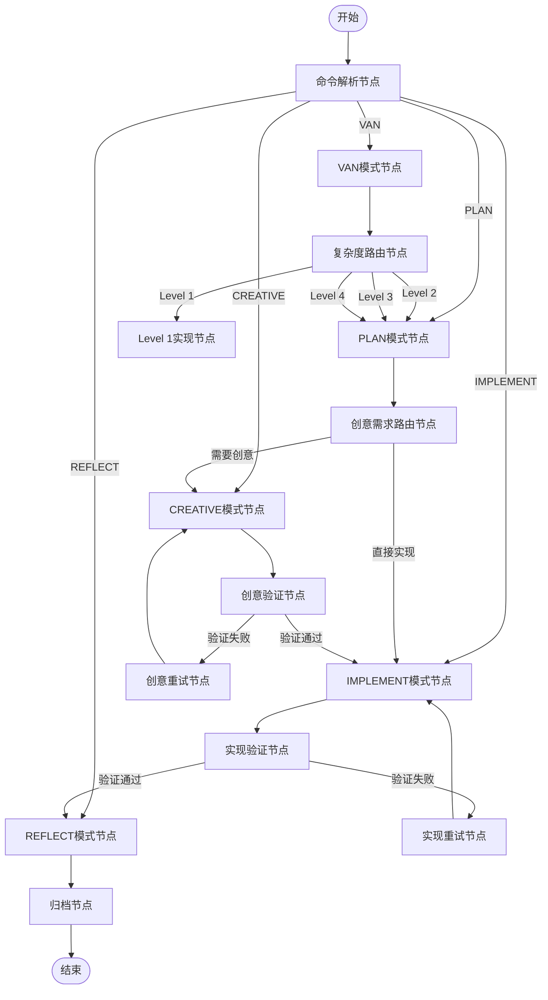

# Memory Bank System 结构化工作流设计

## 概述

本文档分析如何将当前基于自定义模式的提示词工程转变为更加结构化的LangGraph工作流框架。通过抽象化当前系统的核心组件和工作流程，设计一个可扩展、可维护的AI辅助开发工作流系统。

## 当前系统架构分析

### 核心组件

1. **模式系统 (Mode System)**
   - VAN模式：项目初始化与复杂度评估
   - PLAN模式：任务规划与组件识别
   - CREATIVE模式：设计探索与决策分析
   - IMPLEMENT模式：系统化实现
   - REFLECT/ARCHIVE模式：回顾与归档

2. **内存库系统 (Memory Bank)**
   - tasks.md：任务状态跟踪（单一事实源）
   - progress.md：实施进度跟踪
   - activeContext.md：当前开发焦点
   - 项目文档：项目上下文与模式特定文档

3. **复杂度自适应模型**
   - Level 1：快速修复（直接实现）
   - Level 2：简单增强（简化流程）
   - Level 3：中级功能（完整流程）
   - Level 4：复杂系统（增强流程）

### 工作流特点

- **专业化分工**：每个模式专注于特定开发阶段
- **上下文传递**：通过内存库文件共享状态
- **条件路由**：基于复杂度级别的自适应流程
- **验证检查点**：每个阶段的质量保证机制

## LangGraph工作流抽象设计

### 1. 状态管理抽象

#### 全局状态 (Global State)
```python
class MemoryBankState:
    """全局状态容器"""
    
    # 项目上下文
    project_context: Dict[str, Any]
    
    # 任务管理
    tasks: List[Task]
    active_task: Optional[Task]
    
    # 复杂度评估
    complexity_level: int  # 1-4
    
    # 当前模式状态
    current_mode: str
    mode_history: List[str]
    
    # 文档存储
    memory_files: Dict[str, str]  # 文件名 -> 内容
    
    # 验证状态
    checkpoints: Dict[str, bool]  # 检查点名称 -> 完成状态
```

#### 节点状态 (Node State)
```python
class NodeState:
    """节点执行状态"""
    
    # 输入参数
    input_data: Dict[str, Any]
    
    # 处理结果
    output_data: Dict[str, Any]
    
    # 执行状态
    status: str  # pending, running, completed, failed
    error_message: Optional[str]
    
    # 元数据
    execution_time: float
    token_usage: int
```

### 2. 节点抽象设计

#### 基础节点类型

**1. 模式节点 (Mode Nodes)**
```python
class ModeNode:
    """模式执行节点基类"""
    
    def __init__(self, mode_name: str, prompt_template: str):
        self.mode_name = mode_name
        self.prompt_template = prompt_template
    
    async def execute(self, state: MemoryBankState) -> NodeState:
        """执行模式特定的处理逻辑"""
        pass
    
    def get_next_nodes(self, state: MemoryBankState) -> List[str]:
        """根据当前状态确定下一个节点"""
        pass
```

**2. 路由节点 (Routing Nodes)**
```python
class RoutingNode:
    """条件路由节点"""
    
    def evaluate_condition(self, state: MemoryBankState) -> str:
        """评估路由条件，返回目标节点名称"""
        pass
```

**3. 验证节点 (Validation Nodes)**
```python
class ValidationNode:
    """质量验证节点"""
    
    def validate(self, state: MemoryBankState) -> bool:
        """执行验证逻辑"""
        pass
    
    def get_failure_recovery_path(self) -> str:
        """验证失败时的恢复路径"""
        pass
```

### 3. 工作流图结构设计

#### 主工作流图 (Main Workflow Graph)



#### 子工作流图 (Sub-Workflows)

**复杂度级别特定工作流**


### 4. 上下文传递机制

#### 内存库集成设计

```python
class MemoryBankManager:
    """内存库管理器"""
    
    def __init__(self, base_path: str):
        self.base_path = base_path
        self.files = {
            'tasks': 'tasks.md',
            'progress': 'progress.md', 
            'active_context': 'activeContext.md',
            'project_brief': 'projectbrief.md'
        }
    
    async def load_context(self, state: MemoryBankState) -> None:
        """加载内存库上下文到状态"""
        for key, filename in self.files.items():
            content = await self.read_file(filename)
            state.memory_files[key] = content
    
    async def save_context(self, state: MemoryBankState) -> None:
        """保存状态到内存库"""
        for key, content in state.memory_files.items():
            if key in self.files:
                await self.write_file(self.files[key], content)
    
    def get_relevant_context(self, state: MemoryBankState, current_node: str) -> str:
        """根据当前节点获取相关上下文"""
        # 实现选择性上下文加载逻辑
        pass
```

#### 上下文优化策略

1. **分层加载**：按需加载上下文，避免一次性加载所有文档
2. **增量更新**：只更新发生变化的部分
3. **缓存机制**：缓存频繁访问的上下文片段
4. **压缩策略**：对大型文档进行智能压缩

### 5. 路由逻辑设计

#### 复杂度路由算法

```python
class ComplexityRouter:
    """复杂度路由决策器"""
    
    def __init__(self):
        self.complexity_criteria = {
            'level_1': {
                'max_files': 1,
                'max_components': 2,
                'estimated_time': '1小时以内'
            },
            'level_2': {
                'max_files': 3,
                'max_components': 5,
                'estimated_time': '1-4小时'
            },
            'level_3': {
                'max_files': 10,
                'max_components': 15,
                'estimated_time': '4-8小时'
            },
            'level_4': {
                'min_files': 10,
                'min_components': 15,
                'estimated_time': '8小时以上'
            }
        }
    
    def determine_complexity(self, state: MemoryBankState) -> int:
        """基于项目分析确定复杂度级别"""
        analysis = self.analyze_project(state)
        
        if self.matches_criteria(analysis, self.complexity_criteria['level_1']):
            return 1
        elif self.matches_criteria(analysis, self.complexity_criteria['level_2']):
            return 2
        elif self.matches_criteria(analysis, self.complexity_criteria['level_3']):
            return 3
        else:
            return 4
    
    def get_workflow_path(self, complexity_level: int) -> List[str]:
        """根据复杂度级别返回工作流路径"""
        workflow_paths = {
            1: ['VAN', 'L1_Implement', 'L1_Validation', 'REFLECT'],
            2: ['VAN', 'PLAN', 'L2_Implement', 'L2_Validation', 'REFLECT'],
            3: ['VAN', 'PLAN', 'CREATIVE', 'IMPLEMENT', 'VALIDATION', 'REFLECT'],
            4: ['VAN', 'PLAN', 'CREATIVE', 'ARCHITECTURE_REVIEW', 'IMPLEMENT', 'VALIDATION', 'REFLECT']
        }
        return workflow_paths.get(complexity_level, workflow_paths[3])
```

#### 创意需求路由

```python
class CreativeRequirementRouter:
    """创意需求评估路由"""
    
    def requires_creative_phase(self, state: MemoryBankState) -> bool:
        """判断是否需要创意阶段"""
        plan_output = state.get_mode_output('PLAN')
        
        criteria = [
            len(plan_output.get('architectural_decisions', [])) > 0,
            len(plan_output.get('design_alternatives', [])) > 1,
            plan_output.get('complexity_score', 0) >= 7,
            'creative' in plan_output.get('recommended_phases', [])
        ]
        
        return any(criteria)
```

### 6. 验证与错误处理设计

#### 验证检查点系统

```python
class ValidationCheckpoint:
    """验证检查点"""
    
    def __init__(self, name: str, criteria: List[Callable]):
        self.name = name
        self.criteria = criteria
    
    def validate(self, state: MemoryBankState) -> ValidationResult:
        """执行验证"""
        results = []
        for criterion in self.criteria:
            try:
                result = criterion(state)
                results.append(ValidationItem(
                    criterion_name=criterion.__name__,
                    passed=result,
                    message="" if result else f"{criterion.__name__} failed"
                ))
            except Exception as e:
                results.append(ValidationItem(
                    criterion_name=criterion.__name__,
                    passed=False,
                    message=f"Validation error: {str(e)}"
                ))
        
        return ValidationResult(
            checkpoint_name=self.name,
            items=results,
            overall_passed=all(item.passed for item in results)
        )
```

#### 错误恢复机制

```python
class ErrorRecoveryManager:
    """错误恢复管理器"""
    
    def __init__(self):
        self.recovery_strategies = {
            'validation_failure': self.handle_validation_failure,
            'timeout': self.handle_timeout,
            'context_overflow': self.handle_context_overflow,
            'mode_conflict': self.handle_mode_conflict
        }
    
    async def recover(self, error_type: str, state: MemoryBankState) -> RecoveryPlan:
        """执行错误恢复"""
        strategy = self.recovery_strategies.get(error_type)
        if strategy:
            return await strategy(state)
        else:
            return self.default_recovery(state)
    
    async def handle_validation_failure(self, state: MemoryBankState) -> RecoveryPlan:
        """处理验证失败"""
        # 分析失败原因，提供修复建议
        failed_checkpoint = state.current_checkpoint
        analysis = self.analyze_failure_reason(failed_checkpoint)
        
        return RecoveryPlan(
            retry_node=failed_checkpoint.retry_node,
            context_adjustments=analysis.suggested_adjustments,
            additional_validation=analysis.additional_checks
        )
```

## 系统集成与扩展性设计

### 1. 插件系统设计

```python
class PluginSystem:
    """插件系统支持自定义节点和功能扩展"""
    
    def __init__(self):
        self.plugins: Dict[str, Plugin] = {}
        self.hooks: Dict[str, List[Callable]] = {}
    
    def register_plugin(self, plugin: Plugin) -> None:
        """注册插件"""
        self.plugins[plugin.name] = plugin
        
        # 注册插件提供的钩子
        for hook_name, hook_func in plugin.get_hooks().items():
            if hook_name not in self.hooks:
                self.hooks[hook_name] = []
            self.hooks[hook_name].append(hook_func)
    
    async def execute_hooks(self, hook_name: str, state: MemoryBankState) -> None:
        """执行特定钩子的所有函数"""
        if hook_name in self.hooks:
            for hook_func in self.hooks[hook_name]:
                await hook_func(state)
```

### 2. 监控与指标收集

```python
class MonitoringSystem:
    """系统监控和性能指标收集"""
    
    def __init__(self):
        self.metrics: Dict[str, List[Metric]] = {}
        self.alert_rules: List[AlertRule] = []
    
    def record_metric(self, metric_name: str, value: float, tags: Dict[str, str]) -> None:
        """记录指标"""
        if metric_name not in self.metrics:
            self.metrics[metric_name] = []
        
        self.metrics[metric_name].append(Metric(
            name=metric_name,
            value=value,
            timestamp=datetime.now(),
            tags=tags
        ))
    
    def get_performance_insights(self) -> PerformanceReport:
        """生成性能洞察报告"""
        report = PerformanceReport()
        
        # 分析节点执行时间
        node_times = self.analyze_node_execution_times()
        report.slowest_nodes = node_times.slowest(5)
        
        # 分析上下文使用效率
        context_efficiency = self.analyze_context_usage()
        report.context_optimization_suggestions = context_efficiency.suggestions
        
        return report
```

## 实施路线图

### 阶段1：核心框架搭建
1. 实现基础状态管理和节点系统
2. 创建主要模式节点的基本实现
3. 建立简单的工作流图结构

### 阶段2：内存库集成
1. 实现内存库文件读写和管理
2. 建立上下文传递和选择性加载机制
3. 实现复杂度路由逻辑

### 阶段3：验证与错误处理
1. 实现验证检查点系统
2. 建立错误恢复机制
3. 添加监控和指标收集

### 阶段4：高级功能
1. 实现插件系统
2. 添加性能优化功能
3. 建立配置管理系统

## 优势与价值

### 技术优势
1. **结构化可维护性**：清晰的节点边界和状态管理
2. **可扩展性**：插件系统支持功能扩展
3. **可观测性**：完整的监控和指标收集
4. **错误恢复能力**：健壮的错误处理机制

### 业务价值
1. **开发效率提升**：自动化的工作流执行
2. **质量保证**：系统化的验证检查点
3. **知识积累**：结构化的经验归档
4. **团队协作**：标准化的开发流程

## 结论

通过将当前基于自定义模式的提示词工程抽象为LangGraph工作流框架，我们可以创建一个更加结构化、可维护和可扩展的AI辅助开发系统。这种转变不仅保留了原有系统的核心优势（专业化分工、上下文管理、复杂度自适应），还引入了现代工作流引擎的强大功能（状态管理、条件路由、错误处理、监控等）。

这种结构化设计为未来的功能扩展和性能优化提供了坚实的基础，同时保持了与现有Memory Bank系统的兼容性。