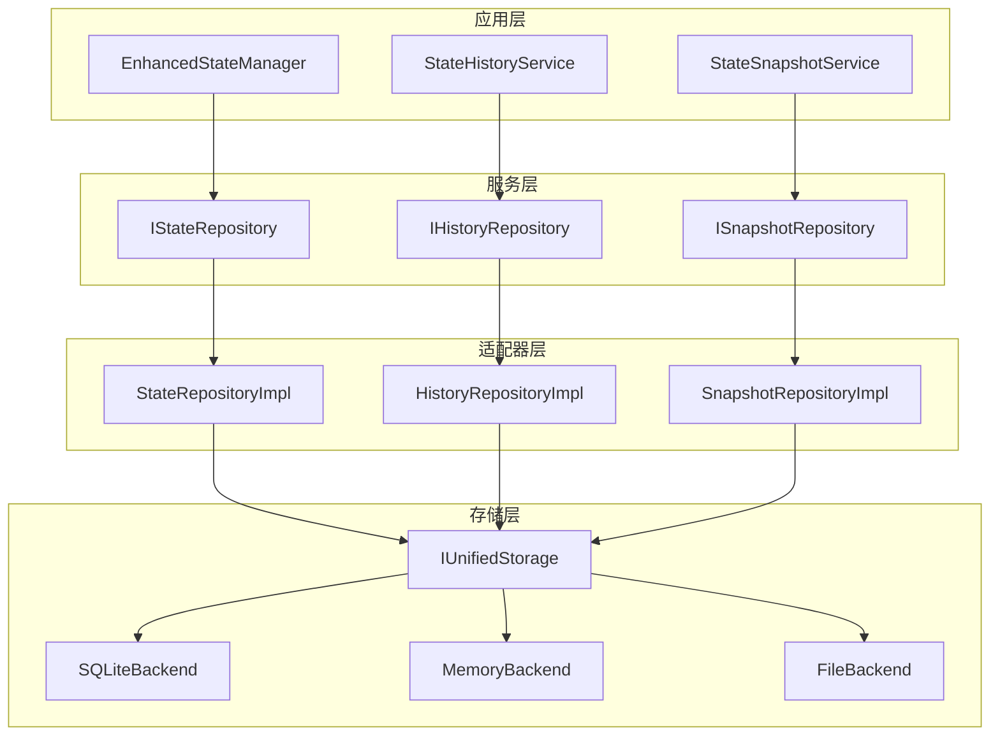

# State与Storage模块关系分析及解耦方案

## 1. 当前state与storage模块的耦合关系分析

### 1.1 紧耦合问题识别

通过代码分析，我发现当前state与storage模块存在以下紧耦合问题：

1. **直接依赖关系**：
   - `StateHistoryService`、`StateSnapshotService`、`StatePersistenceService`等服务直接依赖`IStateStorageAdapter`
   - `EnhancedStateManager`通过历史和快照服务间接依赖存储适配器
   - 依赖注入配置直接将存储适配器注入到状态服务中

2. **接口混合设计**：
   - `IStateStorageAdapter`接口不仅包含通用存储操作，还包含状态特定的业务逻辑
   - 存储适配器直接处理状态历史和快照，模糊了存储层和业务层的边界

3. **配置耦合**：
   - 存储配置与状态管理配置混合在一起
   - 存储后端的初始化逻辑嵌入在状态管理服务的配置中

### 1.2 state模块如何使用storage适配器

- `StateHistoryService`使用`IStateStorageAdapter`来保存、获取和删除历史记录
- `StateSnapshotService`使用`IStateStorageAdapter`来管理状态快照
- `StatePersistenceService`协调历史记录和快照的持久化操作，使用事务功能

## 2. IStateStorageAdapter接口设计分析

`IStateStorageAdapter`接口定义了状态存储的特定功能，包括：
- 历史记录管理（保存、获取、删除历史记录）
- 快照管理（保存、加载、删除快照）
- 事务支持
- 统计信息获取

## 3. 当前架构中state与storage的职责分离情况

### 3.1 职责分离问题
- **存储职责**：应该专注于数据的持久化、查询、索引等功能
- **状态管理职责**：应该专注于状态的业务逻辑、状态转换、状态验证等功能
- **当前问题**：存储适配器直接处理状态业务逻辑，职责边界模糊

## 4. 正确的state与storage关系应当是怎样的

### 4.1 理想架构关系

```
State Management Layer (业务逻辑)
├── StateManager
├── StateHistoryService
├── StateSnapshotService
└── StatePersistenceService

Abstract Storage Interface Layer (抽象接口)
├── IStateRepository (状态存储抽象)
├── IHistoryRepository (历史记录存储抽象)
└── ISnapshotRepository (快照存储抽象)

Storage Implementation Layer (具体实现)
├── SQLiteStateRepository
├── MemoryStateRepository
├── FileStateRepository
└── ...
```

### 4.2 职责清晰分离
- **State Management Layer**: 负责状态业务逻辑、状态转换规则、状态验证等
- **Repository Layer**: 作为抽象层，定义数据访问接口，不包含业务逻辑
- **Storage Implementation Layer**: 负责具体的数据持久化技术实现

## 5. 解耦state与storage模块的建议方案

### 5.1 引入Repository模式

创建独立的Repository接口，将状态管理与存储实现解耦：

```python
# src/interfaces/repositories/state_repository.py
from abc import ABC, abstractmethod
from typing import Dict, Any, Optional, List

class IStateRepository(ABC):
    """状态存储仓库接口"""
    
    @abstractmethod
    async def save_state(self, agent_id: str, state_data: Dict[str, Any]) -> str:
        """保存状态"""
        pass
    
    @abstractmethod
    async def load_state(self, agent_id: str) -> Optional[Dict[str, Any]]:
        """加载状态"""
        pass

class IHistoryRepository(ABC):
    """历史记录仓库接口"""
    
    @abstractmethod
    async def save_history(self, entry: Dict[str, Any]) -> str:
        """保存历史记录"""
        pass

class ISnapshotRepository(ABC):
    """快照仓库接口"""
    
    @abstractmethod
    async def save_snapshot(self, snapshot: Dict[str, Any]) -> str:
        """保存快照"""
        pass
```

### 5.2 修改依赖关系

- State服务层依赖Repository接口，而不是具体的存储适配器
- Repository实现层依赖具体的存储后端
- 消除状态业务逻辑与存储技术实现的直接耦合

### 5.3 依赖注入配置调整

在依赖注入配置中，将Repository实现注入到State服务中，而不是直接注入存储适配器。

### 5.4 引入统一存储接口

使用通用的`IUnifiedStorage`接口作为存储后端的基础，然后在Repository层之上构建状态特定的抽象。

## 6. 解耦后的架构设计



## 7. 实施建议

### 7.1 渐进式迁移策略
1. **第一阶段**：引入Repository接口，保持现有实现不变
2. **第二阶段**：重构State服务层以依赖Repository接口
3. **第三阶段**：实现具体的Repository实现类
4. **第四阶段**：更新依赖注入配置

### 7.2 优势
- **职责清晰**：状态业务逻辑与存储技术实现分离
- **可测试性**：更容易对状态管理逻辑进行单元测试
- **可扩展性**：可以轻松添加新的存储后端
- **维护性**：降低模块间的耦合度，提高代码可维护性

### 7.3 风险控制
- 保持向后兼容性
- 提供适配器以支持现有代码
- 分阶段实施以降低风险

这种解耦方案将使系统架构更加清晰，职责分离更加明确，同时保持了系统的灵活性和可扩展性。