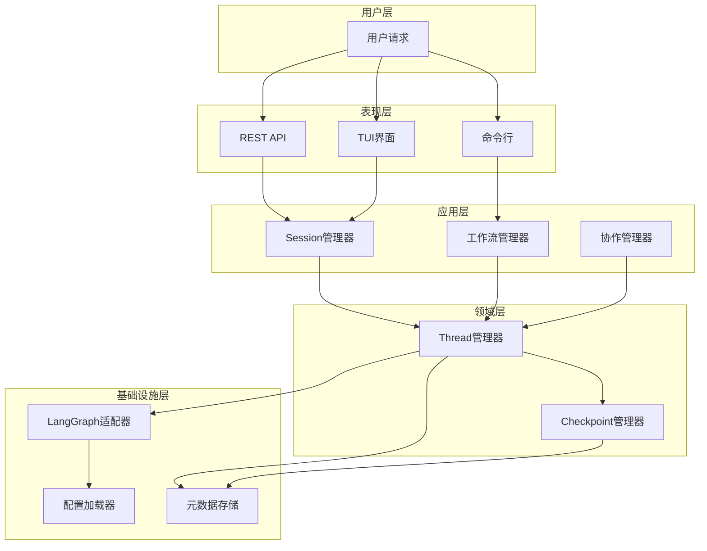

# Thread层与工作流集成指南

## 概述

本文档详细分析了项目中Thread层的架构设计、功能实现以及与工作流的集成方式，并提供了完整的使用示例和最佳实践。

## 目录

1. [Thread层架构定位](#thread层架构定位)
2. [工作流配置集成](#工作流配置集成)
3. [Session层协调管理](#session层协调管理)
4. [核心功能实现](#核心功能实现)
5. [高级功能详解](#高级功能详解)
6. [LangGraph适配器](#langgraph适配器)
7. [整体协作模式](#整体协作模式)
8. [实际使用指南](#实际使用指南)
9. [优化建议](#优化建议)

## Thread层架构定位

### 架构层级

Thread层位于项目架构的核心执行层，承担以下关键职责：

```
表现层 (Presentation Layer)
    ↓
应用层 (Application Layer) - Session管理器、工作流管理器
    ↓
领域层 (Domain Layer) - Thread管理器、Checkpoint接口
    ↓
基础设施层 (Infrastructure Layer) - LangGraph适配器、存储
```

### 核心职责

1. **工作流执行管理**
   - 通过`execute_workflow()`和`stream_workflow()`方法执行工作流
   - 支持同步和异步执行模式
   - 提供实时状态反馈

2. **Thread生命周期管理**
   - 创建、更新、删除Thread
   - 管理Thread状态转换
   - 维护Thread元数据

3. **状态持久化**
   - 通过Checkpoint机制实现状态保存和恢复
   - 支持状态历史查询
   - 提供状态回滚功能

4. **LangGraph交互**
   - 通过LangGraphAdapter统一管理与LangGraph的交互
   - 抽象底层复杂性
   - 提供一致的API接口

## 工作流配置集成

### 配置文件结构

工作流使用YAML格式定义，包含以下核心元素：

```yaml
name: plan_execute_workflow_qwen
description: Plan-and-Execute工作流模式
version: 1.0

state_schema:
  type: "plan_execute_state"
  fields:
    messages:
      type: "List[BaseMessage]"
    plan:
      type: "List[str]"
    current_step_index:
      type: "int"

nodes:
  create_plan:
    type: llm_node
    config:
      llm_client: silicon-Qwen2.5-7B
      system_prompt: |
        你是一个计划制定助手...

edges:
  - from: create_plan
    to: execute_step
    type: simple

entry_point: create_plan
```

### 配置加载流程

1. **配置解析**：YAML配置被解析为结构化数据
2. **图构建**：通过GraphBuilder将配置转换为LangGraph可执行的图结构
3. **Thread创建**：使用`create_thread_from_config()`创建Thread实例
4. **执行绑定**：Thread与特定的工作流配置绑定

### 参数传递机制

- **初始状态**：通过`initial_state`参数传递初始状态
- **运行时配置**：通过`config`参数传递温度、最大迭代次数等
- **元数据附加**：创建Thread时可附加自定义元数据

## Session层协调管理

### Thread协调机制

Session层通过以下方式协调和管理Thread：

1. **批量Thread创建**
   ```python
   thread_ids = await session_manager.coordinate_threads(session_id, thread_configs)
   ```

2. **Thread与Session关联**
   - 通过元数据添加session_id
   - 建立Thread与Session的关联关系
   - 维护Thread命名映射

3. **生命周期管理**
   - 创建阶段：记录Thread创建交互事件
   - 执行阶段：追踪执行状态和结果
   - 状态同步：更新Session上下文信息

### 交互追踪

所有Thread操作都会记录为UserInteraction：
- `thread_created`：Thread创建事件
- `workflow_execution_start`：工作流执行开始
- `workflow_execution_success`：执行成功
- `workflow_execution_error`：执行失败

## 核心功能实现

### 工作流执行

#### 同步执行
```python
result = await thread_manager.execute_workflow(
    thread_id,
    config={"temperature": 0.7},
    initial_state=initial_state
)
```

#### 流式执行
```python
async for state in await thread_manager.stream_workflow(thread_id, config):
    print(f"当前步骤: {state.get('current_step')}")
```

### 状态管理

#### 状态获取
```python
current_state = await thread_manager.get_thread_state(thread_id)
```

#### 状态更新
```python
success = await thread_manager.update_thread_state(thread_id, new_state)
```

#### 历史查询
```python
history = await thread_manager.get_thread_history(thread_id, limit=10)
```

### 生命周期管理

#### Thread创建
```python
# 基于配置文件创建
thread_id = await thread_manager.create_thread_from_config(
    "configs/workflows/plan_execute_workflow.yaml",
    metadata={"purpose": "data_analysis"}
)

# 基于graph_id创建
thread_id = await thread_manager.create_thread(
    graph_id="default_graph",
    metadata={"purpose": "general"}
)
```

#### 元数据管理
```python
# 获取Thread信息
thread_info = await thread_manager.get_thread_info(thread_id)

# 更新元数据
await thread_manager.update_thread_metadata(thread_id, {
    "status": "completed",
    "result_summary": "分析完成"
})
```

## 高级功能详解

### Thread分支功能

创建Thread分支用于实验性执行：

```python
branch_thread_id = await thread_manager.fork_thread(
    source_thread_id="original_thread",
    checkpoint_id="latest",
    branch_name="experimental_branch",
    metadata={"experiment": "try_different_temperature"}
)
```

### Thread快照功能

#### 创建快照
```python
snapshot_id = await thread_manager.create_thread_snapshot(
    thread_id,
    snapshot_name="before_major_change",
    description="执行重要更改前的状态快照"
)
```

#### 状态回滚
```python
success = await thread_manager.rollback_thread(
    thread_id,
    checkpoint_id="checkpoint_123"
)
```

### Thread协作功能

#### 状态共享
```python
await collaboration_manager.share_thread_state(
    source_thread_id="analysis_thread",
    target_thread_id="report_thread",
    checkpoint_id="latest",
    permissions={"read": True, "write": False}
)
```

#### 创建共享会话
```python
collaboration_id = await collaboration_manager.create_shared_session(
    thread_ids=["thread1", "thread2", "thread3"],
    session_config={
        "permissions": {"sync": True},
        "metadata": {"project": "data_analysis_project"}
    }
)
```

#### 状态同步
```python
await collaboration_manager.sync_thread_states(
    thread_ids=["thread1", "thread2"],
    sync_strategy="bidirectional"
)
```

### 高级查询功能

```python
from src.application.threads.query_manager import ThreadQueryManager

query_manager = ThreadQueryManager(thread_manager)

# 多条件搜索
active_threads = await query_manager.search_threads({
    "status": "active",
    "created_after": datetime.now() - timedelta(days=7),
    "metadata": {"project": "data_analysis"}
})

# 获取统计信息
stats = await query_manager.get_thread_statistics()
```

## LangGraph适配器

### 核心职责

LangGraph适配器是Thread层与LangGraph框架之间的桥梁：

1. **图创建与管理**
   - 将GraphConfig转换为LangGraph的StateGraph
   - 使用GraphBuilder构建节点和边
   - 编译图并添加checkpoint支持

2. **工作流执行**
   - 准备运行配置，确保thread_id正确设置
   - 调用LangGraph的invoke/ainvoke方法
   - 支持流式执行

3. **Checkpoint管理**
   - 保存、加载、列出、删除checkpoint
   - 支持内存和SQLite存储
   - 提供异步兼容性

### 使用示例

```python
# 创建图
graph = await langgraph_adapter.create_graph(graph_config)

# 执行图
result = await langgraph_adapter.execute_graph(graph, thread_id, config)

# 流式执行
async for state in await langgraph_adapter.stream_graph(graph, thread_id, config):
    yield state
```

## 整体协作模式

### 架构流程图



### 数据流向

1. **请求流入**：用户请求通过表现层到达应用层
2. **Session创建**：SessionManager创建用户会话
3. **Thread协调**：SessionManager协调ThreadManager创建Thread
4. **工作流执行**：ThreadManager通过LangGraphAdapter执行工作流
5. **状态管理**：通过CheckpointManager管理执行状态
6. **结果返回**：执行结果通过各层返回给用户

## 实际使用指南

### 基本工作流执行

```python
from src.infrastructure.di.thread_session_di_config import create_development_stack
from src.application.sessions.manager import UserRequest
from pathlib import Path
from datetime import datetime

# 创建组件栈
components = create_development_stack(Path("./storage"))
session_manager = components["session_manager"]

# 创建用户会话
user_request = UserRequest(
    request_id="req_001",
    user_id="user_123",
    content="分析数据并生成报告",
    timestamp=datetime.now()
)

session_id = await session_manager.create_session(user_request)

# 创建并执行工作流Thread
thread_configs = [{
    "name": "data_analysis",
    "config_path": "configs/workflows/plan_execute_workflow.yaml",
    "initial_state": {
        "messages": [{"role": "user", "content": "分析任务"}],
        "current_step": "planning"
    }
}]

thread_ids = await session_manager.coordinate_threads(session_id, thread_configs)
result = await session_manager.execute_workflow_in_session(session_id, "data_analysis")
```

### 流式工作流执行

```python
# 流式执行工作流，实时获取中间状态
async for state in session_manager.stream_workflow_in_session(
    session_id, 
    "data_analysis",
    config={"temperature": 0.7}
):
    print(f"当前步骤: {state.get('current_step', 'unknown')}")
    print(f"进度: {state.get('iteration_count', 0)}")
    
    # 可以根据状态进行实时处理
    if state.get('current_step') == 'error':
        print(f"执行错误: {state.get('error_message')}")
        break
```

### Thread分支与实验

```python
# 获取Thread管理器
thread_manager = components["thread_manager"]

# 创建Thread分支
branch_thread_id = await thread_manager.fork_thread(
    original_thread_id,
    checkpoint_id="latest",  # 从最新状态分支
    branch_name="experimental_branch",
    metadata={"experiment": "try_different_temperature"}
)

# 在分支中执行不同的配置
branch_result = await thread_manager.execute_workflow(
    branch_thread_id,
    config={"temperature": 0.9}  # 使用更高的温度
)

# 比较两个分支的结果
original_result = await thread_manager.get_thread_state(original_thread_id)
branch_result_state = await thread_manager.get_thread_state(branch_thread_id)

print(f"原始结果: {original_result}")
print(f"分支结果: {branch_result_state}")
```

### Thread状态快照与回滚

```python
# 创建状态快照
snapshot_id = await thread_manager.create_thread_snapshot(
    thread_id,
    snapshot_name="before_major_change",
    description="执行重要更改前的状态快照"
)

# 执行一些操作...
await thread_manager.execute_workflow(thread_id, config={"major_change": True})

# 如果需要回滚到快照状态
success = await thread_manager.rollback_thread(thread_id, snapshot_id)
if success:
    print("成功回滚到快照状态")
else:
    print("回滚失败")
```

### 多Thread协作

```python
from src.application.threads.collaboration_manager import CollaborationManager

collaboration_manager = CollaborationManager(thread_manager, checkpoint_manager)

# 创建多个Thread
analysis_thread = await thread_manager.create_thread_from_config(
    "configs/workflows/data_analysis.yaml"
)
report_thread = await thread_manager.create_thread_from_config(
    "configs/workflows/report_generation.yaml"
)

# 共享Thread状态到其他Thread
await collaboration_manager.share_thread_state(
    source_thread_id=analysis_thread,
    target_thread_id=report_thread,
    checkpoint_id="latest",
    permissions={"read": True, "write": False}
)

# 创建共享会话
collaboration_id = await collaboration_manager.create_shared_session(
    thread_ids=[analysis_thread, report_thread],
    session_config={
        "permissions": {"sync": True},
        "metadata": {"project": "data_analysis_project"}
    }
)

# 同步多Thread状态
await collaboration_manager.sync_thread_states(
    thread_ids=[analysis_thread, report_thread],
    sync_strategy="bidirectional"
)
```

### 高级查询与分析

```python
from src.application.threads.query_manager import ThreadQueryManager
from datetime import datetime, timedelta

query_manager = ThreadQueryManager(thread_manager)

# 搜索特定条件的Threads
active_threads = await query_manager.search_threads({
    "status": "active",
    "created_after": datetime.now() - timedelta(days=7),
    "metadata": {"project": "data_analysis"}
})

print(f"找到 {len(active_threads)} 个活跃的数据分析Thread")

# 获取Thread统计信息
stats = await query_manager.get_thread_statistics()
print(f"总Threads: {stats['total_threads']}")
print(f"活跃Threads: {stats['by_status']['active']}")
print(f"完成Threads: {stats['by_status']['completed']}")

# 按图ID聚合
by_graph = await query_manager.aggregate_threads_by_graph_id()
for graph_id, count in by_graph.items():
    print(f"图 {graph_id}: {count} 个Thread")
```

### 错误处理与监控

```python
try:
    result = await session_manager.execute_workflow_in_session(session_id, thread_name)
except ValueError as e:
    print(f"参数错误: {e}")
except RuntimeError as e:
    print(f"运行时错误: {e}")
except Exception as e:
    print(f"未知错误: {e}")
    
    # 查看错误交互记录
    interactions = await session_manager.get_interaction_history(session_id)
    error_interactions = [i for i in interactions if "error" in i.interaction_type]
    
    for interaction in error_interactions:
        print(f"错误: {interaction.content}")
        print(f"时间: {interaction.timestamp}")
        print(f"元数据: {interaction.metadata}")

# 定期检查Thread状态
thread_info = await thread_manager.get_thread_info(thread_id)
if thread_info["status"] == "error":
    print(f"Thread {thread_id} 处于错误状态")
    print(f"错误信息: {thread_info.get('last_error', 'Unknown')}")
    
    # 尝试恢复
    await thread_manager.update_thread_status(thread_id, "active")
```

### 资源管理与优化

```python
# 定期清理图缓存
await thread_manager.clear_graph_cache()

# 获取缓存信息
cache_info = await thread_manager.get_cache_info()
print(f"缓存的图数量: {cache_info['graph_cache_size']}")

# 清理不需要的Threads
old_threads = await query_manager.search_threads({
    "created_before": datetime.now() - timedelta(days=30),
    "status": "completed"
})

for thread in old_threads:
    thread_id = thread["thread_id"]
    await thread_manager.delete_thread(thread_id)
    print(f"删除旧Thread: {thread_id}")

# 监控性能
stats = await query_manager.get_thread_statistics()
print(f"平均执行时间: {stats['performance']['avg_execution_time']}秒")
print(f"成功率: {stats['performance']['success_rate']}%")
```

## 优化建议

### 性能优化

1. **图缓存优化**
   - 合理设置缓存大小，避免内存溢出
   - 定期清理不常用的图缓存
   - 考虑使用LRU缓存策略

2. **批量操作优化**
   - 批量创建Thread时使用`coordinate_threads()`
   - 批量状态更新时减少数据库访问次数
   - 使用异步操作提高并发性能

3. **存储优化**
   - 根据使用场景选择合适的存储后端
   - 定期清理旧的checkpoint数据
   - 考虑使用压缩存储减少空间占用

### 可靠性优化

1. **错误恢复机制**
   - 实现自动重试机制
   - 添加断路器模式防止级联失败
   - 提供详细的错误日志和监控

2. **状态一致性**
   - 确保Thread状态与checkpoint状态同步
   - 实现状态校验机制
   - 提供状态修复工具

3. **资源管理**
   - 实现资源池管理Thread连接
   - 添加资源使用监控
   - 提供资源清理机制

### 可扩展性优化

1. **分布式支持**
   - 支持跨节点的Thread管理
   - 实现分布式checkpoint存储
   - 提供负载均衡机制

2. **插件化架构**
   - 支持自定义节点类型
   - 提供扩展点机制
   - 实现动态加载插件

3. **监控与观测**
   - 添加详细的性能指标
   - 实现分布式追踪
   - 提供实时监控仪表板

### 安全性优化

1. **权限控制**
   - 实现细粒度的权限管理
   - 支持Thread级别的访问控制
   - 提供审计日志功能

2. **数据保护**
   - 加密敏感的Thread状态
   - 实现数据脱敏机制
   - 提供数据备份和恢复

3. **安全通信**
   - 使用TLS加密通信
   - 实现身份验证机制
   - 提供防重放攻击保护

## 总结

Thread层作为项目的核心执行层，提供了完整的工作流执行、状态管理和协作功能。通过合理的架构设计和丰富的API，支持从简单的工作流执行到复杂的多Thread协作场景。

在实际使用中，建议根据具体需求选择合适的功能组合，并注意性能优化和错误处理。通过遵循最佳实践，可以构建出高效、可靠的工作流系统。