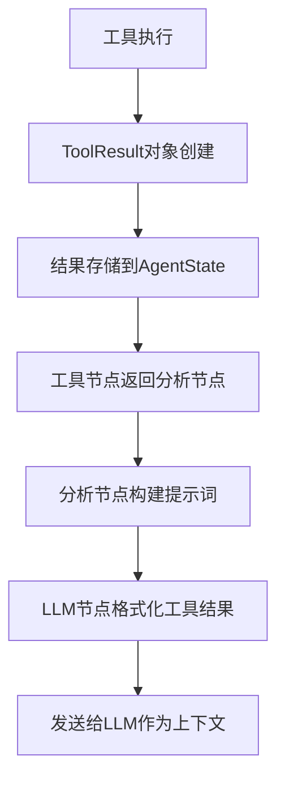
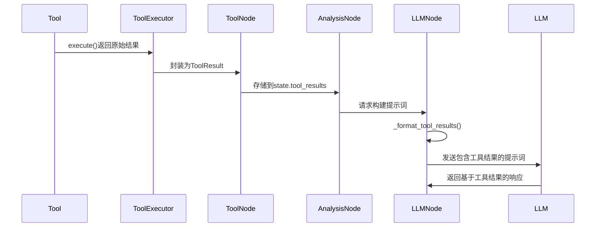

# 工具类函数返回值提交给LLM的完整流程分析

基于对工具系统的深入分析，以下是工具类函数返回值如何提交给LLM的完整流程：

## 1. 工具执行结果处理流程



## 2. 关键组件和流程

### 2.1 工具执行器 ([`src/infrastructure/tools/executor.py`](src/infrastructure/tools/executor.py:43))

- **同步执行**: [`execute()`](src/infrastructure/tools/executor.py:43) 方法调用工具并返回 [`ToolResult`](src/domain/tools/interfaces.py:30) 对象
- **异步执行**: [`execute_async()`](src/infrastructure/tools/executor.py:113) 方法支持异步工具调用
- **结果封装**: 所有工具返回值都被封装为标准化 [`ToolResult`](src/domain/tools/interfaces.py:30) 对象，包含：
  - `success`: 执行是否成功
  - `output`: 工具执行的实际返回值
  - `error`: 错误信息（如果执行失败）
  - `tool_name`: 工具名称
  - `execution_time`: 执行时间

### 2.2 工具节点 ([`src/infrastructure/graph/nodes/tool_node.py`](src/infrastructure/graph/nodes/tool_node.py:32))

- **执行工具调用**: [`execute()`](src/infrastructure/graph/nodes/tool_node.py:32) 方法处理工具执行流程
- **结果存储**: 将 [`ToolResult`](src/domain/tools/interfaces.py:30) 对象添加到 [`state.tool_results`](src/infrastructure/graph/nodes/tool_node.py:92)
- **状态更新**: 工具执行结果成为Agent状态的一部分
- **流程控制**: 通过 [`_determine_next_node()`](src/infrastructure/graph/nodes/tool_node.py:309) 决定下一步（通常返回分析节点）

### 2.3 分析节点 ([`src/infrastructure/graph/nodes/analysis_node.py`](src/infrastructure/graph/nodes/analysis_node.py:33))

- **消息准备**: [`_prepare_messages()`](src/infrastructure/graph/nodes/analysis_node.py:214) 方法构建包含工具结果的提示词
- **上下文整合**: 工具执行结果被整合到发送给LLM的消息中
- **决策逻辑**: 根据LLM响应决定是否需要进一步工具调用

### 2.4 LLM节点 ([`src/infrastructure/graph/nodes/llm_node.py`](src/infrastructure/graph/nodes/llm_node.py))

- **结果格式化**: [`_format_tool_results()`](src/infrastructure/graph/nodes/llm_node.py:277) 方法将工具结果格式化为LLM可读的文本
- **提示词构建**: 工具结果被添加到系统提示词中，为LLM提供执行上下文

## 3. 工具结果格式化细节

### 3.1 格式化方法 ([`src/infrastructure/graph/nodes/llm_node.py:277`](src/infrastructure/graph/nodes/llm_node.py:277))

```python
def _format_tool_results(self, tool_results: List) -> str:
    """格式化工具执行结果为LLM可读的文本"""
    if not tool_results:
        return "没有工具执行结果"
    
    formatted_results = []
    for i, result in enumerate(tool_results, 1):
        # 处理字典和对象格式的结果
        if isinstance(result, dict):
            success = result.get("success", True)
            tool_name = result.get("tool_name", f"工具{i}")
            result_value = result.get("result")
            error = result.get("error")
        else:
            success = result.success
            tool_name = result.tool_name
            result_value = result.output  # 使用output属性
            error = result.error
        
        status = "成功" if success else "失败"
        result_text = f"工具 {i}: {tool_name} - {status}\n"
        
        if success and result_value:
            result_text += f"结果: {result_value}\n"
        elif not success and error:
            result_text += f"错误: {error}\n"
        
        formatted_results.append(result_text)
    
    return "\n".join(formatted_results)
```

### 3.2 格式化输出示例

```
工具 1: hash_convert - 成功
结果: {'original_text': 'Hello', 'algorithm': 'sha256', 'hash_value': '185f8db32271fe...', 'hash_length': 64}

工具 2: weather - 失败
错误: API调用超时
```

## 4. 结果整合到LLM提示词

### 4.1 系统提示词构建 ([`src/infrastructure/graph/nodes/llm_node.py`](src/infrastructure/graph/nodes/llm_node.py))

工具执行结果被添加到系统提示词中，形成完整的上下文：

```
你是一个智能助手，负责分析用户输入并决定是否需要调用工具。

之前的工具执行结果：
工具 1: hash_convert - 成功
结果: {'original_text': 'Hello', 'algorithm': 'sha256', 'hash_value': '185f8db32271fe...', 'hash_length': 64}

请根据工具执行结果和用户的当前请求：
1. 如果需要进一步操作，请调用相应的工具
2. 如果可以直接回答，请提供详细的回答
3. 始终保持友好和专业的语调
```

### 4.2 动态上下文更新

- **增量添加**: 每次工具执行后，结果被增量添加到Agent状态
- **历史感知**: LLM能够看到完整的工具执行历史
- **上下文相关**: 工具结果直接影响LLM的后续决策

## 5. 完整的数据流向



## 6. 关键特性

1. **标准化输出**: 所有工具返回值都标准化为 [`ToolResult`](src/domain/tools/interfaces.py:30) 对象
2. **状态持久化**: 工具结果持久化在Agent状态中，支持多轮对话
3. **上下文感知**: LLM能够基于完整的工具执行历史做出决策
4. **错误处理**: 失败的工具执行也会被记录并提供给LLM
5. **格式化灵活**: 支持字典和对象两种格式的工具结果

这种设计确保了工具执行结果能够有效地传递给LLM，为后续的决策和响应提供完整的上下文信息。

---

# 工具函数返回值到提示词的精确转换分析

基于对代码的深入分析，以下是工具类函数返回值如何转换为LLM提示词的具体机制：

## 1. 工具返回值到提示词的转换规则

### 1.1 核心转换方法 ([`src/infrastructure/graph/nodes/llm_node.py:277`](src/infrastructure/graph/nodes/llm_node.py:277))

```python
def _format_tool_results(self, tool_results: List) -> str:
    # 格式化逻辑：提取关键属性并转换为文本格式
```

### 1.2 转换映射表

| 工具返回值属性 | 提示词中的位置 | 转换规则 | 示例 |
|---------------|---------------|----------|------|
| `output` | 结果内容 | 直接转换为字符串 | `{'hash': 'abc123'}` → `{'hash': 'abc123'}` |
| `success` | 状态标识 | 布尔值转换为"成功"/"失败" | `True` → `成功`, `False` → `失败` |
| `tool_name` | 工具标识 | 直接使用工具名称 | `hash_convert` → `hash_convert` |
| `error` | 错误信息 | 直接显示错误消息 | `API调用超时` → `错误: API调用超时` |
| `execution_time` | ❌ 不包含 | 仅用于内部记录，不发送给LLM | `2.5` → (不显示) |

## 2. 具体转换示例

### 2.1 成功执行的工具

**原始返回值:**
```python
ToolResult(
    success=True,
    output={'original_text': 'Hello', 'algorithm': 'sha256', 'hash_value': '185f8db32271fe...'},
    tool_name='hash_convert',
    execution_time=0.1
)
```

**转换为提示词:**
```
工具 1: hash_convert - 成功
结果: {'original_text': 'Hello', 'algorithm': 'sha256', 'hash_value': '185f8db32271fe...'}
```

### 2.2 失败执行的工具

**原始返回值:**
```python
ToolResult(
    success=False,
    output=None,
    error='API调用超时',
    tool_name='weather',
    execution_time=5.0
)
```

**转换为提示词:**
```
工具 2: weather - 失败
错误: API调用超时
```

## 3. 提示词构建的可调控参数

### 3.1 配置选项 ([`src/infrastructure/graph/nodes/llm_node.py:235`](src/infrastructure/graph/nodes/llm_node.py:235))

```python
# 控制是否包含工具结果
if config.get("include_tool_results", True) and state.tool_results:
    tool_results_text = self._format_tool_results(state.tool_results)
    base_prompt += f"\n\n工具执行结果：\n{tool_results_text}"
```

**可调控参数:**
- `include_tool_results`: 布尔值，控制是否包含工具结果（默认: `True`）
- 可通过节点配置动态调整

### 3.2 系统提示词模板 ([`src/infrastructure/graph/nodes/llm_node.py:266`](src/infrastructure/graph/nodes/llm_node.py:266))

```python
def _get_default_system_prompt(self) -> str:
    return """你是一个智能助手，请根据上下文信息提供准确、有用的回答。

请遵循以下原则：
1. 基于提供的工具执行结果和上下文信息回答问题
2. 如果信息不足，请明确说明需要什么额外信息
3. 保持回答简洁明了，重点突出
4. 如果有多个步骤的结果，请按逻辑顺序组织回答
5. 始终保持友好和专业的语调"""
```

## 4. 错误信息的特殊处理

### 4.1 错误捕获机制 ([`src/infrastructure/tools/executor.py:101`](src/infrastructure/tools/executor.py:101))

```python
except Exception as e:
    execution_time = time.time() - start_time
    error_msg = f"工具执行异常: {str(e)}"
    # 错误信息会被完整记录并发送给LLM
```

### 4.2 错误信息格式化规则
- **异常类型**: 显示具体的异常类型（如 `ValueError`, `TimeoutError`）
- **错误消息**: 显示完整的错误描述
- **工具标识**: 明确标识是哪个工具出错

## 5. 调控建议

### 5.1 优化工具返回值
- **结构化输出**: 返回字典或对象，便于LLM解析
- **清晰错误**: 提供具体的错误描述，帮助LLM理解问题
- **相关上下文**: 包含足够的上下文信息供LLM决策

### 5.2 配置调整策略
- **敏感信息**: 可通过 `include_tool_results=False` 隐藏工具结果
- **性能优化**: 对于大量工具结果，可选择性包含关键结果
- **错误处理**: 失败的工具执行仍会提供有价值的调试信息

### 5.3 提示词优化方向
- **结果摘要**: 可添加结果摘要生成功能
- **优先级排序**: 按重要性对工具结果进行排序
- **格式优化**: 根据LLM能力调整输出格式（JSON vs 文本）

这种转换机制确保了工具执行结果能够有效地为LLM提供上下文，同时保持了足够的灵活性来进行调控和优化。