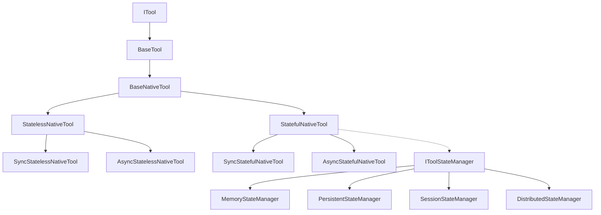
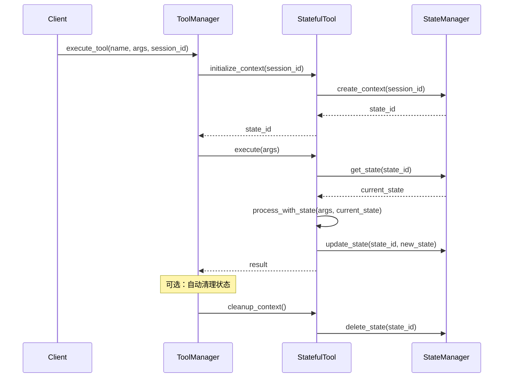

# 有状态工具架构设计

## 概述

本文档详细设计了新的有状态工具架构，包括整体架构设计、核心组件设计、状态管理策略和接口定义。

## 整体架构设计原则

基于分析，我们设计了一个新的有状态工具架构，遵循以下原则：

1. **向后兼容**: 保持现有无状态工具的API不变
2. **状态隔离**: 确保不同会话/实例的状态完全隔离
3. **生命周期管理**: 提供清晰的状态初始化、管理和清理机制
4. **可扩展性**: 支持不同类型的状态管理策略
5. **性能优化**: 避免不必要的状态复制和序列化

## 新的工具类型层次结构



## 核心组件设计

### 1. 状态管理器接口 (IToolStateManager)

```python
from abc import ABC, abstractmethod
from typing import Any, Dict, List, Optional
from enum import Enum
import time
import uuid

class StateType(Enum):
    """状态类型枚举"""
    CONNECTION = "connection"
    SESSION = "session"
    BUSINESS = "business"
    CACHE = "cache"

@dataclass
class StateEntry:
    """状态条目"""
    state_id: str
    context_id: str
    state_type: StateType
    data: Dict[str, Any]
    created_at: float
    updated_at: float
    expires_at: Optional[float] = None
    version: int = 1
    
    def is_expired(self) -> bool:
        """检查是否过期"""
        if self.expires_at is None:
            return False
        return time.time() > self.expires_at

class IToolStateManager(ABC):
    """工具状态管理器接口"""
    
    @abstractmethod
    def create_context(self, context_id: str, tool_type: str) -> str:
        """创建工具上下文"""
        pass
    
    @abstractmethod
    def get_state(self, context_id: str, state_type: StateType) -> Optional[Dict[str, Any]]:
        """获取状态数据"""
        pass
    
    @abstractmethod
    def set_state(self, context_id: str, state_type: StateType, state_data: Dict[str, Any], 
                  ttl: Optional[int] = None) -> bool:
        """设置状态数据"""
        pass
    
    @abstractmethod
    def update_state(self, context_id: str, state_type: StateType, updates: Dict[str, Any]) -> bool:
        """更新状态数据"""
        pass
    
    @abstractmethod
    def delete_state(self, context_id: str, state_type: StateType) -> bool:
        """删除状态"""
        pass
    
    @abstractmethod
    def cleanup_context(self, context_id: str) -> bool:
        """清理上下文"""
        pass
    
    @abstractmethod
    def list_contexts(self, tool_type: Optional[str] = None) -> List[str]:
        """列出上下文"""
        pass
    
    @abstractmethod
    def get_context_info(self, context_id: str) -> Optional[Dict[str, Any]]:
        """获取上下文信息"""
        pass
```

### 2. 状态感知工具基类 (StatefulBaseTool)

```python
class StatefulBaseTool(BaseTool, ABC):
    """状态感知工具基类"""
    
    def __init__(self, name: str, description: str, parameters_schema: Dict[str, Any], 
                 state_manager: IToolStateManager, config: Any):
        """初始化状态感知工具"""
        super().__init__(name, description, parameters_schema)
        self.state_manager = state_manager
        self.config = config
        self._context_id: Optional[str] = None
        self._session_id: Optional[str] = None
        self._initialized = False
    
    def initialize_context(self, session_id: Optional[str] = None) -> str:
        """初始化工具上下文"""
        if self._initialized:
            return self._context_id
        
        # 生成或使用提供的会话ID
        self._session_id = session_id or f"session_{uuid.uuid4().hex[:8]}"
        
        # 创建上下文ID
        self._context_id = f"{self._session_id}_{self.name}_{uuid.uuid4().hex[:8]}"
        
        # 在状态管理器中创建上下文
        self.state_manager.create_context(self._context_id, self.__class__.__name__)
        
        # 初始化各种状态
        self._initialize_connection_state()
        self._initialize_session_state()
        self._initialize_business_state()
        
        self._initialized = True
        return self._context_id
    
    def get_connection_state(self) -> Optional[Dict[str, Any]]:
        """获取连接状态"""
        if not self._context_id:
            return None
        return self.state_manager.get_state(self._context_id, StateType.CONNECTION)
    
    def get_session_state(self) -> Optional[Dict[str, Any]]:
        """获取会话状态"""
        if not self._context_id:
            return None
        return self.state_manager.get_state(self._context_id, StateType.SESSION)
    
    def get_business_state(self) -> Optional[Dict[str, Any]]:
        """获取业务状态"""
        if not self._context_id:
            return None
        return self.state_manager.get_state(self._context_id, StateType.BUSINESS)
    
    def update_connection_state(self, updates: Dict[str, Any]) -> bool:
        """更新连接状态"""
        if not self._context_id:
            return False
        
        # 添加最后使用时间
        updates['last_used'] = time.time()
        return self.state_manager.update_state(self._context_id, StateType.CONNECTION, updates)
    
    def update_session_state(self, updates: Dict[str, Any]) -> bool:
        """更新会话状态"""
        if not self._context_id:
            return False
        
        # 添加最后活动时间
        updates['last_activity'] = time.time()
        return self.state_manager.update_state(self._context_id, StateType.SESSION, updates)
    
    def update_business_state(self, updates: Dict[str, Any]) -> bool:
        """更新业务状态"""
        if not self._context_id:
            return False
        
        # 获取当前状态
        current_state = self.get_business_state()
        if not current_state:
            return False
        
        # 更新数据和版本
        if 'data' in updates:
            current_state['data'].update(updates.pop('data'))
        
        # 添加到历史记录
        if current_state.get('history') is not None:
            current_state['history'].append({
                'timestamp': time.time(),
                'updates': updates,
                'version': current_state.get('version', 1)
            })
            
            # 限制历史记录大小
            max_history = self.config.get('business_config', {}).get('max_history_size', 1000)
            if len(current_state['history']) > max_history:
                current_state['history'] = current_state['history'][-max_history:]
        
        # 更新版本
        current_state['version'] = current_state.get('version', 1) + 1
        
        # 应用其他更新
        current_state.update(updates)
        
        return self.state_manager.set_state(self._context_id, StateType.BUSINESS, current_state)
    
    def cleanup_context(self) -> bool:
        """清理上下文"""
        if not self._context_id:
            return False
        
        result = self.state_manager.cleanup_context(self._context_id)
        self._context_id = None
        self._session_id = None
        self._initialized = False
        return result
```

## 状态管理策略

### 1. 内存状态管理器 (MemoryStateManager)

**适用场景**: 短期会话，重启后状态可丢失
**优势**: 高性能，低延迟
**劣势**: 不持久化，内存占用

```python
class MemoryStateManager(IToolStateManager):
    """内存状态管理器"""
    
    def __init__(self, config: Dict[str, Any]):
        """初始化内存状态管理器"""
        self.config = config
        self._states: Dict[str, Dict[StateType, StateEntry]] = defaultdict(dict)
        self._lock = threading.RLock()
        self._cleanup_thread: Optional[threading.Thread] = None
        self._stop_cleanup = threading.Event()
        
        # 启动清理线程
        if config.get('auto_cleanup', True):
            self._start_cleanup_thread()
```

### 2. 持久化状态管理器 (PersistentStateManager)

**适用场景**: 长期会话，需要状态持久化
**优势**: 状态持久化，可恢复
**劣势**: 性能较低，需要存储后端

```python
class PersistentStateManager(IToolStateManager):
    """持久化状态管理器"""
    
    def __init__(self, config: Dict[str, Any]):
        """初始化持久化状态管理器"""
        self.config = config
        self.persistence_path = config.get('persistence_path', './state_storage')
        self.persistence_format = config.get('persistence_format', 'json')
        self.compression = config.get('compression', False)
        
        # 确保存储目录存在
        Path(self.persistence_path).mkdir(parents=True, exist_ok=True)
```

### 3. 会话状态管理器 (SessionStateManager)

**适用场景**: 多用户环境，按会话隔离状态
**优势**: 自动会话隔离，支持会话生命周期管理
**劣势**: 复杂度较高

```python
class SessionStateManager(IToolStateManager):
    """会话状态管理器"""
    
    def __init__(self, config: Dict[str, Any]):
        """初始化会话状态管理器"""
        self.config = config
        self.session_timeout = config.get('session_timeout', 3600)
        self.max_states_per_session = config.get('max_states_per_session', 10)
        self._sessions: Dict[str, Dict[str, Any]] = {}
        self._lock = threading.RLock()
```

### 4. 分布式状态管理器 (DistributedStateManager)

**适用场景**: 分布式系统，多节点状态同步
**优势**: 支持集群部署，高可用
**劣势**: 依赖外部服务，复杂度高

```python
class DistributedStateManager(IToolStateManager):
    """分布式状态管理器"""
    
    def __init__(self, config: Dict[str, Any]):
        """初始化分布式状态管理器"""
        self.config = config
        self.redis_url = config.get('redis_url', 'redis://localhost:6379')
        self.redis_prefix = config.get('redis_prefix', 'tool_state')
        self.redis_db = config.get('redis_db', 0)
        
        # 初始化Redis连接
        self._redis_client = redis.from_url(self.redis_url, db=self.redis_db)
```

## 工具类型设计

### 1. 有状态Native工具

```python
class StatefulNativeTool(StatefulBaseTool):
    """有状态原生工具"""
    
    def __init__(self, func: Callable, config: Any, state_manager):
        """初始化有状态原生工具"""
        # 从配置获取基本信息
        name = config.name or func.__name__
        description = config.description or func.__doc__ or f"有状态原生工具: {name}"
        
        # 处理参数Schema
        if config.parameters_schema:
            parameters_schema = self._merge_schema_with_function(config.parameters_schema, func)
        else:
            parameters_schema = self._infer_schema(func)
        
        super().__init__(name, description, parameters_schema, state_manager, config)
        
        self.func = func
        self._state_injection = config.get('state_injection', True)
        self._state_parameter_name = config.get('state_parameter_name', 'state')
    
    def execute(self, **kwargs: Any) -> Any:
        """执行工具（带状态管理）"""
        if not self.is_initialized:
            raise RuntimeError("工具未初始化，请先调用 initialize_context()")
        
        try:
            # 记录执行开始
            self.add_to_history('execution_start', {
                'parameters': kwargs,
                'timestamp': time.time()
            })
            
            # 更新连接状态
            self.update_connection_state({
                'active': True,
                'last_used': time.time()
            })
            
            # 准备函数参数
            func_kwargs = kwargs.copy()
            
            # 注入状态参数
            if self._state_injection:
                current_state = self.get_business_state()
                if current_state:
                    func_kwargs[self._state_parameter_name] = current_state.get('data', {})
            
            # 执行函数
            result = self.func(**func_kwargs)
            
            # 处理返回结果中的状态更新
            if isinstance(result, dict) and 'state' in result:
                self.update_business_state({'data': result['state']})
                # 从结果中移除状态数据
                result = {k: v for k, v in result.items() if k != 'state'}
            
            # 记录执行成功
            self.add_to_history('execution_success', {
                'result_type': type(result).__name__,
                'timestamp': time.time()
            })
            
            # 更新连接状态
            self.update_connection_state({
                'active': False,
                'last_used': time.time()
            })
            
            return result
            
        except Exception as e:
            # 记录执行错误
            self.add_to_history('execution_error', {
                'error': str(e),
                'error_type': type(e).__name__,
                'timestamp': time.time()
            })
            
            # 更新连接状态
            self.update_connection_state({
                'active': False,
                'last_used': time.time(),
                'error_count': self.get_connection_state().get('error_count', 0) + 1,
                'last_error': str(e)
            })
            
            raise ValueError(f"有状态原生工具执行错误: {str(e)}")
```

### 2. 有状态MCP工具

```python
class StatefulMCPTool(StatefulBaseTool):
    """有状态MCP工具"""
    
    def __init__(self, config: Any, state_manager):
        """初始化有状态MCP工具"""
        super().__init__(
            name=config.name,
            description=config.description,
            parameters_schema=config.parameters_schema,
            state_manager=state_manager,
            config=config
        )
        self.mcp_client = None
    
    async def _get_stateful_client(self) -> MCPClient:
        """获取有状态的MCP客户端"""
        # 检查连接状态
        conn_state = self.get_connection_state()
        
        if conn_state and conn_state.get("session_active"):
            # 复用现有连接
            return self.mcp_client
        
        # 创建新连接
        self.mcp_client = MCPClient(
            server_url=self.config.mcp_server_url,
            timeout=self.config.timeout
        )
        
        # 更新连接状态
        self.update_connection_state({
            "session_active": True,
            "created_at": time.time()
        })
        
        return self.mcp_client
```

### 3. 有状态REST工具

```python
class StatefulRestTool(StatefulBaseTool):
    """有状态REST工具"""
    
    def __init__(self, config: Any, state_manager):
        """初始化有状态REST工具"""
        super().__init__(
            name=config.name,
            description=config.description,
            parameters_schema=config.parameters_schema,
            state_manager=state_manager,
            config=config
        )
        self._session = None
    
    async def _get_stateful_session(self) -> aiohttp.ClientSession:
        """获取有状态的HTTP会话"""
        # 检查连接状态
        conn_state = self.get_connection_state()
        
        if conn_state and conn_state.get("session_active") and self._session:
            # 检查会话是否仍然有效
            if not self._session.closed:
                return self._session
        
        # 创建新会话
        timeout = aiohttp.ClientTimeout(total=self.config.timeout)
        self._session = aiohttp.ClientSession(timeout=timeout)
        
        # 更新连接状态
        self.update_connection_state({
            "session_active": True,
            "created_at": time.time(),
            "last_used": time.time()
        })
        
        return self._session
```

## 执行流程设计

### 有状态工具执行流程



## 配置模型设计

### 1. 状态管理配置

```python
@dataclass(kw_only=True)
class StateManagerConfig:
    """状态管理器配置"""
    
    # 基础配置
    manager_type: str = "memory"  # "memory", "persistent", "session", "distributed"
    ttl: Optional[int] = None  # 状态生存时间（秒）
    auto_cleanup: bool = True  # 自动清理过期状态
    cleanup_interval: int = 300  # 清理间隔（秒）
    
    # 持久化配置
    persistence_path: Optional[str] = None  # 持久化路径
    persistence_format: str = "json"  # "json", "pickle", "sqlite"
    compression: bool = False  # 是否压缩存储
    
    # 分布式配置
    redis_url: Optional[str] = None  # Redis连接URL
    redis_prefix: str = "tool_state"  # Redis键前缀
    redis_db: int = 0  # Redis数据库编号
    
    # 会话配置
    session_isolation: bool = True  # 会话隔离
    max_states_per_session: int = 10  # 每会话最大状态数
    session_timeout: int = 3600  # 会话超时时间（秒）
```

### 2. 连接状态配置

```python
@dataclass(kw_only=True)
class ConnectionStateConfig:
    """连接状态配置"""
    
    # 连接池配置
    pool_size: int = 10  # 连接池大小
    max_overflow: int = 20  # 最大溢出连接数
    pool_timeout: int = 30  # 连接池超时
    pool_recycle: int = 3600  # 连接回收时间（秒）
    
    # 连接配置
    timeout: int = 30  # 连接超时
    read_timeout: int = 60  # 读取超时
    write_timeout: int = 60  # 写入超时
    connect_timeout: int = 10  # 连接建立超时
    
    # Keep-alive配置
    keep_alive: bool = True  # 保持连接
    keep_alive_timeout: int = 30  # Keep-alive超时
    keep_alive_interval: int = 60  # Keep-alive间隔
    
    # 重试配置
    retry_attempts: int = 3  # 重试次数
    retry_delay: float = 1.0  # 重试延迟
    retry_backoff: float = 2.0  # 重试退避因子
    retry_jitter: bool = True  # 重试抖动
```

### 3. 业务状态配置

```python
@dataclass(kw_only=True)
class BusinessStateConfig:
    """业务状态配置"""
    
    # 状态存储配置
    max_history_size: int = 1000  # 最大历史记录数
    max_state_size: int = 1024 * 1024  # 最大状态大小（字节）
    state_compression: bool = False  # 状态压缩
    
    # 版本控制配置
    versioning: bool = True  # 启用版本控制
    max_versions: int = 10  # 最大版本数
    auto_save: bool = True  # 自动保存
    
    # 同步配置
    sync_interval: int = 60  # 同步间隔（秒）
    sync_on_change: bool = True  # 变化时同步
    conflict_resolution: str = "last_write_wins"  # 冲突解决策略
    
    # 备份配置
    backup_enabled: bool = False  # 启用备份
    backup_interval: int = 3600  # 备份间隔（秒）
    backup_retention: int = 7  # 备份保留天数
```

## 工厂模式设计

### 有状态工具工厂

```python
class StatefulToolFactory(IToolFactory):
    """支持有状态工具的工具工厂"""
    
    def __init__(self, config: Optional[Dict[str, Any]] = None):
        """初始化有状态工具工厂"""
        self.config = config or {}
        
        # 注册支持的工具类型
        self._tool_types: Dict[str, Type[ITool]] = {}
        self._stateful_tool_types: Dict[str, Type[ITool]] = {}
        
        # 状态管理器缓存
        self._state_managers: Dict[str, IToolStateManager] = {}
        
        # 工具实例缓存
        self._tool_cache: Dict[str, ITool] = {}
        
        # 初始化工具类型
        self._register_tool_types()
    
    def create_tool(self, tool_config: Union[Dict[str, Any], 'ToolConfig']) -> ITool:
        """创建工具实例（支持有状态工具）"""
        try:
            # 解析配置
            config = self._parse_config(tool_config)
            
            # 检查是否为有状态工具
            if self._is_stateful_tool(config.tool_type):
                return self._create_stateful_tool(config)
            else:
                return self._create_stateless_tool(config)
                
        except Exception as e:
            logger.error(f"创建工具失败: {e}")
            raise ValueError(f"创建工具失败: {e}")
    
    def create_stateful_tool_session(self, tool_name: str, session_id: str) -> Optional[ITool]:
        """创建有状态工具会话"""
        try:
            # 从缓存或配置中获取工具配置
            tool_config = self._get_tool_config(tool_name)
            if not tool_config:
                return None
            
            # 创建工具实例
            tool = self.create_tool(tool_config)
            
            # 如果是有状态工具，初始化上下文
            if hasattr(tool, 'initialize_context'):
                tool.initialize_context(session_id)
            
            return tool
            
        except Exception as e:
            logger.error(f"创建有状态工具会话失败: {tool_name}, 错误: {e}")
            return None
```

## 迁移策略

### 渐进式迁移

1. **第一阶段**: 实现有状态工具基础设施
2. **第二阶段**: 重构sequentialthinking工具
3. **第三阶段**: 逐步迁移其他有状态工具
4. **第四阶段**: 优化和性能调优

### 兼容性保证

- 保持现有无状态工具API不变
- 提供适配器模式支持旧版有状态工具
- 配置向后兼容，支持渐进式升级

## 总结

新的有状态工具架构提供了：

1. **统一的状态管理**: 通过IToolStateManager接口提供一致的状态管理
2. **灵活的状态策略**: 支持内存、持久化、会话和分布式状态管理
3. **完整的生命周期**: 从初始化到清理的完整状态生命周期管理
4. **向后兼容**: 保持现有API不变，平滑迁移
5. **可扩展性**: 易于添加新的状态管理策略和工具类型

这个架构为需要状态管理的工具提供了强大的支持，同时保持了系统的简洁性和可维护性。