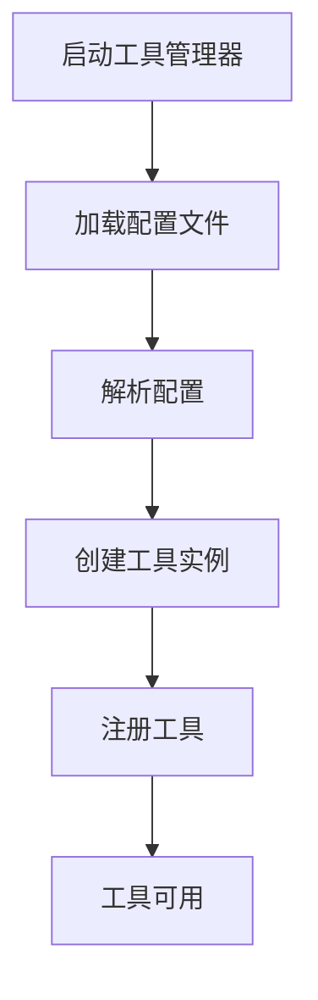
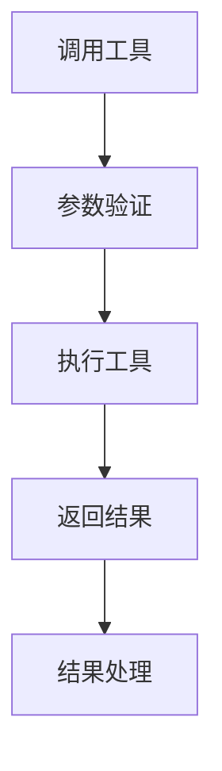

# 工具系统架构

## 概述

工具系统是本项目的核心组件之一，提供统一的接口来管理和执行各种类型的工具。系统支持三种主要工具类型：内置工具、原生工具和MCP工具，具有灵活的配置机制和强大的扩展能力。

## 架构设计

### 分层架构

```
┌─────────────────────────────────────┐
│           Presentation Layer        │
│  (TUI/API/CLI - 工具使用界面)        │
├─────────────────────────────────────┤
│           Application Layer         │
│  (工具执行、工具集管理、工作流集成)    │
├─────────────────────────────────────┤
│            Domain Layer             │
│  (工具核心接口、工具类型定义)          │
├─────────────────────────────────────┤
│         Infrastructure Layer        │
│  (工具管理器、配置加载、执行器)        │
└─────────────────────────────────────┘
```

### 核心组件

#### 1. 工具接口 (Domain Layer)

- `ITool`: 工具核心接口，定义工具的基本行为
- `ToolCall`: 工具调用请求数据结构
- `ToolResult`: 工具执行结果数据结构
- `IToolRegistry`: 工具注册表接口
- `IToolExecutor`: 工具执行器接口
- `IToolFormatter`: 工具格式化器接口

#### 2. 工具类型实现 (Domain Layer)

- `BuiltinTool`: 内置工具实现，包装Python函数，位于 `src/domain/tools/types/builtin_tool.py`
- `NativeTool`: 原生工具实现，调用外部API，位于 `src/domain/tools/types/native_tool.py`
- `MCPTool`: MCP工具实现，通过MCP服务器通信，位于 `src/domain/tools/types/mcp_tool.py`

#### 3. 工具管理 (Infrastructure Layer)

- `IToolManager`: 工具管理器接口
- `ToolManager`: 工具管理器实现
- `IToolLoader`: 工具加载器接口
- `DefaultToolLoader`: 默认工具加载器实现
- `IToolCache`: 工具缓存接口
- `DefaultToolCache`: 默认工具缓存实现

#### 4. 配置管理 (Infrastructure Layer)

- `ToolConfig`: 工具配置基类
- `NativeToolConfig`: 原生工具配置
- `MCPToolConfig`: MCP工具配置
- `BuiltinToolConfig`: 内置工具配置
- `ToolSetConfig`: 工具集配置

#### 5. 工具执行 (Infrastructure Layer)

- `IToolExecutor`: 工具执行器接口
- `ToolExecutor`: 工具执行器实现

## 工具生命周期

### 1. 工具定义

工具通过YAML配置文件定义，存储在 `configs/tools/` 目录下。

### 2. 工具加载



### 3. 工具执行



## 配置管理

### 工具配置

工具配置文件采用YAML格式，存储在 `configs/tools/` 目录下：

```
configs/
└── tools/
    ├── calculator.yaml      # 内置工具示例
    ├── weather.yaml        # 原生工具示例
    └── database.yaml       # MCP工具示例
```

### 工具集配置

工具集配置文件存储在 `configs/tool-sets/` 目录下：

```
configs/
└── tool-sets/
    └── math_tools.yaml     # 工具集示例
```

## 扩展机制

### 添加新工具类型

1. 在 `src/domain/tools/types/` 目录下创建新的工具类型实现
2. 继承 `BaseTool` 基类并实现接口
3. 在 `src/infrastructure/tools/config.py` 中添加配置类
4. 在 `ToolManager` 中添加创建逻辑

### 添加新配置格式

1. 实现 `IToolLoader` 接口
2. 在 `ToolManager` 中注册新的加载器
3. 支持新的配置格式解析

## 性能优化

### 缓存机制

- 工具实例缓存
- 工具Schema缓存
- MCP工具动态Schema缓存

### 并行执行

- 支持工具并行执行
- 异步执行支持
- 资源池管理

## 安全性

### 输入验证

- 参数Schema验证
- 类型检查
- 范围限制

### 执行安全

- 内置工具沙箱执行
- 原生工具请求限制
- MCP工具权限控制

## 监控和日志

### 性能监控

- 工具执行时间统计
- 资源使用情况
- 错误率统计

### 日志记录

- 工具加载日志
- 工具执行日志
- 错误日志

## 最佳实践

### 工具设计

1. **单一职责**: 每个工具应该只负责一个特定功能
2. **明确接口**: 提供清晰的参数Schema和返回格式
3. **错误处理**: 提供有意义的错误信息
4. **文档完善**: 提供详细的工具描述和使用说明

### 配置管理

1. **环境分离**: 为不同环境提供不同的配置
2. **敏感信息**: 使用环境变量管理敏感信息
3. **版本控制**: 配置文件应纳入版本控制
4. **验证机制**: 配置文件应有验证机制

### 性能优化

1. **缓存策略**: 合理使用缓存提高性能
2. **超时设置**: 设置合理的超时时间
3. **资源管理**: 及时释放资源
4. **并发控制**: 控制并发执行数量

## 故障排除

### 常见问题

1. **工具加载失败**: 检查配置文件格式和路径
2. **工具执行超时**: 调整超时设置或优化工具性能
3. **参数验证失败**: 检查参数Schema定义
4. **网络连接问题**: 检查网络连接和服务器状态

### 调试步骤

1. 查看日志文件获取详细错误信息
2. 验证配置文件语法是否正确
3. 检查工具依赖是否正常
4. 测试工具独立运行是否正常

## 未来扩展

### 功能规划

1. **工具市场**: 支持从市场下载和安装工具
2. **工具版本管理**: 支持工具版本管理和升级
3. **工具依赖管理**: 支持工具间的依赖关系
4. **工具测试框架**: 提供工具测试框架

### 性能优化

1. **分布式执行**: 支持工具在分布式环境中执行
2. **资源调度**: 智能调度工具执行资源
3. **预测缓存**: 基于历史数据预测缓存策略
4. **自适应配置**: 根据运行情况自动调整配置