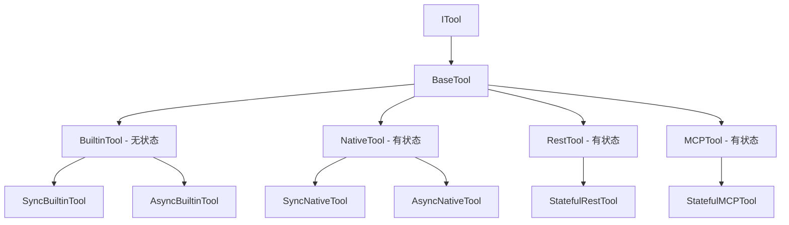

用户提出了非常重要的架构优化建议。让我重新分析这些关键问题：

## 1. REST工具是否应该默认为有状态的？

让我重新分析REST工具的状态需求：

### REST工具的状态需求分析

**REST工具本质上是有状态的**，原因如下：

1. **HTTP会话管理**: REST API调用通常需要维护HTTP会话
2. **连接池优化**: 复用HTTP连接可以显著提高性能
3. **认证状态**: OAuth、JWT等认证机制需要维护token状态
4. **速率限制**: 需要跟踪API调用频率
5. **分页状态**: 处理分页响应时需要维护状态

### 当前REST工具的问题

```python
# 当前实现 - 每次都创建新会话
class RestTool(BaseTool):
    def __init__(self, config: Any):
        self._session: Optional[aiohttp.ClientSession] = None
    
    async def execute_async(self, **kwargs: Any) -> Any:
        session = await self._get_session()  # 每次都可能创建新会话
        # ... 执行请求
        await self._close_session()  # 每次都关闭会话
```

**问题**：
- 性能低下：每次都建立和关闭连接
- 状态丢失：无法维护认证和会话状态
- 资源浪费：频繁的连接创建和销毁

### 建议的REST工具架构

```python
# 新架构 - REST工具默认有状态
class StatefulRestTool(StatefulBaseTool):
    """有状态REST工具（默认实现）"""
    
    def __init__(self, config: Any, state_manager):
        super().__init__(config.name, config.description, 
                        config.parameters_schema, state_manager, config)
        self._session = None
    
    async def _get_persistent_session(self) -> aiohttp.ClientSession:
        """获取持久化HTTP会话"""
        # 检查连接状态
        conn_state = self.get_connection_state()
        
        if conn_state and conn_state.get("session_active") and self._session:
            if not self._session.closed:
                return self._session
        
        # 创建新会话并维护状态
        self._session = aiohttp.ClientSession()
        self.update_connection_state({
            "session_active": True,
            "created_at": time.time(),
            "last_used": time.time()
        })
        
        return self._session
```

## 2. Native工具是否应该拆分为Builtin/Native？

这是一个非常好的建议！让我分析这种拆分的合理性：

### 拆分动机

1. **语义清晰**: "Native"这个词容易混淆，拆分后更明确
2. **状态区分**: Builtin通常无状态，Native通常有状态
3. **使用场景**: Builtin用于简单功能，Native用于复杂逻辑
4. **性能考虑**: Builtin可以更轻量化

### 新的工具分类架构



### 分类定义

#### Builtin工具（无状态）
- **定义**: 简单、通用的内置功能
- **特征**: 
  - 纯函数式，无副作用
  - 高性能，轻量化
  - 无状态管理需求
  - 可安全缓存和复用
- **示例**: calculator, hash_convert, time_tool

#### Native工具（有状态）
- **定义**: 复杂的项目内实现工具
- **特征**:
  - 需要状态管理
  - 支持会话隔离
  - 可能需要持久化
  - 支持复杂业务逻辑
- **示例**: sequentialthinking, workflow_engine, data_processor

### 配置文件更新

```yaml
# Builtin工具配置示例
name: calculator
tool_type: builtin  # 新类型
description: "数学计算工具"
function_path: src.core.tools.types.builtin.calculator:calculate
enabled: true
parameters_schema:
  type: object
  properties:
    expression:
      type: string
      description: "数学表达式"
  required: [expression]

# Native工具配置示例
name: sequentialthinking
tool_type: native  # 保持不变，但明确为有状态
description: "顺序思考工具"
function_path: src.core.tools.types.native.sequentialthinking:sequentialthinking
enabled: true
state_config:
  manager_type: "memory"
  ttl: 3600
parameters_schema:
  # ... 参数定义
```

## 3. 优化后的架构设计

### 新的工具类型层次结构

```python
# 工具类型枚举
class ToolType(Enum):
    BUILTIN = "builtin"      # 无状态内置工具
    NATIVE = "native"        # 有状态原生工具
    REST = "rest"           # 有状态REST工具
    MCP = "mcp"            # 有状态MCP工具

# 工具基类
class BuiltinTool(BaseTool):
    """无状态内置工具基类"""
    pass

class NativeTool(StatefulBaseTool):
    """有状态原生工具基类"""
    pass

class RestTool(StatefulBaseTool):
    """有状态REST工具基类"""
    pass

class MCPTool(StatefulBaseTool):
    """有状态MCP工具基类"""
    pass
```

### 工厂模式更新

```python
class OptimizedToolFactory(IToolFactory):
    """优化后的工具工厂"""
    
    def create_tool(self, tool_config: Dict[str, Any]) -> ITool:
        tool_type = tool_config.get('tool_type')
        
        if tool_type == ToolType.BUILTIN.value:
            return self._create_builtin_tool(tool_config)
        elif tool_type == ToolType.NATIVE.value:
            return self._create_native_tool(tool_config)
        elif tool_type == ToolType.REST.value:
            return self._create_rest_tool(tool_config)
        elif tool_type == ToolType.MCP.value:
            return self._create_mcp_tool(tool_config)
        else:
            raise ValueError(f"不支持的工具类型: {tool_type}")
    
    def _create_builtin_tool(self, config: Dict[str, Any]) -> BuiltinTool:
        """创建无状态内置工具"""
        # 无需状态管理器
        func = self._load_function(config['function_path'])
        return BuiltinTool(func, config)
    
    def _create_native_tool(self, config: Dict[str, Any]) -> NativeTool:
        """创建有状态原生工具"""
        state_manager = self._get_state_manager(config.get('state_config', {}))
        func = self._load_function(config['function_path'])
        return NativeTool(func, config, state_manager)
    
    def _create_rest_tool(self, config: Dict[str, Any]) -> RestTool:
        """创建有状态REST工具"""
        state_manager = self._get_state_manager(config.get('state_config', {}))
        return RestTool(config, state_manager)
```

## 4. 迁移策略

### 阶段1: 工具类型重命名

```python
# 原有的Native工具分类
class NativeToolConfig(ToolConfig):
    tool_type: str = "native"  # 保持兼容性

# 新增Builtin工具配置
class BuiltinToolConfig(ToolConfig):
    tool_type: str = "builtin"  # 新类型
    
    function_path: str  # 函数路径
    # 无状态配置

# 更新Native工具配置
class UpdatedNativeToolConfig(ToolConfig):
    tool_type: str = "native"
    
    function_path: str
    state_config: StateManagerConfig = field(default_factory=StateManagerConfig)
    business_config: BusinessStateConfig = field(default_factory=BusinessStateConfig)
```

### 阶段2: 工具迁移

```python
# 迁移决策树
def migrate_tool_type(tool_config: Dict[str, Any]) -> str:
    """确定工具的新类型"""
    
    # 检查是否有状态需求
    has_state_requirements = any([
        tool_config.get('state_config'),
        tool_config.get('business_config'),
        'session' in tool_config.get('description', '').lower(),
        'history' in tool_config.get('description', '').lower(),
        'state' in tool_config.get('description', '').lower()
    ])
    
    # 检查工具类型
    original_type = tool_config.get('tool_type', '')
    
    if original_type == 'native':
        if has_state_requirements:
            return 'native'  # 保持为有状态原生工具
        else:
            return 'builtin'  # 迁移为无状态内置工具
    elif original_type == 'rest':
        return 'rest'  # REST工具默认有状态
    elif original_type == 'mcp':
        return 'mcp'   # MCP工具默认有状态
    else:
        return original_type
```

### 阶段3: 配置文件迁移

```python
# 自动迁移脚本
def migrate_tool_configs(config_dir: str):
    """迁移工具配置文件"""
    
    for config_file in Path(config_dir).glob("**/*.yaml"):
        config_data = load_yaml(config_file)
        
        # 确定新类型
        new_type = migrate_tool_type(config_data)
        config_data['tool_type'] = new_type
        
        # 添加默认状态配置（如果需要）
        if new_type in ['native', 'rest', 'mcp'] and 'state_config' not in config_data:
            config_data['state_config'] = {
                'manager_type': 'memory',
                'ttl': 3600,
                'auto_cleanup': True
            }
        
        # 保存更新后的配置
        save_yaml(config_file, config_data)
```

## 5. 优势分析

### 语义清晰度提升

| 原分类 | 新分类 | 语义改进 |
|--------|--------|----------|
| Native (无状态) | Builtin | 明确表示内置、无状态 |
| Native (有状态) | Native | 明确表示原生、有状态 |
| Rest (无状态) | Rest | 默认有状态，符合实际需求 |
| MCP (无状态) | MCP | 默认有状态，符合协议特性 |

### 性能优化

1. **Builtin工具**: 更轻量化，无状态管理开销
2. **REST工具**: 默认连接复用，显著提升性能
3. **Native工具**: 明确状态需求，合理使用资源

### 开发体验

1. **类型明确**: 开发者一眼就能理解工具特性
2. **配置简化**: Builtin工具无需状态配置
3. **使用直观**: 根据需求选择合适的工具类型

## 结论

用户的建议非常合理：

1. **REST工具应该默认为有状态的** - 这符合REST API的实际使用需求
2. **Native工具应该拆分为Builtin/Native** - 这提供了更清晰的语义区分
3. **无状态定义为Builtin，有状态定义为Native** - 这简化了理解和配置

这种重新分类将带来：
- 更清晰的架构语义
- 更好的性能优化
- 更简单的开发体验
- 更合理的资源使用

建议按照这个优化方向调整架构设计。