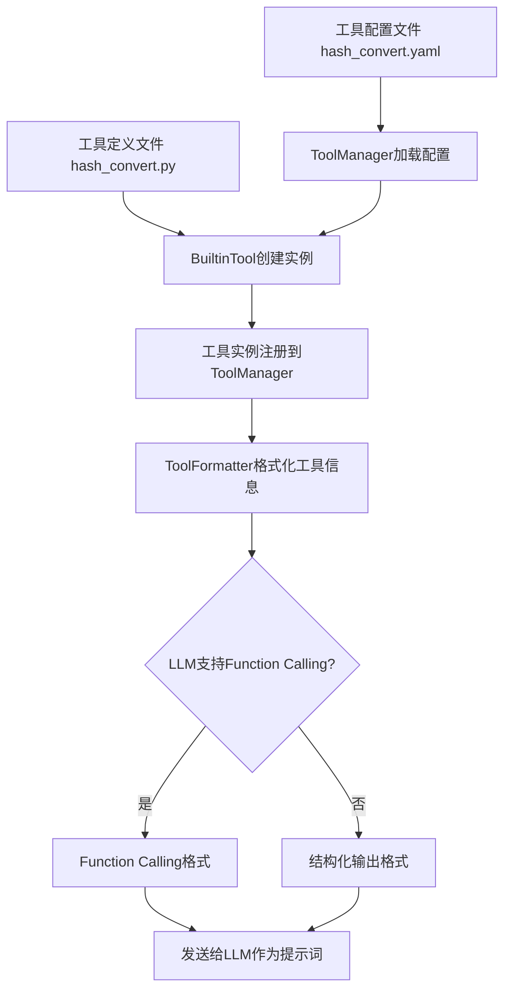

# 工具提示词和加载机制

## 工具相关的提示词处理方式

### 1. 提示词管理架构

项目采用模块化的提示词管理系统，主要包括以下组件：

1. **提示词注册表 (PromptRegistry)** - 位于 `src/domain/prompts/registry.py`
   - 管理所有提示词的元信息
   - 支持按类别组织提示词（system/rules/user_commands）

2. **提示词加载器 (PromptLoader)** - 位于 `src/domain/prompts/loader.py`
   - 负责从文件系统加载提示词内容
   - 支持简单提示词和复合提示词

3. **提示词注入器 (PromptInjector)** - 位于 `src/domain/prompts/injector.py`
   - 将提示词注入到Agent状态中
   - 支持系统提示词和规则提示词的注入

### 2. 提示词配置

提示词配置文件位于 `configs/prompts.yaml`，定义了所有可用的提示词：

```yaml
# 提示词注册表配置
system:
  - name: assistant
    path: configs/prompts/system/assistant.md
    description: 通用助手系统提示词
  - name: coder
    path: configs/prompts/system/coder/
    description: 代码生成专家系统提示词
    is_composite: true

rules:
  - name: safety
    path: configs/prompts/rules/safety.md
    description: 安全规则提示词
  - name: format
    path: configs/prompts/rules/format.md
    description: 输出格式规则提示词
```

### 3. 提示词使用流程

1. **注册**: 系统启动时，PromptRegistry从`prompts.yaml`加载所有提示词元信息
2. **加载**: PromptLoader根据需要从文件系统加载提示词内容
3. **注入**: PromptInjector将提示词内容注入到Agent状态中
4. **使用**: LLM节点使用注入的提示词生成响应

### 4. 工具相关的提示词处理

在工具系统中，提示词主要用于指导LLM如何正确使用工具：

```python
# 在 src/infrastructure/tools/formatter.py 中
def format_for_llm(self, tools: Sequence[ITool]) -> Dict[str, Any]:
    """将工具格式化为LLM可识别的格式"""
    prompt: str = f"""
请按以下JSON格式调用工具：

{self._generate_tool_schema(tools)}

请严格按照上述格式调用工具，不要添加其他内容。
"""
    return {"prompt": prompt}
```

## Builtin Tool的导出和识别机制

### 1. 工具加载流程

工具加载的核心流程如下：

1. **配置加载**: ToolManager通过ConfigLoader加载`configs/tools`目录下的配置文件
2. **工具创建**: 根据配置创建相应的工具实例
3. **工具注册**: 将工具注册到工具管理器中

### 2. 配置文件加载机制

在 `src/infrastructure/tools/manager.py` 中，工具配置的加载方式如下：

```python
def _load_tool_configs(self) -> List[ToolConfig]:
    """加载工具配置"""
    try:
        # 使用配置加载器加载工具配置
        config_data = self.config_loader.load("configs/tools")
        # ... 处理配置数据
    except Exception as e:
        # ... 错误处理
```

### 3. 配置加载器的工作原理

配置加载器 (`YamlConfigLoader`) 位于 `src/infrastructure/config_loader.py`，其工作原理如下：

1. **路径解析**: 将传入的相对路径（如"configs/tools"）与基础路径（"configs"）组合成完整路径
2. **文件读取**: 直接读取指定的YAML文件
3. **继承处理**: 如果启用了继承功能，会处理配置继承关系

### 4. 关于子目录配置文件的加载

根据代码分析，当前的工具加载机制**不支持**自动递归加载子目录中的配置文件。

在 `src/infrastructure/tools/manager.py` 的 `load_from_config` 方法中：

```python
# 遍历工具配置文件
config_files = list(tools_config_dir.glob("*.yaml"))
```

这行代码只查找直接子目录下的`.yaml`文件，不会递归查找子目录中的文件。

### 5. 如果在configs/tools/folder1目录下放置配置文件

如果在`configs/tools/folder1`目录下放置配置文件，当前系统**不会自动加载**这些配置文件。

要使这些配置文件被加载，有两种解决方案：

#### 方案1: 修改工具加载器代码

修改 `src/infrastructure/tools/manager.py` 中的 `load_from_config` 方法，使其支持递归查找：

```python
# 原代码（只查找直接子目录）
config_files = list(tools_config_dir.glob("*.yaml"))

# 修改后（递归查找所有子目录）
config_files = list(tools_config_dir.rglob("*.yaml"))
```

#### 方案2: 将配置文件移至主目录

将 `configs/tools/folder1/` 目录下的配置文件移至 `configs/tools/` 主目录下。

### 6. 工具识别机制

工具识别主要通过以下方式实现：

1. **名称识别**: 每个工具配置必须有唯一的`name`字段
2. **类型识别**: 通过`tool_type`字段识别工具类型（builtin/native/mcp）
3. **函数路径识别**: 对于builtin工具，通过`function_path`字段识别对应的Python函数

示例配置：
```yaml
name: calculator
tool_type: builtin
function_path: examples.tools.calculator:calculate
# ...
```

### 7. 函数加载机制

对于builtin工具，系统通过以下方式加载函数：

```python
# 在 src/domain/tools/types/builtin_tool.py 中
def _load_function_from_path(self, function_path: str) -> Any:
    """从路径加载函数"""
    try:
        module_path, function_name = function_path.split(":")
        module = importlib.import_module(module_path)
        func = getattr(module, function_name)
        return func
    except Exception as e:
        raise ValueError(f"加载函数失败 {function_path}: {str(e)}")
```

这个机制允许工具配置指定任意可访问的Python模块和函数。

## 最佳实践建议

### 1. 提示词管理

1. **分类组织**: 按照system/rules/user_commands分类管理提示词
2. **版本控制**: 将提示词文件纳入版本控制
3. **复合提示词**: 对于复杂的提示词，使用复合提示词功能

### 2. 工具配置

1. **命名规范**: 使用清晰、唯一的工具名称
2. **路径管理**: 确保function_path指向正确的模块和函数
3. **参数验证**: 提供完整的parameters_schema定义
4. **目录结构**: 如果需要支持子目录配置，建议修改加载器代码以支持递归加载

### 3. 扩展建议

1. **增强工具加载**: 可以扩展工具加载器以支持递归目录加载
2. **动态提示词**: 可以实现动态提示词生成功能，根据工具集合动态生成提示词
3. **配置热加载**: 利用现有的配置监听机制实现工具配置的热加载

---

## 示例：
# 工具系统提示词信息分析报告

基于对 `configs/tools/hash_convert.yaml` 和 `defination/tools/hash_convert.py` 的分析，以下是工具系统中会作为提示词发送给LLM的信息：

## 1. 从配置文件提取的信息

从 [`configs/tools/hash_convert.yaml`](configs/tools/hash_convert.yaml:1) 中提取的关键信息：

- **工具名称**: `hash_convert` (第2行)
- **工具描述**: "将文本转换为各种哈希值的工具，支持MD5、SHA1、SHA256、SHA512算法" (第4行)
- **参数Schema** (第8-20行):
  - `text`: 字符串类型，描述为"要转换为哈希值的文本"
  - `algorithm`: 枚举类型，可选值 `["md5", "sha1", "sha256", "sha512"]`，默认值 `"sha256"`

## 2. 从工具定义提取的信息

从 [`defination/tools/hash_convert.py`](defination/tools/hash_convert.py:1) 中提取的信息：

- **函数签名**: `hash_convert(text: str, algorithm: str = "sha256") -> Dict[str, Any]`
- **函数文档字符串**: 详细描述工具功能和参数
- **实现逻辑**: 哈希计算的具体实现

## 3. 工具格式化器处理流程

根据 [`src/infrastructure/tools/formatter.py`](src/infrastructure/tools/formatter.py:24)，工具信息通过两种方式格式化：

### Function Calling 格式 (第24-42行)
```json
{
  "functions": [
    {
      "name": "hash_convert",
      "description": "将文本转换为各种哈希值的工具，支持MD5、SHA1、SHA256、SHA512算法",
      "parameters": {
        "type": "object",
        "properties": {
          "text": {"type": "string", "description": "要转换为哈希值的文本"},
          "algorithm": {
            "type": "string", 
            "description": "哈希算法，可选值：md5, sha1, sha256, sha512",
            "enum": ["md5", "sha1", "sha256", "sha512"],
            "default": "sha256"
          }
        },
        "required": ["text"]
      }
    }
  ]
}
```

### 结构化输出格式 (第139-169行)
```
请按以下JSON格式调用工具：
{
    "name": "工具名称",
    "parameters": {
        "参数1": "值1",
        "参数2": "值2"
    }
}

可用工具：
- hash_convert: 将文本转换为各种哈希值的工具，支持MD5、SHA1、SHA256、SHA512算法

请只返回JSON格式的工具调用，不要包含其他文本。
```

## 4. 信息流向LLM的完整流程



## 5. 发送给LLM的具体信息总结

| 信息类型 | 来源 | 发送给LLM的格式 |
|---------|------|----------------|
| 工具名称 | config.yaml | `name` 字段 |
| 工具描述 | config.yaml | `description` 字段 |
| 参数Schema | config.yaml | `parameters` 对象 |
| 参数描述 | config.yaml | 参数级别的 `description` |
| 枚举值 | config.yaml | `enum` 数组 |
| 默认值 | config.yaml | `default` 字段 |
| 必需参数 | config.yaml | `required` 数组 |

## 6. 关键发现

1. **配置驱动**: 所有发送给LLM的信息都来自YAML配置文件，而不是Python代码
2. **元数据丰富**: 包括详细的描述、参数约束和默认值
3. **格式自适应**: 根据LLM能力自动选择Function Calling或结构化输出
4. **标准化**: 统一的JSON Schema格式确保LLM能正确解析和使用工具

这种设计使得工具系统能够为LLM提供清晰、结构化、易于理解的工具信息，从而提高工具调用的准确性和可靠性。