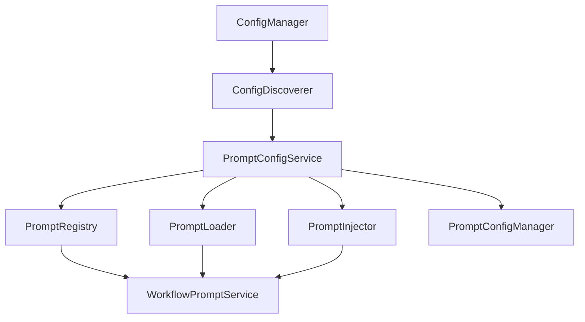

# PromptConfigService 架构分析报告

## 概述

本报告分析 `src\services\config\prompt_config_service.py` 的必要性，评估其是否为多余的架构组件，并提出简化方案。

## 当前架构分析

### 1. 现有组件关系



### 2. PromptConfigService 的职责分析

`PromptConfigService` 当前承担的职责：

1. **组件初始化**: 创建和配置 `PromptRegistry`、`PromptLoader`、`PromptInjector`
2. **配置发现**: 使用 `ConfigDiscoverer` 发现提示词文件
3. **生命周期管理**: 管理初始化状态和重新加载
4. **服务提供**: 为其他组件提供提示词系统组件的访问接口

### 3. 架构重复性分析

#### 3.1 与现有配置系统的重复

1. **ConfigServiceFactory**: 已经提供了配置管理器的创建功能
2. **ConfigDiscoverer**: 已经提供了配置发现功能
3. **PromptConfigManager**: 已经提供了提示词配置管理功能

#### 3.2 功能重叠

1. **初始化逻辑**: `PromptConfigService` 的初始化逻辑与 `ConfigServiceFactory` 的模式相似
2. **发现机制**: 使用 `ConfigDiscoverer` 但包装了一层额外的逻辑
3. **全局实例管理**: 与 `PromptConfigManager` 的全局实例管理模式重复

## 问题分析

### 1. 架构冗余

`PromptConfigService` 在现有架构中形成了不必要的中间层：

- **ConfigManager** → **ConfigDiscoverer** → **PromptConfigService** → **PromptRegistry**

这个链条可以简化为：
- **ConfigManager** → **ConfigDiscoverer** → **PromptRegistry**

### 2. 职责分散

提示词系统的初始化逻辑分散在多个地方：
- `PromptConfigService`: 组件创建和生命周期管理
- `ConfigServiceFactory`: 配置管理器创建
- `PromptConfigManager`: 配置对象管理

### 3. 复杂性增加

额外的服务类增加了：
- 代码复杂性
- 维护成本
- 学习成本
- 测试复杂性

## 简化方案分析

### 方案一：集成到 ConfigServiceFactory

```python
# 在 ConfigServiceFactory 中添加提示词系统创建方法
class ConfigServiceFactory:
    @staticmethod
    async def create_prompt_system(
        config_manager: Optional[ConfigManager] = None,
        prompts_directory: str = "configs/prompts"
    ) -> Tuple[PromptRegistry, PromptLoader, PromptInjector]:
        """创建提示词系统组件"""
        # 直接在这里实现初始化逻辑
```

**优点**:
- 统一的配置服务创建入口
- 减少一个专门的服务类
- 与现有配置系统模式一致

**缺点**:
- ConfigServiceFactory 变得更复杂
- 混合了同步和异步创建模式
- 可能违反单一职责原则

### 方案二：扩展 PromptConfigManager

```python
# 扩展 PromptConfigManager 添加发现和初始化功能
class PromptConfigManager:
    async def initialize_system(self, config_manager: ConfigManager) -> None:
        """初始化提示词系统"""
        # 将 PromptConfigService 的逻辑移到这里
```

**优点**:
- 提示词相关功能集中在一个类中
- 减少服务间的依赖
- 更符合领域驱动设计

**缺点**:
- PromptConfigManager 职责过重
- 与配置系统的耦合度增加
- 可能影响现有的使用方式

### 方案三：使用依赖注入容器

```python
# 通过现有的依赖注入容器管理提示词系统
# 在容器配置中定义提示词系统的创建逻辑
```

**优点**:
- 最符合现有的架构模式
- 灵活的组件配置
- 易于测试和模拟

**缺点**:
- 需要修改容器配置
- 学习成本较高
- 可能过度工程化

## 推荐方案

基于分析，**推荐方案一（集成到 ConfigServiceFactory）**，原因如下：

1. **简化架构**: 减少一个中间层，直接在工厂中创建
2. **保持一致性**: 与现有的配置服务创建模式保持一致
3. **减少复杂性**: 避免了额外的服务类和全局实例管理
4. **易于维护**: 所有配置相关的创建逻辑集中在一个地方

## 具体实现建议

### 1. 修改 ConfigServiceFactory

```python
class ConfigServiceFactory:
    @staticmethod
    async def create_prompt_system(
        config_manager: Optional[ConfigManager] = None,
        prompts_directory: str = "configs/prompts",
        auto_discover: bool = True
    ) -> Dict[str, Any]:
        """创建提示词系统
        
        Returns:
            Dict[str, Any]: 包含 registry, loader, injector 的字典
        """
        if config_manager is None:
            config_manager = ConfigServiceFactory.create_config_manager()
        
        # 创建提示词组件
        config_mgr = get_global_config_manager()
        registry = PromptRegistry(
            loader=None,
            config=config_mgr.create_config()
        )
        loader = PromptLoader(registry=registry)
        registry._loader = loader
        injector = PromptInjector(loader=loader)
        
        # 自动发现和加载
        if auto_discover:
            discoverer = ConfigDiscoverer(prompts_directory)
            discovery_result = discoverer.discover_configs(
                scan_directories=["prompts"],
                file_patterns=[r".*\.md$"]
            )
            await loader.load_all(registry)
        
        return {
            "registry": registry,
            "loader": loader,
            "injector": injector
        }
```

### 2. 更新 WorkflowPromptService

```python
class WorkflowPromptService:
    def __init__(self, auto_initialize: bool = True):
        self._auto_initialize = auto_initialize
        self._initialized = False
    
    async def _ensure_initialized(self):
        """确保已初始化"""
        if not self._initialized and self._auto_initialize:
            from ...services.config import ConfigServiceFactory
            
            prompt_system = await ConfigServiceFactory.create_prompt_system()
            self._prompt_registry = prompt_system["registry"]
            self._prompt_injector = prompt_system["injector"]
            self._initialized = True
```

## 迁移计划

### 第一阶段：准备工作
1. 在 `ConfigServiceFactory` 中添加 `create_prompt_system` 方法
2. 添加单元测试验证新方法的功能

### 第二阶段：更新依赖
1. 更新 `WorkflowPromptService` 使用新的创建方式
2. 更新所有直接使用 `PromptConfigService` 的地方
3. 更新测试用例

### 第三阶段：清理
1. 删除 `PromptConfigService` 类
2. 更新导入语句
3. 更新文档和示例

### 第四阶段：验证
1. 运行完整的测试套件
2. 验证所有功能正常工作
3. 性能测试确保没有回归

## 影响评估

### 1. 正面影响

- **代码减少**: 预计减少约 300 行代码
- **复杂性降低**: 减少一个中间层和全局实例管理
- **维护性提升**: 配置创建逻辑集中管理
- **一致性改善**: 与现有配置系统模式保持一致

### 2. 潜在风险

- **向后兼容性**: 需要更新所有使用 `PromptConfigService` 的代码
- **测试覆盖**: 需要确保新实现有充分的测试覆盖
- **文档更新**: 需要更新相关文档和示例

### 3. 风险缓解

- **渐进式迁移**: 分阶段进行，确保每一步都可以验证
- **充分测试**: 在每个阶段都进行完整的测试
- **文档同步**: 及时更新文档，避免信息滞后

## 结论

`PromptConfigService` 确实是多余的架构组件。通过将其功能集成到 `ConfigServiceFactory` 中，可以：

1. **简化架构**: 减少不必要的中间层
2. **提高一致性**: 与现有配置系统模式保持一致
3. **降低复杂性**: 减少代码和维护成本
4. **保持功能**: 不影响现有的提示词加载和配置能力

这种简化不会影响提示词系统的核心功能，包括：
- 提示词文件的发现和加载
- LLM节点的提示词配置
- 模板处理和变量替换
- 引用系统和组合机制

建议按照提出的迁移计划进行重构，以实现更简洁、更易维护的架构。