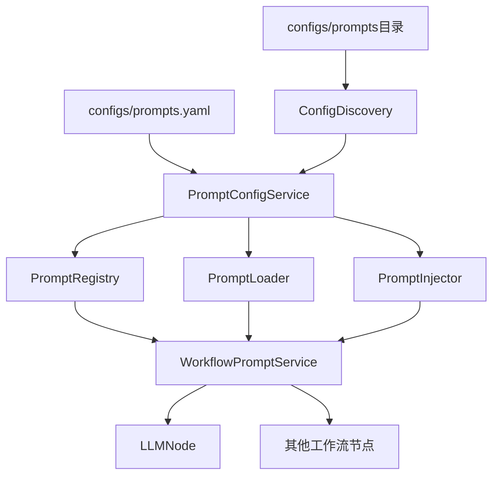
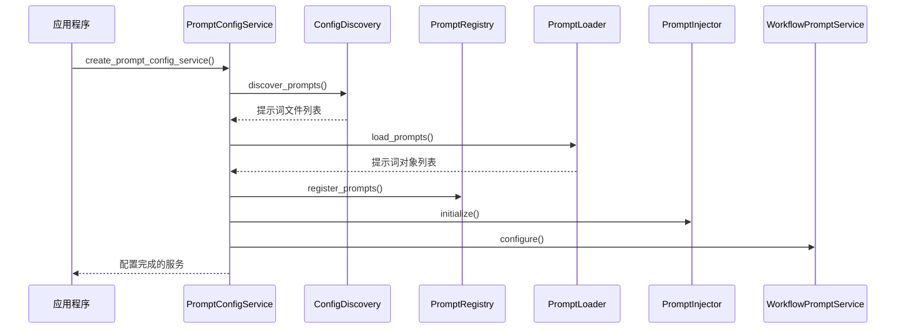
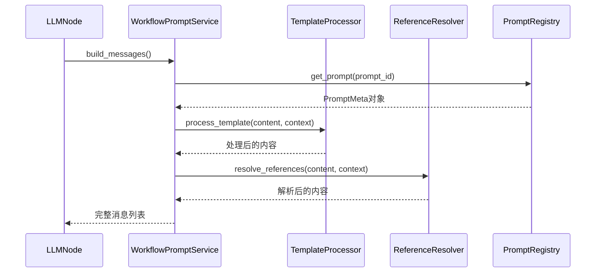

# 提示词加载机制分析

## 概述

本文档详细分析了当前工作流系统中提示词的加载机制，以及如何为LLM节点配置专门的提示词。通过重构，提示词系统已经完全集成到统一的配置管理系统中，提供了灵活且强大的提示词管理能力。

## 提示词加载机制架构

### 1. 整体架构图



### 2. 核心组件

#### 2.1 PromptConfigService
- **位置**: `src/services/config/prompt_config_service.py`
- **功能**: 提示词系统的统一配置服务，负责初始化和管理所有提示词相关组件
- **关键特性**:
  - 使用配置发现机制扫描提示词文件
  - 提供组件生命周期管理
  - 支持配置驱动的提示词加载

#### 2.2 ConfigDiscovery (扩展)
- **位置**: `src/services/config/discovery.py`
- **功能**: 扩展支持提示词文件发现
- **关键特性**:
  - 自动扫描 `configs/prompts` 目录
  - 按类别组织提示词文件 (system, rules, user_commands)
  - 支持文件模式匹配

#### 2.3 WorkflowPromptService
- **位置**: `src/core/workflow/services/prompt_service.py`
- **功能**: 工作流提示词服务，为工作流节点提供提示词处理功能
- **关键特性**:
  - 提示词内容处理和模板渲染
  - 引用解析和变量替换
  - 节点输入输出的提示词处理

#### 2.4 LLMNode
- **位置**: `src/core/workflow/graph/nodes/llm_node.py`
- **功能**: LLM调用节点，集成提示词系统
- **关键特性**:
  - 支持多种提示词配置方式
  - 自动提示词处理和消息构建
  - 灵活的提示词变量支持

## 提示词加载流程

### 1. 初始化流程



### 2. 详细步骤

1. **配置发现阶段**
   - `ConfigDiscovery` 扫描 `configs/prompts` 目录
   - 根据配置文件中的规则识别提示词文件
   - 按类别组织文件结构

2. **提示词加载阶段**
   - `PromptLoader` 读取提示词文件
   - 解析YAML前置元数据和Markdown内容
   - 创建 `PromptMeta` 对象

3. **注册阶段**
   - `PromptRegistry` 注册提示词对象
   - 建立提示词ID到对象的映射
   - 提供查询和管理接口

4. **服务配置阶段**
   - `WorkflowPromptService` 接收配置的组件
   - 初始化模板处理器和引用解析器
   - 准备为工作流节点提供服务

## 提示词文件结构

### 1. 目录结构

```
configs/prompts/
├── system/              # 系统提示词
│   ├── assistant.md
│   └── coder/
│       ├── 01_code_style.md
│       └── 02_error_handling.md
├── rules/               # 规则提示词
│   ├── format.md
│   └── safety.md
└── user_commands/       # 用户命令提示词
    ├── code_review.md
    └── data_analysis.md
```

### 2. 文件格式

每个提示词文件使用YAML前置元数据和Markdown内容：

```markdown
---
description: 通用助手提示词，定义Agent基础角色
priority: high
tags: [assistant, general]
variables:
  - name: task_type
    type: string
    description: 任务类型
---

你是一个通用助手，负责解答用户问题，语言简洁明了。

当前任务类型: {{task_type}}
```

### 3. 配置文件

`configs/prompts.yaml` 定义提示词系统的加载规则：

```yaml
prompt_system:
  auto_discover: true
  prompts_directory: "configs/prompts"
  discovery:
    scan_directories: ["system", "rules", "user_commands"]
    file_patterns: [".*\\.md$"]
  categories:
    system:
      description: "系统提示词"
      default_priority: "high"
    rules:
      description: "规则提示词"
      default_priority: "medium"
    user_commands:
      description: "用户命令提示词"
      default_priority: "low"
```

## LLM节点提示词配置

### 1. 配置方式

LLM节点支持多种提示词配置方式：

#### 1.1 传统方式 (直接配置)
```yaml
nodes:
  analysis_node:
    type: "llm_node"
    config:
      system_prompt: "你是一个专业的数据分析助手..."
      user_input: "请分析以下数据: {{data}}"
```

#### 1.2 提示词ID方式 (推荐)
```yaml
nodes:
  analysis_node:
    type: "llm_node"
    config:
      system_prompt_id: "system.assistant"
      user_prompt_id: "user_commands.data_analysis"
      prompt_variables:
        task_type: "data_analysis"
        data_source: "user_input"
```

#### 1.3 混合方式
```yaml
nodes:
  analysis_node:
    type: "llm_node"
    config:
      system_prompt_id: "system.assistant"
      user_input: "请分析以下数据: {{data}}"
      prompt_variables:
        data: "{{workflow.input_data}}"
```

### 2. 提示词变量

LLM节点支持丰富的提示词变量：

#### 2.1 系统变量
- `node_id`: 当前节点ID
- `timestamp`: 执行时间戳
- `workflow_id`: 工作流ID
- `workflow_name`: 工作流名称

#### 2.2 状态变量
- 所有工作流状态中的数据都可以通过 `{{state.key}}` 访问

#### 2.3 配置变量
- 节点配置中的 `prompt_variables` 对象
- 全局工作流配置中的 `prompt_variables`

#### 2.4 引用变量
- `{{ref:prompt_id}}`: 引用其他提示词
- 支持嵌套引用和循环引用检测

### 3. 消息构建流程



## 灵活性分析

### 1. 配置灵活性

#### 1.1 多层次配置
- **全局级别**: 在工作流配置中定义全局提示词变量
- **节点级别**: 为每个节点配置特定的提示词
- **运行时级别**: 在执行时动态提供提示词变量

#### 1.2 继承和覆盖
- 支持工作流配置继承 (`inherits_from`)
- 子配置可以覆盖父配置的提示词设置
- 提供默认值和回退机制

#### 1.3 条件配置
- 支持基于条件的提示词选择
- 可以根据工作流状态动态选择提示词
- 支持A/B测试和提示词版本管理

### 2. 内容灵活性

#### 2.1 模板系统
- 支持变量替换: `{{variable_name}}`
- 支持条件渲染: `{{#if condition}}...{{/if}}`
- 支持循环: `{{#each items}}...{{/each}}`
- 支持嵌套模板和包含

#### 2.2 引用系统
- 支持提示词间的引用: `{{ref:other_prompt}}`
- 支持参数化引用: `{{ref:other_prompt:param1=value1}}`
- 自动循环引用检测和处理

#### 2.3 多语言支持
- 支持多语言提示词文件
- 基于用户偏好或上下文选择语言
- 支持语言回退机制

### 3. 运行时灵活性

#### 3.1 动态加载
- 支持运行时重新加载提示词
- 热更新无需重启系统
- 支持提示词版本管理

#### 3.2 缓存机制
- 智能缓存已处理的提示词
- 支持缓存失效和更新
- 提高性能和响应速度

#### 3.3 错误处理
- 优雅处理提示词缺失
- 提供详细的错误信息和修复建议
- 支持回退到默认提示词

## 最佳实践

### 1. 提示词组织

#### 1.1 分类原则
- **系统提示词**: 定义AI角色和行为准则
- **规则提示词**: 定义输出格式和约束条件
- **用户命令提示词**: 定义特定任务的指令

#### 1.2 命名规范
- 使用层次化命名: `category.subcategory.name`
- 保持描述性和一致性
- 避免特殊字符和空格

#### 1.3 版本管理
- 使用语义化版本号
- 记录变更历史和影响
- 支持向后兼容性

### 2. 配置设计

#### 2.1 模块化设计
- 将复杂提示词分解为可重用模块
- 使用引用组合提示词
- 避免重复和冗余

#### 2.2 参数化设计
- 使用变量而非硬编码值
- 提供合理的默认值
- 支持参数验证和类型检查

#### 2.3 测试策略
- 为提示词编写单元测试
- 测试不同参数组合
- 验证输出格式和质量

### 3. 性能优化

#### 3.1 缓存策略
- 缓存常用的提示词组合
- 使用LRU缓存策略
- 定期清理过期缓存

#### 3.2 延迟加载
- 按需加载提示词文件
- 避免初始化时加载所有内容
- 使用异步加载提高响应速度

#### 3.3 监控和分析
- 监控提示词使用情况
- 分析性能瓶颈
- 优化热点提示词

## 扩展性考虑

### 1. 新增提示词类型

系统设计支持轻松添加新的提示词类型：

1. 在 `configs/prompts.yaml` 中添加新类别配置
2. 创建对应的目录结构
3. 编写提示词文件
4. 系统自动发现和加载

### 2. 自定义处理器

可以扩展提示词处理逻辑：

1. 实现 `IPromptType` 接口
2. 注册到类型注册表
3. 在提示词文件中指定类型
4. 系统自动调用自定义处理器

### 3. 集成外部系统

支持与外部提示词管理系统集成：

1. 实现 `IPromptLoader` 接口
2. 配置外部数据源
3. 实现同步和缓存机制
4. 保持API兼容性

## 总结

当前的提示词加载机制具有以下优势：

1. **统一管理**: 通过配置系统统一管理所有提示词
2. **灵活配置**: 支持多种配置方式和变量系统
3. **高性能**: 智能缓存和延迟加载机制
4. **易扩展**: 模块化设计支持功能扩展
5. **强类型**: 完整的类型检查和验证
6. **易维护**: 清晰的架构和文档

通过这个系统，开发人员可以轻松地为每个LLM节点配置专门的提示词，实现高度定制化的工作流行为。系统的设计充分考虑了灵活性、性能和可维护性，为复杂的工作流场景提供了强大的支持。