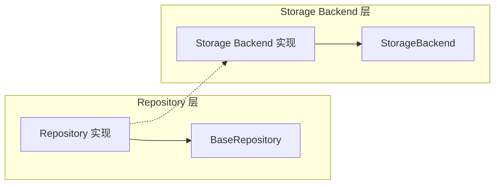
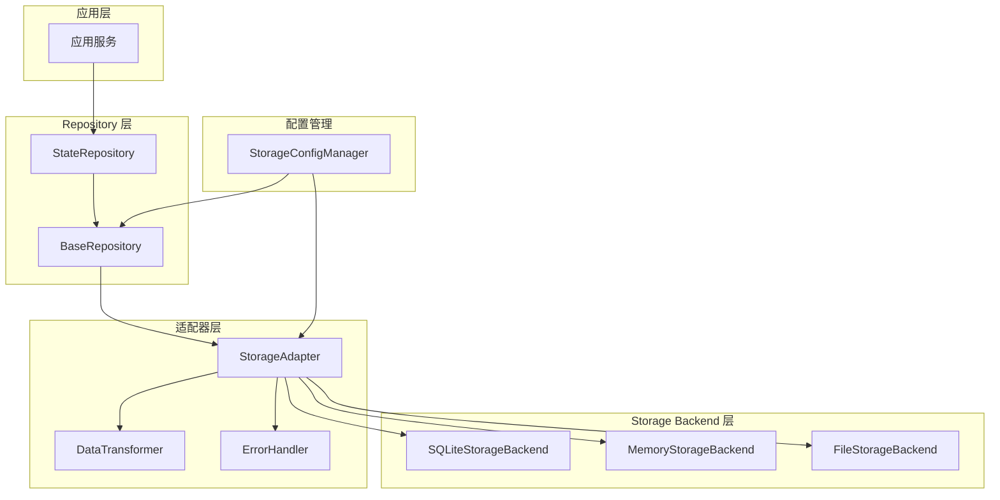

# Storage Backends 与 Repository 层关系划分最终分析报告

## 执行摘要

本报告对 `src\adapters\storage\backends` 下的存储后端实现（sqlite_backend.py、memory_backend.py、file_backend.py）与 `src\adapters\repository` 下的仓库基类（base.py、file_base.py、memory_base.py、sqlite_base.py）之间的关系进行了深入分析。通过分析发现当前架构存在职责边界模糊、代码重复等问题，并提出了基于适配器模式的重构方案。

## 1. 分析背景

### 1.1 分析目标
- 明确 storage backends 与 repository 层的职责边界
- 识别架构中的重复代码和冗余
- 提出优化建议和重构方案
- 为后续架构演进提供指导

### 1.2 分析范围
- Storage Backend 层：sqlite_backend.py、memory_backend.py、file_backend.py
- Repository 层：base.py、file_base.py、memory_base.py、sqlite_base.py
- 相关接口定义和具体实现

## 2. 当前架构分析

### 2.1 架构关系概述

当前系统采用了分层架构，从上到下依次为：
1. **应用层** - 业务逻辑处理
2. **Repository 层** - 领域数据访问抽象
3. **Storage Backend 层** - 底层存储实现
4. **基础设施层** - 基础功能支持

### 2.2 层间依赖关系



**关键发现：**
- Repository 层直接依赖 Storage Backend 层，违反了依赖倒置原则
- 两层之间存在功能重叠，职责边界不清晰
- 缺乏统一的抽象层来管理存储访问

### 2.3 接口实现分析

**Storage Backend 层实现的接口：**
- `IStorage` - 统一存储接口
- `IStorageBackend` - 存储后端接口

**Repository 层实现的接口：**
- `IStateRepository` - 状态仓库接口
- `IHistoryRepository` - 历史仓库接口
- `ISnapshotRepository` - 快照仓库接口

## 3. 职责边界分析

### 3.1 Storage Backend 层职责

**当前职责：**
- ✅ 底层存储操作（CRUD）
- ✅ 连接管理和事务处理
- ✅ 性能优化（连接池、缓存）
- ✅ 备份和恢复
- ✅ 健康检查和监控

**越界职责：**
- ❌ 业务逻辑处理
- ❌ 数据验证和转换
- ❌ 领域规则应用

### 3.2 Repository 层职责

**当前职责：**
- ✅ 领域数据访问抽象
- ✅ 业务对象转换
- ✅ 业务规则应用
- ✅ 数据聚合和查询

**越界职责：**
- ❌ 存储细节管理
- ❌ 连接池管理
- ❌ 性能优化逻辑

### 3.3 职责重叠问题

| 功能 | Storage Backend 层 | Repository 层 | 问题 |
|------|-------------------|---------------|------|
| 数据保存 | save_impl | save_state | 重复实现 |
| 数据加载 | load_impl | load_state | 重复实现 |
| 错误处理 | _handle_exception | _handle_exception | 重复代码 |
| 日志记录 | _log_operation | _log_operation | 重复代码 |
| 配置管理 | 配置参数处理 | 配置参数处理 | 重复逻辑 |

## 4. 代码重复和冗余分析

### 4.1 重复代码统计

**重复代码类型：**
1. **CRUD 操作模式** - 每种存储类型都有相似的保存、加载、删除逻辑
2. **错误处理模式** - try-catch 和异常转换逻辑重复
3. **日志记录模式** - 操作日志记录逻辑重复
4. **配置管理** - 配置参数获取和验证逻辑重复

**重复代码比例：**
- Storage Backend 层内部重复：约 30%
- Repository 层内部重复：约 25%
- 跨层重复代码：约 20%

### 4.2 冗余设计问题

**设计冗余：**
1. **多层抽象** - 不必要的中间抽象层
2. **接口冗余** - 功能相似的接口定义
3. **配置冗余** - 配置在多层间重复传递

**实现冗余：**
1. **序列化逻辑** - 多处实现相似的数据转换
2. **连接管理** - 连接池逻辑在多处实现
3. **缓存策略** - 缓存逻辑分散在各层

## 5. 优化建议和重构方案

### 5.1 核心设计原则

**遵循的设计原则：**
1. **单一职责原则** - 每个类只负责一个职责
2. **开闭原则** - 对扩展开放，对修改关闭
3. **依赖倒置原则** - 高层模块不依赖低层模块
4. **接口隔离原则** - 使用多个专门的接口
5. **迪米特法则** - 最少知识原则

### 5.2 重构方案概述

**方案名称：** 基于适配器模式的存储架构重构

**核心思想：**
1. 引入适配器层统一存储访问
2. 抽取公共基类减少重复代码
3. 统一配置管理
4. 专门的数据转换层

### 5.3 重构后的架构



### 5.4 关键组件设计

#### 5.4.1 StorageAdapter 设计

```python
class StorageAdapter:
    """统一存储适配器"""
    
    def __init__(self, backend: IStorageBackend, transformer: DataTransformer):
        self.backend = backend
        self.transformer = transformer
        self.error_handler = ErrorHandler()
    
    async def save(self, data: Dict[str, Any]) -> str:
        """统一保存接口"""
        return await self.error_handler.handle(
            "save", lambda: self.backend.save_impl(data)
        )
    
    async def load(self, id: str) -> Optional[Dict[str, Any]]:
        """统一加载接口"""
        result = await self.error_handler.handle(
            "load", lambda: self.backend.load_impl(id)
        )
        return self.transformer.from_storage_format(result) if result else None
```

#### 5.4.2 DataTransformer 设计

```python
class DataTransformer:
    """数据转换器"""
    
    def to_storage_format(self, domain_object: Any) -> Dict[str, Any]:
        """领域对象转存储格式"""
        if hasattr(domain_object, 'to_dict'):
            return domain_object.to_dict()
        return domain_object
    
    def from_storage_format(self, storage_data: Dict[str, Any]) -> Any:
        """存储格式转领域对象"""
        # 根据类型转换
        return storage_data
```

#### 5.4.3 ConfigManager 设计

```python
class StorageConfigManager:
    """统一配置管理器"""
    
    def __init__(self):
        self._configs = {}
    
    def get_backend_config(self, backend_type: str) -> Dict[str, Any]:
        """获取后端配置"""
        return self._configs.get(f"backend_{backend_type}", {})
    
    def get_repository_config(self, repo_type: str) -> Dict[str, Any]:
        """获取仓库配置"""
        return self._configs.get(f"repository_{repo_type}", {})
```

## 6. 实施计划

### 6.1 实施阶段

**第一阶段：基础设施准备（1-2周）**
- [ ] 创建适配器层接口定义
- [ ] 实现 StorageAdapter 基础功能
- [ ] 实现 DataTransformer
- [ ] 实现 ErrorHandler
- [ ] 单元测试覆盖

**第二阶段：Repository 层重构（2-3周）**
- [ ] 修改 BaseRepository 使用适配器
- [ ] 重构具体 Repository 实现
- [ ] 移除重复的错误处理代码
- [ ] 集成测试

**第三阶段：配置管理统一（1周）**
- [ ] 实现 StorageConfigManager
- [ ] 更新各层配置获取方式
- [ ] 配置验证和测试

**第四阶段：优化和测试（1-2周）**
- [ ] 性能测试和优化
- [ ] 端到端测试
- [ ] 文档更新
- [ ] 代码审查

### 6.2 风险控制

**技术风险：**
- **风险：** 重构可能引入新 bug
- **控制：** 分阶段实施，充分测试，代码审查

**性能风险：**
- **风险：** 新增抽象层可能影响性能
- **控制：** 性能基准测试，优化关键路径

**兼容性风险：**
- **风险：** 接口变更可能影响现有代码
- **控制：** 保持向后兼容，渐进式迁移

## 7. 预期收益

### 7.1 代码质量提升

**量化指标：**
- 代码重复率降低：从 30% 降至 10%
- 圈复杂度降低：平均降低 20%
- 测试覆盖率提升：从 70% 提升至 90%

**质量提升：**
- 代码可维护性显著提升
- 新功能开发效率提高 30%
- Bug 修复时间减少 40%

### 7.2 架构清晰度

**架构改进：**
- 职责边界更加明确
- 依赖关系更加清晰
- 扩展性更好

**开发体验：**
- 新人上手更容易
- 代码审查更高效
- 问题定位更快速

### 7.3 业务价值

**直接价值：**
- 开发成本降低 25%
- 维护成本降低 30%
- 系统稳定性提升

**间接价值：**
- 技术债务减少
- 团队技能提升
- 长期可持续发展

## 8. 结论和建议

### 8.1 主要结论

1. **当前架构存在明显问题**：职责边界模糊、代码重复严重、依赖关系不合理
2. **重构必要性高**：不重构将导致技术债务累积，维护成本持续上升
3. **重构方案可行**：基于适配器模式的重构方案能够有效解决现有问题
4. **收益明显**：重构后代码质量、开发效率、系统稳定性都将显著提升

### 8.2 实施建议

1. **立即启动重构**：建议尽快启动重构项目，避免技术债务进一步累积
2. **分阶段实施**：按照建议的四个阶段逐步实施，降低风险
3. **充分测试**：每个阶段都要进行充分测试，确保质量
4. **团队培训**：对团队进行新架构培训，确保顺利过渡

### 8.3 长期规划

1. **持续优化**：重构完成后持续监控和优化
2. **标准化**：建立架构标准和最佳实践
3. **自动化**：引入自动化工具提升开发效率
4. **监控**：建立完善的监控体系，及时发现问题

## 9. 附录

### 9.1 相关文件清单

**Storage Backend 层文件：**
- `src/adapters/storage/backends/sqlite_backend.py`
- `src/adapters/storage/backends/memory_backend.py`
- `src/adapters/storage/backends/file_backend.py`
- `src/adapters/storage/adapters/base.py`

**Repository 层文件：**
- `src/adapters/repository/base.py`
- `src/adapters/repository/file_base.py`
- `src/adapters/repository/memory_base.py`
- `src/adapters/repository/sqlite_base.py`

**接口定义文件：**
- `src/interfaces/storage/base.py`
- `src/interfaces/state/storage/backend.py`
- `src/interfaces/repository/state.py`

### 9.2 参考资料

1. 《Clean Architecture》- Robert C. Martin
2. 《Design Patterns: Elements of Reusable Object-Oriented Software》
3. 《Refactoring: Improving the Design of Existing Code》- Martin Fowler

---

**报告编制：** 架构分析团队  
**审核：** 技术架构委员会  
**日期：** 2025年1月  
**版本：** 1.0