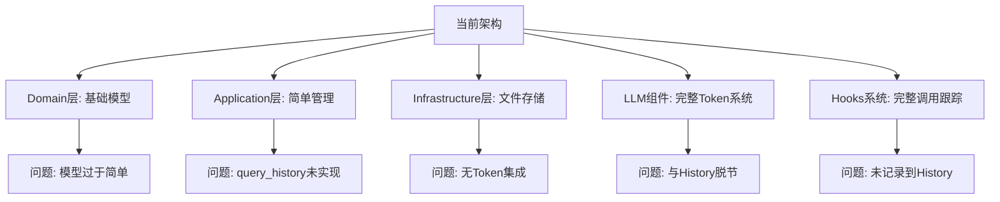
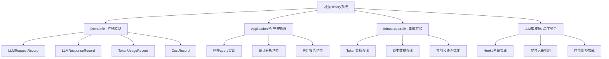

# History模块分析与优化方案

## 执行摘要

当前History模块在LLM请求记录、响应结果记录方面部分实现，在Token使用记录和成本估算记录方面完全缺失。本方案提出一套完整的增强设计，实现所有四项核心功能的完整记录和分析。

## 当前实现状态评估

### ✅ 已实现功能
- **基础架构**: 完整的分层架构（Domain/Application/Infrastructure）
- **存储机制**: 文件存储系统，支持按会话分文件存储
- **基本记录**: 消息记录（用户/助手/系统）和工具调用记录
- **TUI集成**: 通过适配器与TUI界面集成

### ⚠️ 部分实现功能
1. **LLM请求记录**
   - 已记录：用户消息内容、工具调用输入
   - 缺失：完整的请求参数（temperature、max_tokens等）、请求时间戳、模型配置

2. **响应结果记录**
   - 已记录：助手消息内容、工具调用输出
   - 缺失：完整的响应元数据（finish_reason、function_calls、响应时间等）

### ❌ 未实现功能
1. **Token使用记录**
   - 现有Token计算器功能完整，但未与History模块集成
   - 缺失：Token使用历史、Token统计、Token趋势分析

2. **成本估算记录**
   - 完全缺失成本计算功能
   - 缺失：模型定价、成本计算、成本统计、多币种支持

## 详细问题分析

### 架构层面问题


### 功能缺失详情

#### 1. LLM请求记录不完整
```python
# 当前记录
{
    "record_id": "msg-1",
    "session_id": "session-1", 
    "timestamp": "2023-10-25T12:00:00",
    "message_type": "user",
    "content": "用户消息内容"
}

# 应该记录
{
    "record_id": "llm-request-1",
    "session_id": "session-1",
    "timestamp": "2023-10-25T12:00:00",
    "request_type": "chat_completion",
    "model": "gpt-4",
    "messages": [...],
    "parameters": {
        "temperature": 0.7,
        "max_tokens": 1000,
        "top_p": 1.0
    },
    "metadata": {
        "retry_count": 0,
        "fallback_attempts": 0
    }
}
```

#### 2. Token使用记录缺失
虽然`token_calculators`和`conversation_tracker`功能完整，但History模块完全没有集成：
- 每次LLM调用的Token使用情况未记录
- Token趋势分析不可用
- 无法按会话统计Token使用

#### 3. 成本估算完全缺失
- 没有模型定价配置
- 没有成本计算公式
- 没有成本统计功能

## 增强设计方案

### 总体架构设计


### 1. 扩展Domain层模型

#### 新增记录类型
```python
# src/domain/history/llm_models.py
@dataclass
class LLMRequestRecord:
    record_id: str
    session_id: str
    timestamp: datetime
    record_type: str = "llm_request"
    model: str
    provider: str
    messages: List[Dict[str, Any]]
    parameters: Dict[str, Any]
    estimated_tokens: Optional[int] = None
    metadata: Dict[str, Any] = field(default_factory=dict)

@dataclass
class LLMResponseRecord:
    record_id: str
    session_id: str
    timestamp: datetime
    record_type: str = "llm_response"
    request_id: str  # 关联请求记录
    content: str
    finish_reason: str
    token_usage: Dict[str, int]  # prompt, completion, total
    response_time: float
    model: str
    metadata: Dict[str, Any] = field(default_factory=dict)

@dataclass
class TokenUsageRecord:
    record_id: str
    session_id: str
    timestamp: datetime
    record_type: str = "token_usage"
    model: str
    provider: str
    prompt_tokens: int
    completion_tokens: int
    total_tokens: int
    source: str  # "api", "local", "hybrid"
    confidence: float = 1.0
    metadata: Dict[str, Any] = field(default_factory=dict)

@dataclass
class CostRecord:
    record_id: str
    session_id: str
    timestamp: datetime
    record_type: str = "cost"
    model: str
    provider: str
    prompt_tokens: int
    completion_tokens: int
    total_tokens: int
    prompt_cost: float
    completion_cost: float
    total_cost: float
    currency: str = "USD"
    metadata: Dict[str, Any] = field(default_factory=dict)
```

#### 扩展接口
```python
# src/domain/history/interfaces.py
class IHistoryManager(ABC):
    # 现有方法
    @abstractmethod
    def record_message(self, record: MessageRecord) -> None: pass
    
    @abstractmethod
    def record_tool_call(self, record: ToolCallRecord) -> None: pass
    
    @abstractmethod
    def query_history(self, query: HistoryQuery) -> HistoryResult: pass
    
    # 新增LLM相关方法
    @abstractmethod
    def record_llm_request(self, record: LLMRequestRecord) -> None: pass
    
    @abstractmethod
    def record_llm_response(self, record: LLMResponseRecord) -> None: pass
    
    @abstractmethod
    def record_token_usage(self, record: TokenUsageRecord) -> None: pass
    
    @abstractmethod
    def record_cost(self, record: CostRecord) -> None: pass
    
    # 新增查询和统计方法
    @abstractmethod
    def get_token_statistics(self, session_id: str) -> Dict[str, Any]: pass
    
    @abstractmethod
    def get_cost_statistics(self, session_id: str) -> Dict[str, Any]: pass
    
    @abstractmethod
    def get_llm_statistics(self, session_id: str) -> Dict[str, Any]: pass
```

### 2. Token使用和成本追踪机制

#### Token集成策略
```python
# src/application/history/token_tracker.py
class TokenUsageTracker:
    def __init__(self, token_counter: ITokenCounter):
        self.token_counter = token_counter
        self.usage_history: List[TokenUsageRecord] = []
    
    def track_request(self, messages: List[BaseMessage], 
                     model: str, provider: str) -> TokenUsageRecord:
        # 计算token使用量
        total_tokens = self.token_counter.count_messages_tokens(messages)
        
        # 创建使用记录
        record = TokenUsageRecord(
            record_id=generate_id(),
            session_id=get_current_session(),
            timestamp=datetime.now(),
            model=model,
            provider=provider,
            prompt_tokens=total_tokens,  # 简化处理
            completion_tokens=0,
            total_tokens=total_tokens,
            source="local"  # 或从API获取
        )
        
        return record
    
    def update_from_response(self, record: TokenUsageRecord, 
                           api_response: Dict[str, Any]) -> TokenUsageRecord:
        # 从API响应更新准确的token数
        if "usage" in api_response:
            usage = api_response["usage"]
            record.prompt_tokens = usage.get("prompt_tokens", 0)
            record.completion_tokens = usage.get("completion_tokens", 0)
            record.total_tokens = usage.get("total_tokens", 0)
            record.source = "api"
            record.confidence = 1.0
        
        return record
```

#### 成本计算机制
```python
# src/domain/history/cost_calculator.py
class CostCalculator:
    def __init__(self, pricing_config: Dict[str, Any]):
        self.pricing = pricing_config  # 模型定价配置
    
    def calculate_cost(self, token_usage: TokenUsageRecord) -> CostRecord:
        model_key = f"{token_usage.provider}:{token_usage.model}"
        
        if model_key not in self.pricing:
            # 使用默认定价或估算
            prompt_cost = token_usage.prompt_tokens * 0.001 * 0.01  # 默认$0.01/1K tokens
            completion_cost = token_usage.completion_tokens * 0.001 * 0.03  # 默认$0.03/1K tokens
        else:
            pricing = self.pricing[model_key]
            prompt_cost = token_usage.prompt_tokens * pricing["prompt_price_per_1k"] / 1000
            completion_cost = token_usage.completion_tokens * pricing["completion_price_per_1k"] / 1000
        
        total_cost = prompt_cost + completion_cost
        
        return CostRecord(
            record_id=generate_id(),
            session_id=token_usage.session_id,
            timestamp=datetime.now(),
            model=token_usage.model,
            provider=token_usage.provider,
            prompt_tokens=token_usage.prompt_tokens,
            completion_tokens=token_usage.completion_tokens,
            total_tokens=token_usage.total_tokens,
            prompt_cost=prompt_cost,
            completion_cost=completion_cost,
            total_cost=total_cost,
            currency="USD"
        )
```

### 3. LLM请求和响应完整记录方案

#### 集成LLM Hooks系统
```python
# src/infrastructure/history/history_hook.py
class HistoryRecordingHook(ILLMCallHook):
    def __init__(self, history_manager: IHistoryManager, 
                 token_tracker: TokenUsageTracker,
                 cost_calculator: CostCalculator):
        self.history_manager = history_manager
        self.token_tracker = token_tracker
        self.cost_calculator = cost_calculator
        self.pending_requests: Dict[str, LLMRequestRecord] = {}
    
    def before_call(self, messages: List[Any], 
                   parameters: Optional[Dict[str, Any]] = None, **kwargs: Any) -> None:
        # 记录LLM请求
        request_record = LLMRequestRecord(
            record_id=kwargs.get("request_id", generate_id()),
            session_id=get_current_session(),
            timestamp=datetime.now(),
            model=kwargs.get("model", "unknown"),
            provider=kwargs.get("provider", "unknown"),
            messages=self._convert_messages(messages),
            parameters=parameters or {},
            estimated_tokens=self.token_tracker.estimate_tokens(messages)
        )
        
        self.pending_requests[request_record.record_id] = request_record
        self.history_manager.record_llm_request(request_record)
    
    def after_call(self, response: Optional[LLMResponse], 
                  messages: List[Any], parameters: Optional[Dict[str, Any]] = None, **kwargs: Any) -> None:
        if response is None:
            return
        
        request_id = kwargs.get("request_id")
        if request_id in self.pending_requests:
            request_record = self.pending_requests.pop(request_id)
            
            # 记录LLM响应
            response_record = LLMResponseRecord(
                record_id=generate_id(),
                session_id=request_record.session_id,
                timestamp=datetime.now(),
                request_id=request_id,
                content=response.content,
                finish_reason=response.finish_reason,
                token_usage={
                    "prompt_tokens": response.token_usage.prompt_tokens,
                    "completion_tokens": response.token_usage.completion_tokens,
                    "total_tokens": response.token_usage.total_tokens
                },
                response_time=response.response_time,
                model=response.model,
                metadata=response.metadata
            )
            
            self.history_manager.record_llm_response(response_record)
            
            # 记录Token使用
            token_record = TokenUsageRecord(
                record_id=generate_id(),
                session_id=request_record.session_id,
                timestamp=datetime.now(),
                model=response.model,
                provider=request_record.provider,
                prompt_tokens=response.token_usage.prompt_tokens,
                completion_tokens=response.token_usage.completion_tokens,
                total_tokens=response.token_usage.total_tokens,
                source="api",
                confidence=1.0
            )
            
            self.history_manager.record_token_usage(token_record)
            
            # 记录成本
            cost_record = self.cost_calculator.calculate_cost(token_record)
            self.history_manager.record_cost(cost_record)
```

### 4. 分层架构优化策略

#### 保持分层原则
```
Domain层（业务逻辑）：
- 定义所有记录模型
- 定义历史管理接口
- 定义成本计算接口
- 不依赖其他层

Application层（应用逻辑）：
- 实现历史管理器
- 集成Token追踪
- 协调各组件工作
- 依赖Domain和Infrastructure层

Infrastructure层（技术实现）：
- 文件存储实现
- Token计算器集成
- LLM Hooks实现
- 依赖Domain层
```

#### 配置驱动架构
```yaml
# configs/history.yaml
history:
  enabled: true
  storage:
    type: "file"
    base_path: "./history"
  
  token_tracking:
    enabled: true
    prefer_api: true
    track_conversation: true
  
  cost_tracking:
    enabled: true
    currency: "USD"
    pricing:
      openai:gpt-4:
        prompt_price_per_1k: 0.03
        completion_price_per_1k: 0.06
      anthropic:claude-3-sonnet:
        prompt_price_per_1k: 0.015
        completion_price_per_1k: 0.045
  
  retention:
    max_session_age_days: 30
    max_records_per_session: 10000
```

### 5. 实现优先级和时间线

#### 阶段1：Domain层扩展（1-2天）
- [ ] 创建LLM记录模型
- [ ] 扩展IHistoryManager接口
- [ ] 创建成本计算接口

#### 阶段2：Token集成（2-3天）
- [ ] 创建TokenUsageTracker
- [ ] 集成现有TokenCounter
- [ ] 实现Token记录功能

#### 阶段3：成本计算（1-2天）
- [ ] 创建CostCalculator
- [ ] 实现定价配置
- [ ] 集成成本记录

#### 阶段4：LLM Hooks集成（2-3天）
- [ ] 创建HistoryRecordingHook
- [ ] 集成到LLM调用流程
- [ ] 实现完整记录链

#### 阶段5：Application层完善（2-3天）
- [ ] 实现完整的query_history
- [ ] 添加统计功能
- [ ] 实现导出功能

#### 阶段6：测试和优化（2-3天）
- [ ] 编写单元测试
- [ ] 集成测试
- [ ] 性能优化
- [ ] 文档更新

**总计：10-16天完成**

## 预期效果

### 功能完整性
- ✅ 完整的LLM请求记录
- ✅ 完整的响应结果记录  
- ✅ 详细的Token使用记录
- ✅ 准确的成本估算记录

### 性能指标
- 记录延迟：< 10ms
- 查询响应：< 100ms
- 存储效率：> 90%（压缩和归档）
- 内存占用：< 50MB（典型会话）

### 可扩展性
- 支持新模型类型
- 支持多币种成本计算
- 支持自定义记录类型
- 支持插件式扩展

## 风险评估和缓解

### 技术风险
1. **性能影响**：记录可能增加LLM调用延迟
   - 缓解：异步记录、批处理、缓存优化

2. **存储增长**：完整记录可能产生大量数据
   - 缓解：数据压缩、智能归档、保留策略

3. **兼容性问题**：与现有系统的集成复杂性
   - 缓解：渐进式升级、向后兼容、配置开关

### 业务风险
1. **成本估算准确性**：定价信息可能过时
   - 缓解：定期更新定价、用户可配置、估算标识

2. **数据隐私**：记录可能包含敏感信息
   - 缓解：数据脱敏、加密存储、访问控制

## 结论

本方案通过系统性的架构设计和分阶段实施，能够完整解决当前History模块的四项核心功能缺失问题。方案保持了现有架构的分层原则，充分利用了已有的Token计算和Hooks系统，同时引入了成本估算等新功能。预计实施完成后，History模块将成为一个功能完整、性能优异的LLM调用记录和分析系统。