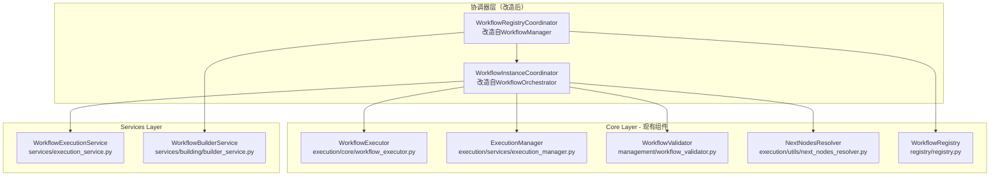

# 编排组件改造为协调器的重构方案

## 1. 现有编排组件分析

### 1.1 WorkflowOrchestrator 分析

**当前职责**：
- 工作流模板注册和管理
- 工作流执行生命周期管理
- 执行状态跟踪
- 执行记录清理

**问题**：
- 职责相对单一，但命名偏向"编排"而非"协调"
- 与 WorkflowInstance 的功能有重叠
- 缺少对现有Core层组件的充分利用

### 1.2 WorkflowManager 分析

**当前职责**：
- 工作流创建和配置
- 工作流执行（委托给执行器）
- 工作流状态查询
- 工作流列表和删除

**问题**：
- 依赖过多（Orchestrator、Executor、Registry）
- 职责不够清晰，既是管理器又是执行器
- 与 WorkflowInstance 的功能重叠严重

## 2. 改造方案设计

### 2.1 核心设计思路

1. **将 WorkflowOrchestrator 改造为 WorkflowInstanceCoordinator**
   - 专注于单个工作流实例的协调
   - 充分利用现有的Core层组件
   - 简化职责，专注于协调而非编排

2. **将 WorkflowManager 改造为 WorkflowRegistryCoordinator**
   - 专注于多个工作流的注册和管理
   - 提供工作流生命周期管理
   - 与 WorkflowInstanceCoordinator 协作

### 2.2 新的架构设计



## 3. 具体重构实现

### 3.1 WorkflowInstanceCoordinator（改造自 WorkflowOrchestrator）

```python
"""工作流实例协调器 - 改造自 WorkflowOrchestrator

专注于单个工作流实例的协调，充分利用现有Core层组件。
"""

from typing import Dict, Any, List, Optional
import uuid
import logging
from datetime import datetime

from src.interfaces.workflow.core import IWorkflow, ExecutionContext
from src.interfaces.state import IWorkflowState
from src.core.workflow.entities import WorkflowExecution
from src.core.workflow.execution.core.workflow_executor import WorkflowExecutor
from src.core.workflow.execution.services.execution_manager import ExecutionManager
from src.core.workflow.management.workflow_validator import WorkflowValidator
from src.core.workflow.execution.utils.next_nodes_resolver import NextNodesResolver


logger = logging.getLogger(__name__)


class WorkflowInstanceCoordinator:
    """工作流实例协调器
    
    专注于单个工作流实例的协调，整合现有的Core层组件。
    改造自 WorkflowOrchestrator，职责更加明确。
    """
    
    def __init__(
        self,
        workflow: IWorkflow,
        executor: Optional[WorkflowExecutor] = None,
        execution_manager: Optional[ExecutionManager] = None
    ):
        """初始化工作流实例协调器
        
        Args:
            workflow: 工作流实例
            executor: 工作流执行器（可选，默认创建）
            execution_manager: 执行管理器（可选，默认创建）
        """
        self.workflow = workflow
        self.executor = executor or WorkflowExecutor()
        self.execution_manager = execution_manager or ExecutionManager()
        
        # 初始化其他现有组件
        self.validator = WorkflowValidator()
        self.next_nodes_resolver = NextNodesResolver()
        
        # 执行记录管理
        self._active_executions: Dict[str, WorkflowExecution] = {}
        
        logger.debug(f"工作流实例协调器初始化完成: {workflow.workflow_id}")
    
    def execute_workflow(
        self, 
        initial_state: IWorkflowState,
        config: Optional[Dict[str, Any]] = None
    ) -> IWorkflowState:
        """执行工作流 - 使用现有的执行管理器
        
        Args:
            initial_state: 初始状态
            config: 执行配置
            
        Returns:
            IWorkflowState: 执行结果状态
        """
        execution_id = str(uuid.uuid4())
        
        # 创建执行上下文
        context = ExecutionContext(
            workflow_id=self.workflow.workflow_id,
            execution_id=execution_id,
            config=config or {
                "initial_data": initial_state.values if hasattr(initial_state, 'values') else {},
                "coordinator_timestamp": datetime.now().isoformat()
            },
            metadata={}
        )
        
        # 记录执行开始
        execution = WorkflowExecution(
            execution_id=execution_id,
            workflow_id=self.workflow.workflow_id,
            status="running",
            started_at=datetime.now()
        )
        self._active_executions[execution_id] = execution
        
        try:
            # 使用现有的执行管理器执行工作流
            initial_data = initial_state.values if hasattr(initial_state, 'values') else {}
            result = self.execution_manager.execute_workflow(
                self.workflow, initial_data, config
            )
            
            # 更新执行状态
            execution.status = "completed" if not result.get("error") else "failed"
            execution.completed_at = datetime.now()
            if result.get("error"):
                execution.error = result["error"]
            
            logger.info(f"工作流执行完成: {self.workflow.workflow_id} ({execution_id})")
            
            # 将结果转换为 IWorkflowState
            from src.core.workflow.entities import WorkflowState
            return WorkflowState.from_dict(result)
            
        except Exception as e:
            # 更新执行状态
            execution.status = "failed"
            execution.completed_at = datetime.now()
            execution.error = str(e)
            
            logger.error(f"工作流执行失败: {self.workflow.workflow_id} ({execution_id}): {e}")
            raise
    
    async def execute_workflow_async(
        self, 
        initial_state: IWorkflowState,
        config: Optional[Dict[str, Any]] = None
    ) -> IWorkflowState:
        """异步执行工作流 - 使用现有的执行管理器
        
        Args:
            initial_state: 初始状态
            config: 执行配置
            
        Returns:
            IWorkflowState: 执行结果状态
        """
        execution_id = str(uuid.uuid4())
        
        # 创建执行上下文
        context = ExecutionContext(
            workflow_id=self.workflow.workflow_id,
            execution_id=execution_id,
            config=config or {
                "initial_data": initial_state.values if hasattr(initial_state, 'values') else {},
                "coordinator_timestamp": datetime.now().isoformat()
            },
            metadata={}
        )
        
        # 记录执行开始
        execution = WorkflowExecution(
            execution_id=execution_id,
            workflow_id=self.workflow.workflow_id,
            status="running",
            started_at=datetime.now()
        )
        self._active_executions[execution_id] = execution
        
        try:
            # 使用现有的执行管理器异步执行工作流
            initial_data = initial_state.values if hasattr(initial_state, 'values') else {}
            result = await self.execution_manager.execute_workflow_async(
                self.workflow, initial_data, config
            )
            
            # 更新执行状态
            execution.status = "completed" if not result.get("error") else "failed"
            execution.completed_at = datetime.now()
            if result.get("error"):
                execution.error = result["error"]
            
            logger.info(f"工作流异步执行完成: {self.workflow.workflow_id} ({execution_id})")
            
            # 将结果转换为 IWorkflowState
            from src.core.workflow.entities import WorkflowState
            return WorkflowState.from_dict(result)
            
        except Exception as e:
            # 更新执行状态
            execution.status = "failed"
            execution.completed_at = datetime.now()
            execution.error = str(e)
            
            logger.error(f"工作流异步执行失败: {self.workflow.workflow_id} ({execution_id}): {e}")
            raise
    
    def get_next_nodes(self, node_id: str, state: Any, config: Dict[str, Any]) -> List[str]:
        """获取下一个节点 - 使用现有的导航解析器
        
        Args:
            node_id: 当前节点ID
            state: 当前状态
            config: 配置
            
        Returns:
            List[str]: 下一个节点ID列表
        """
        return self.next_nodes_resolver.get_next_nodes(self.workflow, node_id, state, config)
    
    async def get_next_nodes_async(self, node_id: str, state: Any, config: Dict[str, Any]) -> List[str]:
        """异步获取下一个节点 - 使用现有的导航解析器
        
        Args:
            node_id: 当前节点ID
            state: 当前状态
            config: 配置
            
        Returns:
            List[str]: 下一个节点ID列表
        """
        return await self.next_nodes_resolver.get_next_nodes_async(self.workflow, node_id, state, config)
    
    def validate_workflow(self) -> List[str]:
        """验证工作流 - 使用现有的验证器
        
        Returns:
            List[str]: 验证错误列表
        """
        # 如果工作流有配置对象，使用配置验证器
        if hasattr(self.workflow, 'config'):
            issues = self.validator.validate_config_object(self.workflow.config)
            return [issue.message for issue in issues if issue.severity == ValidationSeverity.ERROR]
        
        # 否则使用基本验证
        return self.workflow.validate()
    
    def get_execution_status(self, execution_id: str) -> Optional[WorkflowExecution]:
        """获取执行状态
        
        Args:
            execution_id: 执行ID
            
        Returns:
            Optional[WorkflowExecution]: 执行状态
        """
        return self._active_executions.get(execution_id)
    
    def list_active_executions(self) -> List[WorkflowExecution]:
        """列出所有活跃的执行
        
        Returns:
            List[WorkflowExecution]: 执行列表
        """
        return list(self._active_executions.values())
    
    def cleanup_execution(self, execution_id: str) -> None:
        """清理执行记录
        
        Args:
            execution_id: 执行ID
        """
        if execution_id in self._active_executions:
            del self._active_executions[execution_id]
            logger.info(f"清理执行记录: {execution_id}")
    
    def get_coordinator_stats(self) -> Dict[str, Any]:
        """获取协调器统计信息
        
        Returns:
            Dict[str, Any]: 统计信息
        """
        return {
            "workflow_id": self.workflow.workflow_id,
            "workflow_name": self.workflow.name,
            "active_executions": len(self._active_executions),
            "total_executions": len(self._active_executions),  # 简化实现
            "execution_ids": list(self._active_executions.keys())
        }
```

### 3.2 WorkflowRegistryCoordinator（改造自 WorkflowManager）

```python
"""工作流注册表协调器 - 改造自 WorkflowManager

专注于多个工作流的注册和管理，与 WorkflowInstanceCoordinator 协作。
"""

from abc import ABC, abstractmethod
from typing import Dict, Any, Optional, List
from src.interfaces.workflow.core import IWorkflow
from src.interfaces.state.workflow import IWorkflowState
from src.core.workflow.workflow_instance import Workflow
from src.core.workflow.registry.registry import WorkflowRegistry
from .workflow_instance_coordinator import WorkflowInstanceCoordinator


class IWorkflowRegistryCoordinator(ABC):
    """工作流注册表协调器接口"""
    
    @abstractmethod
    def register_workflow(self, workflow_id: str, workflow: IWorkflow) -> None:
        """注册工作流"""
        pass
    
    @abstractmethod
    def get_workflow(self, workflow_id: str) -> Optional[IWorkflow]:
        """获取工作流"""
        pass
    
    @abstractmethod
    def create_workflow_coordinator(self, workflow_id: str) -> WorkflowInstanceCoordinator:
        """创建工作流实例协调器"""
        pass
    
    @abstractmethod
    def execute_workflow(
        self, 
        workflow_id: str, 
        initial_state: Optional[IWorkflowState] = None,
        config: Optional[Dict[str, Any]] = None
    ) -> IWorkflowState:
        """执行工作流"""
        pass
    
    @abstractmethod
    def list_workflows(self) -> List[Dict[str, Any]]:
        """列出所有已注册的工作流"""
        pass
    
    @abstractmethod
    def delete_workflow(self, workflow_id: str) -> bool:
        """删除工作流"""
        pass


class WorkflowRegistryCoordinator(IWorkflowRegistryCoordinator):
    """工作流注册表协调器
    
    专注于多个工作流的注册和管理，改造自 WorkflowManager。
    与 WorkflowInstanceCoordinator 协作提供完整的工作流管理功能。
    """
    
    def __init__(self, registry: Optional[WorkflowRegistry] = None):
        """初始化工作流注册表协调器
        
        Args:
            registry: 工作流注册表（可选，默认创建）
        """
        self._registry = registry or WorkflowRegistry()
        
        # 工作流实例协调器缓存
        self._coordinators: Dict[str, WorkflowInstanceCoordinator] = {}
        
        logger.debug("工作流注册表协调器初始化完成")
    
    def register_workflow(self, workflow_id: str, workflow: IWorkflow) -> None:
        """注册工作流
        
        Args:
            workflow_id: 工作流ID
            workflow: 工作流实例
        """
        self._registry.register_workflow(workflow_id, workflow)
        
        # 创建对应的协调器
        coordinator = WorkflowInstanceCoordinator(workflow)
        self._coordinators[workflow_id] = coordinator
        
        logger.info(f"注册工作流: {workflow_id}")
    
    def get_workflow(self, workflow_id: str) -> Optional[IWorkflow]:
        """获取工作流
        
        Args:
            workflow_id: 工作流ID
            
        Returns:
            Optional[IWorkflow]: 工作流实例
        """
        return self._registry.get_workflow(workflow_id)
    
    def create_workflow_coordinator(self, workflow_id: str) -> WorkflowInstanceCoordinator:
        """创建工作流实例协调器
        
        Args:
            workflow_id: 工作流ID
            
        Returns:
            WorkflowInstanceCoordinator: 工作流实例协调器
        """
        if workflow_id in self._coordinators:
            return self._coordinators[workflow_id]
        
        workflow = self.get_workflow(workflow_id)
        if not workflow:
            raise ValueError(f"工作流不存在: {workflow_id}")
        
        coordinator = WorkflowInstanceCoordinator(workflow)
        self._coordinators[workflow_id] = coordinator
        return coordinator
    
    def execute_workflow(
        self, 
        workflow_id: str, 
        initial_state: Optional[IWorkflowState] = None,
        config: Optional[Dict[str, Any]] = None
    ) -> IWorkflowState:
        """执行工作流 - 委托给对应的协调器
        
        Args:
            workflow_id: 工作流ID
            initial_state: 初始状态
            config: 执行配置
            
        Returns:
            IWorkflowState: 执行结果状态
        """
        coordinator = self.create_workflow_coordinator(workflow_id)
        
        # 如果未提供初始状态，创建默认状态
        if initial_state is None:
            from src.core.state.factories.state_factory import create_workflow_state
            workflow = self.get_workflow(workflow_id)
            initial_state = create_workflow_state(
                workflow_id=workflow_id,
                workflow_name=workflow.name if workflow else "",
                input_text=""
            )
        
        return coordinator.execute_workflow(initial_state, config)
    
    async def execute_workflow_async(
        self, 
        workflow_id: str, 
        initial_state: Optional[IWorkflowState] = None,
        config: Optional[Dict[str, Any]] = None
    ) -> IWorkflowState:
        """异步执行工作流 - 委托给对应的协调器
        
        Args:
            workflow_id: 工作流ID
            initial_state: 初始状态
            config: 执行配置
            
        Returns:
            IWorkflowState: 执行结果状态
        """
        coordinator = self.create_workflow_coordinator(workflow_id)
        
        # 如果未提供初始状态，创建默认状态
        if initial_state is None:
            from src.core.state.factories.state_factory import create_workflow_state
            workflow = self.get_workflow(workflow_id)
            initial_state = create_workflow_state(
                workflow_id=workflow_id,
                workflow_name=workflow.name if workflow else "",
                input_text=""
            )
        
        return await coordinator.execute_workflow_async(initial_state, config)
    
    def get_workflow_status(self, workflow_id: str) -> Dict[str, Any]:
        """获取工作流状态
        
        Args:
            workflow_id: 工作流ID
            
        Returns:
            Dict[str, Any]: 工作流状态信息
        """
        workflow = self.get_workflow(workflow_id)
        if not workflow:
            raise ValueError(f"工作流不存在: {workflow_id}")
        
        coordinator = self._coordinators.get(workflow_id)
        stats = coordinator.get_coordinator_stats() if coordinator else {}
        
        return {
            "workflow_id": workflow_id,
            "name": workflow.name,
            "status": "registered",
            "active_executions": stats.get("active_executions", 0),
            "total_executions": stats.get("total_executions", 0)
        }
    
    def list_workflows(self) -> List[Dict[str, Any]]:
        """列出所有已注册的工作流
        
        Returns:
            List[Dict[str, Any]]: 工作流信息列表
        """
        workflow_ids = self._registry.list_workflows()
        result = []
        for workflow_id in workflow_ids:
            workflow = self.get_workflow(workflow_id)
            if workflow:
                coordinator = self._coordinators.get(workflow_id)
                stats = coordinator.get_coordinator_stats() if coordinator else {}
                
                result.append({
                    "workflow_id": workflow_id,
                    "name": workflow.name,
                    "status": "registered",
                    "active_executions": stats.get("active_executions", 0)
                })
        return result
    
    def delete_workflow(self, workflow_id: str) -> bool:
        """删除工作流
        
        Args:
            workflow_id: 工作流ID
            
        Returns:
            bool: 是否删除成功
        """
        # 清理协调器
        if workflow_id in self._coordinators:
            del self._coordinators[workflow_id]
        
        # 从注册表删除
        return self._registry.unregister_workflow(workflow_id)
    
    def get_registry_stats(self) -> Dict[str, Any]:
        """获取注册表统计信息
        
        Returns:
            Dict[str, Any]: 统计信息
        """
        workflow_ids = self._registry.list_workflows()
        
        # 统计所有协调器的执行情况
        total_active_executions = 0
        total_executions = 0
        
        for workflow_id in workflow_ids:
            coordinator = self._coordinators.get(workflow_id)
            if coordinator:
                stats = coordinator.get_coordinator_stats()
                total_active_executions += stats.get("active_executions", 0)
                total_executions += stats.get("total_executions", 0)
        
        return {
            "registered_workflows": len(workflow_ids),
            "active_coordinators": len(self._coordinators),
            "total_active_executions": total_active_executions,
            "total_executions": total_executions,
            "workflow_ids": workflow_ids
        }
```

## 4. 重构实施计划

### 4.1 重构阶段

#### 阶段一：准备工作（1天）
1. **分析现有依赖关系**
   - 分析 WorkflowOrchestrator 和 WorkflowManager 的依赖
   - 确保改造后的协调器能正确使用现有组件

2. **创建备份和测试**
   - 为现有组件创建完整测试套件
   - 确保改造前后行为一致性

#### 阶段二：改造 WorkflowOrchestrator（2天）
1. **创建 WorkflowInstanceCoordinator**
   - 基于现有 WorkflowOrchestrator 创建新的协调器
   - 集成现有的执行器、验证器、导航解析器
   - 简化职责，专注于协调

2. **更新接口和依赖**
   - 更新相关的接口定义
   - 确保与现有组件的兼容性

#### 阶段三：改造 WorkflowManager（2天）
1. **创建 WorkflowRegistryCoordinator**
   - 基于现有 WorkflowManager 创建新的协调器
   - 集成 WorkflowRegistry 和新的 WorkflowInstanceCoordinator
   - 简化职责，专注于注册和管理

2. **更新协作关系**
   - 建立两个协调器之间的协作关系
   - 确保功能完整性

#### 阶段四：集成和测试（2天）
1. **集成测试**
   - 测试两个协调器的协作
   - 验证与现有系统的集成

2. **性能测试**
   - 对比重构前后的性能
   - 确保没有性能退化

### 4.2 迁移策略

1. **渐进式迁移**
   - 保留原有类作为适配器
   - 逐步迁移到新的协调器
   - 最终移除原有实现

2. **向后兼容**
   - 保持现有API的兼容性
   - 提供迁移指南和工具

## 5. 预期收益

### 5.1 架构改善
1. **职责清晰**：协调器专注于协调，而非编排
2. **组件复用**：充分利用现有的Core层组件
3. **架构一致**：与项目的扁平化架构保持一致

### 5.2 功能增强
1. **更好的集成**：与现有执行器、验证器等组件深度集成
2. **统一管理**：通过协调器提供统一的管理接口
3. **扩展性**：更容易添加新的协调功能

### 5.3 维护性提升
1. **代码复用**：避免重复实现已有功能
2. **测试简化**：每个协调器可以独立测试
3. **问题隔离**：问题更容易定位和修复

## 6. 总结

通过将现有的 WorkflowOrchestrator 和 WorkflowManager 改造为协调器，可以：

1. **充分利用现有组件**：避免重复实现，复用执行器、验证器等
2. **明确职责分工**：协调器专注于协调，而非编排
3. **提升架构一致性**：与项目的扁平化架构保持一致
4. **简化维护**：减少代码重复，提高可维护性

这种改造方案既解决了 WorkflowInstance 的职责过多问题，又充分利用了现有的编排组件，是一个更加务实和高效的重构方案。