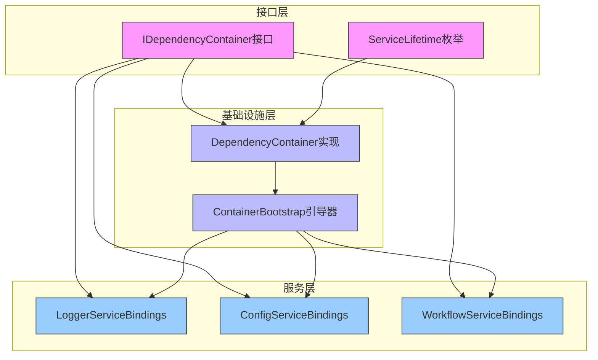

# 各层Container关系设计

## 核心设计原则

基于分层架构原则，各层container之间应该保持清晰的依赖关系，避免循环依赖。

## Container层级关系

### 1. 接口层Container (`src/interfaces/container/`)

**职责**：定义纯接口，不包含任何实现
**依赖关系**：不依赖任何其他层的container

```python
# src/interfaces/container/core.py
from abc import ABC, abstractmethod
from typing import Type, TypeVar, Callable, Dict, Any
from enum import Enum

T = TypeVar('T')

class ServiceLifetime(Enum):
    SINGLETON = "singleton"
    TRANSIENT = "transient"
    SCOPED = "scoped"

class IDependencyContainer(ABC):
    """依赖注入容器接口 - 纯接口定义"""
    
    @abstractmethod
    def register(
        self,
        interface: Type,
        implementation: Type,
        lifetime: ServiceLifetime = ServiceLifetime.SINGLETON
    ) -> None:
        """注册服务实现"""
        pass
    
    @abstractmethod
    def register_factory(
        self,
        interface: Type,
        factory: Callable[[], Any],
        lifetime: ServiceLifetime = ServiceLifetime.SINGLETON
    ) -> None:
        """注册服务工厂"""
        pass
    
    @abstractmethod
    def get(self, service_type: Type[T]) -> T:
        """获取服务实例"""
        pass
    
    @abstractmethod
    def has_service(self, service_type: Type) -> bool:
        """检查服务是否已注册"""
        pass

# 注意：接口层不导入任何container实现
# 只定义接口规范
```

### 2. 基础设施层Container (`src/infrastructure/container/`)

**职责**：实现容器接口，提供具体的容器功能
**依赖关系**：只依赖接口层的container接口

```python
# src/infrastructure/container/dependency_container.py
import threading
from typing import Type, TypeVar, Dict, Any, Optional, Callable

# 只导入接口层的container接口
from src.interfaces.container.core import (
    IDependencyContainer,
    ServiceLifetime
)

T = TypeVar('T')

class ServiceRegistration:
    """服务注册信息"""
    
    def __init__(
        self,
        interface: Type,
        implementation: Optional[Type] = None,
        factory: Optional[Callable[[], Any]] = None,
        lifetime: ServiceLifetime = ServiceLifetime.SINGLETON
    ):
        self.interface = interface
        self.implementation = implementation
        self.factory = factory
        self.lifetime = lifetime

class DependencyContainer(IDependencyContainer):
    """依赖注入容器实现 - 基础设施层"""
    
    def __init__(self):
        self._registrations: Dict[Type, ServiceRegistration] = {}
        self._instances: Dict[Type, Any] = {}
        self._lock = threading.RLock()
    
    def register(
        self,
        interface: Type,
        implementation: Type,
        lifetime: ServiceLifetime = ServiceLifetime.SINGLETON
    ) -> None:
        """注册服务实现"""
        with self._lock:
            registration = ServiceRegistration(
                interface=interface,
                implementation=implementation,
                lifetime=lifetime
            )
            self._registrations[interface] = registration
    
    def register_factory(
        self,
        interface: Type,
        factory: Callable[[], Any],
        lifetime: ServiceLifetime = ServiceLifetime.SINGLETON
    ) -> None:
        """注册服务工厂"""
        with self._lock:
            registration = ServiceRegistration(
                interface=interface,
                factory=factory,
                lifetime=lifetime
            )
            self._registrations[interface] = registration
    
    def get(self, service_type: Type[T]) -> T:
        """获取服务实例"""
        with self._lock:
            if service_type not in self._registrations:
                raise ValueError(f"服务未注册: {service_type.__name__}")
            
            registration = self._registrations[service_type]
            
            # 单例模式检查缓存
            if registration.lifetime == ServiceLifetime.SINGLETON:
                if service_type in self._instances:
                    return self._instances[service_type]
            
            # 创建实例
            if registration.factory:
                instance = registration.factory()
            elif registration.implementation:
                instance = registration.implementation()
            else:
                raise ValueError(f"注册信息不完整: {service_type.__name__}")
            
            # 缓存单例实例
            if registration.lifetime == ServiceLifetime.SINGLETON:
                self._instances[service_type] = instance
            
            return instance
    
    def has_service(self, service_type: Type) -> bool:
        """检查服务是否已注册"""
        return service_type in self._registrations
```

### 3. 基础设施层Container引导器 (`src/infrastructure/container/`)

**职责**：管理容器初始化和服务注册顺序
**依赖关系**：使用基础设施层的container实现

```python
# src/infrastructure/container/bootstrap.py
from typing import Dict, Any

# 使用基础设施层的container实现
from .dependency_container import DependencyContainer
from src.interfaces.container.core import IDependencyContainer

class ContainerBootstrap:
    """容器引导器 - 基础设施层"""
    
    @staticmethod
    def create_container(config: Dict[str, Any]) -> IDependencyContainer:
        """创建并初始化容器"""
        # 创建基础设施层的container实例
        container = DependencyContainer()
        
        # 注册基础设施服务
        ContainerBootstrap._register_infrastructure_services(container, config)
        
        # 注册业务服务
        ContainerBootstrap._register_business_services(container, config)
        
        return container
    
    @staticmethod
    def _register_infrastructure_services(container: IDependencyContainer, config: Dict[str, Any]):
        """注册基础设施服务"""
        # 注册日志服务
        from src.services.container.bindings.logger_bindings import LoggerServiceBindings
        logger_bindings = LoggerServiceBindings()
        logger_bindings.register_services(container, config)
        
        # 注册配置服务
        from src.services.container.bindings.config_bindings import ConfigServiceBindings
        config_bindings = ConfigServiceBindings()
        config_bindings.register_services(container, config)
    
    @staticmethod
    def _register_business_services(container: IDependencyContainer, config: Dict[str, Any]):
        """注册业务服务"""
        # 注册工作流服务
        from src.services.container.bindings.workflow_bindings import WorkflowServiceBindings
        workflow_bindings = WorkflowServiceBindings()
        workflow_bindings.register_services(container, config)
```

### 4. 服务层Container绑定 (`src/services/container/`)

**职责**：提供具体的服务绑定逻辑
**依赖关系**：使用接口层的container接口

```python
# src/services/container/bindings/logger_bindings.py
from typing import Dict, Any

# 只导入接口层的container接口
from src.interfaces.container.core import ServiceLifetime
from src.interfaces.logger import ILogger, ILoggerFactory

class LoggerServiceBindings:
    """日志服务绑定 - 服务层"""
    
    def register_services(self, container, config: Dict[str, Any]):
        """注册日志服务"""
        # 注册日志工厂
        def logger_factory():
            from src.infrastructure.logger.factory.logger_factory import LoggerFactory
            return LoggerFactory()
        
        container.register_factory(
            ILoggerFactory,
            logger_factory,
            lifetime=ServiceLifetime.SINGLETON
        )
        
        # 注册日志服务
        def logger_service():
            logger_factory_instance = container.get(ILoggerFactory)
            return logger_factory_instance.create_logger("application")
        
        container.register_factory(
            ILogger,
            logger_service,
            lifetime=ServiceLifetime.SINGLETON
        )
```

## Container关系图



## 导入关系总结

### 1. 接口层Container
- **不导入**任何其他层的container
- **只定义**接口规范
- **被**基础设施层和服务层导入

### 2. 基础设施层Container
- **导入**接口层的container接口
- **不导入**服务层的container
- **提供**具体的container实现

### 3. 服务层Container绑定
- **导入**接口层的container接口
- **不导入**基础设施层的container实现
- **使用**接口进行服务注册

### 4. Container引导器
- **位于**基础设施层
- **使用**基础设施层的container实现
- **调用**服务层的绑定逻辑

## 关键设计决策

### 1. 单一Container实例
- 整个系统使用一个container实例
- 避免多个container之间的复杂性
- 简化依赖管理

### 2. 接口驱动设计
- 所有层都依赖接口层的container接口
- 基础设施层提供具体实现
- 服务层提供绑定逻辑

### 3. 分离关注点
- 接口层：定义规范
- 基础设施层：提供实现和引导
- 服务层：提供绑定逻辑

### 4. 避免循环依赖
- 严格的单向依赖关系
- 接口层不依赖任何其他层
- 基础设施层只依赖接口层
- 服务层只依赖接口层

## 使用示例

```python
# 应用程序入口
from src.infrastructure.container.bootstrap import ContainerBootstrap

# 创建并初始化容器
config = {
    "log_level": "INFO",
    "database_url": "postgresql://localhost:5432/app"
}

# 通过引导器创建容器
container = ContainerBootstrap.create_container(config)

# 使用服务
from src.interfaces.logger import ILogger
logger = container.get(ILogger)
logger.info("应用程序启动")

from src.interfaces.workflow import IWorkflowService
workflow_service = container.get(IWorkflowService)
workflow_service.execute_workflow("test-workflow")
```

## 总结

各层container之间的关系设计遵循以下原则：

1. **接口层**：纯接口定义，不依赖任何其他层
2. **基础设施层**：实现接口，提供具体功能
3. **服务层**：使用接口，提供绑定逻辑
4. **引导器**：协调各层，管理初始化顺序

这种设计确保了：
- 清晰的依赖关系
- 避免循环依赖
- 良好的可测试性
- 简单的维护和扩展