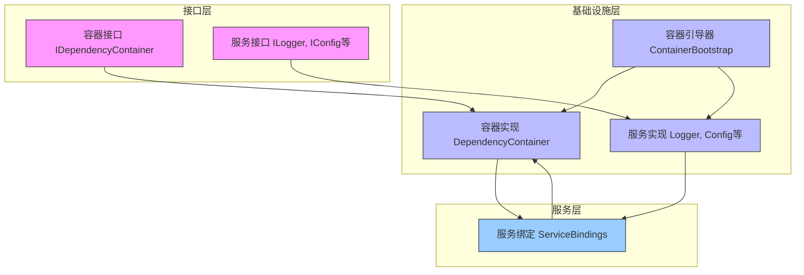
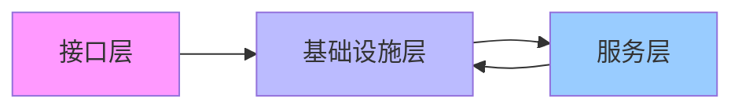

# 依赖注入全新架构设计

## 设计背景

由于业务尚未部署，我们可以直接设计一个全新的依赖注入架构，无需考虑向后兼容性。这让我们能够采用最简洁、最高效的设计方案。

## 全新架构设计

### 核心设计原则

1. **单一职责**：每个组件只负责一个明确的职责
2. **最小依赖**：减少层间依赖，避免循环依赖
3. **类型安全**：完整的类型注解支持
4. **简单直接**：避免过度设计，保持架构简洁

### 架构图



## 组件详细设计

### 1. 接口层容器接口 (`src/interfaces/container/`)

**职责**：定义纯接口，不包含任何实现

```python
# src/interfaces/container/core.py
"""依赖注入容器核心接口"""

from abc import ABC, abstractmethod
from typing import Type, TypeVar, Dict, Any, Optional, Callable
from enum import Enum

T = TypeVar('T')

class ServiceLifetime(Enum):
    """服务生命周期"""
    SINGLETON = "singleton"
    TRANSIENT = "transient"
    SCOPED = "scoped"

class IDependencyContainer(ABC):
    """依赖注入容器接口"""
    
    @abstractmethod
    def register(
        self,
        interface: Type,
        implementation: Type,
        lifetime: ServiceLifetime = ServiceLifetime.SINGLETON
    ) -> None:
        """注册服务实现"""
        pass
    
    @abstractmethod
    def register_factory(
        self,
        interface: Type,
        factory: Callable[[], Any],
        lifetime: ServiceLifetime = ServiceLifetime.SINGLETON
    ) -> None:
        """注册服务工厂"""
        pass
    
    @abstractmethod
    def get(self, service_type: Type[T]) -> T:
        """获取服务实例"""
        pass
    
    @abstractmethod
    def has_service(self, service_type: Type) -> bool:
        """检查服务是否已注册"""
        pass
```

### 2. 基础设施层容器实现 (`src/infrastructure/container/`)

**职责**：完整的容器实现，包含引导器

```python
# src/infrastructure/container/dependency_container.py
"""依赖注入容器实现"""

import threading
from typing import Type, TypeVar, Dict, Any, Optional

from src.interfaces.container.core import (
    IDependencyContainer,
    ServiceLifetime
)

T = TypeVar('T')

class ServiceRegistration:
    """服务注册信息"""
    
    def __init__(
        self,
        interface: Type,
        implementation: Optional[Type] = None,
        factory: Optional[Callable[[], Any]] = None,
        lifetime: ServiceLifetime = ServiceLifetime.SINGLETON
    ):
        self.interface = interface
        self.implementation = implementation
        self.factory = factory
        self.lifetime = lifetime

class DependencyContainer(IDependencyContainer):
    """依赖注入容器实现"""
    
    def __init__(self):
        self._registrations: Dict[Type, ServiceRegistration] = {}
        self._instances: Dict[Type, Any] = {}
        self._lock = threading.RLock()
    
    def register(
        self,
        interface: Type,
        implementation: Type,
        lifetime: ServiceLifetime = ServiceLifetime.SINGLETON
    ) -> None:
        """注册服务实现"""
        with self._lock:
            registration = ServiceRegistration(
                interface=interface,
                implementation=implementation,
                lifetime=lifetime
            )
            self._registrations[interface] = registration
    
    def register_factory(
        self,
        interface: Type,
        factory: Callable[[], Any],
        lifetime: ServiceLifetime = ServiceLifetime.SINGLETON
    ) -> None:
        """注册服务工厂"""
        with self._lock:
            registration = ServiceRegistration(
                interface=interface,
                factory=factory,
                lifetime=lifetime
            )
            self._registrations[interface] = registration
    
    def get(self, service_type: Type[T]) -> T:
        """获取服务实例"""
        with self._lock:
            if service_type not in self._registrations:
                raise ValueError(f"服务未注册: {service_type.__name__}")
            
            registration = self._registrations[service_type]
            
            # 单例模式检查缓存
            if registration.lifetime == ServiceLifetime.SINGLETON:
                if service_type in self._instances:
                    return self._instances[service_type]
            
            # 创建实例
            if registration.factory:
                instance = registration.factory()
            elif registration.implementation:
                instance = registration.implementation()
            else:
                raise ValueError(f"注册信息不完整: {service_type.__name__}")
            
            # 缓存单例实例
            if registration.lifetime == ServiceLifetime.SINGLETON:
                self._instances[service_type] = instance
            
            return instance
    
    def has_service(self, service_type: Type) -> bool:
        """检查服务是否已注册"""
        return service_type in self._registrations
```

### 3. 基础设施层容器引导器 (`src/infrastructure/container/`)

```python
# src/infrastructure/container/bootstrap.py
"""容器引导器"""

from typing import Dict, Any
from .dependency_container import DependencyContainer
from src.interfaces.container.core import IDependencyContainer

class ContainerBootstrap:
    """容器引导器 - 管理初始化顺序"""
    
    @staticmethod
    def create_container(config: Dict[str, Any]) -> IDependencyContainer:
        """创建并初始化容器"""
        container = DependencyContainer()
        
        # 注册基础设施服务
        ContainerBootstrap._register_infrastructure_services(container, config)
        
        # 注册业务服务
        ContainerBootstrap._register_business_services(container, config)
        
        return container
    
    @staticmethod
    def _register_infrastructure_services(container: IDependencyContainer, config: Dict[str, Any]):
        """注册基础设施服务"""
        # 注册日志服务
        from src.services.container.bindings.logger_bindings import LoggerServiceBindings
        logger_bindings = LoggerServiceBindings()
        logger_bindings.register_services(container, config)
        
        # 注册配置服务
        from src.services.container.bindings.config_bindings import ConfigServiceBindings
        config_bindings = ConfigServiceBindings()
        config_bindings.register_services(container, config)
    
    @staticmethod
    def _register_business_services(container: IDependencyContainer, config: Dict[str, Any]):
        """注册业务服务"""
        # 注册工作流服务
        from src.services.container.bindings.workflow_bindings import WorkflowServiceBindings
        workflow_bindings = WorkflowServiceBindings()
        workflow_bindings.register_services(container, config)
```

### 4. 服务层服务绑定 (`src/services/container/`)

```python
# src/services/container/bindings/logger_bindings.py
"""日志服务绑定"""

from typing import Dict, Any
from src.interfaces.logger import ILogger, ILoggerFactory
from src.interfaces.container.core import ServiceLifetime

class LoggerServiceBindings:
    """日志服务绑定"""
    
    def register_services(self, container, config: Dict[str, Any]):
        """注册日志服务"""
        # 注册日志工厂
        def logger_factory():
            from src.infrastructure.logger.factory.logger_factory import LoggerFactory
            return LoggerFactory()
        
        container.register_factory(
            ILoggerFactory,
            logger_factory,
            lifetime=ServiceLifetime.SINGLETON
        )
        
        # 注册日志服务
        def logger_service():
            logger_factory_instance = container.get(ILoggerFactory)
            return logger_factory_instance.create_logger("application")
        
        container.register_factory(
            ILogger,
            logger_service,
            lifetime=ServiceLifetime.SINGLETON
        )
```

## 实施计划

### 阶段1：创建新架构（1周）
1. 创建新的接口层定义
2. 实现基础设施层容器
3. 创建容器引导器

### 阶段2：迁移服务绑定（1周）
1. 重构日志服务绑定
2. 重构配置服务绑定
3. 重构其他服务绑定

### 阶段3：清理旧代码（1天）
1. 删除旧的依赖注入实现
2. 删除临时解决方案
3. 清理相关配置文件

## 关键优势

### 1. 架构简洁
- 移除不必要的复杂性
- 减少代码量
- 提高可维护性

### 2. 依赖关系清晰


### 3. 性能优化
- 减少初始化步骤
- 简化依赖解析逻辑
- 提高响应速度

### 4. 开发效率
- 更少的配置
- 更简单的API
- 更好的开发体验

## 使用示例

```python
# 应用程序入口
from src.infrastructure.container.bootstrap import ContainerBootstrap

# 创建并初始化容器
config = {
    "log_level": "INFO",
    "database_url": "postgresql://localhost:5432/app"
}

container = ContainerBootstrap.create_container(config)

# 使用服务
logger = container.get(ILogger)
logger.info("应用程序启动")

workflow_service = container.get(IWorkflowService)
workflow_service.execute_workflow("test-workflow")
```

## 总结

这个全新的依赖注入架构设计具有以下特点：

1. **简洁性**：移除不必要的复杂性，保持架构简洁
2. **清晰性**：依赖关系明确，避免循环依赖
3. **高效性**：性能优化，响应快速
4. **易用性**：简单的API，良好的开发体验

由于不需要考虑向后兼容性，我们可以采用最直接、最高效的设计方案，这将显著提升系统的可维护性和开发效率。