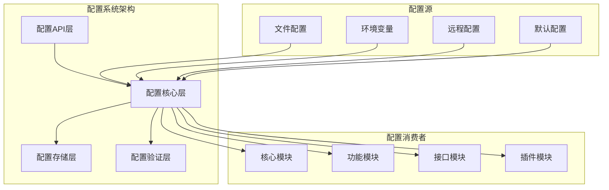
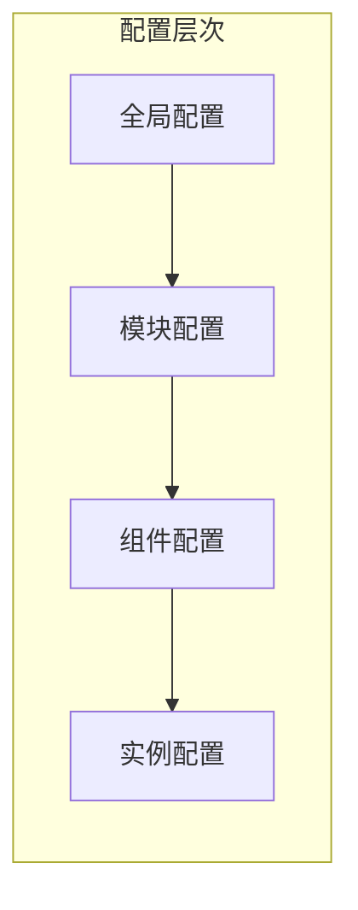

# 新架构配置系统设计文档

## 概述

本文档描述了Modular Agent V2新架构中配置系统的设计。新配置系统旨在保留当前灵活的配置结构，同时简化配置管理，支持基于配置文件构建的系统，并确保与历史记录、存储、检查点等机制的兼容性。

## 架构设计

### 整体架构



### 配置层次结构



## 核心组件设计

### 1. 配置核心 (Config Core)

#### 1.1 配置管理器 (ConfigManager)
配置管理器是配置系统的核心组件，负责配置的加载、合并、解析和分发。

```python
class ConfigManager:
    """配置管理器 - 负责配置的加载、合并、解析和分发"""
    
    def __init__(self, config_paths: List[str], env_prefix: str = "AGENT_"):
        self.config_paths = config_paths
        self.env_prefix = env_prefix
        self.config_cache = {}
        self.watchers = {}
        self.validators = {}
    
    def load_config(self, config_name: str, reload: bool = False) -> Dict[str, Any]:
        """加载指定配置"""
        pass
    
    def get_config(self, key: str, default: Any = None) -> Any:
        """获取配置值"""
        pass
    
    def set_config(self, key: str, value: Any) -> None:
        """设置配置值"""
        pass
    
    def reload_config(self, config_name: str) -> None:
        """重新加载配置"""
        pass
    
    def watch_config(self, config_name: str, callback: Callable) -> None:
        """监听配置变化"""
        pass
```

#### 1.2 配置加载器 (ConfigLoader)
配置加载器负责从不同源加载配置数据。

```python
class ConfigLoader:
    """配置加载器 - 负责从不同源加载配置数据"""
    
    def __init__(self):
        self.loaders = {
            'file': FileConfigLoader(),
            'env': EnvironmentConfigLoader(),
            'remote': RemoteConfigLoader(),
            'default': DefaultConfigLoader()
        }
    
    def load(self, source: str, path: str) -> Dict[str, Any]:
        """从指定源加载配置"""
        pass
    
    def register_loader(self, source_type: str, loader: ConfigLoaderInterface) -> None:
        """注册配置加载器"""
        pass
```

#### 1.3 配置合并器 (ConfigMerger)
配置合并器负责将多个配置源的数据合并成一个统一的配置树。

```python
class ConfigMerger:
    """配置合并器 - 负责配置数据的合并"""
    
    def merge(self, configs: List[Dict[str, Any]]) -> Dict[str, Any]:
        """合并多个配置"""
        pass
    
    def apply_inheritance(self, config: Dict[str, Any]) -> Dict[str, Any]:
        """应用配置继承"""
        pass
    
    def resolve_variables(self, config: Dict[str, Any]) -> Dict[str, Any]:
        """解析环境变量"""
        pass
```

### 2. 配置存储 (Config Storage)

#### 2.1 配置存储接口
```python
class ConfigStorageInterface:
    """配置存储接口"""
    
    def save(self, key: str, config: Dict[str, Any]) -> bool:
        """保存配置"""
        pass
    
    def load(self, key: str) -> Optional[Dict[str, Any]]:
        """加载配置"""
        pass
    
    def delete(self, key: str) -> bool:
        """删除配置"""
        pass
    
    def list_keys(self) -> List[str]:
        """列出所有配置键"""
        pass
```

#### 2.2 文件配置存储
```python
class FileConfigStorage(ConfigStorageInterface):
    """文件配置存储"""
    
    def __init__(self, base_path: str):
        self.base_path = Path(base_path)
    
    def save(self, key: str, config: Dict[str, Any]) -> bool:
        """保存配置到文件"""
        pass
    
    def load(self, key: str) -> Optional[Dict[str, Any]]:
        """从文件加载配置"""
        pass
```

#### 2.3 数据库配置存储
```python
class DatabaseConfigStorage(ConfigStorageInterface):
    """数据库配置存储"""
    
    def __init__(self, connection_string: str):
        self.connection_string = connection_string
    
    def save(self, key: str, config: Dict[str, Any]) -> bool:
        """保存配置到数据库"""
        pass
    
    def load(self, key: str) -> Optional[Dict[str, Any]]:
        """从数据库加载配置"""
        pass
```

### 3. 配置验证 (Config Validation)

#### 3.1 配置验证器
```python
class ConfigValidator:
    """配置验证器"""
    
    def __init__(self):
        self.schemas = {}
        self.validators = {}
    
    def register_schema(self, config_type: str, schema: Dict[str, Any]) -> None:
        """注册配置模式"""
        pass
    
    def validate(self, config: Dict[str, Any], config_type: str) -> List[str]:
        """验证配置"""
        pass
    
    def validate_structure(self, config: Dict[str, Any]) -> List[str]:
        """验证配置结构"""
        pass
    
    def validate_dependencies(self, config: Dict[str, Any]) -> List[str]:
        """验证配置依赖"""
        pass
```

#### 3.2 配置模式定义
```python
# 配置模式示例
CONFIG_SCHEMAS = {
    "workflow": {
        "type": "object",
        "required": ["name", "nodes", "edges"],
        "properties": {
            "name": {"type": "string"},
            "nodes": {"type": "array"},
            "edges": {"type": "array"},
            "metadata": {"type": "object"}
        }
    },
    "llm": {
        "type": "object",
        "required": ["provider", "model"],
        "properties": {
            "provider": {"type": "string"},
            "model": {"type": "string"},
            "parameters": {"type": "object"},
            "timeout": {"type": "number"},
            "max_retries": {"type": "integer"}
        }
    }
}
```

## 配置数据模型

### 1. 配置文件结构

#### 1.1 主配置文件 (config.yaml)
```yaml
# Modular Agent V2 主配置文件
version: "2.0"
environment: "${ENV:development}"

# 核心配置
core:
  engine:
    max_concurrent_workflows: 10
    checkpoint_interval: 30
  config:
    auto_reload: true
    watch_interval: 5
    validation_mode: "strict"
  logging:
    level: "INFO"
    outputs:
      - type: "console"
        format: "text"
      - type: "file"
        path: "logs/agent.log"
        format: "json"

# 功能模块配置
features:
  llm:
    config_path: "configs/llms"
    default_provider: "openai"
    groups:
      - "fast_group"
      - "thinking_group"
    polling_pools:
      - "fast_pool"
      - "thinking_pool"
  
  tools:
    config_path: "configs/tools"
    auto_discovery: true
    tool_sets:
      - "basic_tools"
  
  workflows:
    config_path: "configs/workflows"
    template_path: "configs/workflows/_templates.yaml"
    auto_save: true
  
  agents:
    config_path: "configs/agents"
    default_type: "react"

# 接口配置
interfaces:
  cli:
    enabled: true
  tui:
    enabled: true
    refresh_rate: 0.1
  api:
    enabled: false
    host: "localhost"
    port: 8000

# 插件配置
plugins:
  storage:
    type: "file"
    path: "data"
  monitoring:
    enabled: false
    metrics_port: 9090

# 历史和检查点配置
history:
  enabled: true
  storage:
    type: "file"
    base_path: "./history"
  token_tracking:
    enabled: true
    prefer_api: true
  retention:
    max_session_age_days: 30
    max_records_per_session: 10000

checkpoint:
  enabled: true
  storage_type: "sqlite"
  auto_save: true
  save_interval: 5
  max_checkpoints: 100
  retention_days: 30
  db_path: "storage/checkpoints.db"
```

#### 1.2 LLM配置结构
```yaml
# configs/llms/_registry.yaml
# LLM配置注册表

# 任务组配置
task_groups:
  fast_group:
    file: "groups/fast_group.yaml"
    description: "快速响应任务组"
    enabled: true
  
  thinking_group:
    file: "groups/thinking_group.yaml"
    description: "思考任务组"
    enabled: true

# 轮询池配置
polling_pools:
  fast_pool:
    file: "polling_pools/fast_pool.yaml"
    description: "快速响应轮询池"
    enabled: true
  
  thinking_pool:
    file: "polling_pools/thinking_pool.yaml"
    description: "思考任务轮询池"
    enabled: true

# 提供商配置
providers:
  openai:
    file: "provider/openai/openai-gpt4.yaml"
    description: "OpenAI GPT-4"
    enabled: true
  
  anthropic:
    file: "provider/anthropic/claude-sonnet.yaml"
    description: "Anthropic Claude"
    enabled: true
```

#### 1.3 工作流配置结构
```yaml
# configs/workflows/react_workflow.yaml
# ReAct工作流配置

metadata:
  name: "react_workflow"
  version: "2.0"
  description: "ReAct模式工作流"
  author: "system"

# 继承配置
inherits_from: "base_workflow.yaml"

# 工作流配置
workflow_name: "react_workflow"
description: "ReAct模式工作流，支持思考-行动-观察循环"
max_iterations: 20
timeout: 600

# 状态模式
state_schema:
  name: "ReActWorkflowState"
  fields:
    messages:
      type: "List[dict]"
      default: []
      reducer: "extend"
    input:
      type: "str"
      default: ""
    output:
      type: "str"
      default: ""
    thought:
      type: "str"
      default: ""
    action:
      type: "str"
      default: ""
    observation:
      type: "str"
      default: ""
    steps:
      type: "List[dict]"
      default: []
      reducer: "extend"

# 节点配置
nodes:
  start_node:
    function: "start_node"
    config:
      description: "开始节点"
  
  think_node:
    function: "think_node"
    config:
      description: "思考节点"
      system_prompt: "请分析问题并制定解决策略"
  
  act_node:
    function: "act_node"
    config:
      description: "行动节点"
      tool_selection: "auto"
  
  observe_node:
    function: "observe_node"
    config:
      description: "观察节点"
      result_processing: "analyze"
  
  end_node:
    function: "end_node"
    config:
      description: "结束节点"

# 边配置
edges:
  - from: "start_node"
    to: "think_node"
    type: "simple"
  
  - from: "think_node"
    to: "act_node"
    type: "simple"
  
  - from: "act_node"
    to: "observe_node"
    type: "simple"
  
  - from: "observe_node"
    to: "end_node"
    type: "conditional"
    condition: "is_complete"
  
  - from: "observe_node"
    to: "think_node"
    type: "conditional"
    condition: "needs_more_thinking"

# 入口点
entry_point: "start_node"
```

### 2. 配置继承机制

#### 2.1 继承规则
```python
class ConfigInheritance:
    """配置继承处理器"""
    
    def apply_inheritance(self, config: Dict[str, Any]) -> Dict[str, Any]:
        """应用配置继承"""
        if "inherits_from" not in config:
            return config
        
        parent_config = self.load_parent_config(config["inherits_from"])
        merged_config = self.merge_configs(parent_config, config)
        return merged_config
    
    def load_parent_config(self, parent_path: str) -> Dict[str, Any]:
        """加载父配置"""
        pass
    
    def merge_configs(self, parent: Dict[str, Any], child: Dict[str, Any]) -> Dict[str, Any]:
        """合并父子配置"""
        pass
```

#### 2.2 继承示例
```yaml
# 子配置文件
inherits_from: "base_workflow.yaml"

# 覆盖父配置的值
max_iterations: 20
timeout: 600

# 扩展父配置的字段
state_schema:
  # 继承父配置的字段
  fields:
    # 新增字段
    thought:
      type: "str"
      default: ""
    action:
      type: "str"
      default: ""
```

### 3. 环境变量处理

#### 3.1 变量解析器
```python
class VariableResolver:
    """环境变量解析器"""
    
    def __init__(self, env_prefix: str = "AGENT_"):
        self.env_prefix = env_prefix
    
    def resolve_variables(self, config: Any) -> Any:
        """解析配置中的环境变量"""
        if isinstance(config, dict):
            return {k: self.resolve_variables(v) for k, v in config.items()}
        elif isinstance(config, list):
            return [self.resolve_variables(item) for item in config]
        elif isinstance(config, str):
            return self.resolve_string_variables(config)
        else:
            return config
    
    def resolve_string_variables(self, text: str) -> str:
        """解析字符串中的环境变量"""
        import re
        pattern = r'\$\{([^}]+)\}'
        
        def replace_var(match):
            var_expr = match.group(1)
            if ':' in var_expr:
                var_name, default_value = var_expr.split(':', 1)
                return os.getenv(self.env_prefix + var_name, default_value)
            else:
                return os.getenv(self.env_prefix + var_expr, '')
        
        return re.sub(pattern, replace_var, text)
```

#### 3.2 变量语法示例
```yaml
# 环境变量语法示例
database:
  host: "${DB_HOST:localhost}"
  port: "${DB_PORT:5432}"
  username: "${DB_USERNAME}"
  password: "${DB_PASSWORD}"

# 复杂表达式
api:
  url: "${API_PROTOCOL:http}://${API_HOST:localhost}:${API_PORT:8000}"
  timeout: "${API_TIMEOUT:30}"
```

## 配置热重载机制

### 1. 文件监听器
```python
class FileWatcher:
    """文件监听器"""
    
    def __init__(self, config_manager: ConfigManager):
        self.config_manager = config_manager
        self.watchers = {}
    
    def watch_file(self, file_path: str, callback: Callable) -> None:
        """监听文件变化"""
        pass
    
    def unwatch_file(self, file_path: str) -> None:
        """取消监听文件"""
        pass
    
    def start_watching(self) -> None:
        """开始监听"""
        pass
    
    def stop_watching(self) -> None:
        """停止监听"""
        pass
```

### 2. 热重载处理器
```python
class HotReloadHandler:
    """热重载处理器"""
    
    def __init__(self, config_manager: ConfigManager):
        self.config_manager = config_manager
        self.reload_callbacks = {}
    
    def register_callback(self, config_name: str, callback: Callable) -> None:
        """注册重载回调"""
        pass
    
    def handle_config_change(self, config_name: str) -> None:
        """处理配置变化"""
        pass
    
    def validate_new_config(self, config_name: str, new_config: Dict[str, Any]) -> bool:
        """验证新配置"""
        pass
```

## 配置迁移机制

### 1. 迁移工具
```python
class ConfigMigrator:
    """配置迁移工具"""
    
    def __init__(self):
        self.migrations = {}
    
    def register_migration(self, from_version: str, to_version: str, migration_func: Callable) -> None:
        """注册迁移函数"""
        pass
    
    def migrate_config(self, config: Dict[str, Any], target_version: str) -> Dict[str, Any]:
        """迁移配置到目标版本"""
        pass
    
    def get_migration_path(self, from_version: str, to_version: str) -> List[str]:
        """获取迁移路径"""
        pass
```

### 2. 版本兼容性检查
```python
class VersionChecker:
    """版本兼容性检查器"""
    
    def __init__(self):
        self.compatibility_matrix = {}
    
    def check_compatibility(self, config_version: str, system_version: str) -> bool:
        """检查版本兼容性"""
        pass
    
    def get_required_migrations(self, config_version: str, system_version: str) -> List[str]:
        """获取必需的迁移"""
        pass
```

## 错误处理和恢复

### 1. 错误处理器
```python
class ConfigErrorHandler:
    """配置错误处理器"""
    
    def __init__(self):
        self.error_handlers = {}
    
    def register_handler(self, error_type: str, handler: Callable) -> None:
        """注册错误处理器"""
        pass
    
    def handle_error(self, error: Exception, context: Dict[str, Any]) -> None:
        """处理配置错误"""
        pass
    
    def attempt_recovery(self, error: Exception, context: Dict[str, Any]) -> bool:
        """尝试错误恢复"""
        pass
```

### 2. 备份和恢复
```python
class ConfigBackupManager:
    """配置备份管理器"""
    
    def __init__(self, backup_path: str):
        self.backup_path = backup_path
    
    def create_backup(self, config_name: str, config: Dict[str, Any]) -> str:
        """创建配置备份"""
        pass
    
    def restore_backup(self, config_name: str, backup_id: str) -> Dict[str, Any]:
        """恢复配置备份"""
        pass
    
    def list_backups(self, config_name: str) -> List[str]:
        """列出配置备份"""
        pass
    
    def cleanup_old_backups(self, config_name: str, retention_days: int) -> None:
        """清理旧备份"""
        pass
```

## 性能优化

### 1. 配置缓存
```python
class ConfigCache:
    """配置缓存"""
    
    def __init__(self, max_size: int = 1000, ttl: int = 3600):
        self.max_size = max_size
        self.ttl = ttl
        self.cache = {}
    
    def get(self, key: str) -> Optional[Dict[str, Any]]:
        """获取缓存配置"""
        pass
    
    def set(self, key: str, config: Dict[str, Any]) -> None:
        """设置缓存配置"""
        pass
    
    def invalidate(self, key: str) -> None:
        """使缓存失效"""
        pass
    
    def cleanup(self) -> None:
        """清理过期缓存"""
        pass
```

### 2. 延迟加载
```python
class LazyConfigLoader:
    """延迟配置加载器"""
    
    def __init__(self, config_manager: ConfigManager):
        self.config_manager = config_manager
        self.loaded_configs = {}
    
    def get_config(self, config_name: str) -> Dict[str, Any]:
        """获取配置（延迟加载）"""
        pass
    
    def preload_config(self, config_name: str) -> None:
        """预加载配置"""
        pass
    
    def unload_config(self, config_name: str) -> None:
        """卸载配置"""
        pass
```

## 安全机制

### 1. 敏感信息处理
```python
class SecretManager:
    """敏感信息管理器"""
    
    def __init__(self, secret_provider: str = "environment"):
        self.secret_provider = secret_provider
        self.secret_patterns = [
            r'sk-[a-zA-Z0-9]{20,}',
            r'ms-[a-zA-Z0-9]{15,}',
            r'\w+@\w+\.\w+',
            r'1\d{10}'
        ]
    
    def mask_secrets(self, config: Dict[str, Any]) -> Dict[str, Any]:
        """屏蔽敏感信息"""
        pass
    
    def encrypt_secrets(self, config: Dict[str, Any]) -> Dict[str, Any]:
        """加密敏感信息"""
        pass
    
    def decrypt_secrets(self, config: Dict[str, Any]) -> Dict[str, Any]:
        """解密敏感信息"""
        pass
```

### 2. 访问控制
```python
class ConfigAccessControl:
    """配置访问控制"""
    
    def __init__(self):
        self.permissions = {}
    
    def grant_access(self, role: str, config_path: str, permissions: List[str]) -> None:
        """授予访问权限"""
        pass
    
    def check_access(self, role: str, config_path: str, permission: str) -> bool:
        """检查访问权限"""
        pass
    
    def audit_access(self, role: str, config_path: str, action: str) -> None:
        """审计访问记录"""
        pass
```

## 总结

新配置系统设计保留了当前系统的灵活性和强大功能，同时简化了配置管理流程。通过统一的配置管理器、模块化的配置结构、完善的验证机制和热重载支持，新配置系统能够更好地支持Modular Agent V2的架构需求。

主要设计特点：
1. **统一管理**：通过ConfigManager提供统一的配置管理接口
2. **模块化结构**：按功能模块组织配置，支持独立加载和管理
3. **继承机制**：支持配置继承，减少重复配置
4. **环境变量**：支持环境变量注入，提高配置灵活性
5. **热重载**：支持配置热重载，提高开发效率
6. **验证机制**：提供完善的配置验证和错误处理
7. **性能优化**：通过缓存和延迟加载提高性能
8. **安全保护**：提供敏感信息屏蔽和访问控制

这个设计确保了配置系统能够满足新架构的需求，同时保持与现有系统的兼容性。