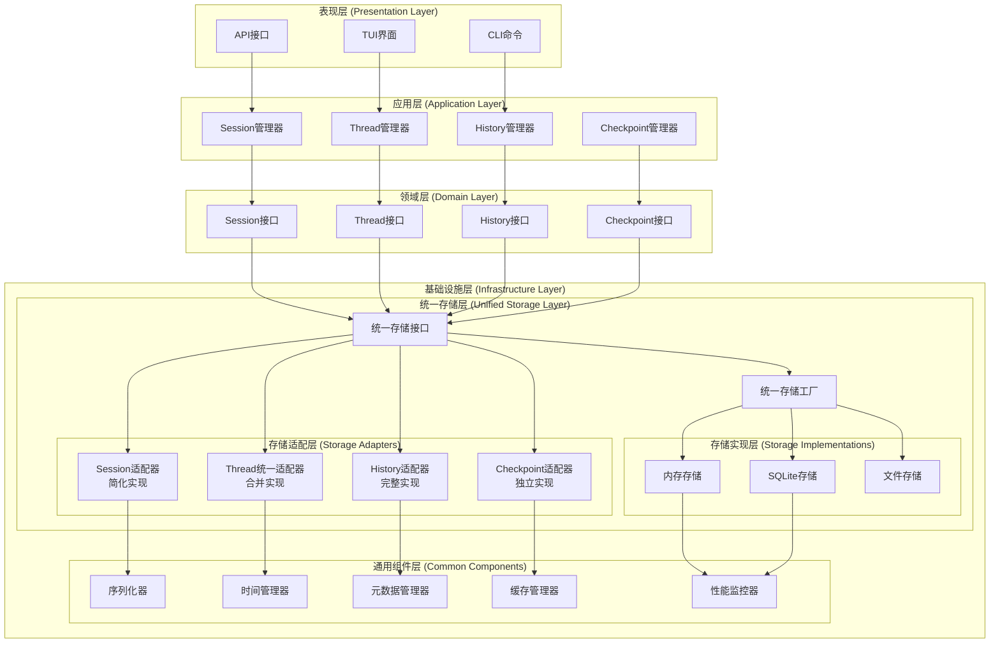

# 统一存储架构设计文档（更新版）

## 概述

本文档描述了统一存储架构的设计方案，基于对各模块存储需求和适配器必要性的详细分析。新架构将提供一个统一、高效且可扩展的存储解决方案，支持内存和SQLite两种存储后端，采用全异步实现，并能够协调多工作流同时执行的场景。

## 现有实现分析

### 当前存储架构问题

1. **职责重叠**：多个模块都有自己的存储实现，导致功能重复
2. **接口不统一**：不同模块使用不同的存储接口，难以维护和扩展
3. **依赖混乱**：模块间存在循环依赖和不必要的依赖关系
4. **LangGraph限制**：过度依赖LangGraph的checkpoint机制，限制了存储的灵活性

### 各模块存储需求分析

#### 1. Session模块
- **存储需求**：简单的键值存储，支持会话元数据的CRUD操作
- **数据特点**：相对简单的数据结构，需要原子性写入
- **适配器必要性**：中等 - 可以考虑直接使用统一存储接口

#### 2. Thread模块
- **存储需求**：复杂的实体关系管理，包括Thread、Branch、Snapshot
- **数据特点**：多个相关实体，需要复杂的关系查询
- **适配器必要性**：高 - 需要处理复杂的关系管理和查询优化

#### 3. History模块
- **存储需求**：多种记录类型的存储和统计查询
- **数据特点**：写入频繁，数据量大，需要聚合统计
- **适配器必要性**：高 - 需要实现缺失的存储功能和复杂查询

#### 4. Checkpoint模块
- **存储需求**：状态数据的版本管理和序列化
- **数据特点**：数据量大，需要序列化支持，完全依赖LangGraph
- **适配器必要性**：高 - 需要完全移除LangGraph依赖，实现独立存储

### 现有模块处理策略

#### 1. Checkpoint模块
- **保留功能**：
  - `src/infrastructure/checkpoint/checkpoint_base_storage.py` - 基础存储类
  - `src/infrastructure/checkpoint/types.py` - 类型定义
  - `src/domain/checkpoint/interfaces.py` - 领域接口
  - `src/domain/checkpoint/repository.py` - 仓储模式

- **需要修改**：
  - `src/infrastructure/checkpoint/memory_store.py` - 完全移除LangGraph依赖
  - `src/infrastructure/checkpoint/sqlite_store.py` - 完全移除LangGraph依赖
  - `src/infrastructure/checkpoint/langgraph_adapter.py` - 重构为LangGraph兼容层

- **需要删除**：
  - `src/infrastructure/checkpoint/factory.py` - 使用统一工厂替代
  - `src/infrastructure/checkpoint/di_config.py` - 合并到统一配置

#### 2. Session模块
- **保留功能**：
  - `src/domain/sessions/store.py` - 领域存储接口
  - `src/application/sessions/manager.py` - 会话管理逻辑

- **需要修改**：
  - 简化存储实现，直接使用统一存储接口
  - 保持现有API兼容性

#### 3. Thread模块
- **保留功能**：
  - `src/domain/threads/interfaces.py` - 领域接口
  - `src/domain/threads/repository.py` - 仓储模式
  - `src/application/threads/thread_service.py` - 业务逻辑

- **需要修改**：
  - 合并`src/infrastructure/threads/branch_store.py`、`src/infrastructure/threads/snapshot_store.py`、`src/infrastructure/threads/metadata_store.py`为一个统一的Thread存储适配器
  - 基于统一存储重构

#### 4. History模块
- **保留功能**：
  - `src/domain/history/interfaces.py` - 领域接口
  - `src/domain/history/repository.py` - 仓储模式
  - `src/application/history/manager.py` - 业务逻辑

- **需要修改**：
  - `src/infrastructure/history/token_tracker.py` - 基于统一存储重构
  - 实现缺失的存储功能

## 架构设计

### 整体架构



### 目录结构

```
src/
├── domain/                          # 领域层
│   ├── storage/                     # 统一存储领域接口
│   │   ├── __init__.py
│   │   ├── interfaces.py            # 存储领域接口
│   │   ├── models.py                # 存储领域模型
│   │   └── exceptions.py            # 存储领域异常
│   ├── sessions/                    # 会话领域
│   ├── threads/                     # 线程领域
│   ├── history/                     # 历史领域
│   └── checkpoint/                  # 检查点领域
├── infrastructure/                  # 基础设施层
│   ├── storage/                     # 统一存储实现
│   │   ├── __init__.py
│   │   ├── interfaces.py            # 存储基础设施接口
│   │   ├── base_storage.py          # 基础存储实现
│   │   ├── factory.py               # 存储工厂
│   │   ├── registry.py              # 存储注册表
│   │   ├── memory/                  # 内存存储实现
│   │   │   ├── __init__.py
│   │   │   ├── memory_storage.py    # 内存存储
│   │   │   └── memory_config.py     # 内存存储配置
│   │   ├── sqlite/                  # SQLite存储实现
│   │   │   ├── __init__.py
│   │   │   ├── sqlite_storage.py    # SQLite存储
│   │   │   ├── sqlite_config.py     # SQLite存储配置
│   │   │   └── migrations/          # 数据库迁移
│   │   ├── file/                    # 文件存储实现
│   │   │   ├── __init__.py
│   │   │   ├── file_storage.py      # 文件存储
│   │   │   └── file_config.py       # 文件存储配置
│   │   └── adapters/                # 存储适配器
│   │       ├── __init__.py
│   │       ├── session_adapter.py   # 会话存储适配器（简化）
│   │       ├── thread_adapter.py    # 线程统一存储适配器（合并）
│   │       ├── history_adapter.py   # 历史存储适配器（完整）
│   │       └── checkpoint_adapter.py # 检查点存储适配器（独立）
│   ├── common/                      # 通用组件
│   │   ├── serialization/           # 序列化组件
│   │   ├── temporal/                # 时间管理组件
│   │   ├── metadata/                # 元数据管理组件
│   │   ├── cache/                   # 缓存组件
│   │   └── monitoring/              # 监控组件
│   └── langgraph/                   # LangGraph集成
│       └── adapter.py               # LangGraph兼容层
└── application/                     # 应用层
    ├── storage/                     # 存储应用服务
    │   ├── __init__.py
    │   ├── storage_service.py       # 存储服务
    │   ├── migration_service.py     # 迁移服务
    │   └── config_service.py        # 配置服务
    ├── sessions/                    # 会话应用服务
    ├── threads/                     # 线程应用服务
    ├── history/                     # 历史应用服务
    └── checkpoint/                  # 检查点应用服务
```

## 组件设计

### 1. 统一存储接口

#### 领域接口 (domain/storage/interfaces.py)

```python
from abc import ABC, abstractmethod
from typing import Dict, Any, Optional, List, Union, AsyncIterator
from datetime import datetime

class IUnifiedStorage(ABC):
    """统一存储接口"""
    
    @abstractmethod
    async def save(self, data: Dict[str, Any]) -> str:
        """保存数据并返回ID"""
        pass
    
    @abstractmethod
    async def load(self, id: str) -> Optional[Dict[str, Any]]:
        """根据ID加载数据"""
        pass
    
    @abstractmethod
    async def update(self, id: str, updates: Dict[str, Any]) -> bool:
        """更新数据"""
        pass
    
    @abstractmethod
    async def delete(self, id: str) -> bool:
        """删除数据"""
        pass
    
    @abstractmethod
    async def list(self, filters: Dict[str, Any], limit: Optional[int] = None) -> List[Dict[str, Any]]:
        """列出数据"""
        pass
    
    @abstractmethod
    async def query(self, query: str, params: Dict[str, Any]) -> List[Dict[str, Any]]:
        """执行查询"""
        pass
    
    @abstractmethod
    async def exists(self, id: str) -> bool:
        """检查数据是否存在"""
        pass
    
    @abstractmethod
    async def count(self, filters: Dict[str, Any]) -> int:
        """计数"""
        pass
    
    @abstractmethod
    async def transaction(self, operations: List[Dict[str, Any]]) -> bool:
        """执行事务"""
        pass

class IStorageFactory(ABC):
    """存储工厂接口"""
    
    @abstractmethod
    def create_storage(self, storage_type: str, config: Dict[str, Any]) -> IUnifiedStorage:
        """创建存储实例"""
        pass
    
    @abstractmethod
    def register_storage(self, storage_type: str, storage_class: type) -> None:
        """注册存储类型"""
        pass
    
    @abstractmethod
    def get_available_types(self) -> List[str]:
        """获取可用的存储类型"""
        pass
```

### 2. 存储适配器设计

#### Session适配器（简化实现）

```python
from typing import Dict, Any, Optional, List
from ...domain.storage.interfaces import IUnifiedStorage
from ...domain.sessions.interfaces import ISessionStore

class SessionStorageAdapter(ISessionStore):
    """会话存储适配器（简化实现）"""
    
    def __init__(self, storage: IUnifiedStorage):
        self._storage = storage
    
    async def save_session(self, session_id: str, session_data: Dict[str, Any]) -> bool:
        """保存会话"""
        try:
            data = {
                "id": session_id,
                "type": "session",
                "data": session_data
            }
            await self._storage.save(data)
            return True
        except Exception:
            return False
    
    async def get_session(self, session_id: str) -> Optional[Dict[str, Any]]:
        """获取会话"""
        try:
            data = await self._storage.load(session_id)
            return data.get("data") if data else None
        except Exception:
            return None
    
    # 其他方法实现...
```

#### Thread统一适配器（合并实现）

```python
from typing import Dict, Any, Optional, List
from ...domain.storage.interfaces import IUnifiedStorage
from ...domain.threads.interfaces import (
    IThreadRepository, IThreadBranchRepository, IThreadSnapshotRepository
)

class ThreadUnifiedAdapter(IThreadRepository, IThreadBranchRepository, IThreadSnapshotRepository):
    """Thread统一存储适配器（合并实现）"""
    
    def __init__(self, storage: IUnifiedStorage):
        self._storage = storage
    
    # Thread相关方法
    async def save(self, thread: 'Thread') -> bool:
        """保存Thread"""
        data = {
            "id": thread.thread_id,
            "type": "thread",
            "data": thread.to_dict()
        }
        await self._storage.save(data)
        return True
    
    # Branch相关方法
    async def save_branch(self, branch: 'ThreadBranch') -> bool:
        """保存分支"""
        data = {
            "id": branch.branch_id,
            "type": "thread_branch",
            "thread_id": branch.source_thread_id,
            "data": branch.to_dict()
        }
        await self._storage.save(data)
        return True
    
    # Snapshot相关方法
    async def save_snapshot(self, snapshot: 'ThreadSnapshot') -> bool:
        """保存快照"""
        data = {
            "id": snapshot.snapshot_id,
            "type": "thread_snapshot",
            "thread_id": snapshot.thread_id,
            "data": snapshot.to_dict()
        }
        await self._storage.save(data)
        return True
    
    # 其他方法实现...
```

#### History适配器（完整实现）

```python
from typing import Dict, Any, Optional, List
from ...domain.storage.interfaces import IUnifiedStorage
from ...domain.history.interfaces import IHistoryManager

class HistoryStorageAdapter(IHistoryManager):
    """历史存储适配器（完整实现）"""
    
    def __init__(self, storage: IUnifiedStorage):
        self._storage = storage
    
    async def record_message(self, record: 'MessageRecord') -> None:
        """记录消息"""
        data = {
            "id": record.record_id,
            "type": "message",
            "session_id": record.session_id,
            "data": record.to_dict()
        }
        await self._storage.save(data)
    
    async def record_token_usage(self, record: 'TokenUsageRecord') -> None:
        """记录Token使用"""
        data = {
            "id": record.record_id,
            "type": "token_usage",
            "session_id": record.session_id,
            "data": record.to_dict()
        }
        await self._storage.save(data)
    
    async def get_token_statistics(self, session_id: str) -> Dict[str, Any]:
        """获取Token统计"""
        filters = {
            "type": "token_usage",
            "session_id": session_id
        }
        records = await self._storage.list(filters)
        
        # 计算统计信息
        total_tokens = sum(r["data"]["total_tokens"] for r in records)
        prompt_tokens = sum(r["data"]["prompt_tokens"] for r in records)
        completion_tokens = sum(r["data"]["completion_tokens"] for r in records)
        
        return {
            "total_tokens": total_tokens,
            "prompt_tokens": prompt_tokens,
            "completion_tokens": completion_tokens,
            "record_count": len(records)
        }
    
    # 其他方法实现...
```

#### Checkpoint适配器（独立实现）

```python
from typing import Dict, Any, Optional, List
from ...domain.storage.interfaces import IUnifiedStorage
from ...domain.checkpoint.interfaces import ICheckpointStore
from ..common.serialization.serializer import Serializer

class CheckpointStorageAdapter(ICheckpointStore):
    """检查点存储适配器（独立实现）"""
    
    def __init__(self, storage: IUnifiedStorage, serializer: Optional[Serializer] = None):
        self._storage = storage
        self._serializer = serializer or Serializer()
    
    async def save(self, checkpoint_data: Dict[str, Any]) -> bool:
        """保存checkpoint数据"""
        try:
            # 序列化状态数据
            state_data = checkpoint_data.get('state_data', {})
            serialized_state = self._serializer.serialize(state_data)
            
            data = {
                "id": checkpoint_data.get('id') or self._generate_id(),
                "type": "checkpoint",
                "thread_id": checkpoint_data['thread_id'],
                "workflow_id": checkpoint_data['workflow_id'],
                "state_data": serialized_state,
                "metadata": checkpoint_data.get('metadata', {}),
                "created_at": checkpoint_data.get('created_at'),
                "updated_at": checkpoint_data.get('updated_at')
            }
            
            await self._storage.save(data)
            return True
        except Exception:
            return False
    
    async def load_by_thread(self, thread_id: str, checkpoint_id: Optional[str] = None) -> Optional[Dict[str, Any]]:
        """根据thread ID加载checkpoint"""
        try:
            if checkpoint_id:
                data = await self._storage.load(checkpoint_id)
            else:
                # 获取最新的checkpoint
                filters = {
                    "type": "checkpoint",
                    "thread_id": thread_id
                }
                checkpoints = await self._storage.list(filters, limit=1)
                data = checkpoints[0] if checkpoints else None
            
            if not data:
                return None
            
            # 反序列化状态数据
            state_data = self._serializer.deserialize(data["state_data"])
            
            return {
                'id': data["id"],
                'thread_id': data["thread_id"],
                'workflow_id': data["workflow_id"],
                'state_data': state_data,
                'metadata': data["metadata"],
                'created_at': data["created_at"],
                'updated_at': data["updated_at"]
            }
        except Exception:
            return None
    
    # 其他方法实现...
    
    def _generate_id(self) -> str:
        """生成唯一ID"""
        import uuid
        return str(uuid.uuid4())
```

## 数据模型

### 统一数据模型

```python
from typing import Dict, Any, Optional
from datetime import datetime
from pydantic import BaseModel

class StorageData(BaseModel):
    """统一存储数据模型"""
    id: str
    type: str  # 数据类型：session, thread, thread_branch, thread_snapshot, message, token_usage, checkpoint
    data: Dict[str, Any]  # 实际数据
    session_id: Optional[str] = None  # 可选的会话ID
    thread_id: Optional[str] = None  # 可选的线程ID
    metadata: Optional[Dict[str, Any]] = None
    created_at: datetime
    updated_at: datetime
    
    class Config:
        json_encoders = {
            datetime: lambda v: v.isoformat()
        }
```

## 错误处理

### 异常层次结构

```python
class StorageError(Exception):
    """存储基础异常"""
    pass

class StorageConnectionError(StorageError):
    """存储连接异常"""
    pass

class StorageTransactionError(StorageError):
    """存储事务异常"""
    pass

class StorageValidationError(StorageError):
    """存储验证异常"""
    pass

class StorageNotFoundError(StorageError):
    """存储未找到异常"""
    pass
```

## 测试策略

### 测试层次

1. **单元测试**：测试每个存储实现的基本功能
2. **集成测试**：测试存储适配器和工厂的集成
3. **性能测试**：测试不同存储实现的性能特征
4. **并发测试**：测试多线程/协程环境下的存储行为

### 测试工具

- 使用pytest进行单元测试
- 使用pytest-asyncio进行异步测试
- 使用pytest-benchmark进行性能测试
- 使用临时数据库进行SQLite测试

## 迁移策略

### 数据迁移

1. **分析现有数据格式**：了解各模块的现有数据结构
2. **创建迁移工具**：实现从旧格式到新格式的转换
3. **分阶段迁移**：按模块逐步迁移，降低风险
4. **验证数据完整性**：确保迁移过程中数据不丢失

### 代码迁移

1. **保留旧接口**：在过渡期间保留旧接口，确保兼容性
2. **逐步替换**：逐个模块替换为新的存储实现
3. **更新依赖注入**：修改DI配置以使用新的存储服务
4. **清理旧代码**：在确认新系统稳定后删除旧代码

## 性能优化

### 缓存策略

1. **多级缓存**：内存缓存 + 分布式缓存
2. **缓存预热**：系统启动时预加载常用数据
3. **缓存失效**：基于时间和事件的缓存失效策略

### 连接池管理

1. **数据库连接池**：复用数据库连接，减少连接开销
2. **连接健康检查**：定期检查连接状态，及时清理无效连接
3. **连接超时管理**：设置合理的连接超时时间

### 批量操作

1. **批量读写**：支持批量数据操作，减少I/O次数
2. **事务批处理**：将多个操作合并为一个事务
3. **异步批量处理**：使用异步方式处理批量操作

## 监控和日志

### 性能监控

1. **操作延迟**：监控各类存储操作的延迟
2. **吞吐量**：监控存储系统的吞吐量
3. **错误率**：监控存储操作的错误率
4. **资源使用**：监控CPU、内存、磁盘使用情况

### 日志记录

1. **操作日志**：记录所有存储操作
2. **错误日志**：记录所有存储错误
3. **性能日志**：记录性能相关数据
4. **审计日志**：记录数据变更历史

## 安全考虑

### 数据加密

1. **传输加密**：使用TLS加密数据传输
2. **存储加密**：对敏感数据进行加密存储
3. **密钥管理**：安全的密钥生成和管理

### 访问控制

1. **身份验证**：验证用户身份
2. **权限控制**：基于角色的访问控制
3. **审计跟踪**：记录所有访问和操作

## 扩展性设计

### 水平扩展

1. **分片策略**：支持数据分片存储
2. **读写分离**：支持读写分离架构
3. **负载均衡**：支持多实例负载均衡

### 插件机制

1. **存储插件**：支持第三方存储实现
2. **插件注册**：动态注册和发现插件
3. **插件配置**：灵活的插件配置机制

## 实现优先级

基于各模块的分析，建议按以下优先级实现：

1. **高优先级**：
   - 统一存储基础设施
   - Checkpoint适配器（完全移除LangGraph依赖）
   - History适配器（实现缺失功能）

2. **中优先级**：
   - Thread统一适配器（合并多个存储）
   - Session适配器（简化实现）

3. **低优先级**：
   - 性能优化
   - 监控和日志
   - 安全功能

这种优先级安排确保了最关键的功能（移除LangGraph依赖和实现缺失功能）优先完成，同时保持了系统的稳定性和向后兼容性。