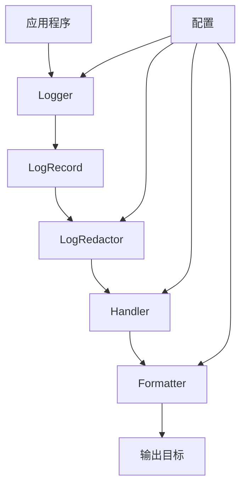

# 日志模块文档

## 概述

本项目的日志模块是一个功能完整、高度可配置的日志系统，采用分层架构设计，提供了灵活的日志记录、格式化、处理和脱敏功能。该模块遵循项目的扁平化架构原则，分为核心层（Core）和服务层（Services）。

## 架构概览

### 整体架构

```
日志模块架构
├── 核心层 (src/core/logger/)
│   ├── 日志级别 (LogLevel)
│   ├── 格式化器 (Formatters)
│   │   ├── BaseFormatter (基础格式化器)
│   │   ├── TextFormatter (文本格式化器)
│   │   ├── JsonFormatter (JSON格式化器)
│   │   └── ColorFormatter (彩色格式化器)
│   └── 处理器 (Handlers)
│       ├── BaseHandler (基础处理器)
│       ├── ConsoleHandler (控制台处理器)
│       ├── FileHandler (文件处理器)
│       └── JsonHandler (JSON处理器)
└── 服务层 (src/services/logger/)
    ├── 日志记录器 (Logger)
    ├── 脱敏器 (LogRedactor)
    ├── 错误处理器 (ErrorHandler)
    ├── 指标收集器 (MetricsCollector)
    └── 结构化文件日志记录器 (StructuredFileLogger)
```

### 设计原则

1. **分层架构**：核心层提供基础功能，服务层提供高级功能
2. **接口驱动**：所有核心组件都定义了接口，便于扩展和测试
3. **配置驱动**：支持通过配置文件灵活配置日志行为
4. **线程安全**：所有组件都考虑了多线程环境下的安全性
5. **性能优化**：包括缓存机制和异步处理能力

## 核心功能

### 1. 多级别日志记录
- 支持 DEBUG、INFO、WARNING、ERROR、CRITICAL 五个级别
- 可动态调整日志级别
- 支持级别过滤和比较

### 2. 多种输出方式
- 控制台输出（支持彩色显示）
- 文件输出（支持文本和JSON格式）
- 可扩展的处理器架构

### 3. 灵活的格式化
- 文本格式化（支持自定义模板）
- JSON格式化（结构化日志）
- 彩色格式化（增强可读性）

### 4. 安全脱敏
- 内置多种敏感信息识别模式
- 支持自定义脱敏规则
- 可选的哈希脱敏功能

### 5. 错误处理
- 全局错误处理器
- 分类错误处理
- 错误上下文记录

### 6. 指标收集
- 计数器、仪表盘、直方图指标
- 线程安全的指标收集
- 支持标签分类

## 组件关系

### 核心流程



### 组件交互

1. **Logger** 作为主要入口，接收日志请求
2. **LogRecord** 封装日志信息，包含时间戳、级别、消息等
3. **LogRedactor** 对敏感信息进行脱敏处理
4. **Handler** 负责将日志输出到不同目标
5. **Formatter** 将日志记录格式化为可读文本

## 特性亮点

### 1. 高性能
- 缓存机制减少重复计算
- 线程安全设计避免锁竞争
- 异步处理能力（可扩展）

### 2. 高可配置性
- YAML配置文件支持
- 环境变量注入
- 运行时配置更新

### 3. 高可扩展性
- 插件化的处理器架构
- 可定制的格式化器
- 灵活的脱敏规则

### 4. 生产就绪
- 完整的错误处理机制
- 详细的指标收集
- 结构化日志支持

## 使用场景

1. **开发调试**：使用控制台彩色输出，快速定位问题
2. **生产环境**：使用文件输出和JSON格式，便于日志分析
3. **安全审计**：启用脱敏功能，保护敏感信息
4. **性能监控**：集成指标收集，监控系统运行状态
5. **错误追踪**：使用全局错误处理器，统一处理异常

## 下一步

请参考以下文档了解更多详细信息：

- [核心组件文档](./docs/core-components.md)
- [服务层组件文档](./docs/service-components.md)
- [使用示例](./docs/usage-examples.md)
- [配置指南](./docs/configuration-guide.md)
- [最佳实践](./docs/best-practices.md)