# 模块关系图和架构图

## 概述

本文档包含日志模块的架构图和组件关系图，帮助理解系统的整体设计和组件间的交互关系。

## 整体架构图

### 系统架构层次

```mermaid
graph TB
    subgraph "应用层"
        APP[应用程序]
        API[API接口]
        CLI[命令行工具]
    end
    
    subgraph "服务层 (src/services/logger/)"
        LOGGER[Logger]
        REDACTOR[LogRedactor]
        ERROR_HANDLER[ErrorHandler]
        METRICS[MetricsCollector]
        STRUCTURED_LOGGER[StructuredFileLogger]
    end
    
    subgraph "核心层 (src/core/logger/)"
        LEVEL[LogLevel]
        
        subgraph "格式化器"
            BASE_FORMATTER[BaseFormatter]
            TEXT_FORMATTER[TextFormatter]
            JSON_FORMATTER[JsonFormatter]
            COLOR_FORMATTER[ColorFormatter]
        end
        
        subgraph "处理器"
            BASE_HANDLER[BaseHandler]
            CONSOLE_HANDLER[ConsoleHandler]
            FILE_HANDLER[FileHandler]
            JSON_HANDLER[JsonHandler]
        end
    end
    
    subgraph "输出目标"
        CONSOLE[控制台]
        FILES[文件系统]
        JSON_FILES[JSON文件]
        WEBHOOK[Webhook]
    end
    
    subgraph "外部系统"
        CONFIG[配置系统]
        MONITORING[监控系统]
        ALERTING[告警系统]
    end
    
    APP --> LOGGER
    API --> LOGGER
    CLI --> LOGGER
    
    LOGGER --> LEVEL
    LOGGER --> REDACTOR
    LOGGER --> ERROR_HANDLER
    LOGGER --> METRICS
    
    LOGGER --> BASE_HANDLER
    REDACTOR --> LOGGER
    ERROR_HANDLER --> LOGGER
    METRICS --> LOGGER
    
    BASE_HANDLER --> BASE_FORMATTER
    BASE_HANDLER --> CONSOLE
    BASE_HANDLER --> FILES
    
    TEXT_FORMATTER --> BASE_FORMATTER
    JSON_FORMATTER --> BASE_FORMATTER
    COLOR_FORMATTER --> TEXT_FORMATTER
    
    CONSOLE_HANDLER --> BASE_HANDLER
    FILE_HANDLER --> BASE_HANDLER
    JSON_HANDLER --> BASE_HANDLER
    
    CONSOLE_HANDLER --> CONSOLE
    FILE_HANDLER --> FILES
    JSON_HANDLER --> JSON_FILES
    
    STRUCTURED_LOGGER --> FILES
    
    ERROR_HANDLER --> ALERTING
    METRICS --> MONITORING
    
    CONFIG --> LOGGER
    CONFIG --> REDACTOR
    CONFIG --> ERROR_HANDLER
    CONFIG --> METRICS
```

### 组件依赖关系

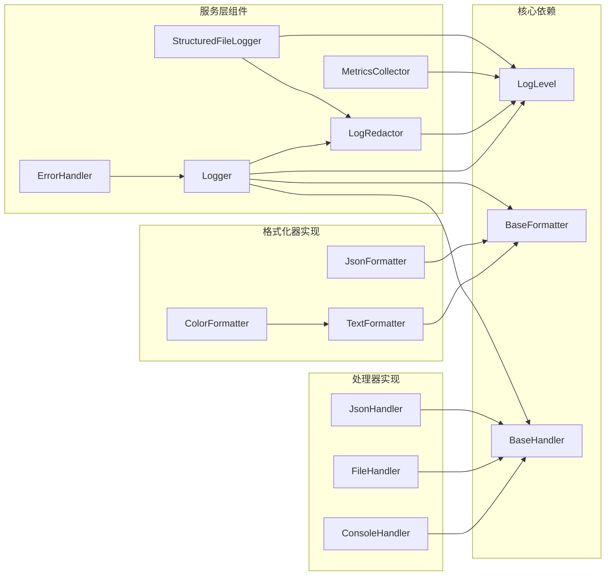

## 数据流图

### 日志处理流程

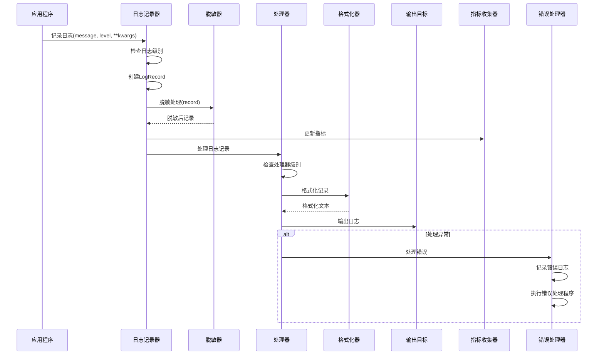

### 配置加载流程

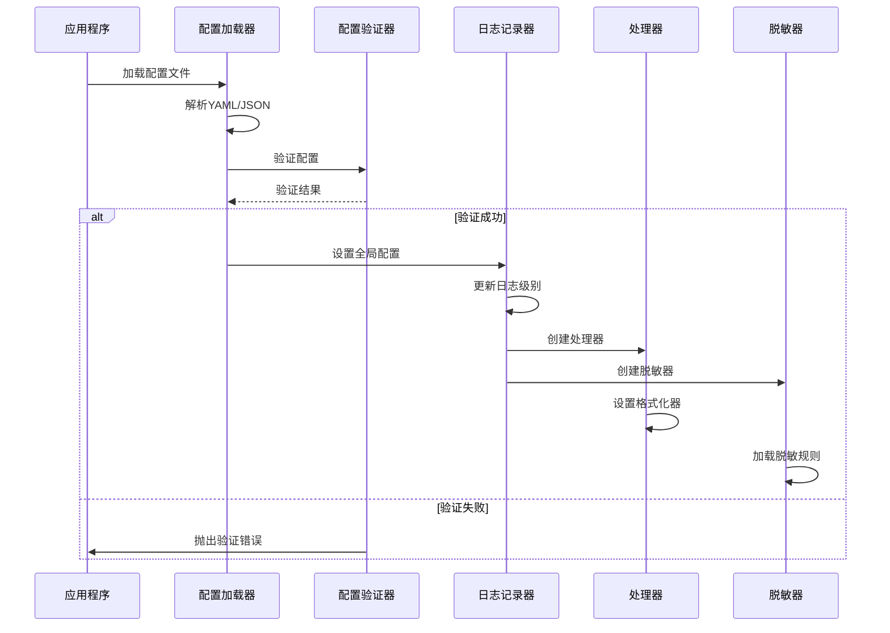

## 组件详细图

### 日志记录器内部结构

```mermaid
graph TB
    subgraph "Logger类"
        LOGGER[Logger实例]
        REGISTRY[日志记录器注册表]
        CONFIG[配置]
        HANDLERS[处理器列表]
        REDACTOR[脱敏器]
        LEVEL[日志级别]
        LOCK[线程锁]
    end
    
    subgraph "核心方法"
        DEBUG[debug()]
        INFO[info()]
        WARNING[warning()]
        ERROR[error()]
        CRITICAL[critical()]
        SET_LEVEL[set_level()]
        ADD_HANDLER[add_handler()]
        REMOVE_HANDLER[remove_handler()]
    end
    
    subgraph "内部方法"
        LOG[_log()]
        SHOULD_LOG[_should_log()]
        CREATE_RECORD[_create_log_record()]
        REDACT_RECORD[_redact_log_record()]
        SETUP_HANDLERS[_setup_handlers_from_config()]
    end
    
    LOGGER --> REGISTRY
    LOGGER --> CONFIG
    LOGGER --> HANDLERS
    LOGGER --> REDACTOR
    LOGGER --> LEVEL
    LOGGER --> LOCK
    
    DEBUG --> LOG
    INFO --> LOG
    WARNING --> LOG
    ERROR --> LOG
    CRITICAL --> LOG
    
    LOG --> SHOULD_LOG
    LOG --> CREATE_RECORD
    LOG --> REDACT_RECORD
    LOG --> HANDLERS
    
    CREATE_RECORD --> LEVEL
    REDACT_RECORD --> REDACTOR
    SETUP_HANDLERS --> CONFIG
```

### 脱敏器处理流程

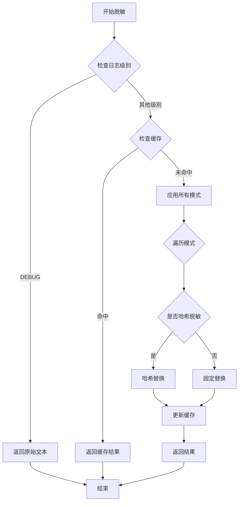

### 错误处理流程

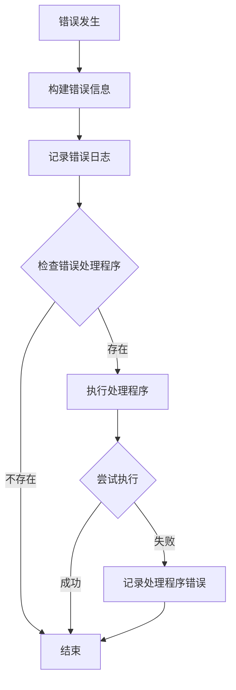

### 指标收集流程

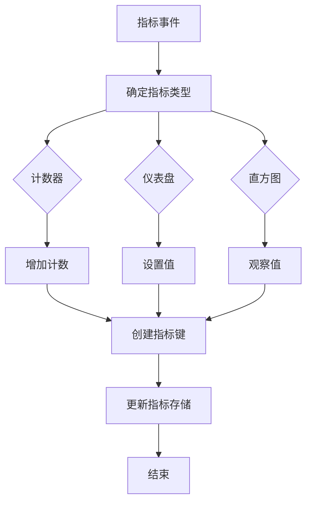

## 部署架构图

### 单机部署架构

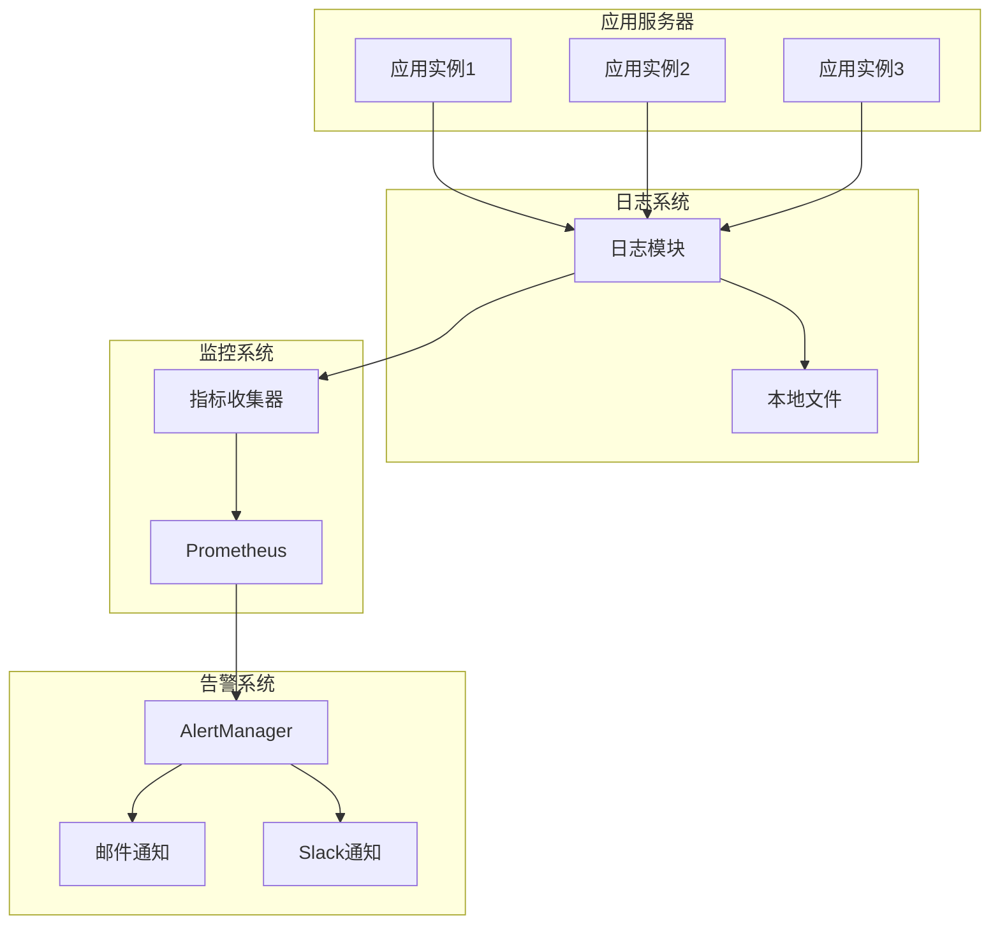

### 分布式部署架构

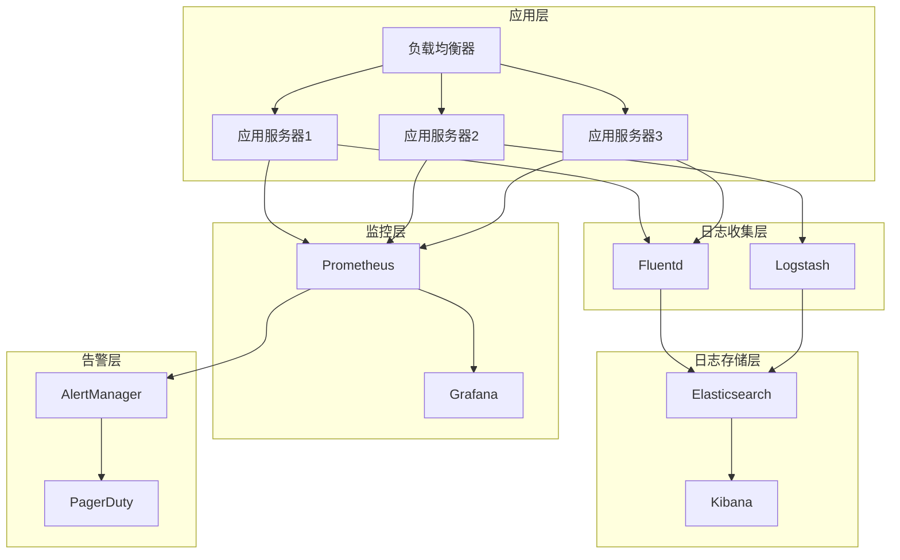

## 性能架构图

### 高性能日志处理

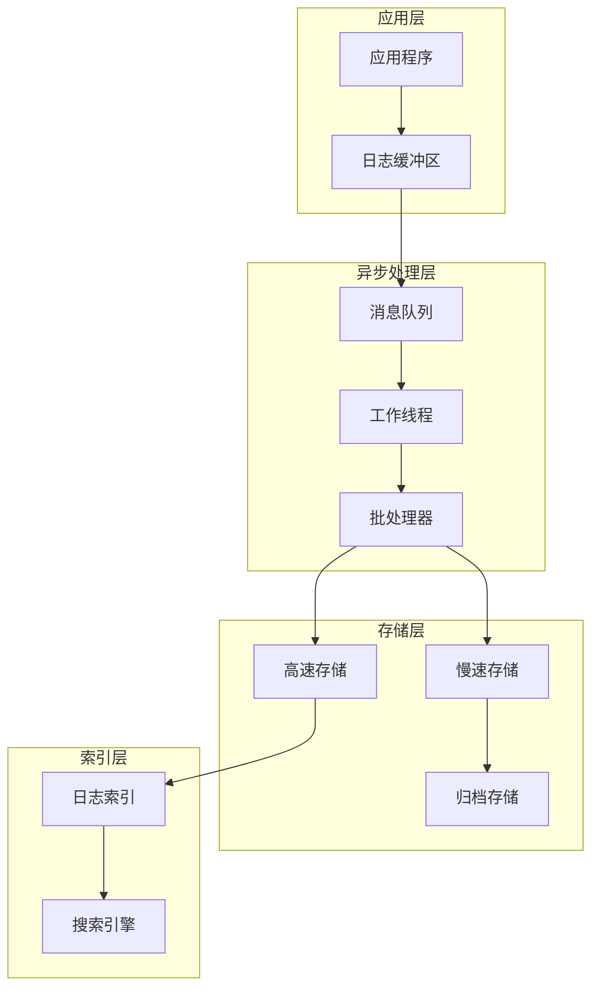

### 缓存架构

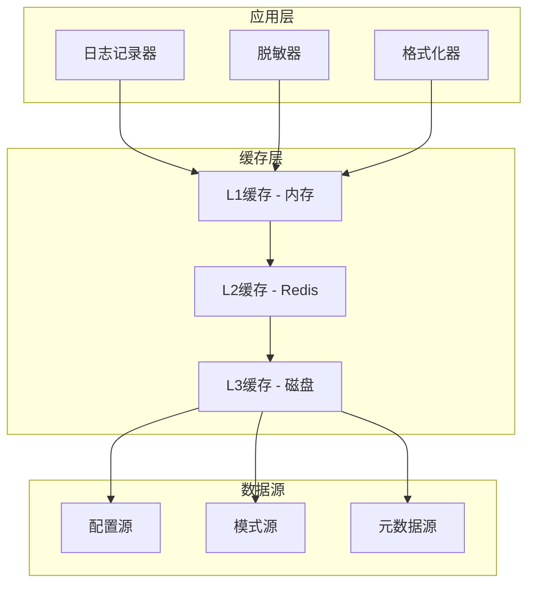

## 安全架构图

### 安全日志处理

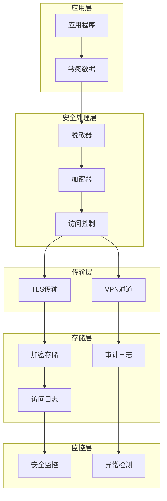

## 扩展架构图

### 插件化架构

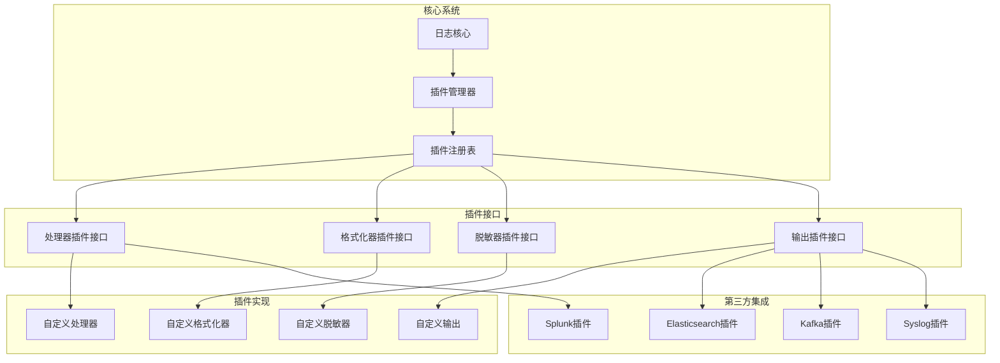

这些架构图展示了日志模块的各个方面，从整体系统架构到具体的组件实现，帮助开发者全面理解日志系统的设计和实现。