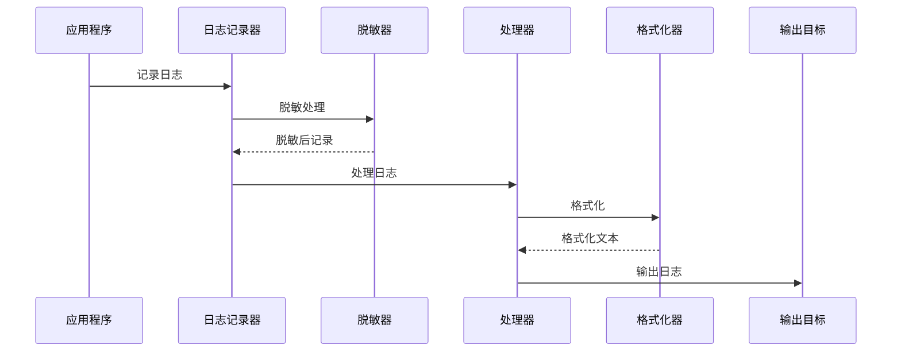

# 核心组件文档

## 概述

核心组件位于 `src/core/logger/` 目录，提供了日志系统的基础功能。这些组件遵循接口驱动的设计原则，为上层服务提供稳定可靠的底层支持。

## 日志级别 (LogLevel)

### 功能描述

`LogLevel` 是一个枚举类，定义了日志系统的五个标准级别，提供了级别比较和字符串转换功能。

### 级别定义

| 级别 | 数值 | 描述 |
|------|------|------|
| DEBUG | 10 | 调试信息，用于开发和问题诊断 |
| INFO | 20 | 一般信息，记录程序正常运行状态 |
| WARNING | 30 | 警告信息，表示潜在问题 |
| ERROR | 40 | 错误信息，表示程序出现错误但可继续运行 |
| CRITICAL | 50 | 严重错误，表示程序可能无法继续运行 |

### 主要功能

#### 1. 字符串转换
```python
# 从字符串创建日志级别
level = LogLevel.from_string("INFO")  # 返回 LogLevel.INFO
level = LogLevel.from_string("WARN")  # 返回 LogLevel.WARNING

# 转换为字符串
str(LogLevel.INFO)  # 返回 "INFO"
```

#### 2. 级别比较
```python
LogLevel.INFO > LogLevel.DEBUG      # True
LogLevel.ERROR >= LogLevel.WARNING   # True
LogLevel.CRITICAL < LogLevel.DEBUG   # False
```

#### 3. 别名支持
- `WARN` 映射到 `WARNING`
- `FATAL` 映射到 `CRITICAL`

### 使用场景

- 日志级别过滤
- 配置文件中的级别设置
- 动态级别调整

## 格式化器 (Formatters)

### 基础格式化器 (BaseFormatter)

#### 功能描述
`BaseFormatter` 是所有格式化器的抽象基类，定义了格式化器的通用接口和基础功能。

#### 核心方法

```python
@abstractmethod
def format(self, record: Dict[str, Any]) -> str:
    """格式化日志记录"""
    pass

def format_time(self, timestamp: datetime) -> str:
    """格式化时间戳"""
    pass

def format_level(self, level: LogLevel | str) -> str:
    """格式化日志级别"""
    pass
```

#### 设计特点
- 抽象基类，强制子类实现 `format` 方法
- 提供通用的时间和级别格式化功能
- 支持自定义日期时间格式

### 文本格式化器 (TextFormatter)

#### 功能描述
`TextFormatter` 提供基于模板的文本格式化功能，支持类似 Python 标准库的格式字符串。

#### 默认格式
```
%(asctime)s - %(name)s - %(levelname)s - %(message)s
```

#### 支持的占位符

| 占位符 | 描述 | 示例 |
|--------|------|------|
| `%(asctime)s` | 时间戳 | 2023-01-01 12:00:00 |
| `%(name)s` | 日志器名称 | MyApp |
| `%(levelname)s` | 日志级别 | INFO |
| `%(message)s` | 日志消息 | 用户登录成功 |
| `%(field_name)s` | 自定义字段 | %(user_id)s |

#### 高级功能

1. **自定义字段格式化**
```python
# 支持数字和字符串格式
"%(count)d"    # 数字格式
"%(user)s"     # 字符串格式
```

2. **灵活的模板配置**
```python
formatter = TextFormatter(
    fmt="%(asctime)s [%(levelname)s] %(name)s: %(message)s",
    datefmt="%Y-%m-%d %H:%M:%S"
)
```

### JSON格式化器 (JsonFormatter)

#### 功能描述
`JsonFormatter` 将日志记录转换为JSON格式，便于结构化日志处理和分析。

#### 特性

1. **自动类型转换**
```python
# 输入记录
{
    "timestamp": datetime(2023, 1, 1, 12, 0, 0),
    "level": LogLevel.INFO,
    "message": "用户登录",
    "user_id": 12345
}

# 输出JSON
{
    "timestamp": "2023-01-01T12:00:00",
    "level": "INFO",
    "message": "用户登录",
    "user_id": 12345
}
```

2. **嵌套对象处理**
```python
# 支持嵌套字典和列表
record = {
    "user": {"id": 123, "name": "张三"},
    "actions": ["login", "view"]
}
```

3. **配置选项**
```python
formatter = JsonFormatter(
    datefmt="%Y-%m-%d %H:%M:%S",
    ensure_ascii=False  # 支持中文字符
)
```

### 彩色格式化器 (ColorFormatter)

#### 功能描述
`ColorFormatter` 继承自 `TextFormatter`，为不同级别的日志添加ANSI颜色代码，提升控制台输出的可读性。

#### 颜色映射

| 级别 | 颜色 | ANSI代码 |
|------|------|----------|
| DEBUG | 青色 | \033[36m |
| INFO | 绿色 | \033[32m |
| WARNING | 黄色 | \033[33m |
| ERROR | 红色 | \033[31m |
| CRITICAL | 紫色 | \033[35m |

#### 使用示例
```python
# 创建彩色格式化器
formatter = ColorFormatter(
    fmt="%(asctime)s - %(levelname)s - %(message)s"
)

# 输出示例（带颜色）
# 2023-01-01 12:00:00 - INFO - 用户登录成功（绿色）
# 2023-01-01 12:00:01 - ERROR - 数据库连接失败（红色）
```

## 处理器 (Handlers)

### 基础处理器 (BaseHandler)

#### 功能描述
`BaseHandler` 是所有处理器的抽象基类，定义了处理器的通用接口和基础功能。

#### 核心方法

```python
@abstractmethod
def emit(self, record: Dict[str, Any]) -> None:
    """输出日志记录"""
    pass

def handle(self, record: Dict[str, Any]) -> None:
    """处理日志记录（包含级别检查和错误处理）"""
    pass

def set_formatter(self, formatter: BaseFormatter) -> None:
    """设置格式化器"""
    pass
```

#### 设计特点

1. **级别过滤**
```python
# 只处理等于或高于设置级别的日志
if record["level"].value < self.level.value:
    return
```

2. **错误处理**
```python
try:
    self.emit(record)
except Exception:
    self.handleError(record)  # 避免日志错误影响主程序
```

3. **格式化器集成**
```python
def format(self, record: Dict[str, Any]) -> Dict[str, Any]:
    if self._formatter:
        formatted_msg = self._formatter.format(record)
        formatted_record = record.copy()
        formatted_record["formatted_message"] = formatted_msg
        return formatted_record
    return record
```

### 控制台处理器 (ConsoleHandler)

#### 功能描述
`ConsoleHandler` 将日志输出到控制台（标准输出或标准错误），支持彩色显示。

#### 配置选项

```python
config = {
    "stream": sys.stdout,      # 输出流（默认为标准输出）
    "use_color": True          # 是否使用彩色（默认为False）
}
```

#### 使用示例

```python
# 基本使用
handler = ConsoleHandler(LogLevel.INFO)

# 带配置的使用
handler = ConsoleHandler(
    level= LogLevel.DEBUG,
    config={
        "stream": sys.stderr,
        "use_color": True
    }
)
```

#### 特性

1. **自动格式化器选择**
```python
# 根据use_color配置自动选择格式化器
if self.use_color:
    self._formatter = ColorFormatter()
else:
    self._formatter = TextFormatter()
```

2. **流刷新**
```python
def flush(self) -> None:
    """刷新输出流"""
    if hasattr(self.stream, "flush"):
        self.stream.flush()
```

### 文件处理器 (FileHandler)

#### 功能描述
`FileHandler` 将日志输出到文件，支持多种文件模式和编码。

#### 配置选项

```python
config = {
    "filename": "app.log",     # 文件名
    "mode": "a",               # 文件模式（追加、覆盖等）
    "encoding": "utf-8"        # 文件编码
}
```

#### 特性

1. **自动目录创建**
```python
# 确保日志文件目录存在
directory = os.path.dirname(self.filename)
if directory:
    os.makedirs(directory, exist_ok=True)
```

2. **线程安全**
```python
# 使用锁确保多线程环境下的文件写入安全
with self._lock:
    self.stream.write(formatted_msg + "\n")
    self.stream.flush()
```

3. **资源管理**
```python
def close(self) -> None:
    """关闭文件"""
    if self.stream and not self.stream.closed:
        self.stream.flush()
        self.stream.close()
        self.stream = None

def __del__(self):
    """析构函数，确保资源释放"""
    self.close()
```

### JSON处理器 (JsonHandler)

#### 功能描述
`JsonHandler` 将日志以JSON格式输出到文件，便于结构化日志处理。

#### 特性

1. **JSON序列化**
```python
def emit(self, record: Dict[str, Any]) -> None:
    # 转换日志记录为JSON可序列化的格式
    json_record = self._prepare_json_record(record)
    json_str = json.dumps(json_record, ensure_ascii=self.ensure_ascii, default=str)
    
    # 写入文件
    with self._lock:
        self.stream.write(json_str + "\n")
        self.stream.flush()
```

2. **类型转换处理**
```python
def _prepare_json_record(self, record: Dict[str, Any]) -> Dict[str, Any]:
    json_record = {}
    for key, value in record.items():
        if isinstance(value, datetime):
            json_record[key] = value.isoformat()
        elif isinstance(value, LogLevel):
            json_record[key] = value.name
        elif isinstance(value, dict):
            json_record[key] = self._prepare_json_record(value)
        # ... 其他类型处理
    return json_record
```

3. **配置选项**
```python
config = {
    "filename": "app.json",
    "mode": "a",
    "encoding": "utf-8",
    "ensure_ascii": False  # 支持中文字符
}
```

## 组件协作

### 典型工作流程



### 配置示例

```python
# 完整的日志配置示例
config = {
    "log_level": "INFO",
    "log_outputs": [
        {
            "type": "console",
            "level": "DEBUG",
            "use_color": True
        },
        {
            "type": "file",
            "level": "INFO",
            "filename": "logs/app.log",
            "mode": "a",
            "encoding": "utf-8"
        },
        {
            "type": "json",
            "level": "WARNING",
            "filename": "logs/error.json",
            "ensure_ascii": False
        }
    ]
}
```

## 扩展指南

### 自定义格式化器

```python
class CustomFormatter(BaseFormatter):
    def format(self, record: Dict[str, Any]) -> str:
        # 实现自定义格式化逻辑
        return f"[{self.format_time(record['timestamp'])}] {record['message']}"
```

### 自定义处理器

```python
class CustomHandler(BaseHandler):
    def emit(self, record: Dict[str, Any]) -> None:
        # 实现自定义输出逻辑
        formatted_record = self.format(record)
        # 输出到自定义目标
        pass
```

核心组件为日志系统提供了稳定可靠的基础，通过接口驱动的设计确保了良好的可扩展性和可测试性。