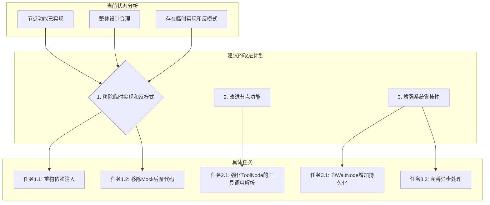

好的，我已经完成了对所有 9 个节点源代码的阅读和分析。

结合 `AGENTS.md` 提供的项目背景，我现在可以对这些预置节点的设计进行全面评估。

### 1. 整体设计理念分析

这些节点共同构成了一个功能强大且高度模块化的工作流（Graph）构建系统。其设计思想清晰，可以总结为以下几点：

*   **关注点分离 (Separation of Concerns)**：每个节点都有明确的职责。例如，`LLMNode` 负责与 LLM 交互，`ToolNode` 负责执行工具，`ConditionNode` 负责逻辑分支。这种设计使得工作流易于构建、理解和调试。
*   **配置驱动 (Configuration-Driven)**：所有节点都通过 `config` 字典进行参数化，并且提供了 `get_config_schema` 方法来定义其配置结构。这与 `AGENTS.md` 中提到的配置驱动架构完全一致，允许通过 YAML 文件灵活地编排复杂的工作流。
*   **状态驱动 (State-Driven)**：整个工作流通过 `AgentState` 对象在节点之间传递和修改。这是一种标准的状态机模式，非常适合 LangGraph 的工作方式。
*   **抽象与封装 (Abstraction and Encapsulation)**：
    *   低层级节点（`LLMNode`, `ToolNode`）封装了与基础设施（LLM 客户端、工具注册表）的交互细节。
    *   高层级节点（`ReActAgentNode`, `PlanExecuteAgentNode`）则将完整的 Agent 行为模式（如 ReAct 循环）封装成单个节点，极大地简化了复杂工作流的构建。
*   **可扩展性 (Extensibility)**：`HookableNode` 的设计提供了一个优雅的 AOP（面向切面编程）机制，允许在不修改节点核心逻辑的情况下，注入日志、监控、权限校验等横切关注点。

### 2. 各节点详细评估

我将节点分为几类进行评估：

#### A. 核心逻辑节点

这类节点是构成 Agent 思维循环的基础。

1.  **`LLMNode` & `AnalysisNode`**
    *   **用途**: `AnalysisNode` 用于分析状态并决定下一步是调用工具还是生成最终回复，而 `LLMNode` 更侧重于根据上下文（包含工具结果）生成最终答案。这种职责划分是合理的。
    *   **设计合理性**:
        *   **优点**: 配置项丰富（temperature, top_p 等），支持提示词模板，能够自动将工具执行结果整合到提示词中，设计良好。
        *   **问题**: `_get_llm_client` 方法中存在硬编码的 `_create_mock_client()` 作为后备。这违反了依赖注入原则，应完全依赖容器来提供服务。代码中的 `TODO` 注释也表明开发者意识到了这一点。
    *   **功能实现**: 基本符合预期，但对 `AgentState` 中 `messages` 格式的处理逻辑略显复杂，试图兼容多种消息类型，未来可以考虑统一为 `AgentMessage` 领域对象。

2.  **`ToolNode`**
    *   **用途**: 专门负责解析并执行工具调用。
    *   **设计合理性**:
        *   **优点**: 职责单一，设计清晰。支持超时、重试、并行调用等高级功能配置，非常实用。能正确处理 `ToolCall` 和 `ToolResult` 等领域对象。
        *   **问题**:
            *   与 `LLMNode` 类似，`_get_tool_manager` 依赖模拟的后备实现。
            *   `_extract_tool_calls` 方法中，`_parse_tool_calls_from_text` 这种基于正则表达式的文本解析方式非常脆弱，强烈建议废弃，转而完全依赖 LLM 的 Function Calling 结构化输出。
_parse_tool_calls_from_text需要保留，用于处理部分不原生支持function calling的llm。但需要进一步优化

#### B. 流程控制节点

这类节点负责决定工作流的走向。

3.  **`ConditionNode`**
    *   **用途**: 实现工作流的条件分支。
    *   **设计合理性**:
        *   **优点**: 设计非常灵活且强大。它内置了多种常用条件（如 `has_tool_calls`, `max_iterations_reached`），并且可以通过 `register_condition_function` 和 `custom` 类型的条件进行扩展，满足了绝大部分分支需求。
        *   **潜在风险**: `_custom_condition` 中使用了 `eval()`。虽然实现者试图通过 `safe_globals` 创建一个沙箱环境，但这仍然是一个潜在的安全风险，需要确保传入的 `code` 来源绝对可信。

4.  **`WaitNode`**
    *   **用途**: 实现工作流的暂停，用于等待人工审核或外部输入。
    *   **设计合理性**:
        *   **优点**: 这是一个设计非常完善的节点。它考虑了超时、多种超时处理策略（继续等待、缓存退出、LLM 自动继续）、状态缓存和恢复，对于需要人机协作的复杂任务至关重要。
        *   **问题**: 节点的状态（`_active_waits`）是存储在内存中的，这意味着如果应用重启，所有等待状态都会丢失。对于生产环境，需要将其改造为持久化存储（如 Redis 或数据库）。

#### C. 高层级 Agent 节点

这类节点将完整的 Agent 逻辑封装成一个可重用的单元。

5.  **`ReActAgentNode` & `PlanExecuteAgentNode`**
    *   **用途**: 分别将 `ReAct` 和 `Plan-Execute` 这两种经典的 Agent 算法封装为图节点。
    *   **设计合理性**:
        *   **优点**: 完美的抽象。它们使得用户可以在不关心 `ReAct` 或 `Plan-Execute` 内部循环细节的情况下，直接在工作流中使用这些能力。这完全符合项目的需求。
        *   **问题**: `execute` 方法中处理异步的逻辑 (`asyncio.get_running_loop()`/`new_event_loop()`) 表明节点的执行环境是同步的，但在内部需要调用异步的 Agent。这种“同步调用异步”的模式虽然能工作，但略显笨拙，可能在复杂的并发场景下引入问题。
    *   **功能实现**: 它们正确地调用了 `src.domain.agent.builtin` 中的 Agent 实现，遵循了架构分层。

6.  **`AgentExecutionNode`**
    *   **用途**: 作为一个通用的 Agent 执行器，通过 `AgentManager` 来调用和管理不同的 Agent。
    *   **设计合理性**:
        *   **优点**: 提供了一个更高层次的抽象，支持在运行时动态选择和切换 Agent，适用于多 Agent 协作（Multi-Agent System）的场景。
        *   **问题**: `_get_agent_manager` 和 `_get_event_manager` 方法中，使用了 `get_global_container()` 这种服务定位器（Service Locator）模式。这是一种反模式，它隐藏了类的依赖关系，使得单元测试变得困难。`AGENTS.md` 强调了完整的依赖注入，这里应改为通过构造函数注入依赖。

#### D. 架构扩展节点

7.  **`HookableNode`**
    *   **用途**: 提供一个基类，让其他节点可以被“挂钩”，从而在执行前后或出错时注入自定义逻辑。
    *   **设计合理性**:
        *   **优点**: 这是一个非常出色的架构设计。它优雅地实现了横切关注点的分离，使得日志、监控、缓存等功能可以模块化地应用到任何节点上，而无需侵入节点本身的逻辑。
    *   **功能实现**: 实现清晰，同时提供了基类继承和工厂函数两种集成方式，考虑周全。

### 3. 综合评估结论

1.  **设计是否合理？**
    *   **是，整体设计非常合理、模块化且功能强大。** 节点职责划分清晰，配置驱动和状态驱动的模式与 LangGraph 框架高度契合。`HookableNode` 和高层级 Agent 节点的设计尤其出色，显示了良好的软件架构思想。
    *   **主要缺陷**在于依赖管理，多处出现了对**模拟实现的依赖**和**全局容器的服务定位器模式**，这与项目宣称的“完整依赖注入”原则相悖，是进入生产环境前必须解决的问题。

2.  **能否满足项目需要？**
    *   **能，完全能够满足项目需要。** 这套节点组合不仅提供了构建标准 Agent（如 ReAct, Plan-Execute）的所有必要组件，还通过 `ConditionNode` 和 `WaitNode` 提供了构建复杂、非线性、可人机交互工作流的能力，满足了项目对灵活性和强大功能的需求。

3.  **实现与功能是否相符？**
    *   **基本相符，但存在一些“开发阶段”的临时实现。** 节点的核心功能都已实现，但一些关键的外部依赖（如 LLM 客户端、工具管理器）被临时的模拟对象替代。这在开发阶段是常见的，但需要替换为真正的实现。此外，`ToolNode` 中基于文本的工具调用解析功能，虽然实现了，但设计上存在缺陷，应予替换。

### 4. 建议的后续计划

为了使这套节点系统达到生产就绪状态，我建议进行以下改进。

基于以上分析，我制定了如下的详细计划，并会使用 `update_todo_list` 工具来跟踪进度。

**计划**

1.  **重构依赖注入**：
[x]
    *   修改所有节点的 `__init__` 方法，使其通过构造函数显式声明其依赖（如 `ILLMClient`, `IToolRegistry`, `IAgentManager`）。
    *   移除所有节点内的 `_get_..._client` 或 `_get_..._manager` 方法中的 `get_global_container()` 调用和创建模拟对象的后备逻辑。依赖项的获取应完全由外部的依赖注入容器负责。
2.  **强化工具调用**：
    *   废弃 `ToolNode` 中基于正则表达式的 `_parse_tool_calls_from_text` 方法。
    *   确保工作流中的 `AnalysisNode` 或 `ReActAgentNode` 能够利用支持 Function Calling 的 LLM，生成结构化的工具调用信息，供 `ToolNode` 直接使用。
3.  **增强 `WaitNode` 的持久化**：
    *   设计并引入一个持久化存储接口（如 `IWaitStateStore`）。
    *   改造 `WaitNode`，使其通过该接口来存储和读取等待状态，确保应用重启后等待状态不丢失。
4.  **审查并统一异步处理**：
    *   评估在同步的节点 `execute` 方法中调用异步代码的模式，研究是否可以统一工作流的执行模式（例如，让所有节点都支持异步执行），以避免潜在的事件循环冲突。
