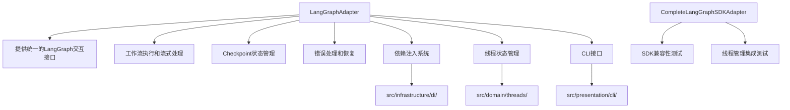

## src/infrastructure/langgraph 目录分析报告

### 目录结构
该目录包含两个核心文件：
- [`adapter.py`](src/infrastructure/langgraph/adapter.py) - 主要LangGraph适配器实现
- [`sdk_adapter.py`](src/infrastructure/langgraph/sdk_adapter.py) - 完整的LangGraph SDK适配器

### 实际使用情况

**LangGraphAdapter ([`adapter.py`](src/infrastructure/langgraph/adapter.py)) 被广泛使用：**

1. **依赖注入配置** - 在 [`src/infrastructure/di/thread_session_di_config.py`](src/infrastructure/di/thread_session_di_config.py:12) 中注册为服务
2. **线程管理** - 在 [`src/domain/threads/manager.py`](src/domain/threads/manager.py:18) 中用于统一状态管理
3. **CLI集成** - 在 [`src/presentation/cli/commands.py`](src/presentation/cli/commands.py:309) 中提供命令行接口
4. **集成测试** - 在多个测试文件中使用

**CompleteLangGraphSDKAdapter ([`sdk_adapter.py`](src/infrastructure/langgraph/sdk_adapter.py)) 主要用于测试：**
- 在 [`tests/integration/test_sdk_compatibility.py`](tests/integration/test_sdk_compatibility.py:15) 中用于SDK兼容性测试
- 在 [`tests/integration/test_thread_integration.py`](tests/integration/test_thread_integration.py:15) 中用于线程集成测试

### 架构作用和重要性

### 核心功能

1. **LangGraph适配器接口** ([`ILangGraphAdapter`](src/infrastructure/langgraph/adapter.py:38))：
   - 图创建和管理
   - 工作流执行和流式处理
   - Checkpoint状态管理
   - 错误处理和恢复

2. **SDK兼容性适配器** ([`CompleteLangGraphSDKAdapter`](src/infrastructure/langgraph/sdk_adapter.py:16))：
   - 提供完整的LangGraph SDK兼容接口
   - 支持线程创建、状态管理、历史记录等
   - 主要用于测试和验证SDK兼容性

### 结论

**`src/infrastructure/langgraph` 目录确实被实际使用**，主要作用包括：

1. **核心适配器**：`LangGraphAdapter` 是项目中LangGraph交互的核心组件，被多个模块依赖
2. **测试支持**：`CompleteLangGraphSDKAdapter` 提供完整的SDK兼容性测试支持
3. **架构桥梁**：作为LangGraph库与项目内部架构之间的桥梁，提供统一的接口和抽象
4. **状态管理**：通过适配器统一管理线程状态、checkpoint和工作流执行

该目录在项目中扮演着**关键的基础设施角色**，是LangGraph功能的核心实现部分。