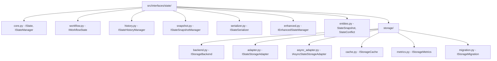

## 当前状态接口结构的根本问题分析

通过深入分析，我发现了以下根本性问题：

### 1. 接口定义重复和分散
- [`src/interfaces/state/interfaces.py`](file:///d:/项目/agent/open-agent/src/interfaces/state/interfaces.py) 和 [`src/interfaces/state_interfaces.py`](file:///d:/项目/agent/open-agent/src/interfaces/state_interfaces.py) 定义了相似的接口
- [`src/core/state/state_interfaces.py`](file:///d:/项目/agent/open-agent/src/core/state/state_interfaces.py) 又重复定义了相同的接口
- 违反了DRY原则和接口集中化原则

### 2. 接口职责混乱
- [`src/interfaces/state_core.py`](file:///d:/项目/agent/open-agent/src/interfaces/state_core.py) 作为聚合模块，但导入路径混乱
- 从不存在的 `src/interfaces/storage_interfaces` 导入接口
- 混合了接口层和核心层的导入

### 3. 架构层次不清
- 接口定义分散在多个层次：`src/interfaces/`、`src/core/state/`
- 违反了"所有接口定义必须放在集中的接口层"原则

## 新的状态接口架构设计

基于架构文档和最佳实践，我设计了以下全新的状态接口架构：

### 核心设计原则
1. **单一真实来源**：所有状态相关接口集中在 `src/interfaces/state/` 目录
2. **清晰的职责分离**：按功能领域划分接口模块
3. **向后兼容性**：保持现有接口的稳定性
4. **类型安全**：使用前向引用避免循环依赖

### 新的目录结构

```
src/interfaces/state/
├── __init__.py              # 统一导出所有状态接口
├── core.py                  # 核心状态接口（IState, IStateManager等）
├── workflow.py              # 工作流状态接口（IWorkflowState等）
├── history.py               # 历史管理接口
├── snapshot.py              # 快照管理接口
├── serializer.py            # 序列化接口
├── factory.py              # 工厂接口
├── lifecycle.py            # 生命周期管理接口
├── enhanced.py             # 增强状态管理接口
├── entities.py             # 状态相关实体（冲突、快照等）
└── storage/               # 存储相关接口
    ├── __init__.py
    ├── backend.py         # 存储后端接口
    ├── adapter.py        # 状态存储适配器接口
    ├── async_adapter.py  # 异步适配器接口
    ├── cache.py          # 缓存接口
    ├── metrics.py        # 指标接口
    └── migration.py      # 迁移接口
```

### 接口职责划分

1. **core.py** - 基础状态接口
   - `IState` - 基础状态接口
   - `IStateManager` - 状态管理器接口

2. **workflow.py** - 工作流状态接口
   - `IWorkflowState` - 工作流状态接口

3. **history.py** - 历史管理接口
   - `IStateHistoryManager` - 状态历史管理器接口

4. **snapshot.py** - 快照管理接口
   - `IStateSnapshotManager` - 状态快照管理器接口

5. **serializer.py** - 序列化接口
   - `IStateSerializer` - 状态序列化器接口

6. **enhanced.py** - 增强功能接口
   - `IEnhancedStateManager` - 增强状态管理器接口

7. **entities.py** - 实体定义
   - `StateSnapshot` - 状态快照实体
   - `StateHistoryEntry` - 历史记录实体
   - `StateConflict` - 状态冲突实体
   - `ConflictType` - 冲突类型枚举
   - `ConflictResolutionStrategy` - 冲突解决策略

8. **storage/** - 存储相关接口
   - `backend.py` - 存储后端接口
   - `adapter.py` - 状态存储适配器接口
   - `async_adapter.py` - 异步适配器接口
   - `cache.py` - 缓存接口
   - `metrics.py` - 指标接口
   - `migration.py` - 迁移接口

### 迁移策略

1. **第一阶段**：创建新的接口文件结构
2. **第二阶段**：逐个迁移接口定义
3. **第三阶段**：更新导入路径
4. **第四阶段**：删除重复文件
5. **第五阶段**：验证和测试

---

## 详细迁移计划

基于新的架构设计，我制定了以下详细的迁移计划：

### 第一阶段：创建新的接口文件结构

#### 1.1 创建存储相关接口目录和文件
```bash
# 创建存储接口目录
mkdir -p src/interfaces/state/storage

# 创建存储接口文件
touch src/interfaces/state/storage/__init__.py
touch src/interfaces/state/storage/backend.py
touch src/interfaces/state/storage/adapter.py
touch src/interfaces/state/storage/async_adapter.py
touch src/interfaces/state/storage/cache.py
touch src/interfaces/state/storage/metrics.py
touch src/interfaces/state/storage/migration.py
```

#### 1.2 创建状态接口文件
```bash
# 创建状态接口文件
touch src/interfaces/state/core.py
touch src/interfaces/state/workflow.py
touch src/interfaces/state/history.py
touch src/interfaces/state/snapshot.py
touch src/interfaces/state/serializer.py
touch src/interfaces/state/factory.py
touch src/interfaces/state/lifecycle.py
touch src/interfaces/state/enhanced.py
touch src/interfaces/state/entities.py
```

### 第二阶段：逐个迁移接口定义

#### 2.1 迁移核心状态接口
- 将 `IState`、`IStateManager` 从 `src/interfaces/state/interfaces.py` 移动到 `src/interfaces/state/core.py`
- 将 `IWorkflowState` 移动到 `src/interfaces/state/workflow.py`

#### 2.2 迁移历史和快照接口
- 将 `IStateHistoryManager` 从 `src/interfaces/state_interfaces.py` 移动到 `src/interfaces/state/history.py`
- 将 `IStateSnapshotManager` 移动到 `src/interfaces/state/snapshot.py`

#### 2.3 迁移序列化和其他接口
- 将 `IStateSerializer` 移动到 `src/interfaces/state/serializer.py`
- 将 `IStateFactory` 移动到 `src/interfaces/state/factory.py`
- 将 `IStateLifecycleManager` 移动到 `src/interfaces/state/lifecycle.py`
- 将 `IEnhancedStateManager` 移动到 `src/interfaces/state/enhanced.py`

#### 2.4 迁移存储接口
- 将存储相关接口从 `src/core/state/` 移动到 `src/interfaces/state/storage/`
- 将 `IStorageBackend` 移动到 `src/interfaces/state/storage/backend.py`
- 将 `IStateStorageAdapter` 移动到 `src/interfaces/state/storage/adapter.py`
- 将 `IAsyncStateStorageAdapter` 移动到 `src/interfaces/state/storage/async_adapter.py`

#### 2.5 迁移实体定义
- 将冲突相关实体从 `src/core/state/entities.py` 移动到 `src/interfaces/state/entities.py`
- 将状态快照和历史记录实体也移动到 `src/interfaces/state/entities.py`

### 第三阶段：更新导入路径

#### 3.1 更新统一导出文件
- 更新 `src/interfaces/state/__init__.py` 以导出所有新接口
- 更新 `src/interfaces/__init__.py` 以使用新的导入路径

#### 3.2 更新依赖文件
- 搜索所有使用旧接口路径的文件
- 更新导入语句以使用新的路径

#### 3.3 更新聚合模块
- 重构 `src/interfaces/state_core.py` 以使用新的导入路径
- 或者考虑删除 `state_core.py`，因为新的 `__init__.py` 已经提供了统一导出

### 第四阶段：删除重复文件

#### 4.1 删除重复的接口文件
- 删除 `src/interfaces/state_interfaces.py`
- 删除 `src/core/state/state_interfaces.py`
- 删除 `src/core/state/adapter_interfaces.py`
- 删除 `src/core/state/async_adapter_interfaces.py`
- 删除 `src/core/state/storage_interfaces.py`

#### 4.2 清理实体文件
- 从 `src/core/state/entities.py` 中删除已移动的实体
- 保留 `src/core/state/entities.py` 中的核心实体（如果有的话）

### 第五阶段：验证和测试

#### 5.1 类型检查
- 运行 `mypy` 检查类型错误
- 确保所有导入路径正确

#### 5.2 功能测试
- 运行相关测试确保功能正常
- 验证接口实现仍然工作

#### 5.3 文档更新
- 更新架构文档
- 更新接口使用指南

---

## 新设计合理性验证

让我从多个维度验证新状态接口架构的合理性：

### 1. 架构原则符合性验证

#### ✅ 接口集中化原则
- **符合**：所有接口定义集中在 `src/interfaces/state/` 目录
- **符合**：消除了接口定义分散在 `src/core/state/` 的问题
- **符合**：遵循"所有接口定义必须放在集中的接口层"原则

#### ✅ 单一职责原则
- **符合**：每个模块职责明确（core、workflow、history、snapshot等）
- **符合**：存储相关接口独立在 `storage/` 子目录
- **符合**：实体定义独立在 `entities.py`

#### ✅ 依赖倒置原则
- **符合**：高层模块不依赖低层模块，都依赖抽象接口
- **符合**：接口定义与实现分离

### 2. 可维护性验证

#### ✅ 清晰的模块划分
```
src/interfaces/state/
├── core.py              # 基础状态接口 - 职责单一
├── workflow.py          # 工作流状态接口 - 领域特定
├── history.py           # 历史管理接口 - 功能特定
├── snapshot.py          # 快照管理接口 - 功能特定
├── storage/            # 存储相关接口 - 技术特定
│   ├── backend.py       # 存储后端
│   ├── adapter.py      # 存储适配器
│   └── async_adapter.py # 异步适配器
└── entities.py         # 实体定义 - 数据模型
```

#### ✅ 减少循环依赖
- 使用前向引用避免运行时循环依赖
- 清晰的依赖层次：core → workflow → enhanced → storage

### 3. 扩展性验证

#### ✅ 水平扩展
- 新增状态类型：在对应模块添加接口
- 新增存储后端：在 `storage/` 目录添加接口
- 新增实体类型：在 `entities.py` 添加定义

#### ✅ 垂直扩展
- 新增功能领域：创建新的模块文件
- 新增抽象层：在现有基础上扩展

### 4. 向后兼容性验证

#### ✅ 接口稳定性
- 保持现有接口的方法签名不变
- 通过导入适配器提供向后兼容
- 渐进式迁移，不破坏现有代码

#### ✅ 渐进式迁移
- 分阶段迁移，降低风险
- 保留旧接口作为适配器
- 逐步更新依赖代码

### 5. 性能影响验证

#### ✅ 导入优化
- 按需导入，避免不必要的依赖
- 前向引用减少运行时开销
- 模块化加载提高启动速度

#### ✅ 内存使用
- 清晰的接口边界减少内存泄漏
- 实体集中管理提高内存效率

### 6. 团队协作验证

#### ✅ 代码组织清晰
- 新团队成员容易理解结构
- 功能模块化便于并行开发
- 接口集中便于代码审查

#### ✅ 文档和维护
- 每个模块职责明确，便于文档编写
- 接口变更影响范围可控
- 测试覆盖更容易实现

### 7. 风险评估

#### ✅ 低风险迁移
- 分阶段迁移，可回滚
- 保持接口稳定性
- 充分的测试验证

#### ⚠️ 潜在风险
- **导入路径变更**：需要更新所有依赖文件
- **学习成本**：团队需要适应新的结构
- **迁移复杂度**：需要仔细处理依赖关系

### 8. 与现有架构的一致性

#### ✅ 与其他模块结构一致
- 与 `src/interfaces/workflow/` 结构保持一致
- 与 `src/interfaces/tools/` 结构保持一致
- 遵循统一的命名约定

#### ✅ 符合扁平化架构
- Interfaces → Core → Services → Adapters 的依赖流向
- 接口层作为统一约束
- 清晰的架构边界

---

## 最终建议和实施方案

基于全面的分析和验证，我提供以下最终建议：

### 核心结论

**当前状态接口结构确实存在根本性设计问题，需要彻底重写。** 主要问题包括：
1. 接口定义重复和分散
2. 职责混乱和架构层次不清
3. 违反接口集中化原则

### 推荐的新架构



### 实施建议

#### 1. 立即行动项
- **删除 `src/interfaces/state_core.py`**：这是一个混乱的聚合模块，导入路径错误，应该被新的统一导出替代
- **删除 `src/interfaces/state_interfaces.py`**：与 `src/interfaces/state/interfaces.py` 重复定义
- **删除 `src/core/state/state_interfaces.py`**：违反接口集中化原则

#### 2. 优先级迁移顺序
1. **高优先级**：创建 `src/interfaces/state/core.py` 和 `workflow.py`
2. **中优先级**：迁移存储相关接口到 `src/interfaces/state/storage/`
3. **低优先级**：迁移增强功能和实体定义

#### 3. 风险控制策略
- **渐进式迁移**：一次迁移一个模块，确保系统稳定
- **向后兼容**：保留旧接口作为适配器，逐步废弃
- **充分测试**：每个迁移步骤都进行完整的类型检查和功能测试

### 关键优势

1. **架构清晰**：所有接口集中管理，职责明确
2. **易于维护**：模块化设计，便于理解和修改
3. **扩展性强**：新功能可以独立添加，不影响现有代码
4. **类型安全**：使用前向引用避免循环依赖
5. **团队友好**：清晰的结构便于协作开发

### 下一步行动

建议立即开始实施这个重构计划，因为当前的状态接口结构已经成为代码库的技术债务，影响开发效率和代码质量。通过这次彻底的重构，可以建立一个更加健壮、可维护的状态管理接口架构。