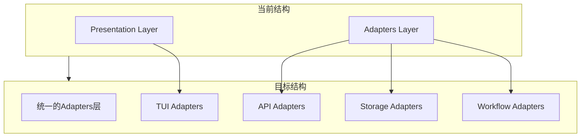

基于我对项目的深入分析，我现在提供一个完整的架构评估和建议。

## 架构分析总结

### 1. 当前架构状态
- **Presentation层** ([`src/presentation/`](src/presentation/)): 主要负责TUI界面渲染、用户交互处理、状态管理
- **Adapters层** ([`src/adapters/`](src/adapters/)): 主要负责外部系统集成、存储后端实现、工作流适配
- **依赖关系**: Presentation层单向依赖Adapters层，没有循环依赖

### 2. 新架构设计理念
根据项目文档，新的扁平化架构设计为：
```
Core (核心功能) + Services (业务服务) + Adapters (接口适配)
```

### 3. 关键发现
- Presentation层专注于UI呈现，职责清晰
- Adapters层专注于技术适配，职责明确  
- 两者之间没有功能重叠或混合
- 新架构设计明确将Presentation层归入Adapters层

## 架构建议

**不应该保留独立的Presentation层**，应该将其合并到Adapters层中。以下是详细的理由和重构计划：

### 重构建议



### 具体重构步骤

1. **目录结构调整**
   - 将 [`src/presentation/tui/`](src/presentation/tui/) 移动到 [`src/adapters/tui/`](src/adapters/tui/)
   - 将 [`src/presentation/api/`](src/presentation/api/) 移动到 [`src/adapters/api/`](src/adapters/api/)
   - 将 [`src/presentation/cli/`](src/presentation/cli/) 移动到 [`src/adapters/cli/`](src/adapters/cli/)

2. **接口统一**
   - 创建统一的适配器接口 [`IUserInterfaceAdapter`](src/interfaces/adapters/ui.py)
   - 确保所有UI适配器实现相同的接口契约

3. **依赖注入配置**
   - 更新依赖注入配置，将UI适配器注册为Adapters层服务
   - 确保服务生命周期管理一致

4. **配置系统更新**
   - 更新配置文件路径引用
   - 确保热重载功能正常工作

### 优势分析

1. **架构简化**: 从4层减少到3层，降低复杂度
2. **职责清晰**: Adapters层统一负责所有外部接口适配
3. **维护便利**: 相关功能集中管理，便于维护和扩展
4. **符合标准**: 遵循业界通用的分层架构最佳实践

### 风险评估

1. **文件移动**: 需要更新所有import语句和依赖引用
2. **配置更新**: 需要更新所有配置文件路径
3. **测试验证**: 需要全面测试确保功能正常

### 实施计划

1. **第一阶段**: 目录结构调整和文件移动
2. **第二阶段**: 接口统一和依赖注入更新  
3. **第三阶段**: 配置系统更新和测试验证
4. **第四阶段**: 文档更新和团队培训