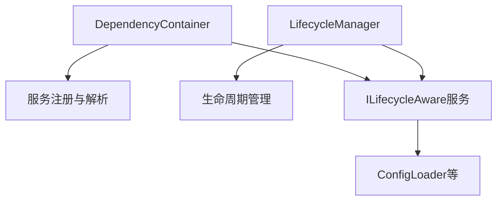

# 生命周期管理器 (LifecycleManager) 分析报告

## 1. 文件作用概述

[`src/services/container/lifecycle_manager.py`](src/services/container/lifecycle_manager.py:1) 是模块化代理框架中负责管理服务生命周期的核心组件。它实现了 [`ILifecycleManager`](src/interfaces/container/lifecycle.py:142) 接口，提供了完整的服务生命周期管理功能，包括服务的注册、初始化、启动、停止和释放。

## 2. 核心功能分析

### 2.1 服务生命周期管理

生命周期管理器支持以下生命周期阶段：
- **注册 (REGISTERED)**: 服务被注册到管理器
- **初始化 (INITIALIZED)**: 服务执行初始化逻辑
- **启动 (CREATED)**: 服务启动并准备处理请求
- **停止 (STOPPED)**: 服务停止运行
- **释放 (DISPOSED)**: 服务资源被释放

### 2.2 依赖关系管理

通过拓扑排序算法（Kahn算法）实现服务依赖关系的正确处理：
- [`_dependency_graph`](src/services/container/lifecycle_manager.py:81): 存储服务的依赖关系
- [`_reverse_dependency_graph`](src/services/container/lifecycle_manager.py:82): 存储反向依赖关系
- [`_get_topological_order()`](src/services/container/lifecycle_manager.py:452): 计算服务的正确初始化/释放顺序

### 2.3 事件系统

提供完整的事件通知机制：
- [`LifecycleEvent`](src/services/container/lifecycle_manager.py:25): 生命周期事件数据结构
- [`register_lifecycle_event_handler()`](src/services/container/lifecycle_manager.py:360): 注册事件处理器
- [`_trigger_event_handlers()`](src/services/container/lifecycle_manager.py:429): 触发事件处理器

### 2.4 状态监控与错误处理

- [`ServiceLifecycleInfo`](src/services/container/lifecycle_manager.py:34): 记录服务的详细生命周期信息
- [`get_service_status()`](src/services/container/lifecycle_manager.py:349): 获取服务状态
- [`get_error_summary()`](src/services/container/lifecycle_manager.py:416): 获取错误摘要
- [`record_error()`](src/services/container/lifecycle_manager.py:69): 记录服务错误

## 3. 实际使用情况分析

### 3.1 当前使用状态

通过代码分析发现，**生命周期管理器在项目中的实际使用非常有限**：

1. **接口定义完整但实现使用不足**：
   - [`ILifecycleManager`](src/interfaces/container/lifecycle.py:142) 接口定义完整
   - [`LifecycleManager`](src/services/container/lifecycle_manager.py:75) 实现功能齐全
   - 但项目中几乎没有直接使用这些功能的代码

2. **容器集成不完整**：
   - [`DependencyContainer`](src/services/container/container.py:185) 虽然导入了 [`ILifecycleAware`](src/interfaces/container/lifecycle.py:18)
   - 但在 [`get()`](src/services/container/container.py:264) 方法中只是简单调用了 [`initialize()`](src/services/container/container.py:309)
   - 没有与 [`LifecycleManager`](src/services/container/lifecycle_manager.py:75) 进行集成

3. **全局实例未被使用**：
   - [`get_global_lifecycle_manager()`](src/services/container/lifecycle_manager.py:560) 提供了单例访问
   - 但搜索结果显示项目中几乎没有调用此函数的代码

### 3.2 实际实现案例

项目中唯一实现 [`ILifecycleAware`](src/interfaces/container/lifecycle.py:18) 接口的服务是：
- [`ConfigLoader`](src/core/config/config_loader.py:19): 配置加载器，但实现非常简单，主要是空方法

### 3.3 其他生命周期管理器

项目中存在其他专门的生命周期管理器：
- [`SessionLifecycleManager`](src/services/sessions/lifecycle.py:29): 会话生命周期管理
- [`IStateLifecycleManager`](src/interfaces/state/lifecycle.py:12): 状态生命周期管理接口
- [`BaseStateLifecycleManager`](src/core/state/core/base.py:312): 基础状态生命周期管理器实现

## 4. 架构集成分析

### 4.1 与依赖注入容器的关系

当前架构中，[`DependencyContainer`](src/services/container/container.py:185) 和 [`LifecycleManager`](src/services/container/lifecycle_manager.py:75) 是两个独立的组件：

**问题**：两个组件没有有效集成，导致生命周期管理功能未被充分利用。

### 4.2 应用启动流程

在 [`src/adapters/api/main.py`](src/adapters/api/main.py:47) 的应用生命周期管理中：
- 使用 [`initialize_dependencies()`](src/adapters/api/dependencies.py:219) 初始化依赖项
- 但没有使用 [`LifecycleManager`](src/services/container/lifecycle_manager.py:75) 进行统一管理

## 5. 潜在问题与改进建议

### 5.1 当前问题

1. **功能冗余**：实现了完整的生命周期管理功能但未被使用
2. **架构不一致**：存在多个生命周期管理器，职责不清晰
3. **集成缺失**：与依赖注入容器没有有效集成
4. **文档不足**：缺乏使用示例和最佳实践指导

### 5.2 改进建议

1. **统一生命周期管理**：
   - 将 [`LifecycleManager`](src/services/container/lifecycle_manager.py:75) 集成到 [`DependencyContainer`](src/services/container/container.py:185) 中
   - 统一管理所有服务的生命周期

2. **完善服务实现**：
   - 为更多服务实现 [`ILifecycleAware`](src/interfaces/container/lifecycle.py:18) 接口
   - 特别是数据库连接、缓存、消息队列等资源密集型服务

3. **改进应用启动流程**：
   - 在应用启动时使用 [`LifecycleManager`](src/services/container/lifecycle_manager.py:75) 统一初始化服务
   - 在应用关闭时正确释放所有资源

4. **添加监控和诊断功能**：
   - 利用生命周期管理器的事件系统添加服务健康检查
   - 提供服务状态的可视化监控

## 6. 结论

[`LifecycleManager`](src/services/container/lifecycle_manager.py:75) 是一个设计良好、功能完整的生命周期管理组件，但在当前项目中的使用率极低。这主要是由于：

1. 与依赖注入容器的集成不完整
2. 缺乏明确的使用指导和最佳实践
3. 项目中实现了多个类似功能的组件，导致职责分散

为了充分发挥生命周期管理器的作用，建议进行架构重构，将其作为统一的服务生命周期管理核心，与依赖注入容器深度集成，并为关键服务实现完整的生命周期管理功能。