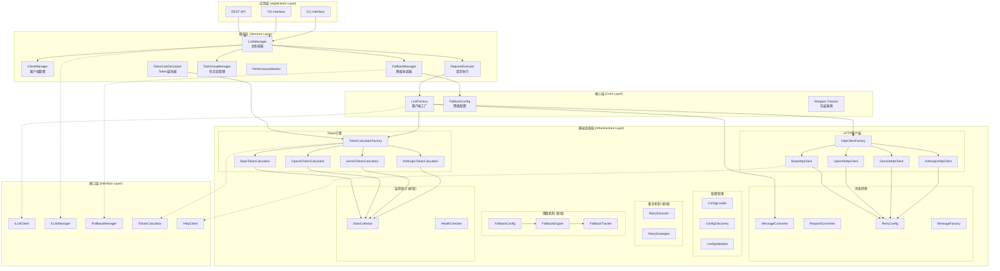
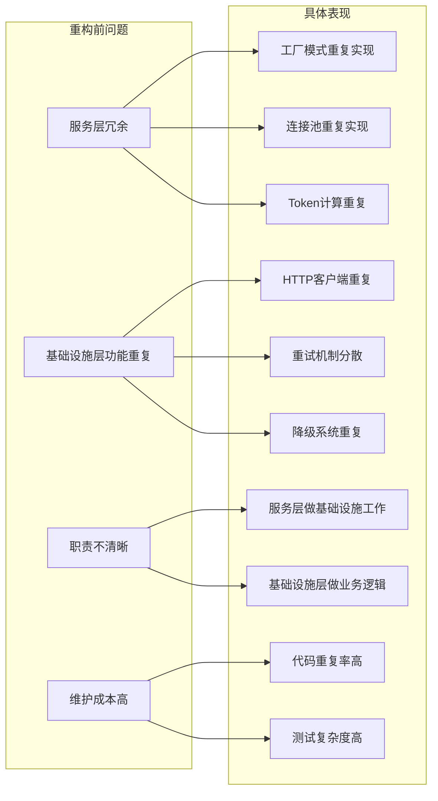
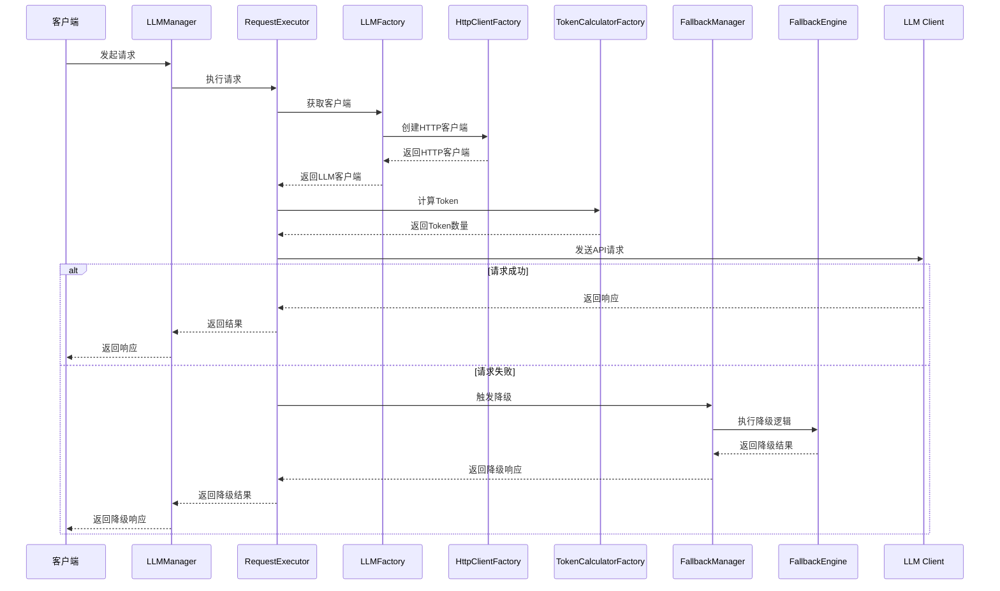
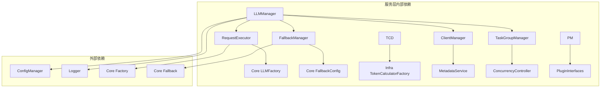
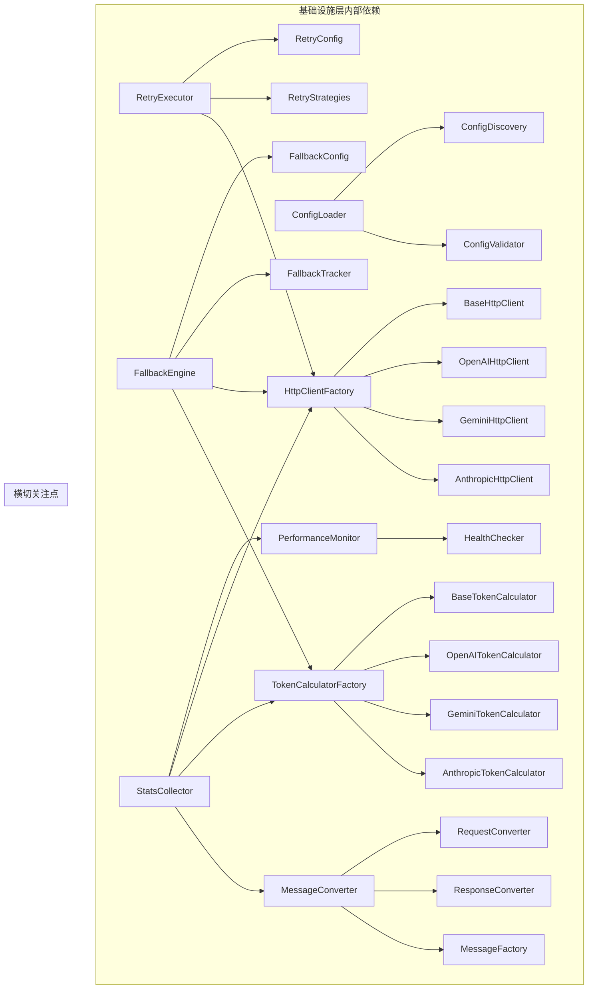
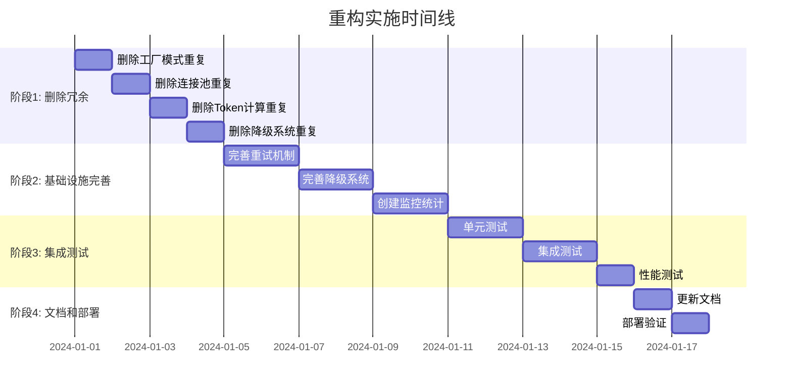
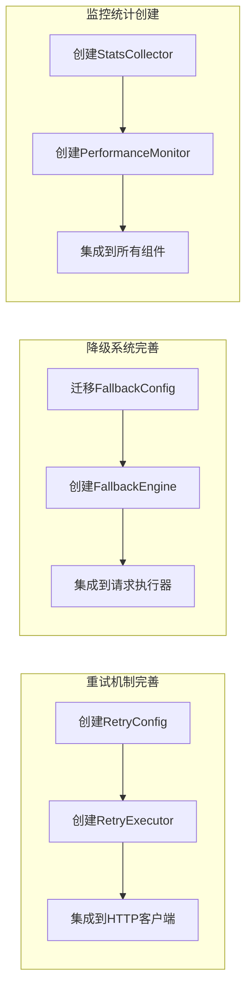
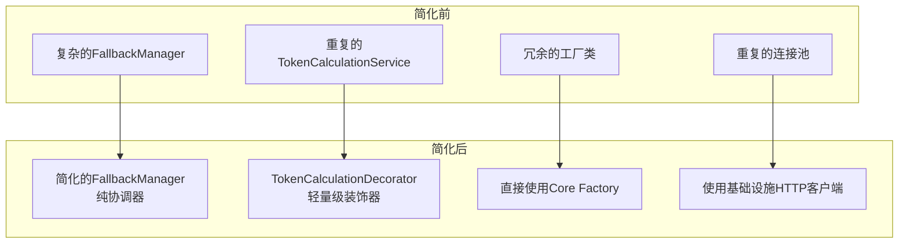
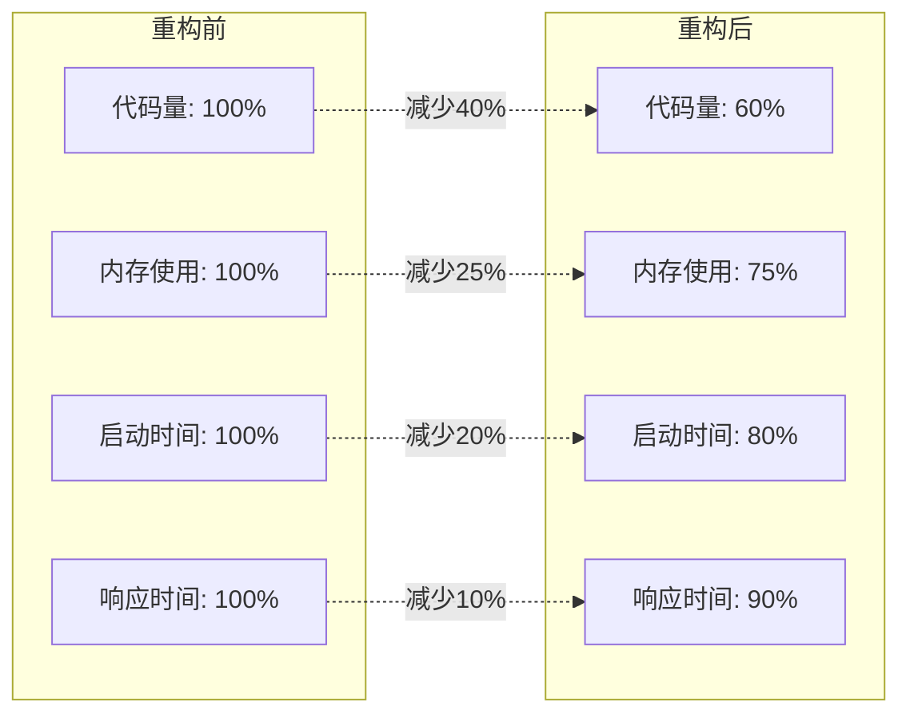
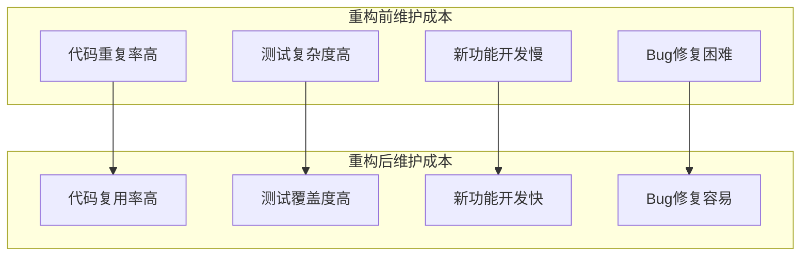

# 重构后架构图

## 整体架构概览

## 重构前后对比

### 重构前架构问题

## 数据流架构

## 组件依赖关系

### 服务层依赖图

### 基础设施层依赖图

## 重构实施路线图

### 阶段1: 删除冗余模块 (第1-2天)

### 阶段2: 基础设施层完善 (第3-7天)

### 阶段3: 服务层简化 (第8-10天)

## 性能优化预期

### 重构前后性能对比

### 维护成本对比

## 总结

重构后的架构具有以下核心优势：

1. **清晰的职责分离**: 每一层都有明确的职责边界
2. **高度的代码复用**: 基础设施层提供统一的技术组件
3. **简化的依赖关系**: 服务层只依赖基础设施层的稳定接口
4. **优秀的可扩展性**: 新功能可以基于基础设施层快速开发
5. **降低的维护成本**: 减少重复代码，提高开发效率

这次重构将为系统的长期发展奠定坚实的架构基础。