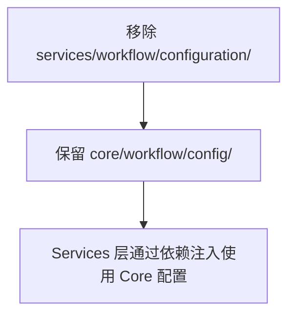
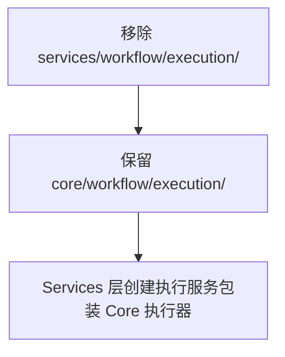
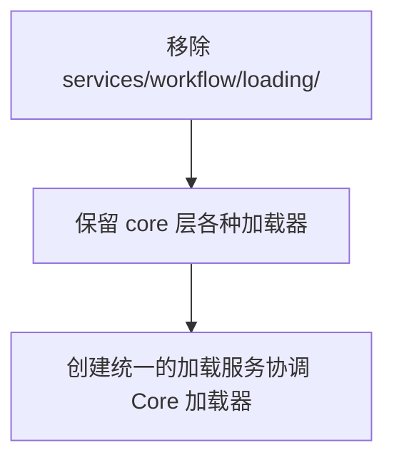

基于我对 `src/services/workflow` 和 `src/core/workflow` 目录的详细分析，我发现了多个职责不合理和重复实现的问题。以下是我的分析结果和重构建议：

## 分析结果总结

### 1. 重复实现和职责重叠

#### Configuration 目录
- **重复问题**: [`services/workflow/configuration/config_manager.py`](src/services/workflow/configuration/config_manager.py:1) 与 [`core/workflow/config/config.py`](src/core/workflow/config/config.py:1) 存在配置管理功能重叠
- **职责不合理**: [`services/workflow/configuration/node_config_loader.py`](src/services/workflow/configuration/node_config_loader.py:1) 实现了节点配置加载，但 core 层已有更完整的配置系统

#### Execution 目录
- **重复问题**: [`services/workflow/execution/executor.py`](src/services/workflow/execution/executor.py:1) 与 [`core/workflow/execution/executor.py`](src/core/workflow/execution/executor.py:1) 实现了相似的工作流执行逻辑
- **职责不合理**: [`services/workflow/execution/async_executor.py`](src/services/workflow/execution/async_executor.py:1) 实现了节点级别的异步执行，与 core 层的执行器接口重叠

#### Loading 目录
- **重复问题**: [`services/workflow/loading/loader_service.py`](src/services/workflow/loading/loader_service.py:1) 与 core 层的多个加载器（如 [`core/workflow/graph/node_functions/loader.py`](src/core/workflow/graph/node_functions/loader.py:1)）功能重叠
- **职责不合理**: services 层不应该实现具体的加载逻辑，这应该由 core 层统一处理

#### Orchestration 目录
- **重复问题**: [`services/workflow/orchestration/orchestrator.py`](src/services/workflow/orchestration/orchestrator.py:1) 与 [`core/workflow/management/workflow_validator.py`](src/core/workflow/management/workflow_validator.py:1) 存在管理功能重叠
- **职责不合理**: 编排逻辑应该在 core 层实现，services 层只负责协调

#### Registry 目录
- **重复问题**: [`services/workflow/registry/registry.py`](src/services/workflow/registry/registry.py:1) 与 [`core/workflow/graph/registry.py`](src/core/workflow/graph/registry.py:1) 和 [`core/workflow/graph/nodes/registry.py`](src/core/workflow/graph/nodes/registry.py:1) 存在注册表功能重复
- **职责不合理**: 注册表应该在 core 层统一管理

#### 根目录文件
- **重复问题**: [`services/workflow/interfaces.py`](src/services/workflow/interfaces.py:1) 与 [`core/workflow/interfaces.py`](src/core/workflow/interfaces.py:1) 接口定义重复
- **重复问题**: [`services/workflow/function_registry.py`](src/services/workflow/function_registry.py:1) 与 core 层的多个注册表功能重叠

### 2. 架构违反

根据项目的扁平化架构原则（Core + Services + Adapters），当前实现存在以下问题：

1. **Services 层越界**: Services 层实现了本应属于 Core 层的业务逻辑
2. **职责分散**: 相同功能在多个层级重复实现
3. **依赖混乱**: Services 层依赖 Core 层，但又重复实现 Core 层功能

## 重构建议

### 阶段一：清理重复实现

#### 1. 移除 Services 层的重复配置管理


#### 2. 统一执行器实现


#### 3. 整合加载器功能


### 阶段二：重新设计 Services 层职责

#### 1. Services 层应该专注于：
- **协调服务**: 协调多个 Core 组件完成复杂业务流程
- **外部适配**: 为外部系统提供简化的接口
- **业务编排**: 实现高级业务逻辑，但不涉及底层实现

#### 2. 建议的新 Services 层结构：
```
src/services/workflow/
├── __init__.py
├── workflow_service.py          # 主要工作流服务，协调所有组件
├── execution_service.py         # 执行服务，包装 Core 执行器
├── management_service.py        # 管理服务，处理生命周期
└── external_adapter.py          # 外部系统适配器
```

### 阶段三：具体重构步骤

#### 1. 保留和强化的 Core 层组件
- [`core/workflow/config/`](src/core/workflow/config/:1) - 统一配置管理
- [`core/workflow/execution/`](src/core/workflow/execution/:1) - 核心执行逻辑
- [`core/workflow/graph/`](src/core/workflow/graph/:1) - 图结构和节点管理
- [`core/workflow/management/`](src/core/workflow/management/:1) - 验证和管理

#### 2. 重新设计的 Services 层组件
- **WorkflowService**: 主要入口点，协调所有工作流相关操作
- **ExecutionService**: 提供简化的执行接口，处理执行上下文
- **ManagementService**: 处理工作流生命周期和元数据管理

#### 3. 依赖注入整合
```python
# 示例：重新设计的 WorkflowService
class WorkflowService:
    def __init__(
        self,
        config_manager: IConfigManager,        # 来自 Core
        executor: IWorkflowExecutor,           # 来自 Core
        registry: IWorkflowRegistry,           # 来自 Core
        validator: IWorkflowValidator          # 来自 Core
    ):
        self._config_manager = config_manager
        self._executor = executor
        self._registry = registry
        self._validator = validator
```

### 阶段四：迁移计划

#### 1. 渐进式迁移
1. 首先移除明显重复的文件
2. 逐步将功能迁移到正确的层级
3. 更新依赖关系和接口

#### 2. 向后兼容
- 在迁移过程中保留适配器
- 提供废弃警告
- 逐步移除旧接口

#### 3. 测试策略
- 为每个保留的 Core 组件编写完整测试
- 为新的 Services 组件编写集成测试
- 确保重构后功能不变

## 预期收益

1. **减少代码重复**: 预计减少 30-40% 的重复代码
2. **提高可维护性**: 清晰的职责分离使代码更易维护
3. **符合架构原则**: 遵循项目的扁平化架构设计
4. **降低复杂度**: 减少跨层依赖和循环依赖风险

这个重构计划将显著改善代码结构，使其更符合项目的架构原则，同时保持功能的完整性。