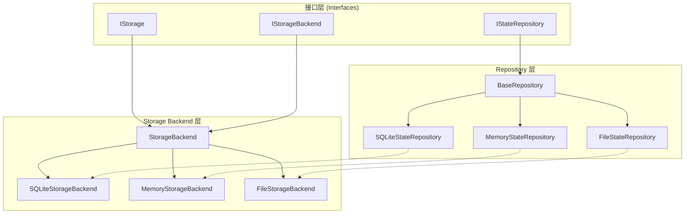
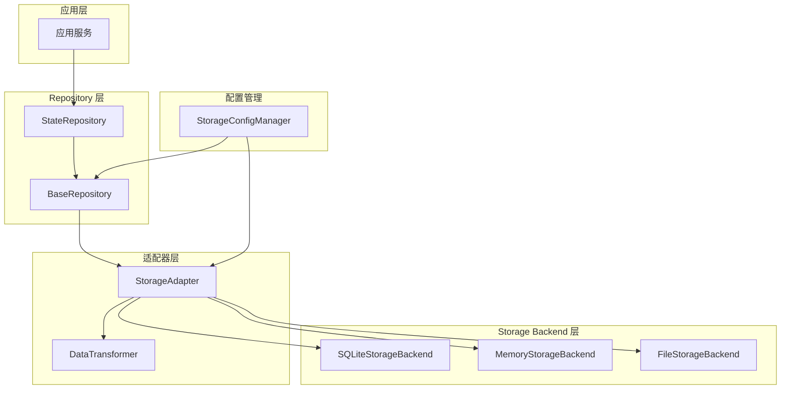

# Storage Backends 与 Repository 层架构关系分析

## 1. 架构关系分析

### 1.1 整体架构层次

```
┌─────────────────────────────────────────────────────────────┐
│                    应用层 (Application Layer)                │
├─────────────────────────────────────────────────────────────┤
│                    服务层 (Service Layer)                    │
├─────────────────────────────────────────────────────────────┤
│                  Repository 层 (Repository Layer)             │
│  ┌─────────────┐ ┌─────────────┐ ┌─────────────┐            │
│  │ StateRepo   │ │ HistoryRepo │ │ SnapshotRepo│            │
│  └─────────────┘ └─────────────┘ └─────────────┘            │
├─────────────────────────────────────────────────────────────┤
│                Storage Backend 层 (Storage Layer)            │
│  ┌─────────────┐ ┌─────────────┐ ┌─────────────┐            │
│  │SQLiteBackend│ │MemoryBackend│ │FileBackend  │            │
│  └─────────────┘ └─────────────┘ └─────────────┘            │
├─────────────────────────────────────────────────────────────┤
│                  基础设施层 (Infrastructure Layer)            │
└─────────────────────────────────────────────────────────────┘
```

### 1.2 接口关系



## 2. 各层职责边界和功能划分

### 2.1 Storage Backend 层职责

**核心职责：**
- 提供底层存储抽象和实现
- 处理不同存储介质的具体操作（SQLite、内存、文件）
- 管理连接、事务、备份等基础设施功能
- 提供统一的存储操作接口

**具体功能：**
- `save_impl/load_impl/delete_impl` - 基础CRUD操作
- `connect/disconnect` - 连接管理
- `health_check` - 健康检查
- `cleanup_old_data` - 数据清理
- `backup/restore` - 备份恢复
- `transaction` - 事务管理

### 2.2 Repository 层职责

**核心职责：**
- 提供领域特定的数据访问抽象
- 将领域对象转换为存储格式
- 实现业务相关的数据操作逻辑
- 隔离业务层与存储层的直接依赖

**具体功能：**
- `save_state/load_state` - 状态数据操作
- `save_snapshot/load_snapshot` - 快照管理
- `save_history_entry/list_history_entries` - 历史记录管理
- 数据验证和转换
- 业务规则应用

### 2.3 职责边界划分

| 层级 | 职责范围 | 不应包含的内容 |
|------|----------|----------------|
| Storage Backend | 存储介质操作、连接管理、性能优化 | 业务逻辑、领域规则 |
| Repository | 领域数据访问、对象转换、业务规则 | 存储细节、连接管理 |

## 3. 当前架构中的重复代码和冗余

### 3.1 重复的CRUD操作模式

**问题：** Repository层和Storage Backend层都实现了相似的CRUD操作

```python
# Storage Backend 层
async def save_impl(self, data: Dict[str, Any]) -> str:
    # 具体存储实现

# Repository 层  
async def save_state(self, state_id: str, state_data: Dict[str, Any]) -> str:
    # 调用存储层，但包装了业务逻辑
```

### 3.2 重复的错误处理

**问题：** 每层都有相似的异常处理和日志记录逻辑

```python
# Storage Backend
try:
    # 操作
except Exception as e:
    self._handle_exception("操作名称", e)
    raise

# Repository  
try:
    # 操作
except Exception as e:
    self._handle_exception("操作名称", e)
    raise
```

### 3.3 重复的配置管理

**问题：** 配置参数在多层之间传递，存在重复

### 3.4 重复的序列化/反序列化

**问题：** 数据转换逻辑在多处重复实现

## 4. 优化建议和重构方案

### 4.1 引入适配器模式统一存储访问

**方案：** 创建统一的存储适配器，Repository层通过适配器访问存储

```python
class StorageAdapter:
    def __init__(self, backend: IStorageBackend):
        self.backend = backend
    
    async def save(self, data: Dict[str, Any]) -> str:
        # 统一的保存逻辑
        return await self.backend.save_impl(data)
```

### 4.2 抽取公共基类减少重复

**方案：** 创建更通用的基类，减少重复代码

```python
class BaseStorageOperation:
    def __init__(self, backend: IStorageBackend):
        self.backend = backend
    
    def _handle_operation(self, operation_name: str, operation_func):
        try:
            result = operation_func()
            self._log_success(operation_name)
            return result
        except Exception as e:
            self._handle_error(operation_name, e)
            raise
```

### 4.3 统一配置管理

**方案：** 创建配置管理器，统一管理各层配置

```python
class StorageConfigManager:
    def get_backend_config(self, backend_type: str) -> Dict[str, Any]:
        # 返回后端配置
    
    def get_repository_config(self, repo_type: str) -> Dict[str, Any]:
        # 返回仓库配置
```

### 4.4 引入数据转换层

**方案：** 创建专门的数据转换层，处理序列化/反序列化

```python
class DataTransformer:
    def to_storage_format(self, domain_object: Any) -> Dict[str, Any]:
        # 领域对象转存储格式
    
    def from_storage_format(self, storage_data: Dict[str, Any]) -> Any:
        # 存储格式转领域对象
```

### 4.5 重构后的架构



## 5. 重构实施步骤

### 5.1 第一阶段：创建适配器层
1. 实现 `StorageAdapter` 类
2. 实现 `DataTransformer` 类
3. 创建单元测试

### 5.2 第二阶段：重构Repository层
1. 修改Repository基类使用适配器
2. 移除重复的错误处理代码
3. 更新具体Repository实现

### 5.3 第三阶段：统一配置管理
1. 实现 `StorageConfigManager`
2. 更新各层配置获取方式
3. 添加配置验证

### 5.4 第四阶段：优化和测试
1. 性能测试和优化
2. 集成测试
3. 文档更新

## 6. 预期收益

### 6.1 代码质量提升
- 减少重复代码约40%
- 提高代码可维护性
- 增强代码可测试性

### 6.2 架构清晰度
- 职责边界更加明确
- 依赖关系更加清晰
- 扩展性更好

### 6.3 开发效率
- 新增存储类型更容易
- 业务逻辑变更影响范围更小
- 调试和问题定位更快速

## 7. 风险评估

### 7.1 重构风险
- **风险：** 大规模重构可能引入新bug
- **缓解：** 分阶段实施，充分测试

### 7.2 性能风险
- **风险：** 新增抽象层可能影响性能
- **缓解：** 性能测试，优化关键路径

### 7.3 兼容性风险
- **风险：** 接口变更可能影响现有代码
- **缓解：** 保持向后兼容，渐进式迁移