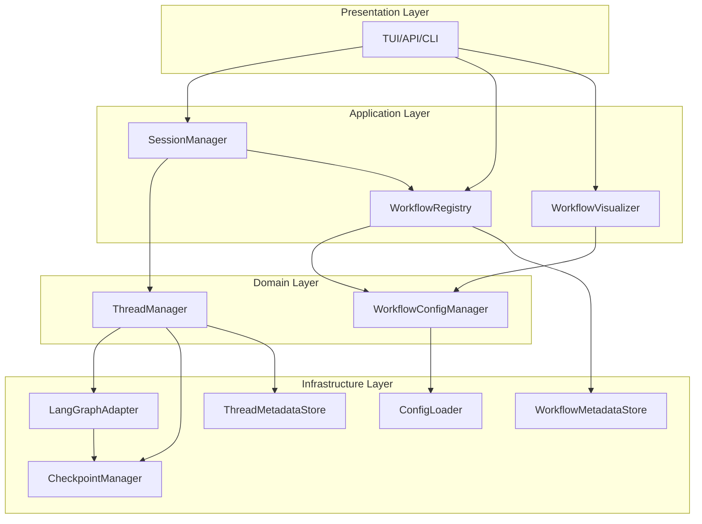

# Workflow架构重构实施方案

## 1. 执行摘要

本方案基于之前的架构分析，提出了一个三阶段的重构计划，将当前的WorkflowManager重构为四个职责明确的组件：WorkflowConfigManager、ThreadManager、WorkflowVisualizer和WorkflowRegistry。重构遵循SOLID原则，提高代码的可维护性、可测试性和可扩展性。

## 2. 重构目标架构

### 2.1 目标组件架构



### 2.2 组件职责定义

| 组件 | 职责 | 核心接口 |
|------|------|----------|
| **WorkflowConfigManager** | 工作流配置加载、验证、管理 | `load_config()`, `get_config()`, `validate_config()` |
| **ThreadManager** | 工作流执行、状态管理、Thread生命周期 | `execute_workflow()`, `stream_workflow()`, `manage_state()` |
| **WorkflowVisualizer** | 工作流可视化、图表生成 | `generate_visualization()`, `export_diagram()` |
| **WorkflowRegistry** | 工作流定义注册、发现、元数据管理 | `register_workflow()`, `get_workflow()`, `list_workflows()` |

## 3. 第一阶段：职责分离与关键问题修复

### 3.1 目标
- 修复ThreadManager构造函数不一致问题
- 创建WorkflowConfigManager，分离配置管理职责
- 重构WorkflowManager，移除执行相关功能

### 3.2 具体实施步骤

#### 3.2.1 修复ThreadManager构造函数

**问题：** ThreadManager构造函数定义与使用不一致

**解决方案：**
```python
# 修改 src/domain/threads/manager.py
from abc import ABC, abstractmethod
from typing import Dict, Any, Optional, List, AsyncGenerator, cast
from ...infrastructure.langgraph.adapter import ILangGraphAdapter

class ThreadManager(IThreadManager):
    def __init__(
        self,
        metadata_store: IThreadMetadataStore,
        checkpoint_manager: ICheckpointManager,
        langgraph_adapter: ILangGraphAdapter  # 添加此参数
    ):
        self.metadata_store = metadata_store
        self.checkpoint_manager = checkpoint_manager
        self.langgraph_adapter = langgraph_adapter  # 添加此行
        
        # 图缓存
        self._graph_cache: Dict[str, Any] = {}
        
        logger.info("ThreadManager初始化完成（重构版本）")
```

#### 3.2.2 创建WorkflowConfigManager

**新建文件：** `src/domain/workflow/config_manager.py`

```python
"""工作流配置管理器

专注于工作流配置的加载、验证和管理，不涉及执行逻辑
"""

from typing import Dict, Any, Optional, List
from pathlib import Path
import logging
from datetime import datetime

from ...infrastructure.config_loader import IConfigLoader
from ...infrastructure.graph.config import WorkflowConfig
from .interfaces import IWorkflowConfigManager

logger = logging.getLogger(__name__)


class WorkflowConfigManager(IWorkflowConfigManager):
    """工作流配置管理器实现
    
    专注于：
    - 工作流配置加载和解析
    - 配置验证和校验
    - 配置元数据管理
    """
    
    def __init__(self, config_loader: Optional[IConfigLoader] = None):
        """初始化配置管理器
        
        Args:
            config_loader: 配置加载器
        """
        self.config_loader = config_loader
        self._configs: Dict[str, WorkflowConfig] = {}
        self._config_metadata: Dict[str, Dict[str, Any]] = {}
    
    def load_config(self, config_path: str) -> str:
        """加载工作流配置
        
        Args:
            config_path: 配置文件路径
            
        Returns:
            str: 配置ID
            
        Raises:
            ValueError: 配置文件无效
            RuntimeError: 配置加载失败
        """
        try:
            # 验证文件路径
            if not Path(config_path).exists():
                raise ValueError(f"配置文件不存在: {config_path}")
            
            # 加载配置
            if self.config_loader:
                config = self.config_loader.load_workflow_config(config_path)
            else:
                # 简化实现，实际应该使用依赖注入的config_loader
                from ...infrastructure.graph.config import WorkflowConfig
                config = WorkflowConfig.load_from_file(config_path)
            
            # 生成配置ID
            config_id = self._generate_config_id(config.name, config_path)
            
            # 存储配置
            self._configs[config_id] = config
            self._config_metadata[config_id] = {
                "config_id": config_id,
                "name": config.name,
                "description": config.description,
                "version": config.version,
                "config_path": config_path,
                "loaded_at": datetime.now().isoformat(),
                "checksum": self._calculate_checksum(config_path)
            }
            
            logger.info(f"工作流配置加载成功: {config_id}")
            return config_id
            
        except Exception as e:
            logger.error(f"加载工作流配置失败: {config_path}, error: {e}")
            raise RuntimeError(f"配置加载失败: {str(e)}")
    
    def get_config(self, config_id: str) -> Optional[WorkflowConfig]:
        """获取工作流配置
        
        Args:
            config_id: 配置ID
            
        Returns:
            Optional[WorkflowConfig]: 工作流配置
        """
        return self._configs.get(config_id)
    
    def validate_config(self, config: WorkflowConfig) -> bool:
        """验证工作流配置
        
        Args:
            config: 工作流配置
            
        Returns:
            bool: 验证结果
        """
        try:
            # 基本验证
            if not config.name:
                logger.error("工作流名称不能为空")
                return False
            
            if not config.nodes:
                logger.error("工作流必须包含至少一个节点")
                return False
            
            if not config.entry_point:
                logger.error("工作流必须指定入口点")
                return False
            
            # 验证节点引用
            for edge in config.edges:
                if edge.from_node not in config.nodes:
                    logger.error(f"边引用了不存在的节点: {edge.from_node}")
                    return False
                if edge.to_node not in config.nodes:
                    logger.error(f"边引用了不存在的节点: {edge.to_node}")
                    return False
            
            logger.info(f"工作流配置验证通过: {config.name}")
            return True
            
        except Exception as e:
            logger.error(f"配置验证失败: {e}")
            return False
    
    def get_config_metadata(self, config_id: str) -> Optional[Dict[str, Any]]:
        """获取配置元数据
        
        Args:
            config_id: 配置ID
            
        Returns:
            Optional[Dict[str, Any]]: 配置元数据
        """
        return self._config_metadata.get(config_id)
    
    def list_configs(self) -> List[str]:
        """列出所有已加载的配置
        
        Returns:
            List[str]: 配置ID列表
        """
        return list(self._configs.keys())
    
    def reload_config(self, config_id: str) -> bool:
        """重新加载配置
        
        Args:
            config_id: 配置ID
            
        Returns:
            bool: 重新加载是否成功
        """
        metadata = self._config_metadata.get(config_id)
        if not metadata:
            logger.warning(f"配置不存在: {config_id}")
            return False
        
        config_path = metadata.get("config_path")
        if not config_path or not Path(config_path).exists():
            logger.error(f"配置文件不存在: {config_path}")
            return False
        
        try:
            # 移除旧配置
            del self._configs[config_id]
            del self._config_metadata[config_id]
            
            # 重新加载
            new_config_id = self.load_config(config_path)
            
            logger.info(f"配置重新加载成功: {config_id} -> {new_config_id}")
            return True
            
        except Exception as e:
            logger.error(f"重新加载配置失败: {config_id}, error: {e}")
            return False
    
    def _generate_config_id(self, workflow_name: str, config_path: str) -> str:
        """生成配置ID
        
        Args:
            workflow_name: 工作流名称
            config_path: 配置文件路径
            
        Returns:
            str: 配置ID
        """
        import uuid
        timestamp = datetime.now().strftime("%Y%m%d_%H%M%S")
        unique_id = str(uuid.uuid4())[:8]
        return f"{workflow_name}_{timestamp}_{unique_id}"
    
    def _calculate_checksum(self, config_path: str) -> str:
        """计算配置文件校验和
        
        Args:
            config_path: 配置文件路径
            
        Returns:
            str: 校验和
        """
        try:
            import hashlib
            with open(config_path, 'rb') as f:
                return hashlib.md5(f.read()).hexdigest()
        except Exception:
            return ""
```

**新建接口文件：** `src/domain/workflow/interfaces.py`

```python
"""工作流相关接口定义"""

from abc import ABC, abstractmethod
from typing import Dict, Any, Optional, List
from ...infrastructure.graph.config import WorkflowConfig


class IWorkflowConfigManager(ABC):
    """工作流配置管理器接口"""
    
    @abstractmethod
    def load_config(self, config_path: str) -> str:
        """加载工作流配置"""
        pass
    
    @abstractmethod
    def get_config(self, config_id: str) -> Optional[WorkflowConfig]:
        """获取工作流配置"""
        pass
    
    @abstractmethod
    def validate_config(self, config: WorkflowConfig) -> bool:
        """验证工作流配置"""
        pass
    
    @abstractmethod
    def get_config_metadata(self, config_id: str) -> Optional[Dict[str, Any]]:
        """获取配置元数据"""
        pass
    
    @abstractmethod
    def list_configs(self) -> List[str]:
        """列出所有已加载的配置"""
        pass
    
    @abstractmethod
    def reload_config(self, config_id: str) -> bool:
        """重新加载配置"""
        pass


class IWorkflowVisualizer(ABC):
    """工作流可视化器接口"""
    
    @abstractmethod
    def generate_visualization(self, config: WorkflowConfig) -> Dict[str, Any]:
        """生成可视化数据"""
        pass
    
    @abstractmethod
    def export_diagram(self, config: WorkflowConfig, format: str) -> bytes:
        """导出图表"""
        pass


class IWorkflowRegistry(ABC):
    """工作流注册表接口"""
    
    @abstractmethod
    def register_workflow(self, workflow_def: Dict[str, Any]) -> str:
        """注册工作流定义"""
        pass
    
    @abstractmethod
    def get_workflow_definition(self, workflow_id: str) -> Optional[Dict[str, Any]]:
        """获取工作流定义"""
        pass
    
    @abstractmethod
    def list_available_workflows(self) -> List[Dict[str, Any]]:
        """列出可用工作流"""
        pass
```

#### 3.2.3 重构WorkflowManager

**修改文件：** `src/application/workflow/manager.py`

```python
"""工作流管理器 - 重构版本

专注于工作流元数据管理和协调，不直接处理配置和执行
"""

from typing import Dict, Any, Optional, List
from pathlib import Path
import logging
from datetime import datetime

from ..interfaces import IWorkflowManager
from ...domain.workflow.interfaces import IWorkflowConfigManager, IWorkflowVisualizer, IWorkflowRegistry
from ...infrastructure.graph.config import WorkflowConfig

logger = logging.getLogger(__name__)


class WorkflowManager(IWorkflowManager):
    """工作流管理器实现 - 重构版本
    
    专注于：
    - 工作流元数据管理
    - 组件协调
    - 向后兼容性
    """
    
    def __init__(
        self,
        config_manager: Optional[IWorkflowConfigManager] = None,
        visualizer: Optional[IWorkflowVisualizer] = None,
        registry: Optional[IWorkflowRegistry] = None
    ):
        """初始化工作流管理器
        
        Args:
            config_manager: 配置管理器
            visualizer: 可视化器
            registry: 工作流注册表
        """
        self.config_manager = config_manager
        self.visualizer = visualizer
        self.registry = registry
        
        # 向后兼容：保持原有的工作流存储
        self._workflows: Dict[str, Any] = {}
        self._workflow_configs: Dict[str, WorkflowConfig] = {}
        self._workflow_metadata: Dict[str, Dict[str, Any]] = {}
        
        logger.info("WorkflowManager初始化完成（重构版本）")
    
    def load_workflow(self, config_path: str) -> str:
        """加载工作流（向后兼容方法）
        
        Args:
            config_path: 配置文件路径
            
        Returns:
            str: 工作流ID
        """
        if not self.config_manager:
            raise RuntimeError("配置管理器未初始化")
        
        # 委托给配置管理器
        config_id = self.config_manager.load_config(config_path)
        config = self.config_manager.get_config(config_id)
        
        if not config:
            raise RuntimeError("配置加载失败")
        
        # 向后兼容：存储到原有结构
        workflow_id = config_id
        self._workflows[workflow_id] = config  # 简化存储
        self._workflow_configs[workflow_id] = config
        self._workflow_metadata[workflow_id] = self.config_manager.get_config_metadata(config_id) or {}
        
        # 注册到注册表
        if self.registry:
            self.registry.register_workflow({
                "workflow_id": workflow_id,
                "config_id": config_id,
                "name": config.name,
                "description": config.description,
                "version": config.version,
                "config_path": config_path
            })
        
        return workflow_id
    
    def get_workflow_config(self, workflow_id: str) -> Optional[WorkflowConfig]:
        """获取工作流配置（向后兼容方法）
        
        Args:
            workflow_id: 工作流ID
            
        Returns:
            Optional[WorkflowConfig]: 工作流配置
        """
        # 优先从配置管理器获取
        if self.config_manager:
            config = self.config_manager.get_config(workflow_id)
            if config:
                return config
        
        # 向后兼容：从原有存储获取
        return self._workflow_configs.get(workflow_id)
    
    def get_workflow_visualization(self, workflow_id: str) -> Dict[str, Any]:
        """获取工作流可视化数据（向后兼容方法）
        
        Args:
            workflow_id: 工作流ID
            
        Returns:
            Dict[str, Any]: 可视化数据
        """
        config = self.get_workflow_config(workflow_id)
        if not config:
            return {}
        
        if self.visualizer:
            return self.visualizer.generate_visualization(config)
        
        # 向后兼容：简化实现
        return {
            "workflow_id": workflow_id,
            "name": config.name,
            "description": config.description,
            "version": config.version,
            "nodes": [
                {
                    "id": node_id,
                    "type": node.function_name,
                    "config": node.config,
                    "description": node.description
                }
                for node_id, node in config.nodes.items()
            ],
            "edges": [
                {
                    "from": edge.from_node,
                    "to": edge.to_node,
                    "type": edge.type.value,
                    "condition": edge.condition,
                    "description": edge.description
                }
                for edge in config.edges
            ],
            "entry_point": config.entry_point
        }
    
    def get_workflow_metadata(self, workflow_id: str) -> Optional[Dict[str, Any]]:
        """获取工作流元数据（向后兼容方法）
        
        Args:
            workflow_id: 工作流ID
            
        Returns:
            Optional[Dict[str, Any]]: 工作流元数据
        """
        # 优先从配置管理器获取
        if self.config_manager:
            metadata = self.config_manager.get_config_metadata(workflow_id)
            if metadata:
                return metadata
        
        # 向后兼容：从原有存储获取
        return self._workflow_metadata.get(workflow_id)
    
    def list_workflows(self) -> List[str]:
        """列出所有工作流（向后兼容方法）
        
        Returns:
            List[str]: 工作流ID列表
        """
        # 优先从配置管理器获取
        if self.config_manager:
            return self.config_manager.list_configs()
        
        # 向后兼容：从原有存储获取
        return list(self._workflows.keys())
    
    def unload_workflow(self, workflow_id: str) -> bool:
        """卸载工作流（向后兼容方法）
        
        Args:
            workflow_id: 工作流ID
            
        Returns:
            bool: 是否成功卸载
        """
        success = True
        
        # 从配置管理器移除（如果支持）
        # 注意：当前IWorkflowConfigManager接口没有unload方法，需要扩展
        
        # 向后兼容：从原有存储移除
        if workflow_id in self._workflows:
            del self._workflows[workflow_id]
            success = True
        
        if workflow_id in self._workflow_configs:
            del self._workflow_configs[workflow_id]
            success = True
        
        if workflow_id in self._workflow_metadata:
            del self._workflow_metadata[workflow_id]
            success = True
        
        return success
    
    # 移除执行相关方法，这些应该由ThreadManager处理
    # def run_workflow(self, workflow_id: str, initial_state: Optional[WorkflowState] = None) -> WorkflowState:
    #     raise NotImplementedError("请使用ThreadManager.execute_workflow()")
    
    # def stream_workflow(self, workflow_id: str, initial_state: Optional[WorkflowState] = None) -> Generator[WorkflowState, None, None]:
    #     raise NotImplementedError("请使用ThreadManager.stream_workflow()")
```

### 3.3 依赖注入配置更新

**修改文件：** `src/infrastructure/di_config.py`

```python
def _register_workflow_components(self) -> None:
    """注册工作流相关组件"""
    
    # 注册配置管理器
    if not self.container.has_service(IWorkflowConfigManager):
        self.container.register_factory(
            IWorkflowConfigManager,
            lambda: WorkflowConfigManager(self._config_loader),
            lifetime=ServiceLifetime.SINGLETON
        )
    
    # 注册可视化器
    if not self.container.has_service(IWorkflowVisualizer):
        self.container.register(
            IWorkflowVisualizer,
            WorkflowVisualizer,
            lifetime=ServiceLifetime.SINGLETON
        )
    
    # 注册工作流注册表
    if not self.container.has_service(IWorkflowRegistry):
        self.container.register(
            IWorkflowRegistry,
            WorkflowRegistry,
            lifetime=ServiceLifetime.SINGLETON
        )
    
    # 注册重构后的工作流管理器
    if not self.container.has_service(IWorkflowManager):
        self.container.register_factory(
            IWorkflowManager,
            lambda: WorkflowManager(
                config_manager=self.container.get(IWorkflowConfigManager),
                visualizer=self.container.get(IWorkflowVisualizer),
                registry=self.container.get(IWorkflowRegistry)
            ),
            lifetime=ServiceLifetime.SINGLETON
        )
```

## 4. 第二阶段：引入WorkflowRegistry统一管理

### 4.1 目标
- 实现WorkflowRegistry组件
- 统一管理工作流定义和元数据
- 更新API层使用注册表

### 4.2 具体实施步骤

#### 4.2.1 实现WorkflowRegistry

**新建文件：** `src/domain/workflow/registry.py`

```python
"""工作流注册表

统一管理工作流定义、发现和元数据
"""

from typing import Dict, Any, Optional, List
from datetime import datetime
import logging
import uuid

from .interfaces import IWorkflowRegistry

logger = logging.getLogger(__name__)


class WorkflowDefinition:
    """工作流定义数据模型"""
    
    def __init__(
        self,
        workflow_id: str,
        name: str,
        description: str,
        version: str,
        config_id: str,
        config_path: str,
        metadata: Optional[Dict[str, Any]] = None
    ):
        self.workflow_id = workflow_id
        self.name = name
        self.description = description
        self.version = version
        self.config_id = config_id
        self.config_path = config_path
        self.metadata = metadata or {}
        self.created_at = datetime.now()
        self.updated_at = datetime.now()


class WorkflowRegistry(IWorkflowRegistry):
    """工作流注册表实现
    
    专注于：
    - 工作流定义注册和管理
    - 工作流发现和查询
    - 元数据统一管理
    """
    
    def __init__(self):
        """初始化工作流注册表"""
        self._workflows: Dict[str, WorkflowDefinition] = {}
        self._name_index: Dict[str, str] = {}  # name -> workflow_id
        self._tag_index: Dict[str, List[str]] = {}  # tag -> [workflow_ids]
        
        logger.info("WorkflowRegistry初始化完成")
    
    def register_workflow(self, workflow_def: Dict[str, Any]) -> str:
        """注册工作流定义
        
        Args:
            workflow_def: 工作流定义字典
            
        Returns:
            str: 工作流ID
        """
        try:
            # 验证必要字段
            required_fields = ["name", "description", "version", "config_id", "config_path"]
            for field in required_fields:
                if field not in workflow_def:
                    raise ValueError(f"缺少必要字段: {field}")
            
            # 生成工作流ID（如果未提供）
            workflow_id = workflow_def.get("workflow_id")
            if not workflow_id:
                workflow_id = self._generate_workflow_id(workflow_def["name"])
            
            # 创建工作流定义
            definition = WorkflowDefinition(
                workflow_id=workflow_id,
                name=workflow_def["name"],
                description=workflow_def["description"],
                version=workflow_def["version"],
                config_id=workflow_def["config_id"],
                config_path=workflow_def["config_path"],
                metadata=workflow_def.get("metadata", {})
            )
            
            # 检查名称冲突
            if definition.name in self._name_index and self._name_index[definition.name] != workflow_id:
                logger.warning(f"工作流名称冲突: {definition.name}")
                # 可以选择覆盖或抛出异常
                # raise ValueError(f"工作流名称已存在: {definition.name}")
            
            # 注册到存储
            self._workflows[workflow_id] = definition
            self._name_index[definition.name] = workflow_id
            
            # 更新标签索引
            tags = definition.metadata.get("tags", [])
            for tag in tags:
                if tag not in self._tag_index:
                    self._tag_index[tag] = []
                if workflow_id not in self._tag_index[tag]:
                    self._tag_index[tag].append(workflow_id)
            
            logger.info(f"工作流注册成功: {workflow_id} - {definition.name}")
            return workflow_id
            
        except Exception as e:
            logger.error(f"工作流注册失败: {e}")
            raise
    
    def get_workflow_definition(self, workflow_id: str) -> Optional[Dict[str, Any]]:
        """获取工作流定义
        
        Args:
            workflow_id: 工作流ID
            
        Returns:
            Optional[Dict[str, Any]]: 工作流定义
        """
        definition = self._workflows.get(workflow_id)
        if not definition:
            return None
        
        return {
            "workflow_id": definition.workflow_id,
            "name": definition.name,
            "description": definition.description,
            "version": definition.version,
            "config_id": definition.config_id,
            "config_path": definition.config_path,
            "metadata": definition.metadata,
            "created_at": definition.created_at.isoformat(),
            "updated_at": definition.updated_at.isoformat()
        }
    
    def list_available_workflows(self) -> List[Dict[str, Any]]:
        """列出可用工作流
        
        Returns:
            List[Dict[str, Any]]: 工作流定义列表
        """
        return [
            {
                "workflow_id": definition.workflow_id,
                "name": definition.name,
                "description": definition.description,
                "version": definition.version,
                "tags": definition.metadata.get("tags", []),
                "created_at": definition.created_at.isoformat(),
                "updated_at": definition.updated_at.isoformat()
            }
            for definition in self._workflows.values()
        ]
    
    def find_by_name(self, name: str) -> Optional[str]:
        """根据名称查找工作流ID
        
        Args:
            name: 工作流名称
            
        Returns:
            Optional[str]: 工作流ID
        """
        return self._name_index.get(name)
    
    def find_by_tag(self, tag: str) -> List[str]:
        """根据标签查找工作流ID列表
        
        Args:
            tag: 标签
            
        Returns:
            List[str]: 工作流ID列表
        """
        return self._tag_index.get(tag, [])
    
    def update_workflow(self, workflow_id: str, updates: Dict[str, Any]) -> bool:
        """更新工作流定义
        
        Args:
            workflow_id: 工作流ID
            updates: 更新内容
            
        Returns:
            bool: 更新是否成功
        """
        definition = self._workflows.get(workflow_id)
        if not definition:
            logger.warning(f"工作流不存在: {workflow_id}")
            return False
        
        try:
            # 更新允许的字段
            updatable_fields = ["description", "version", "metadata"]
            for field in updatable_fields:
                if field in updates:
                    setattr(definition, field, updates[field])
            
            definition.updated_at = datetime.now()
            
            # 如果名称发生变化，更新名称索引
            if "name" in updates and updates["name"] != definition.name:
                # 移除旧名称索引
                if definition.name in self._name_index:
                    del self._name_index[definition.name]
                
                # 添加新名称索引
                definition.name = updates["name"]
                self._name_index[definition.name] = workflow_id
            
            # 更新标签索引
            if "metadata" in updates and "tags" in updates["metadata"]:
                # 移除旧标签索引
                old_tags = definition.metadata.get("tags", [])
                for tag in old_tags:
                    if tag in self._tag_index and workflow_id in self._tag_index[tag]:
                        self._tag_index[tag].remove(workflow_id)
                
                # 添加新标签索引
                new_tags = updates["metadata"]["tags"]
                for tag in new_tags:
                    if tag not in self._tag_index:
                        self._tag_index[tag] = []
                    if workflow_id not in self._tag_index[tag]:
                        self._tag_index[tag].append(workflow_id)
                
                definition.metadata["tags"] = new_tags
            
            logger.info(f"工作流更新成功: {workflow_id}")
            return True
            
        except Exception as e:
            logger.error(f"工作流更新失败: {workflow_id}, error: {e}")
            return False
    
    def unregister_workflow(self, workflow_id: str) -> bool:
        """注销工作流
        
        Args:
            workflow_id: 工作流ID
            
        Returns:
            bool: 注销是否成功
        """
        definition = self._workflows.get(workflow_id)
        if not definition:
            logger.warning(f"工作流不存在: {workflow_id}")
            return False
        
        try:
            # 从名称索引移除
            if definition.name in self._name_index:
                del self._name_index[definition.name]
            
            # 从标签索引移除
            tags = definition.metadata.get("tags", [])
            for tag in tags:
                if tag in self._tag_index and workflow_id in self._tag_index[tag]:
                    self._tag_index[tag].remove(workflow_id)
            
            # 从主存储移除
            del self._workflows[workflow_id]
            
            logger.info(f"工作流注销成功: {workflow_id}")
            return True
            
        except Exception as e:
            logger.error(f"工作流注销失败: {workflow_id}, error: {e}")
            return False
    
    def get_statistics(self) -> Dict[str, Any]:
        """获取注册表统计信息
        
        Returns:
            Dict[str, Any]: 统计信息
        """
        return {
            "total_workflows": len(self._workflows),
            "total_tags": len(self._tag_index),
            "tag_distribution": {tag: len(ids) for tag, ids in self._tag_index.items()},
            "recent_workflows": [
                {
                    "workflow_id": definition.workflow_id,
                    "name": definition.name,
                    "created_at": definition.created_at.isoformat()
                }
                for definition in sorted(
                    self._workflows.values(),
                    key=lambda x: x.created_at,
                    reverse=True
                )[:5]
            ]
        }
    
    def _generate_workflow_id(self, name: str) -> str:
        """生成工作流ID
        
        Args:
            name: 工作流名称
            
        Returns:
            str: 工作流ID
        """
        timestamp = datetime.now().strftime("%Y%m%d_%H%M%S")
        unique_id = str(uuid.uuid4())[:8]
        return f"{name}_{timestamp}_{unique_id}"
```

#### 4.2.2 更新API层使用注册表

**修改文件：** `src/presentation/api/services/workflow_service.py`

```python
"""工作流服务 - 重构版本

使用WorkflowRegistry统一管理工作流
"""

from typing import Dict, Any, Optional, List
from datetime import datetime
import logging

from ...domain.workflow.interfaces import IWorkflowRegistry, IWorkflowConfigManager, IWorkflowVisualizer
from ...domain.workflow.registry import WorkflowDefinition
from .data_access.workflow_dao import WorkflowDAO

logger = logging.getLogger(__name__)


class WorkflowService:
    """工作流服务 - 重构版本
    
    专注于：
    - API层业务逻辑
    - 使用注册表管理工作流
    - 数据持久化协调
    """
    
    def __init__(
        self,
        workflow_registry: IWorkflowRegistry,
        config_manager: IWorkflowConfigManager,
        visualizer: IWorkflowVisualizer,
        workflow_dao: WorkflowDAO
    ):
        """初始化工作流服务
        
        Args:
            workflow_registry: 工作流注册表
            config_manager: 配置管理器
            visualizer: 可视化器
            workflow_dao: 工作流数据访问对象
        """
        self.registry = workflow_registry
        self.config_manager = config_manager
        self.visualizer = visualizer
        self.workflow_dao = workflow_dao
    
    async def load_workflow(self, config_path: str) -> str:
        """加载工作流配置
        
        Args:
            config_path: 配置文件路径
            
        Returns:
            str: 工作流ID
        """
        if not validate_config_path(config_path):
            raise ValueError("无效的配置文件路径")
        
        try:
            # 通过配置管理器加载配置
            config_id = self.config_manager.load_config(config_path)
            config = self.config_manager.get_config(config_id)
            
            if not config:
                raise RuntimeError("加载工作流配置失败")
            
            # 注册到注册表
            workflow_def = {
                "name": config.name,
                "description": config.description,
                "version": config.version,
                "config_id": config_id,
                "config_path": config_path,
                "metadata": {
                    "tags": config.metadata.get("tags", []),
                    "category": config.metadata.get("category", "general")
                }
            }
            
            workflow_id = self.registry.register_workflow(workflow_def)
            
            # 保存到数据库
            workflow_data = {
                "workflow_id": workflow_id,
                "config_id": config_id,
                "name": config.name,
                "description": config.description,
                "version": config.version,
                "config_path": config_path,
                "metadata": workflow_def["metadata"],
                "created_at": datetime.now().isoformat()
            }
            
            await self.workflow_dao.create_workflow(workflow_data)
            
            logger.info(f"工作流加载成功: {workflow_id}")
            return workflow_id
            
        except Exception as e:
            logger.error(f"加载工作流失败: {config_path}, error: {e}")
            raise RuntimeError(f"加载工作流失败: {str(e)}")
    
    async def get_workflow(self, workflow_id: str) -> Optional[Dict[str, Any]]:
        """获取工作流信息
        
        Args:
            workflow_id: 工作流ID
            
        Returns:
            Optional[Dict[str, Any]]: 工作流信息
        """
        # 优先从注册表获取
        workflow_def = self.registry.get_workflow_definition(workflow_id)
        if workflow_def:
            return workflow_def
        
        # 从数据库获取（向后兼容）
        return await self.workflow_dao.get_workflow(workflow_id)
    
    async def list_workflows(self, tags: Optional[List[str]] = None) -> List[Dict[str, Any]]:
        """列出工作流
        
        Args:
            tags: 标签过滤
            
        Returns:
            List[Dict[str, Any]]: 工作流列表
        """
        if tags:
            # 根据标签过滤
            workflow_ids = set()
            for tag in tags:
                workflow_ids.update(self.registry.find_by_tag(tag))
            
            return [
                self.registry.get_workflow_definition(workflow_id)
                for workflow_id in workflow_ids
                if self.registry.get_workflow_definition(workflow_id)
            ]
        else:
            # 返回所有工作流
            return self.registry.list_available_workflows()
    
    async def get_workflow_visualization(self, workflow_id: str) -> Dict[str, Any]:
        """获取工作流可视化
        
        Args:
            workflow_id: 工作流ID
            
        Returns:
            Dict[str, Any]: 可视化数据
        """
        # 从注册表获取工作流定义
        workflow_def = self.registry.get_workflow_definition(workflow_id)
        if not workflow_def:
            raise ValueError("工作流不存在")
        
        # 从配置管理器获取配置
        config = self.config_manager.get_config(workflow_def["config_id"])
        if not config:
            raise ValueError("工作流配置不存在")
        
        # 生成可视化
        return self.visualizer.generate_visualization(config)
    
    async def update_workflow(self, workflow_id: str, updates: Dict[str, Any]) -> bool:
        """更新工作流
        
        Args:
            workflow_id: 工作流ID
            updates: 更新内容
            
        Returns:
            bool: 更新是否成功
        """
        # 更新注册表
        success = self.registry.update_workflow(workflow_id, updates)
        
        if success:
            # 更新数据库
            await self.workflow_dao.update_workflow(workflow_id, updates)
        
        return success
    
    async def delete_workflow(self, workflow_id: str) -> bool:
        """删除工作流
        
        Args:
            workflow_id: 工作流ID
            
        Returns:
            bool: 删除是否成功
        """
        # 从注册表注销
        success = self.registry.unregister_workflow(workflow_id)
        
        if success:
            # 从数据库删除
            await self.workflow_dao.delete_workflow(workflow_id)
        
        return success
```

## 5. 第三阶段：优化集成与完善测试

### 5.1 目标
- 实现WorkflowVisualizer组件
- 优化组件间交互
- 完善单元测试和集成测试
- 添加性能监控

### 5.2 具体实施步骤

#### 5.2.1 实现WorkflowVisualizer

**新建文件：** `src/domain/workflow/visualizer.py`

```python
"""工作流可视化器

专注于工作流图形化展示和图表导出
"""

from typing import Dict, Any, Optional, List
import logging
from datetime import datetime

from ...infrastructure.graph.config import WorkflowConfig
from .interfaces import IWorkflowVisualizer

logger = logging.getLogger(__name__)


class WorkflowVisualizer(IWorkflowVisualizer):
    """工作流可视化器实现
    
    专注于：
    - 工作流图形化展示
    - 多格式图表导出
    - 布局算法优化
    """
    
    def __init__(self):
        """初始化可视化器"""
        self.layout_engines = {
            "hierarchical": self._hierarchical_layout,
            "force_directed": self._force_directed_layout,
            "circular": self._circular_layout
        }
        
        logger.info("WorkflowVisualizer初始化完成")
    
    def generate_visualization(self, config: WorkflowConfig, layout: str = "hierarchical") -> Dict[str, Any]:
        """生成可视化数据
        
        Args:
            config: 工作流配置
            layout: 布局算法
            
        Returns:
            Dict[str, Any]: 可视化数据
        """
        try:
            # 选择布局引擎
            layout_engine = self.layout_engines.get
            layout_engine = self.layout_engines.get(layout, self._hierarchical_layout)
            
            # 生成节点数据
            nodes = self._generate_nodes(config)
            
            # 生成边数据
            edges = self._generate_edges(config)
            
            # 应用布局算法
            positioned_nodes = layout_engine(nodes, edges)
            
            # 生成可视化数据
            visualization = {
                "workflow_id": config.name,
                "name": config.name,
                "description": config.description,
                "version": config.version,
                "layout": layout,
                "nodes": positioned_nodes,
                "edges": edges,
                "entry_point": config.entry_point,
                "generated_at": datetime.now().isoformat(),
                "statistics": {
                    "total_nodes": len(nodes),
                    "total_edges": len(edges),
                    "node_types": self._count_node_types(nodes),
                    "edge_types": self._count_edge_types(edges)
                }
            }
            
            logger.info(f"工作流可视化生成成功: {config.name}")
            return visualization
            
        except Exception as e:
            logger.error(f"生成工作流可视化失败: {config.name}, error: {e}")
            raise
    
    def export_diagram(self, config: WorkflowConfig, format: str = "json") -> bytes:
        """导出图表
        
        Args:
            config: 工作流配置
            format: 导出格式 (json, svg, png, mermaid)
            
        Returns:
            bytes: 图表数据
        """
        visualization = self.generate_visualization(config)
        
        if format == "json":
            import json
            return json.dumps(visualization, indent=2, ensure_ascii=False).encode('utf-8')
        
        elif format == "mermaid":
            return self._export_mermaid(visualization).encode('utf-8')
        
        elif format == "svg":
            return self._export_svg(visualization)
        
        elif format == "png":
            return self._export_png(visualization)
        
        else:
            raise ValueError(f"不支持的导出格式: {format}")
    
    def _generate_nodes(self, config: WorkflowConfig) -> List[Dict[str, Any]]:
        """生成节点数据"""
        nodes = []
        for node_id, node_config in config.nodes.items():
            nodes.append({
                "id": node_id,
                "type": node_config.function_name,
                "label": node_config.description or node_config.function_name,
                "config": node_config.config,
                "position": {"x": 0, "y": 0},  # 将由布局算法设置
                "size": self._get_node_size(node_config.function_name),
                "style": self._get_node_style(node_config.function_name),
                "metadata": {
                    "description": node_config.description,
                    "category": self._get_node_category(node_config.function_name)
                }
            })
        return nodes
    
    def _generate_edges(self, config: WorkflowConfig) -> List[Dict[str, Any]]:
        """生成边数据"""
        edges = []
        for edge in config.edges:
            edges.append({
                "id": f"{edge.from_node}_{edge.to_node}",
                "from": edge.from_node,
                "to": edge.to_node,
                "type": edge.type.value,
                "label": edge.description or "",
                "condition": edge.condition,
                "style": self._get_edge_style(edge.type.value),
                "metadata": {
                    "description": edge.description
                }
            })
        return edges
    
    def _hierarchical_layout(self, nodes: List[Dict[str, Any]], edges: List[Dict[str, Any]]) -> List[Dict[str, Any]]:
        """层次布局算法"""
        # 简化实现：按层次排列节点
        levels = self._calculate_hierarchy_levels(nodes, edges)
        
        positioned_nodes = []
        level_height = 150
        node_width = 200
        
        for level, node_ids in enumerate(levels):
            for i, node_id in enumerate(node_ids):
                node = next(n for n in nodes if n["id"] == node_id)
                node["position"] = {
                    "x": (i - len(node_ids) / 2) * node_width + node_width / 2,
                    "y": level * level_height
                }
                positioned_nodes.append(node)
        
        return positioned_nodes
    
    def _force_directed_layout(self, nodes: List[Dict[str, Any]], edges: List[Dict[str, Any]]) -> List[Dict[str, Any]]:
        """力导向布局算法"""
        # 简化实现：随机分布
        import random
        import math
        
        positioned_nodes = []
        center_x, center_y = 400, 300
        radius = 200
        
        for i, node in enumerate(nodes):
            angle = 2 * math.pi * i / len(nodes)
            node["position"] = {
                "x": center_x + radius * math.cos(angle),
                "y": center_y + radius * math.sin(angle)
            }
            positioned_nodes.append(node)
        
        return positioned_nodes
    
    def _circular_layout(self, nodes: List[Dict[str, Any]], edges: List[Dict[str, Any]]) -> List[Dict[str, Any]]:
        """圆形布局算法"""
        import math
        
        positioned_nodes = []
        center_x, center_y = 400, 300
        radius = min(300, 50 * len(nodes))
        
        for i, node in enumerate(nodes):
            angle = 2 * math.pi * i / len(nodes)
            node["position"] = {
                "x": center_x + radius * math.cos(angle),
                "y": center_y + radius * math.sin(angle)
            }
            positioned_nodes.append(node)
        
        return positioned_nodes
    
    def _calculate_hierarchy_levels(self, nodes: List[Dict[str, Any]], edges: List[Dict[str, Any]]) -> List[List[str]]:
        """计算层次级别"""
        # 简化实现：基于边的连接关系计算层次
        entry_points = [n["id"] for n in nodes if n.get("is_entry", False)]
        if not entry_points:
            entry_points = [nodes[0]["id"]] if nodes else []
        
        levels = []
        visited = set()
        current_level = entry_points.copy()
        
        while current_level:
            levels.append(current_level.copy())
            visited.update(current_level)
            
            next_level = []
            for node_id in current_level:
                # 找到所有从当前节点出发的边
                outgoing_edges = [e for e in edges if e["from"] == node_id]
                for edge in outgoing_edges:
                    if edge["to"] not in visited and edge["to"] not in next_level:
                        next_level.append(edge["to"])
            
            current_level = next_level
        
        # 添加未访问的节点
        unvisited = [n["id"] for n in nodes if n["id"] not in visited]
        if unvisited:
            levels.append(unvisited)
        
        return levels
    
    def _get_node_size(self, node_type: str) -> Dict[str, int]:
        """获取节点大小"""
        size_map = {
            "llm_node": {"width": 120, "height": 80},
            "tool_node": {"width": 100, "height": 60},
            "condition_node": {"width": 80, "height": 80},
            "start_node": {"width": 60, "height": 60},
            "end_node": {"width": 60, "height": 60}
        }
        return size_map.get(node_type, {"width": 100, "height": 60})
    
    def _get_node_style(self, node_type: str) -> Dict[str, Any]:
        """获取节点样式"""
        style_map = {
            "llm_node": {
                "fill": "#e1f5fe",
                "stroke": "#0288d1",
                "stroke_width": 2
            },
            "tool_node": {
                "fill": "#f3e5f5",
                "stroke": "#7b1fa2",
                "stroke_width": 2
            },
            "condition_node": {
                "fill": "#fff3e0",
                "stroke": "#f57c00",
                "stroke_width": 2
            },
            "start_node": {
                "fill": "#e8f5e8",
                "stroke": "#4caf50",
                "stroke_width": 2
            },
            "end_node": {
                "fill": "#ffebee",
                "stroke": "#f44336",
                "stroke_width": 2
            }
        }
        return style_map.get(node_type, {
            "fill": "#f5f5f5",
            "stroke": "#9e9e9e",
            "stroke_width": 1
        })
    
    def _get_edge_style(self, edge_type: str) -> Dict[str, Any]:
        """获取边样式"""
        style_map = {
            "simple": {
                "stroke": "#666666",
                "stroke_width": 2,
                "stroke_dasharray": ""
            },
            "conditional": {
                "stroke": "#ff9800",
                "stroke_width": 2,
                "stroke_dasharray": "5,5"
            }
        }
        return style_map.get(edge_type, style_map["simple"])
    
    def _get_node_category(self, node_type: str) -> str:
        """获取节点类别"""
        category_map = {
            "llm_node": "ai",
            "tool_node": "tool",
            "condition_node": "logic",
            "start_node": "control",
            "end_node": "control"
        }
        return category_map.get(node_type, "general")
    
    def _count_node_types(self, nodes: List[Dict[str, Any]]) -> Dict[str, int]:
        """统计节点类型"""
        type_count = {}
        for node in nodes:
            node_type = node["type"]
            type_count[node_type] = type_count.get(node_type, 0) + 1
        return type_count
    
    def _count_edge_types(self, edges: List[Dict[str, Any]]) -> Dict[str, int]:
        """统计边类型"""
        type_count = {}
        for edge in edges:
            edge_type = edge["type"]
            type_count[edge_type] = type_count.get(edge_type, 0) + 1
        return type_count
    
    def _export_mermaid(self, visualization: Dict[str, Any]) -> str:
        """导出为Mermaid格式"""
        lines = ["graph TD"]
        
        # 添加节点
        for node in visualization["nodes"]:
            label = node["label"].replace('"', '\\"')
            lines.append(f'    {node["id"]}["{label}"]')
        
        # 添加边
        for edge in visualization["edges"]:
            if edge["condition"]:
                lines.append(f'    {edge["from"]} -->|{edge["condition"]}| {edge["to"]}')
            else:
                lines.append(f'    {edge["from"]} --> {edge["to"]}')
        
        # 添加样式
        lines.append("")
        for node in visualization["nodes"]:
            style = node["style"]
            lines.append(f'    style {node["id"]} fill:{style["fill"]},stroke:{style["stroke"]}')
        
        return "\n".join(lines)
    
    def _export_svg(self, visualization: Dict[str, Any]) -> bytes:
        """导出为SVG格式"""
        # 简化实现：生成基本SVG
        width, height = 800, 600
        
        svg_elements = [f'<svg width="{width}" height="{height}" xmlns="http://www.w3.org/2000/svg">']
        
        # 添加边
        for edge in visualization["edges"]:
            from_node = next(n for n in visualization["nodes"] if n["id"] == edge["from"])
            to_node = next(n for n in visualization["nodes"] if n["id"] == edge["to"])
            
            x1, y1 = from_node["position"]["x"], from_node["position"]["y"]
            x2, y2 = to_node["position"]["x"], to_node["position"]["y"]
            
            style = edge["style"]
            svg_elements.append(
                f'<line x1="{x1}" y1="{y1}" x2="{x2}" y2="{y2}" '
                f'stroke="{style["stroke"]}" stroke-width="{style["stroke_width"]}" />'
            )
        
        # 添加节点
        for node in visualization["nodes"]:
            x, y = node["position"]["x"], node["position"]["y"]
            width, height = node["size"]["width"], node["size"]["height"]
            style = node["style"]
            
            svg_elements.append(
                f'<rect x="{x - width/2}" y="{y - height/2}" width="{width}" height="{height}" '
                f'fill="{style["fill"]}" stroke="{style["stroke"]}" stroke-width="{style["stroke_width"]}" />'
            )
            
            svg_elements.append(
                f'<text x="{x}" y="{y}" text-anchor="middle" dominant-baseline="middle">{node["label"]}</text>'
            )
        
        svg_elements.append('</svg>')
        
        return "\n".join(svg_elements).encode('utf-8')
    
    def _export_png(self, visualization: Dict[str, Any]) -> bytes:
        """导出为PNG格式"""
        # 简化实现：返回占位符
        return b"PNG export not implemented yet"
```

#### 5.2.2 优化组件间交互

**创建组件协调器：** `src/application/workflow/coordinator.py`

```python
"""工作流协调器

协调各个工作流组件之间的交互
"""

from typing import Dict, Any, Optional, List
import logging
from datetime import datetime

from ..domain.workflow.interfaces import IWorkflowConfigManager, IWorkflowVisualizer, IWorkflowRegistry
from ..domain.threads.interfaces import IThreadManager
from ..infrastructure.langgraph.adapter import ILangGraphAdapter

logger = logging.getLogger(__name__)


class WorkflowCoordinator:
    """工作流协调器
    
    专注于：
    - 组件间协调
    - 统一的工作流操作接口
    - 错误处理和恢复
    """
    
    def __init__(
        self,
        config_manager: IWorkflowConfigManager,
        visualizer: IWorkflowVisualizer,
        registry: IWorkflowRegistry,
        thread_manager: IThreadManager,
        langgraph_adapter: ILangGraphAdapter
    ):
        """初始化协调器
        
        Args:
            config_manager: 配置管理器
            visualizer: 可视化器
            registry: 工作流注册表
            thread_manager: 线程管理器
            langgraph_adapter: LangGraph适配器
        """
        self.config_manager = config_manager
        self.visualizer = visualizer
        self.registry = registry
        self.thread_manager = thread_manager
        self.langgraph_adapter = langgraph_adapter
        
        logger.info("WorkflowCoordinator初始化完成")
    
    async def load_and_register_workflow(self, config_path: str, metadata: Optional[Dict[str, Any]] = None) -> str:
        """加载并注册工作流
        
        Args:
            config_path: 配置文件路径
            metadata: 额外元数据
            
        Returns:
            str: 工作流ID
        """
        try:
            # 加载配置
            config_id = self.config_manager.load_config(config_path)
            config = self.config_manager.get_config(config_id)
            
            if not config:
                raise RuntimeError("配置加载失败")
            
            # 验证配置
            if not self.config_manager.validate_config(config):
                raise RuntimeError("配置验证失败")
            
            # 注册到注册表
            workflow_def = {
                "name": config.name,
                "description": config.description,
                "version": config.version,
                "config_id": config_id,
                "config_path": config_path,
                "metadata": metadata or {}
            }
            
            workflow_id = self.registry.register_workflow(workflow_def)
            
            logger.info(f"工作流加载并注册成功: {workflow_id}")
            return workflow_id
            
        except Exception as e:
            logger.error(f"加载并注册工作流失败: {config_path}, error: {e}")
            raise
    
    async def execute_workflow(
        self,
        workflow_id: str,
        config: Optional[Dict[str, Any]] = None,
        initial_state: Optional[Dict[str, Any]] = None
    ) -> Dict[str, Any]:
        """执行工作流
        
        Args:
            workflow_id: 工作流ID
            config: 执行配置
            initial_state: 初始状态
            
        Returns:
            Dict[str, Any]: 执行结果
        """
        try:
            # 获取工作流定义
            workflow_def = self.registry.get_workflow_definition(workflow_id)
            if not workflow_def:
                raise ValueError(f"工作流不存在: {workflow_id}")
            
            # 创建Thread
            thread_id = await self.thread_manager.create_thread_from_config(
                workflow_def["config_path"],
                metadata={"workflow_id": workflow_id}
            )
            
            # 执行工作流
            result = await self.thread_manager.execute_workflow(
                thread_id,
                config,
                initial_state
            )
            
            logger.info(f"工作流执行成功: {workflow_id}, thread_id: {thread_id}")
            return {
                "workflow_id": workflow_id,
                "thread_id": thread_id,
                "result": result
            }
            
        except Exception as e:
            logger.error(f"执行工作流失败: {workflow_id}, error: {e}")
            raise
    
    async def stream_workflow(
        self,
        workflow_id: str,
        config: Optional[Dict[str, Any]] = None,
        initial_state: Optional[Dict[str, Any]] = None
    ):
        """流式执行工作流
        
        Args:
            workflow_id: 工作流ID
            config: 执行配置
            initial_state: 初始状态
            
        Yields:
            Dict[str, Any]: 中间状态
        """
        try:
            # 获取工作流定义
            workflow_def = self.registry.get_workflow_definition(workflow_id)
            if not workflow_def:
                raise ValueError(f"工作流不存在: {workflow_id}")
            
            # 创建Thread
            thread_id = await self.thread_manager.create_thread_from_config(
                workflow_def["config_path"],
                metadata={"workflow_id": workflow_id}
            )
            
            # 流式执行工作流
            async for state in await self.thread_manager.stream_workflow(
                thread_id,
                config,
                initial_state
            ):
                yield {
                    "workflow_id": workflow_id,
                    "thread_id": thread_id,
                    "state": state
                }
            
            logger.info(f"流式工作流执行成功: {workflow_id}, thread_id: {thread_id}")
            
        except Exception as e:
            logger.error(f"流式执行工作流失败: {workflow_id}, error: {e}")
            raise
    
    def get_workflow_visualization(self, workflow_id: str, layout: str = "hierarchical") -> Dict[str, Any]:
        """获取工作流可视化
        
        Args:
            workflow_id: 工作流ID
            layout: 布局算法
            
        Returns:
            Dict[str, Any]: 可视化数据
        """
        try:
            # 获取工作流定义
            workflow_def = self.registry.get_workflow_definition(workflow_id)
            if not workflow_def:
                raise ValueError(f"工作流不存在: {workflow_id}")
            
            # 获取配置
            config = self.config_manager.get_config(workflow_def["config_id"])
            if not config:
                raise ValueError(f"工作流配置不存在: {workflow_id}")
            
            # 生成可视化
            return self.visualizer.generate_visualization(config, layout)
            
        except Exception as e:
            logger.error(f"获取工作流可视化失败: {workflow_id}, error: {e}")
            raise
    
    async def get_workflow_status(self, workflow_id: str) -> Dict[str, Any]:
        """获取工作流状态
        
        Args:
            workflow_id: 工作流ID
            
        Returns:
            Dict[str, Any]: 工作流状态
        """
        try:
            # 获取工作流定义
            workflow_def = self.registry.get_workflow_definition(workflow_id)
            if not workflow_def:
                raise ValueError(f"工作流不存在: {workflow_id}")
            
            # 查找相关Thread
            threads = await self.thread_manager.list_threads({
                "workflow_id": workflow_id
            })
            
            # 聚合状态信息
            status = {
                "workflow_id": workflow_id,
                "name": workflow_def["name"],
                "version": workflow_def["version"],
                "total_threads": len(threads),
                "active_threads": len([t for t in threads if t.get("status") == "active"]),
                "completed_threads": len([t for t in threads if t.get("status") == "completed"]),
                "error_threads": len([t for t in threads if t.get("status") == "error"]),
                "last_updated": datetime.now().isoformat()
            }
            
            return status
            
        except Exception as e:
            logger.error(f"获取工作流状态失败: {workflow_id}, error: {e}")
            raise
```

#### 5.2.3 完善测试

**创建单元测试：** `tests/unit/domain/workflow/test_config_manager.py`

```python
"""工作流配置管理器单元测试"""

import pytest
from unittest.mock import Mock, patch
from pathlib import Path

from src.domain.workflow.config_manager import WorkflowConfigManager
from src.domain.workflow.interfaces import IWorkflowConfigManager
from src.infrastructure.graph.config import WorkflowConfig


class TestWorkflowConfigManager:
    """工作流配置管理器测试"""
    
    def setup_method(self):
        """测试前设置"""
        self.config_loader = Mock()
        self.config_manager = WorkflowConfigManager(self.config_loader)
    
    def test_implements_interface(self):
        """测试接口实现"""
        assert isinstance(self.config_manager, IWorkflowConfigManager)
    
    @patch('src.domain.workflow.config_manager.Path.exists')
    def test_load_config_success(self, mock_exists):
        """测试成功加载配置"""
        # 设置
        mock_exists.return_value = True
        mock_config = Mock(spec=WorkflowConfig)
        mock_config.name = "test_workflow"
        self.config_loader.load_workflow_config.return_value = mock_config
        
        # 执行
        config_id = self.config_manager.load_config("test_config.yaml")
        
        # 验证
        assert config_id is not None
        assert config_id.startswith("test_workflow_")
        self.config_loader.load_workflow_config.assert_called_once_with("test_config.yaml")
    
    @patch('src.domain.workflow.config_manager.Path.exists')
    def test_load_config_file_not_exists(self, mock_exists):
        """测试配置文件不存在"""
        # 设置
        mock_exists.return_value = False
        
        # 执行和验证
        with pytest.raises(ValueError, match="配置文件不存在"):
            self.config_manager.load_config("nonexistent.yaml")
    
    def test_get_config_success(self):
        """测试成功获取配置"""
        # 设置
        mock_config = Mock(spec=WorkflowConfig)
        config_id = self.config_manager._configs["test"] = mock_config
        
        # 执行
        result = self.config_manager.get_config("test")
        
        # 验证
        assert result == mock_config
    
    def test_get_config_not_found(self):
        """测试获取不存在的配置"""
        # 执行
        result = self.config_manager.get_config("nonexistent")
        
        # 验证
        assert result is None
    
    def test_validate_config_success(self):
        """测试成功验证配置"""
        # 设置
        mock_config = Mock(spec=WorkflowConfig)
        mock_config.name = "test"
        mock_config.nodes = {"node1": Mock()}
        mock_config.entry_point = "node1"
        mock_config.edges = []
        
        # 执行
        result = self.config_manager.validate_config(mock_config)
        
        # 验证
        assert result is True
    
    def test_validate_config_empty_name(self):
        """测试验证空名称配置"""
        # 设置
        mock_config = Mock(spec=WorkflowConfig)
        mock_config.name = ""
        
        # 执行
        result = self.config_manager.validate_config(mock_config)
        
        # 验证
        assert result is False
    
    def test_list_configs(self):
        """测试列出配置"""
        # 设置
        self.config_manager._configs = {"config1": Mock(), "config2": Mock()}
        
        # 执行
        result = self.config_manager.list_configs()
        
        # 验证
        assert set(result) == {"config1", "config2"}
```

**创建集成测试：** `tests/integration/test_workflow_refactoring.py`

```python
"""工作流重构集成测试"""

import pytest
import asyncio
from unittest.mock import Mock, AsyncMock

from src.domain.workflow.config_manager import WorkflowConfigManager
from src.domain.workflow.visualizer import WorkflowVisualizer
from src.domain.workflow.registry import WorkflowRegistry
from src.domain.threads.manager import ThreadManager
from src.application.workflow.coordinator import WorkflowCoordinator


class TestWorkflowRefactoring:
    """工作流重构集成测试"""
    
    @pytest.fixture
    def mock_dependencies(self):
        """模拟依赖"""
        config_loader = Mock()
        metadata_store = AsyncMock()
        checkpoint_manager = AsyncMock()
        langgraph_adapter = AsyncMock()
        
        return {
            "config_loader": config_loader,
            "metadata_store": metadata_store,
            "checkpoint_manager": checkpoint_manager,
            "langgraph_adapter": langgraph_adapter
        }
    
    @pytest.fixture
    def components(self, mock_dependencies):
        """创建组件实例"""
        config_manager = WorkflowConfigManager(mock_dependencies["config_loader"])
        visualizer = WorkflowVisualizer()
        registry = WorkflowRegistry()
        thread_manager = ThreadManager(
            mock_dependencies["metadata_store"],
            mock_dependencies["checkpoint_manager"],
            mock_dependencies["langgraph_adapter"]
        )
        
        coordinator = WorkflowCoordinator(
            config_manager,
            visualizer,
            registry,
            thread_manager,
            mock_dependencies["langgraph_adapter"]
        )
        
        return {
            "config_manager": config_manager,
            "visualizer": visualizer,
            "registry": registry,
            "thread_manager": thread_manager,
            "coordinator": coordinator
        }
    
    @pytest.mark.asyncio
    async def test_load_and_register_workflow(self, components, mock_dependencies):
        """测试加载并注册工作流"""
        # 设置
        mock_config = Mock()
        mock_config.name = "test_workflow"
        mock_config.description = "Test workflow"
        mock_config.version = "1.0"
        mock_config.nodes = {"node1": Mock()}
        mock_config.entry_point = "node1"
        mock_config.edges = []
        
        mock_dependencies["config_loader"].load_workflow_config.return_value = mock_config
        
        # 执行
        workflow_id = await components["coordinator"].load_and_register_workflow(
            "test_config.yaml",
            {"tags": ["test"]}
        )
        
        # 验证
        assert workflow_id is not None
        assert workflow_id.startswith("test_workflow_")
        
        # 验证注册表中的工作流
        workflow_def = components["registry"].get_workflow_definition(workflow_id)
        assert workflow_def is not None
        assert workflow_def["name"] == "test_workflow"
        assert workflow_def["metadata"]["tags"] == ["test"]
    
    @pytest.mark.asyncio
    async def test_execute_workflow(self, components, mock_dependencies):
        """测试执行工作流"""
        # 设置
        # 先注册工作流
        mock_config = Mock()
        mock_config.name = "test_workflow"
        mock_config.description = "Test workflow"
        mock_config.version = "1.0"
        mock_config.nodes = {"node1": Mock()}
        mock_config.entry_point = "node1"
        mock_config.edges = []
        
        mock_dependencies["config_loader"].load_workflow_config.return_value = mock_config
        
        workflow_id = await components["coordinator"].load_and_register_workflow("test_config.yaml")
        
        # 设置Thread相关模拟
        mock_dependencies["metadata_store"].save_metadata.return_value = True
        mock_dependencies["metadata_store"].get_metadata.return_value = {
            "thread_id": "test_thread",
            "graph_id": "test_workflow",
            "status": "active"
        }
        
        mock_dependencies["langgraph_adapter"].execute_graph.return_value = {"result": "success"}
        
        # 执行
        result = await components["coordinator"].execute_workflow(workflow_id)
        
        # 验证
        assert result["workflow_id"] == workflow_id
        assert "thread_id" in result
        assert result["result"] == {"result": "success"}
    
    def test_get_workflow_visualization(self, components, mock_dependencies):
        """测试获取工作流可视化"""
        # 设置
        mock_config = Mock()
        mock_config.name = "test_workflow"
        mock_config.description = "Test workflow"
        mock_config.version = "1.0"
        mock_config.nodes = {
            "node1": Mock(
                function_name="llm_node",
                description="LLM Node",
                config={}
            )
        }
        mock_config.entry_point = "node1"
        mock_config.edges = []
        
        mock_dependencies["config_loader"].load_workflow_config.return_value = mock_config
        
        # 注册工作流
        config_id = components["config_manager"].load_config("test_config.yaml")
        
        workflow_def = {
            "name": "test_workflow",
            "description": "Test workflow",
            "version": "1.0",
            "config_id": config_id,
            "config_path": "test_config.yaml",
            "metadata": {}
        }
        
        workflow_id = components["registry"].register_workflow(workflow_def)
        
        # 执行
        visualization = components["coordinator"].get_workflow_visualization(workflow_id)
        
        # 验证
        assert visualization["name"] == "test_workflow"
        assert "nodes" in visualization
        assert "edges" in visualization
        assert len(visualization["nodes"]) == 1
        assert visualization["nodes"][0]["id"] == "node1"
```

## 6. 代码迁移指南

### 6.1 现有代码迁移步骤

#### 6.1.1 API层迁移

**原有代码：**
```python
# src/presentation/api/services/workflow_service.py
async def load_workflow(self, config_path: str) -> str:
    workflow_id = self.workflow_manager.load_workflow(config_path)
    config = self.workflow_manager.get_workflow_config(workflow_id)
    # ... 处理逻辑
```

**迁移后代码：**
```python
# src/presentation/api/services/workflow_service.py
async def load_workflow(self, config_path: str) -> str:
    workflow_id = await self.coordinator.load_and_register_workflow(config_path)
    # ... 处理逻辑
```

#### 6.1.2 CLI层迁移

**原有代码：**
```python
# src/presentation/cli/commands.py
workflow_manager = container.get(IWorkflowManager)
workflow_id = workflow_manager.load_workflow(config_path)
result = workflow_manager.run_workflow(workflow_id, initial_state)
```

**迁移后代码：**
```python
# src/presentation/cli/commands.py
coordinator = container.get(WorkflowCoordinator)
workflow_id = await coordinator.load_and_register_workflow(config_path)
result = await coordinator.execute_workflow(workflow_id, initial_state=initial_state)
```

#### 6.1.3 TUI层迁移

**原有代码：**
```python
# src/presentation/tui/app.py
workflow_manager = container.get(IWorkflowManager)
visualization = workflow_manager.get_workflow_visualization(workflow_id)
```

**迁移后代码：**
```python
# src/presentation/tui/app.py
coordinator = container.get(WorkflowCoordinator)
visualization = coordinator.get_workflow_visualization(workflow_id)
```

### 6.2 依赖注入配置迁移

**原有配置：**
```python
# src/infrastructure/di_config.py
def _register_workflow_manager(self) -> None:
    if not self.container.has_service(IWorkflowManager):
        self.container.register_factory(
            IWorkflowManager,
            lambda: WorkflowManager(
                self._config_loader,
                self.container,
                self._workflow_factory,
                self._graph_builder
            ),
            lifetime=ServiceLifetime.SINGLETON
        )
```

**迁移后配置：**
```python
# src/infrastructure/di_config.py
def _register_workflow_components(self) -> None:
    # 注册配置管理器
    self.container.register(
        IWorkflowConfigManager,
        WorkflowConfigManager,
        lifetime=ServiceLifetime.SINGLETON
    )
    
    # 注册可视化器
    self.container.register(
        IWorkflowVisualizer,
        WorkflowVisualizer,
        lifetime=ServiceLifetime.SINGLETON
    )
    
    # 注册注册表
    self.container.register(
        IWorkflowRegistry,
        WorkflowRegistry,
        lifetime=ServiceLifetime.SINGLETON
    )
    
    # 注册协调器
    self.container.register(
        WorkflowCoordinator,
        WorkflowCoordinator,
        lifetime=ServiceLifetime.SINGLETON
    )
```

### 6.3 测试迁移

**原有测试：**
```python
# tests/unit/application/workflow/test_manager.py
def test_load_workflow(self):
    workflow_manager = WorkflowManager()
    workflow_id = workflow_manager.load_workflow("test_config.yaml")
    assert workflow_id is not None
```

**迁移后测试：**
```python
# tests/unit/domain/workflow/test_config_manager.py
def test_load_config(self):
    config_manager = WorkflowConfigManager()
    config_id = config_manager.load_config("test_config.yaml")
    assert config_id is not None

# tests/integration/test_workflow_coordinator.py
@pytest.mark.asyncio
async def test_load_and_register_workflow(self):
    coordinator = WorkflowCoordinator(...)
    workflow_id = await coordinator.load_and_register_workflow("test_config.yaml")
    assert workflow_id is not None
```

## 7. 风险评估与缓解措施

### 7.1 技术风险

| 风险 | 概率 | 影响 | 缓解措施 |
|------|------|------|----------|
| 组件接口不兼容 | 中 | 高 | 提供适配器模式，保持向后兼容 |
| 性能下降 | 低 | 中 | 性能测试验证，优化关键路径 |
| 依赖注入失败 | 中 | 高 | 分阶段迁移，保持原有配置 |

### 7.2 业务风险

| 风险 | 概率 | 影响 | 缓解措施 |
|------|------|------|----------|
| 功能回归 | 中 | 高 | 完整的回归测试套件 |
| 用户体验下降 | 低 | 中 | 保持API接口不变 |
| 开发效率下降 | 中 | 中 | 提供迁移文档和工具 |

### 7.3 项目风险

| 风险 | 概率 | 影响 | 缓解措施 |
|------|------|------|----------|
| 迁移时间超期 | 中 | 中 | 分阶段实施，优先关键功能 |
| 团队适应困难 | 低 | 中 | 培训和文档支持 |
| 维护成本增加 | 低 | 低 | 自动化测试和监控 |

## 8. 总结

本重构方案通过三阶段的实施计划，将当前复杂的WorkflowManager重构为四个职责明确的组件：

1. **WorkflowConfigManager**：专注于配置管理
2. **ThreadManager**：专注于执行和状态管理
3. **WorkflowVisualizer**：专注于可视化
4. **WorkflowRegistry**：统一管理工作流定义

重构后的架构具有以下优势：
- 遵循SOLID原则，提高代码质量
- 职责分离，提高可维护性
- 组件化设计，提高可测试性
- 统一接口，提高可扩展性

通过分阶段实施和完善的风险缓解措施，可以确保重构过程的平稳进行，为系统的长期发展奠定坚实基础。