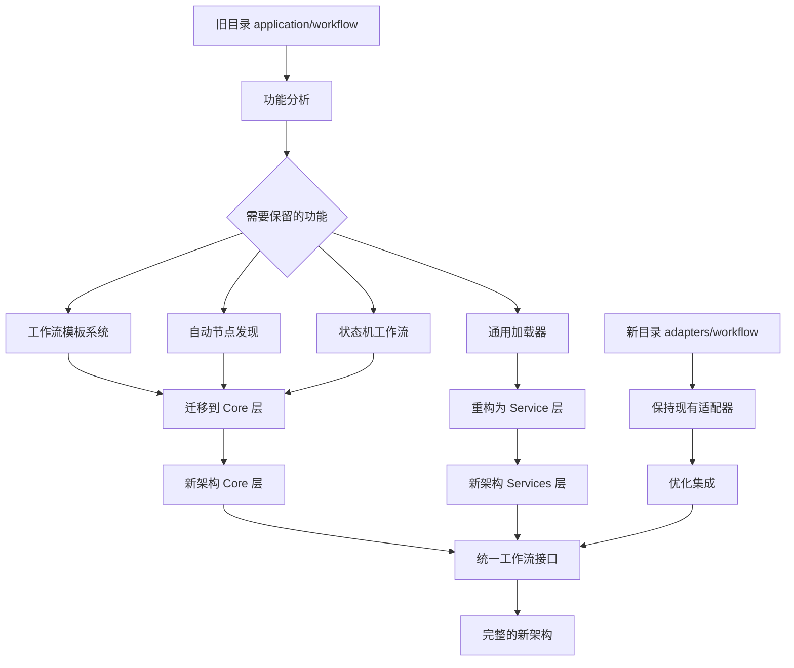
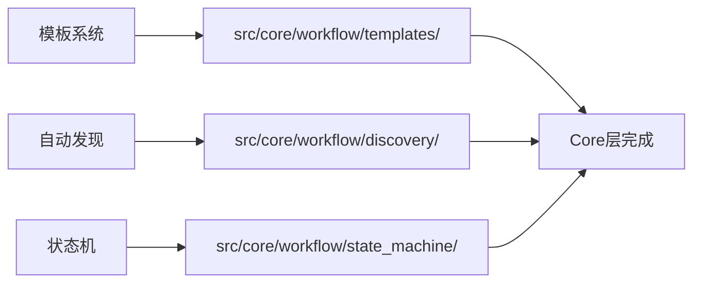
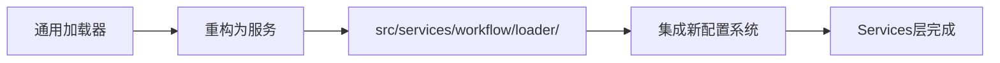
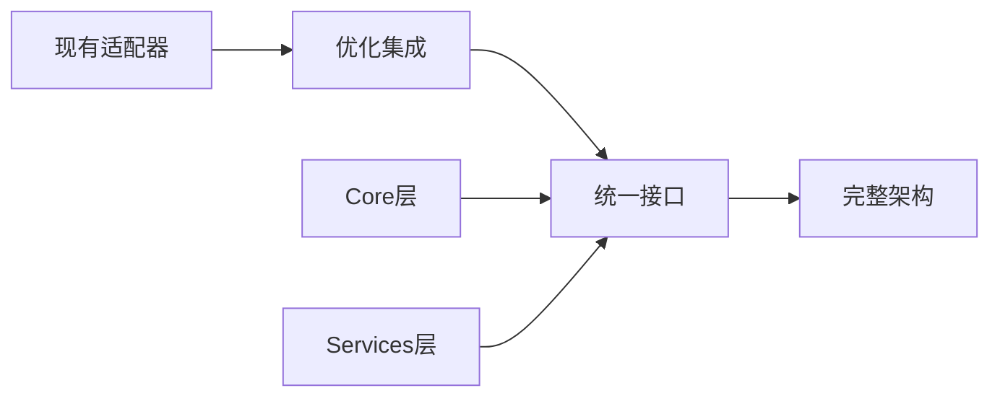
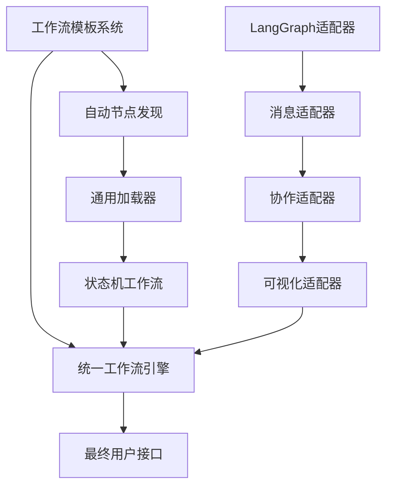
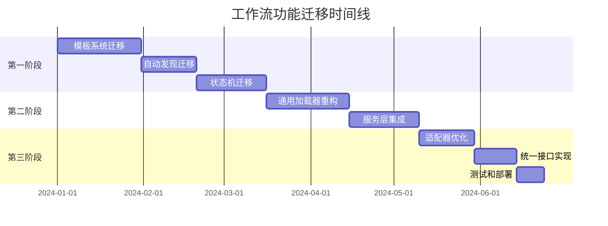
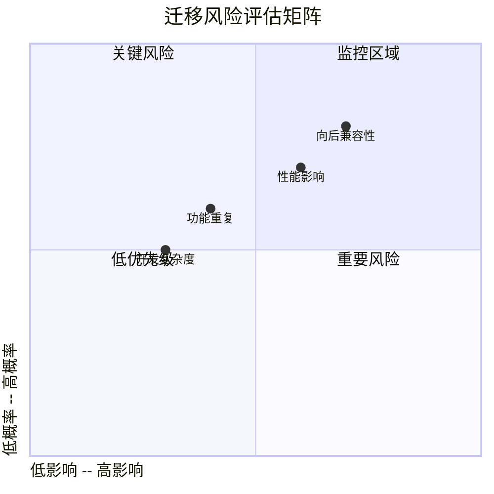
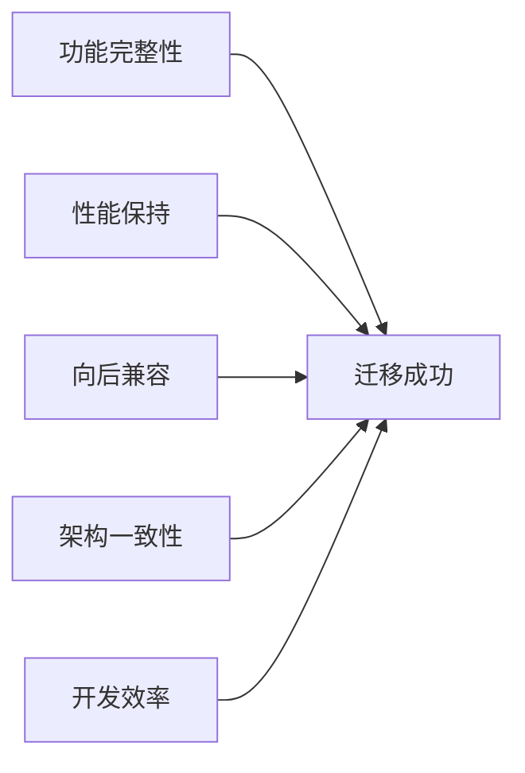

# 工作流功能迁移计划可视化

## 迁移架构图

```mermaid
graph TD
    A[旧目录 application/workflow] --> B[功能分析]
    B --> C{需要保留的功能}
    
    C --> D[工作流模板系统]
    C --> E[自动节点发现]
    C --> F[通用加载器]
    C --> G[状态机工作流]
    
    D --> H[迁移到 Core 层]
    E --> H
    G --> H
    F --> I[重构为 Service 层]
    
    H --> J[新架构 Core 层]
    I --> K[新架构 Services 层]
    
    L[新目录 adapters/workflow] --> M[保持现有适配器]
    M --> N[优化集成]
    
    J --> O[统一工作流接口]
    K --> O
    N --> O
    
    O --> P[完整的新架构]
```

## 迁移阶段详细说明

### 第一阶段：核心功能迁移（Core层）

```mermaid
graph LR
    A[模板系统] --> A1[src/core/workflow/templates/]
    B[自动发现] --> B1[src/core/workflow/discovery/]
    C[状态机] --> C1[src/core/workflow/state_machine/]
    
    A1 --> D[Core层完成]
    B1 --> D
    C1 --> D
```

### 第二阶段：服务层重构

```mermaid
graph LR
    A[通用加载器] --> A1[重构为服务]
    A1 --> B[src/services/workflow/loader/]
    B --> C[集成新配置系统]
    C --> D[Services层完成]
```

### 第三阶段：适配器整合

```mermaid
graph LR
    A[现有适配器] --> B[优化集成]
    B --> C[统一接口]
    C --> D[完整架构]
    
    E[Core层] --> C
    F[Services层] --> C
```

## 功能依赖关系

```mermaid
graph TB
    A[工作流模板系统] --> B[自动节点发现]
    B --> C[通用加载器]
    C --> D[状态机工作流]
    
    E[LangGraph适配器] --> F[消息适配器]
    F --> G[协作适配器]
    G --> H[可视化适配器]
    
    A --> I[统一工作流引擎]
    D --> I
    H --> I
    
    I --> J[最终用户接口]
```

## 迁移时间线

```mermaid
gantt
    title 工作流功能迁移时间线
    dateFormat YYYY-MM-DD
    section 第一阶段
    模板系统迁移     :a1, 2024-01-01, 30d
    自动发现迁移     :a2, after a1, 20d
    状态机迁移      :a3, after a2, 25d
    
    section 第二阶段  
    通用加载器重构   :b1, after a3, 30d
    服务层集成      :b2, after b1, 25d
    
    section 第三阶段
    适配器优化      :c1, after b2, 20d
    统一接口实现    :c2, after c1, 15d
    测试和部署     :c3, after c2, 10d
```

## 风险评估矩阵

```mermaid
quadrantChart
    title 迁移风险评估矩阵
    x-axis 低影响 -- 高影响
    y-axis 低概率 -- 高概率
    quadrant-1 监控区域
    quadrant-2 关键风险
    quadrant-3 低优先级
    quadrant-4 重要风险
    "向后兼容性": [0.7, 0.8]
    "性能影响": [0.6, 0.7]
    "功能重复": [0.4, 0.6]
    "开发复杂度": [0.3, 0.5]
```

## 成功指标

```mermaid
graph LR
    A[功能完整性] --> B[迁移成功]
    C[性能保持] --> B
    D[向后兼容] --> B
    E[架构一致性] --> B
    F[开发效率] --> B
```

这个迁移计划确保了旧有价值功能的保留，同时实现了向新架构的平滑过渡。