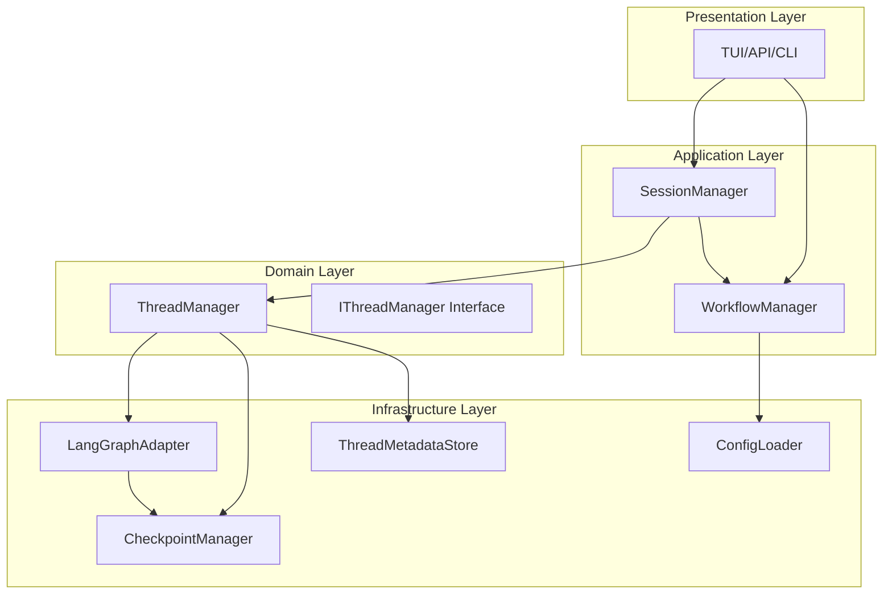

# Workflow与Thread层架构分析报告

## 1. 执行摘要

本报告深入分析了当前代码库中Workflow与Thread层的关系，识别了架构设计模式、存在的问题，并提出了具体的改进建议。通过分析发现，当前架构采用了分层设计模式，但存在职责重叠、依赖不一致等问题，需要进行重构以提高代码的可维护性和扩展性。

## 2. 架构概览

### 2.1 核心组件

当前架构包含以下核心组件：

1. **WorkflowManager** (`src/application/workflow/manager.py`)
   - 负责工作流的加载、创建、执行和管理
   - 专注于工作流生命周期管理
   - 提供同步和异步执行接口

2. **ThreadManager** (`src/domain/threads/manager.py`)
   - 负责Thread生命周期管理
   - 通过LangGraphAdapter与LangGraph交互
   - 提供Thread分支和快照管理功能

3. **SessionManager** (`src/application/sessions/manager.py`)
   - 负责用户交互追踪
   - 协调多个Thread执行
   - 管理会话级状态

4. **LangGraphAdapter** (`src/infrastructure/langgraph/adapter.py`)
   - 提供与LangGraph框架的统一接口
   - 管理状态持久化和checkpoint
   - 抽象LangGraph的复杂性

### 2.2 架构层次关系



## 3. 组件职责分析

### 3.1 WorkflowManager职责

**主要职责：**
- 工作流配置加载和解析
- 工作流实例创建和管理
- 工作流执行（同步/异步/流式）
- 工作流元数据管理
- 工作流可视化数据生成

**关键方法：**
- `load_workflow(config_path)`: 加载工作流配置
- `run_workflow(workflow_id, initial_state)`: 执行工作流
- `stream_workflow(workflow_id, initial_state)`: 流式执行工作流
- `get_workflow_visualization(workflow_id)`: 获取可视化数据

**设计特点：**
- 采用工厂模式创建工作流实例
- 支持延迟初始化组件
- 提供完整的工作流生命周期管理

### 3.2 ThreadManager职责

**主要职责：**
- Thread生命周期管理
- 通过LangGraphAdapter执行工作流
- Thread状态管理和持久化
- Thread分支和快照管理
- Thread历史记录管理

**关键方法：**
- `create_thread(graph_id, metadata)`: 创建新Thread
- `execute_workflow(thread_id, config, initial_state)`: 执行工作流
- `stream_workflow(thread_id, config, initial_state)`: 流式执行工作流
- `fork_thread(source_thread_id, checkpoint_id, branch_name)`: 创建Thread分支

**设计特点：**
- 专注于与LangGraph的交互
- 通过LangGraphAdapter统一状态管理
- 支持高级Thread操作（分支、快照、回滚）

### 3.3 SessionManager职责

**主要职责：**
- 用户会话生命周期管理
- 用户交互历史追踪
- 多Thread协调
- 会话级状态管理

**关键方法：**
- `create_session(user_request)`: 创建用户会话
- `coordinate_threads(session_id, thread_configs)`: 协调多Thread执行
- `execute_workflow_in_session(session_id, thread_name, config)`: 在会话中执行工作流
- `track_user_interaction(session_id, interaction)`: 追踪用户交互

**设计特点：**
- 通过ThreadManager委托执行
- 专注于用户交互追踪
- 支持Git版本控制集成

## 4. 组件间交互分析

### 4.1 WorkflowManager与ThreadManager关系

**当前关系：**
- 两者都提供工作流执行功能，存在职责重叠
- WorkflowManager专注于工作流定义和加载
- ThreadManager专注于执行和状态管理
- 没有直接的依赖关系，但功能相似

**问题：**
- 功能重叠导致混淆
- 开发者不确定应该使用哪个组件
- 代码重复和维护成本高

### 4.2 SessionManager与ThreadManager关系

**当前关系：**
- SessionManager依赖ThreadManager
- SessionManager通过ThreadManager执行工作流
- SessionManager管理用户交互，ThreadManager管理执行

**设计模式：**
- 采用委托模式
- 清晰的职责分离
- 良好的抽象层次

### 4.3 ThreadManager与LangGraphAdapter关系

**当前关系：**
- ThreadManager依赖LangGraphAdapter
- LangGraphAdapter提供与LangGraph的统一接口
- ThreadManager通过LangGraphAdapter管理状态和执行

**设计模式：**
- 采用适配器模式
- 良好的抽象和封装
- 便于测试和替换

## 5. 架构问题识别

### 5.1 严重问题

#### 5.1.1 ThreadManager构造函数不一致

**问题描述：**
ThreadManager的构造函数定义与实际使用不一致：

```python
# 构造函数定义（src/domain/threads/manager.py:32-36）
def __init__(
    self,
    metadata_store: IThreadMetadataStore,
    checkpoint_manager: ICheckpointManager
):

# 实际使用（src/infrastructure/di/thread_session_di_config.py:101-105）
return ThreadManager(
    metadata_store=metadata_store,
    checkpoint_manager=checkpoint_manager,
    langgraph_adapter=langgraph_adapter  # 参数不存在
)
```

**影响：**
- 代码无法正常运行
- 依赖注入失败
- 系统启动错误

**解决方案：**
修改ThreadManager构造函数，添加langgraph_adapter参数：

```python
def __init__(
    self,
    metadata_store: IThreadMetadataStore,
    checkpoint_manager: ICheckpointManager,
    langgraph_adapter: ILangGraphAdapter
):
    self.metadata_store = metadata_store
    self.checkpoint_manager = checkpoint_manager
    self.langgraph_adapter = langgraph_adapter
```

#### 5.1.2 WorkflowManager与ThreadManager职责重叠

**问题描述：**
两个组件都提供工作流执行功能，导致职责不清：

```python
# WorkflowManager执行方法
def run_workflow(self, workflow_id: str, initial_state: Optional[WorkflowState] = None)

# ThreadManager执行方法
async def execute_workflow(self, thread_id: str, config: Optional[Dict[str, Any]] = None)
```

**影响：**
- 开发者困惑：应该使用哪个组件？
- 代码重复
- 维护成本高

### 5.2 设计问题

#### 5.2.1 缺乏统一的工作流抽象

**问题描述：**
没有统一的工作流抽象接口，导致不同组件使用不同的工作流表示。

**影响：**
- 组件间集成困难
- 代码耦合度高
- 扩展性差

#### 5.2.2 状态管理分散

**问题描述：**
状态管理逻辑分散在多个组件中，缺乏统一的状态管理策略。

**影响：**
- 状态一致性难以保证
- 调试困难
- 性能问题

### 5.3 架构问题

#### 5.3.1 分层不清晰

**问题描述：**
ThreadManager位于Domain层，但依赖Infrastructure层的LangGraphAdapter，违反了分层架构原则。

**影响：**
- 架构混乱
- 测试困难
- 依赖循环风险

#### 5.3.2 缺乏明确的边界上下文

**问题描述：**
组件职责边界不清晰，缺乏明确的边界上下文定义。

**影响：**
- 组件耦合度高
- 重构困难
- 新功能添加复杂

## 6. 解决方案建议

### 6.1 立即修复（高优先级）

#### 6.1.1 修复ThreadManager构造函数

```python
# 修改 src/domain/threads/manager.py
class ThreadManager(IThreadManager):
    def __init__(
        self,
        metadata_store: IThreadMetadataStore,
        checkpoint_manager: ICheckpointManager,
        langgraph_adapter: ILangGraphAdapter  # 添加此参数
    ):
        self.metadata_store = metadata_store
        self.checkpoint_manager = checkpoint_manager
        self.langgraph_adapter = langgraph_adapter  # 添加此行
```

#### 6.1.2 统一工作流执行接口

创建统一的工作流执行接口：

```python
# 新建 src/domain/workflow/interfaces.py
from abc import ABC, abstractmethod
from typing import Dict, Any, Optional, AsyncGenerator

class IWorkflowExecutor(ABC):
    @abstractmethod
    async def execute(
        self,
        workflow_id: str,
        config: Optional[Dict[str, Any]] = None,
        initial_state: Optional[Dict[str, Any]] = None
    ) -> Dict[str, Any]:
        pass
    
    @abstractmethod
    async def stream_execute(
        self,
        workflow_id: str,
        config: Optional[Dict[str, Any]] = None,
        initial_state: Optional[Dict[str, Any]] = None
    ) -> AsyncGenerator[Dict[str, Any], None]:
        pass
```

### 6.2 短期改进（中优先级）

#### 6.2.1 重构组件职责

**重新定义组件职责：**

1. **WorkflowManager**：
   - 专注于工作流定义和配置管理
   - 提供工作流模板和元数据
   - 不负责执行

2. **ThreadManager**：
   - 专注于工作流执行和状态管理
   - 作为唯一的工作流执行入口
   - 管理执行上下文和生命周期

3. **SessionManager**：
   - 专注于用户交互和会话管理
   - 协调多个Thread执行
   - 管理会话级状态

#### 6.2.2 引入工作流注册表

创建工作流注册表，统一管理工作流定义：

```python
# 新建 src/domain/workflow/registry.py
class WorkflowRegistry:
    def __init__(self):
        self._workflows: Dict[str, WorkflowDefinition] = {}
    
    def register(self, workflow_def: WorkflowDefinition) -> None:
        self._workflows[workflow_def.id] = workflow_def
    
    def get(self, workflow_id: str) -> Optional[WorkflowDefinition]:
        return self._workflows.get(workflow_id)
    
    def list_all(self) -> List[WorkflowDefinition]:
        return list(self._workflows.values())
```

### 6.3 长期重构（低优先级）

#### 6.3.1 引入领域事件

实现领域事件系统，减少组件间直接依赖：

```python
# 新建 src/domain/events/bus.py
class DomainEventBus:
    def __init__(self):
        self._handlers: Dict[str, List[EventHandler]] = {}
    
    def subscribe(self, event_type: str, handler: EventHandler) -> None:
        if event_type not in self._handlers:
            self._handlers[event_type] = []
        self._handlers[event_type].append(handler)
    
    async def publish(self, event: DomainEvent) -> None:
        handlers = self._handlers.get(event.type, [])
        for handler in handlers:
            await handler.handle(event)
```

#### 6.3.2 实现CQRS模式

分离命令和查询职责，提高系统性能和可扩展性：

```python
# 新建 src/application/workflow/commands.py
class ExecuteWorkflowCommand:
    def __init__(self, workflow_id: str, config: Dict[str, Any]):
        self.workflow_id = workflow_id
        self.config = config

class ExecuteWorkflowCommandHandler:
    async def handle(self, command: ExecuteWorkflowCommand) -> Dict[str, Any]:
        # 执行工作流逻辑
        pass
```

## 7. 实施计划

### 7.1 第一阶段：紧急修复（1-2天）

1. 修复ThreadManager构造函数不一致问题
2. 添加单元测试验证修复
3. 更新相关文档

### 7.2 第二阶段：职责重构（1-2周）

1. 重新定义组件职责边界
2. 创建统一的工作流执行接口
3. 实现工作流注册表
4. 更新依赖注入配置

### 7.3 第三阶段：架构优化（2-4周）

1. 引入领域事件系统
2. 实现CQRS模式
3. 优化状态管理
4. 完善测试覆盖

## 8. 风险评估

### 8.1 技术风险

- **中等风险**：重构可能引入新的bug
- **缓解措施**：逐步重构，保持向后兼容

### 8.2 业务风险

- **低风险**：重构不影响现有功能
- **缓解措施**：充分测试，分阶段部署

### 8.3 时间风险

- **中等风险**：重构时间可能超出预期
- **缓解措施**：分阶段实施，优先修复关键问题

## 9. 结论

当前架构中Workflow与Thread层存在职责重叠、依赖不一致等问题，需要进行重构。建议采用分阶段的方式，首先修复关键问题，然后逐步优化架构设计。通过明确组件职责、引入统一接口和实现领域事件系统，可以显著提高代码的可维护性和扩展性。

重构后的架构将具有以下优势：
1. 清晰的职责分离
2. 统一的工作流执行接口
3. 更好的可测试性
4. 更高的可扩展性
5. 更低的维护成本

建议立即开始第一阶段的紧急修复工作，以确保系统的正常运行。